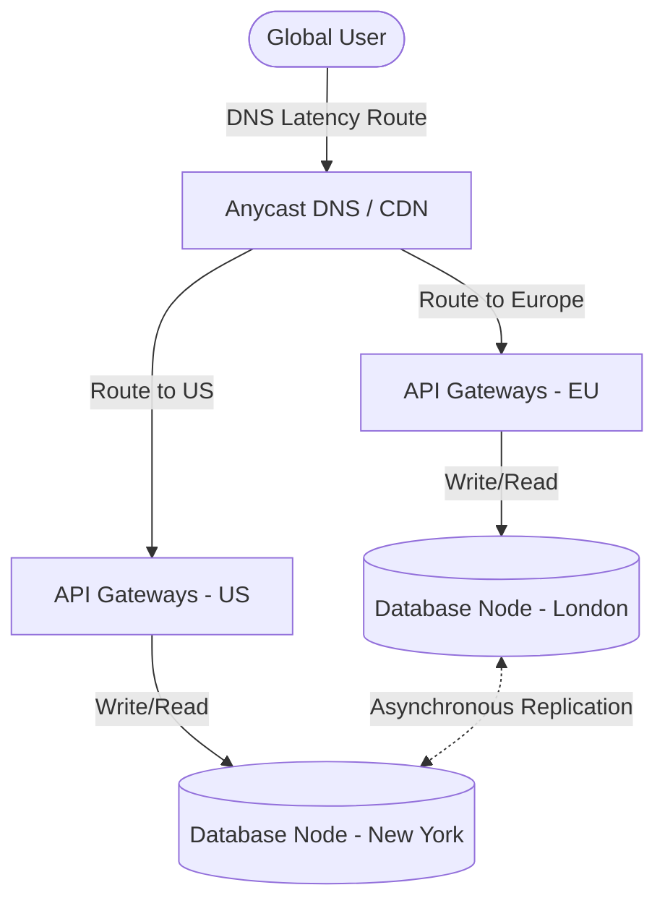

When building global applications, minimizing latency is paramount. If a user in Singapore attempts to load an application hosted entirely in North Virginia, the physics of fiber-optic light propagation dictate a minimum round-trip time (RTT) latency of ~180 milliseconds. For an application performing multiple database queries per page, this latency makes the user experience feel sluggish.

To achieve sub-100ms load times worldwide, we must bring both computing and **data** close to the user. 

While deploying stateless server instances in multiple regions is trivial, replicating data dynamically is one of the hardest challenges in computer science. In this system design review, we'll analyze the architecture of **Multi-Region Active-Active (Multi-Master) Database Deployments**, dissect how they handle network partitions, and explore conflict resolution strategies.

---

## 1. Active-Passive vs. Active-Active

Before diving into active-active, let's contrast it with the traditional primary-replica (active-passive) model:

```
Active-Passive (Global Read, Single Write)
Region 1 (Primary)            Region 2 (Replica)
[ Reads & Writes ] ──(Sync)──► [ Reads Only ]

Active-Active (Global Write, Global Read)
Region 1 (Master)             Region 2 (Master)
[ Reads & Writes ] ◄─(Async)─► [ Reads & Writes ]
```

*   **Active-Passive:** Writes are routed to a single primary database (e.g., in US-East). Read-only replicas are distributed globally. While this simplifies consistency, any write request from Singapore must travel to Virginia, making updates extremely slow for global users. Additionally, if the primary region goes offline, the application faces write downtime during failover.
*   **Active-Active:** Fully decentralized. Every region has an active database instance capable of handling both reads and writes. Data written in Region A is asynchronously replicated to Region B and Region C. This yields single-digit millisecond write latencies globally and bulletproof fault tolerance.

---

## 2. Theoretical Boundaries: CAP and PACELC Theorems

Distributed databases are strictly governed by the **CAP Theorem** (Consistency, Availability, Partition Tolerance) and the **PACELC Theorem**.

According to CAP, in the presence of a network partition (P):
*   You must choose either **Consistency** (C) — rejecting writes to avoid stale data,
*   Or **Availability** (A) — accepting writes in all partition segments, risking data divergence.

Active-Active databases are fundamentally **AP** systems. They prioritize absolute availability and near-zero latency, meaning they accept the reality of **Eventual Consistency**. Data replication occurs asynchronously behind the scenes, meaning a read in Tokyo might temporarily return old data written in London milliseconds ago.

---

## 3. The Nightmare of Active-Active: Write Conflicts

The absolute hardest part of active-active architecture is handling **Write Conflicts** (specifically, concurrent double-writes to the same row).

Imagine two users attempt to update the same record at the exact same millisecond:
1. User A updates Account balance to `$100` in **London** (Region 1).
2. User B updates Account balance to `$120` in **New York** (Region 2).
3. The databases attempt to sync asynchronously. 

Which write should win? If not handled properly, London will stay at `$100` and New York at `$120`, resulting in a **split-brain** scenario where data diverges permanently.

Here are the three primary patterns used to resolve active-active conflicts:

### A. Last-Write-Wins (LWW)
LWW resolves conflicts by comparing the timestamp of the writes and keeping the newest one. While simple, **this is highly dangerous in distributed systems**. 

Because of **clock skew**, it is impossible to perfectly synchronize wall-clock time across thousands of physical servers (even with NTP). A server with a clock running just 5 milliseconds fast can overwrite perfectly valid newer writes from other servers.

### B. Conflict-Free Replicated Data Types (CRDTs)
CRDTs are specialized data structures that are mathematically guaranteed to converge to the exact same state without conflicts, regardless of the order in which updates are received.
*   **PN-Counters (Positive-Negative Counters):** Separately track increments and decrements. The final balance is derived by merging both logs.
*   **LWW-Element-Sets:** Keep separate add and remove sets with timestamps.

### C. Application-Level Partitioning (The Cleanest Solution)
The most practical way to avoid conflicts is to design your routing so that **writes for a specific record are always directed to a single home region**.

For example, a user's account resides in the US-West database. Even if they travel to Europe, their write requests are routed back to US-West. This gives you local consistency while maintaining high read performance via global caching.

---

## 4. Modern Database Options

If you are planning to deploy an active-active system, you will typically evaluate these three options:

1.  **AWS DynamoDB Global Tables:** A fully managed, multi-region database that replicates data asynchronously across AWS regions. It uses **Last-Write-Wins (LWW)** to resolve conflicts.
2.  **ScyllaDB / Apache Cassandra:** Masterless NoSQL databases. They utilize wide-column storage, peer-to-peer gossip protocols, and offer highly tunable consistency levels (e.g., `QUORUM` writes vs `LOCAL_QUORUM` reads).
3.  **CockroachDB / YugabyteDB:** These are distributed SQL databases. While they run in multiple regions, they are **CP (Strict Serializable)** systems. They use **Multi-Raft consensus** to ensure that writes are agreed upon synchronously before committing. While this prevents conflicts completely, it incurs cross-region network roundtrips on writes.

---

## 5. Architectural Blueprint: Multi-Region Setup

Here is a system architecture demonstrating how global traffic is routed using latency-based DNS to the nearest active-active database node:



## Summary

Active-active database deployments represent the peak of highly available, low-latency system design. However, they require you to abandon traditional ACID transaction guarantees and embrace eventual consistency. By structuring your application logic to partition writes geographically and leveraging modern AP databases like ScyllaDB or DynamoDB Global Tables, you can build bulletproof global platforms capable of surviving whole region outages without dropping a single write.
