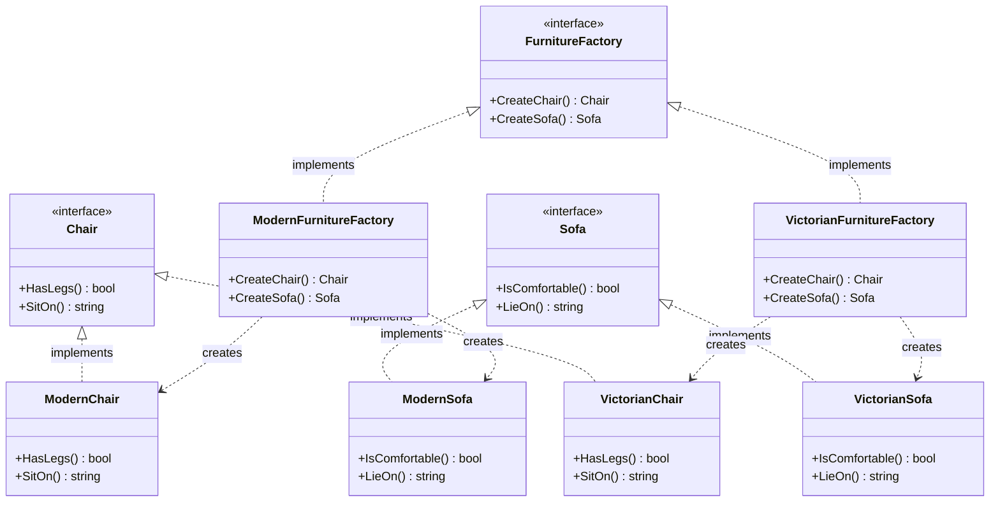

Abstract Factory adalah creational design pattern yang memungkinkan Anda menghasilkan keluarga objek yang terkait tanpa menentukan kelas konkretnya. Pola ini sangat berguna ketika kode Anda perlu bekerja dengan berbagai keluarga produk terkait, tetapi Anda tidak ingin kode tersebut bergantung pada kelas konkret dari produk-produk tersebut.

## Penjelasan Konseptual & Analogi Dunia Nyata

Bayangkan Anda sedang membuat simulator toko furnitur. Kode Anda terdiri dari struct yang mewakili:
1. Keluarga produk terkait: `Chair` (Kursi) + `Sofa` + `CoffeeTable` (Meja Kopi).
2. Beberapa varian dari keluarga ini: Produk tersedia dalam gaya seperti `Modern`, `Victorian`, atau `ArtDeco`.

Anda memerlukan cara untuk membuat objek furnitur individual sehingga cocok dengan objek lain dari keluarga yang sama. Pelanggan akan sangat marah ketika mereka menerima kursi Modern yang tidak cocok dengan sofa Victorian mereka.

Pola Abstract Factory menyarankan agar Anda secara eksplisit mendeklarasikan interface untuk setiap produk berbeda dari keluarga produk tersebut (misalnya, Chair, Sofa, atau CoffeeTable). Kemudian Anda membuat semua varian produk mengikuti interface tersebut. Misalnya, semua varian kursi harus mengimplementasikan interface `Chair`.

Selanjutnya, Anda mendeklarasikan *Abstract Factory*—sebuah interface dengan daftar metode pembuatan untuk semua produk yang merupakan bagian dari keluarga produk (misalnya, `CreateChair()`, `CreateSofa()`). Metode-metode ini harus mengembalikan tipe produk abstrak yang diwakili oleh interface yang kita definisikan sebelumnya.

Untuk setiap varian dari keluarga produk, kita membuat implementasi pabrik terpisah berdasarkan interface Abstract Factory. Pabrik adalah struct yang mengembalikan produk dari varietas tertentu. Misalnya, `ModernFurnitureFactory` hanya membuat objek `ModernChair`, `ModernSofa`, dan `ModernCoffeeTable`.

---

## Diagram Konseptual

Berikut adalah diagram kelas Mermaid yang menggambarkan struktur pola Abstract Factory di Go:



---

## Use Case / Skenario Masalah

Mengapa kita membutuhkan pola ini?
Dalam kit alat antarmuka pengguna grafis (GUI Toolkit), Anda sering kali perlu membuat widget (button, textbox, checkbox) yang sesuai dengan tampilan dan nuansa sistem operasi tertentu (misalnya, Windows, macOS, atau Linux).

Jika Anda menulis inisialisasi widget secara langsung di dalam kode (misalnya, `WindowsButton` atau `MacButton`), mengganti tampilan dan nuansa saat runtime atau menambahkan dukungan untuk sistem operasi baru menjadi sangat melelahkan dan rentan terhadap kesalahan. Pola Abstract Factory menyembunyikan detail pembuatan widget, membiarkan kode klien tetap independen dari sistem operasi tempat ia berjalan.

---

## Contoh Kode Golang

Di bawah ini adalah program Go lengkap yang dapat dikompilasi, mendemonstrasikan pola Abstract Factory dengan analogi Furnitur kami.

```go
package main

import (
	"fmt"
)

// Chair mewakili produk abstrak A.
type Chair interface {
	HasLegs() bool
	SitOn() string
}

// ModernChair adalah produk konkret A1.
type ModernChair struct{}

func (mc *ModernChair) HasLegs() bool {
	return false // Kursi modern mungkin menggunakan kaki tunggal/pedestal alih-alih empat kaki tradisional
}

func (mc *ModernChair) SitOn() string {
	return "Duduk di kursi modern yang ramping dan ergonomis."
}

// VictorianChair adalah produk konkret A2.
type VictorianChair struct{}

func (vc *VictorianChair) HasLegs() bool {
	return true
}

func (vc *VictorianChair) SitOn() string {
	return "Duduk di kursi Victorian mewah dengan ukiran kayu buatan tangan."
}

// Sofa mewakili produk abstrak B.
type Sofa interface {
	IsComfortable() bool
	LieOn() string
}

// ModernSofa adalah produk konkret B1.
type ModernSofa struct{}

func (ms *ModernSofa) IsComfortable() bool {
	return true
}

func (ms *ModernSofa) LieOn() string {
	return "Berbaring di sofa modern minimalis."
}

// VictorianSofa adalah produk konkret B2.
type VictorianSofa struct{}

func (vs *VictorianSofa) IsComfortable() bool {
	return true
}

func (vs *VictorianSofa) LieOn() string {
	return "Berbaring di sofa beludru berumbai Victorian yang megah."
}

// FurnitureFactory mewakili interface Abstract Factory.
type FurnitureFactory interface {
	CreateChair() Chair
	CreateSofa() Sofa
}

// ModernFurnitureFactory adalah pabrik konkret yang mengimplementasikan FurnitureFactory.
type ModernFurnitureFactory struct{}

func (m *ModernFurnitureFactory) CreateChair() Chair {
	return &ModernChair{}
}

func (m *ModernFurnitureFactory) CreateSofa() Sofa {
	return &ModernSofa{}
}

// VictorianFurnitureFactory adalah pabrik konkret yang mengimplementasikan FurnitureFactory.
type VictorianFurnitureFactory struct{}

func (v *VictorianFurnitureFactory) CreateChair() Chair {
	return &VictorianChair{}
}

func (v *VictorianFurnitureFactory) CreateSofa() Sofa {
	return &VictorianSofa{}
}

// ClientCode berinteraksi dengan pabrik dan produk hanya melalui interface.
func ClientCode(f FurnitureFactory) {
	chair := f.CreateChair()
	sofa := f.CreateSofa()

	fmt.Printf("Info Kursi - Punya Kaki: %t | Aksi: %s\n", chair.HasLegs(), chair.SitOn())
	fmt.Printf("Info Sofa  - Nyaman: %t | Aksi: %s\n\n", sofa.IsComfortable(), sofa.LieOn())
}

func main() {
	fmt.Println("Klien: Menguji Modern Furniture Factory...")
	modernFactory := &ModernFurnitureFactory{}
	ClientCode(modernFactory)

	fmt.Println("Klien: Menguji Victorian Furniture Factory...")
	victorianFactory := &VictorianFurnitureFactory{}
	ClientCode(victorianFactory)
}
```

---

## Ringkasan

### Keuntungan
- **Konsistensi**: Anda dapat memastikan bahwa produk yang Anda dapatkan dari pabrik kompatibel satu sama lain.
- **Pemisahan (Decoupling)**: Anda menghindari ketergantungan yang erat antara produk konkret dan kode klien.
- **Single Responsibility Principle**: Anda dapat mengekstrak kode pembuatan produk ke satu tempat, membuat basis kode lebih mudah dipelihara.
- **Open/Closed Principle**: Anda dapat memperkenalkan varian produk baru tanpa merusak kode klien yang sudah ada.

### Kekurangan
- **Kompleksitas**: Kode dapat menjadi lebih rumit karena banyak interface dan struct baru yang diperkenalkan bersamaan dengan pola ini.

### Kapan Menggunakan
- Gunakan Abstract Factory ketika kode Anda perlu bekerja dengan berbagai keluarga produk terkait, tetapi Anda tidak ingin bergantung pada kelas konkret dari produk-produk tersebut—yang mungkin tidak diketahui sebelumnya atau untuk memungkinkan perluasan di masa mendatang.
- Gunakan Abstract Factory ketika Anda memiliki kelas dengan sekumpulan factory method yang mengaburkan tanggung jawab utamanya.
