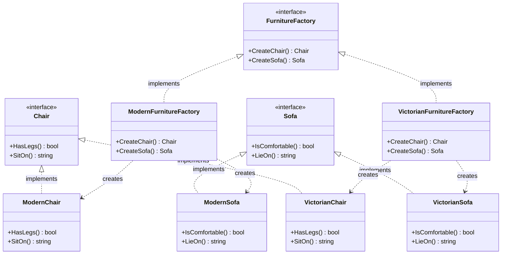

The Abstract Factory is a creational design pattern that lets you produce families of related objects without specifying their concrete classes. It is particularly useful when your code needs to work with various families of related products, but you don’t want it to depend on the concrete classes of those products.

## Conceptual Explanation & Real-World Analogy

Imagine you are creating a furniture shop simulator. Your code consists of classes that represent:
1. A family of related products: `Chair` + `Sofa` + `CoffeeTable`.
2. Several variants of this family: Products are available in styles like `Modern`, `Victorian`, or `ArtDeco`.

You need a way to create individual furniture objects so that they match other objects of the same family. Customers get quite angry when they receive a Modern chair that doesn't match their Victorian sofa.

The Abstract Factory pattern suggests that you explicitly declare interfaces for each distinct product of the product family (e.g., Chair, Sofa, or CoffeeTable). Then you make all variants of products follow those interfaces. For example, all chair variants must implement the `Chair` interface.

Next, you declare the *Abstract Factory*—an interface with a list of creation methods for all products that are part of the product family (e.g., `CreateChair()`, `CreateSofa()`). These methods must return abstract product types represented by the interfaces we defined earlier.

For each variant of a product family, we create a separate factory implementation based on the Abstract Factory interface. A factory is a struct that returns products of a particular variety. For example, the `ModernFurnitureFactory` only creates `ModernChair`, `ModernSofa`, and `ModernCoffeeTable` objects.

---

## Conceptual Diagram

Here is a Mermaid class diagram that illustrates the structure of the Abstract Factory pattern in Go:



---

## Use Case / Problem Scenario

Why do we need this pattern?
In graphical user interface (GUI) toolkits, you often need to create widgets (buttons, textboxes, checkboxes) that conform to the look and feel of a specific operating system (e.g., Windows, macOS, or Linux). 

If you hardcode widget instantiation (e.g., `WindowsButton` or `MacButton`), switching the look and feel at runtime or adding support for a new operating system becomes extremely tedious and error-prone. The Abstract Factory pattern encapsulates widget creation, letting the client code remain completely independent of the operating system it is running on.

---

## Golang Code Example

Below is a complete, compilable Go program demonstrating the Abstract Factory pattern with our Furniture analogy.

```go
package main

import (
	"fmt"
)

// Chair represents the abstract product A.
type Chair interface {
	HasLegs() bool
	SitOn() string
}

// ModernChair is a concrete product A1.
type ModernChair struct{}

func (mc *ModernChair) HasLegs() bool {
	return false // Modern chairs might have a sleek pedestal base instead of traditional legs
}

func (mc *ModernChair) SitOn() string {
	return "Sitting on a sleek, ergonomic modern chair."
}

// VictorianChair is a concrete product A2.
type VictorianChair struct{}

func (vc *VictorianChair) HasLegs() bool {
	return true
}

func (vc *VictorianChair) SitOn() string {
	return "Sitting on a plush, hand-carved Victorian chair."
}

// Sofa represents the abstract product B.
type Sofa interface {
	IsComfortable() bool
	LieOn() string
}

// ModernSofa is a concrete product B1.
type ModernSofa struct{}

func (ms *ModernSofa) IsComfortable() bool {
	return true
}

func (ms *ModernSofa) LieOn() string {
	return "Lying down on a minimalist modern sofa."
}

// VictorianSofa is a concrete product B2.
type VictorianSofa struct{}

func (vs *VictorianSofa) IsComfortable() bool {
	return true
}

func (vs *VictorianSofa) LieOn() string {
	return "Lying down on a grand Victorian tufted velvet sofa."
}

// FurnitureFactory represents the Abstract Factory interface.
type FurnitureFactory interface {
	CreateChair() Chair
	CreateSofa() Sofa
}

// ModernFurnitureFactory is a concrete factory implementing FurnitureFactory.
type ModernFurnitureFactory struct{}

func (m *ModernFurnitureFactory) CreateChair() Chair {
	return &ModernChair{}
}

func (m *ModernFurnitureFactory) CreateSofa() Sofa {
	return &ModernSofa{}
}

// VictorianFurnitureFactory is a concrete factory implementing FurnitureFactory.
type VictorianFurnitureFactory struct{}

func (v *VictorianFurnitureFactory) CreateChair() Chair {
	return &VictorianChair{}
}

func (v *VictorianFurnitureFactory) CreateSofa() Sofa {
	return &VictorianSofa{}
}

// ClientCode interacts with the factories and products solely via interfaces.
func ClientCode(f FurnitureFactory) {
	chair := f.CreateChair()
	sofa := f.CreateSofa()

	fmt.Printf("Chair Info - Has Legs: %t | Action: %s\n", chair.HasLegs(), chair.SitOn())
	fmt.Printf("Sofa Info  - Comfortable: %t | Action: %s\n\n", sofa.IsComfortable(), sofa.LieOn())
}

func main() {
	fmt.Println("Client: Testing Modern Furniture Factory...")
	modernFactory := &ModernFurnitureFactory{}
	ClientCode(modernFactory)

	fmt.Println("Client: Testing Victorian Furniture Factory...")
	victorianFactory := &VictorianFurnitureFactory{}
	ClientCode(victorianFactory)
}
```

---

## Summary

### Advantages
- **Consistency**: You can be sure that the products you get from a factory are compatible with each other.
- **Decoupling**: You avoid tight coupling between concrete products and client code.
- **Single Responsibility Principle**: You can extract the product creation code into one place, making the codebase easier to maintain.
- **Open/Closed Principle**: You can introduce new variants of products without breaking existing client code.

### Disadvantages
- **Complexity**: The code may become more complicated than it should be, as a lot of new interfaces and structs are introduced alongside the pattern.

### When to Use
- Use the Abstract Factory when your code needs to work with various families of related products, but you don't want it to depend on the concrete classes of those products—which might be unknown beforehand or you simply want to allow for future extensibility.
- Use the Abstract Factory when you have a class with a set of factory methods that blur its primary responsibility.
