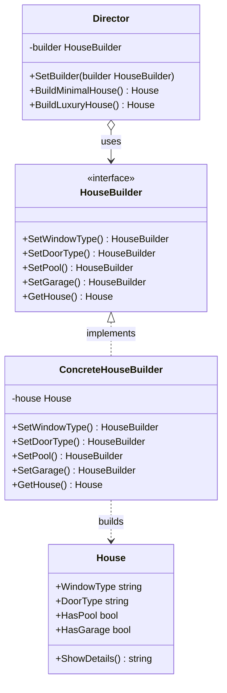

Builder adalah creational design pattern yang memungkinkan Anda membangun objek kompleks langkah demi langkah. Tidak seperti pola pembuatan lainnya, Builder tidak memerlukan produk untuk memiliki interface yang sama. Hal ini memungkinkan pembuatan produk yang berbeda menggunakan proses konstruksi yang sama.

## Penjelasan Konseptual & Analogi Dunia Nyata

Bayangkan sebuah objek kompleks yang memerlukan inisialisasi lambat langkah demi langkah dari banyak field dan objek bersarang. Kode inisialisasi seperti itu biasanya terkubur di dalam konstruktor raksasa dengan lusinan parameter, atau tersebar di seluruh kode klien.

Sebagai contoh, mari kita pikirkan tentang cara membuat objek `House` (Rumah). Untuk membangun rumah sederhana, Anda perlu membangun empat dinding, lantai, memasang pintu, memasang sepasang jendela, dan membangun atap. Namun bagaimana jika Anda menginginkan rumah yang lebih besar dan terang, dengan halaman belakang, kolam renang, garasi, dan pemanas sentral?

Solusi paling sederhana adalah memperluas kelas dasar `House` dan membuat sekumpulan subclass untuk mencakup semua kombinasi parameter. Namun pada akhirnya, Anda akan berakhir dengan jumlah subclass yang sangat banyak. Setiap parameter baru, seperti gaya teras, akan membutuhkan pertumbuhan hierarki ini lebih banyak lagi.

Sebagai alternatif, Anda dapat membuat satu konstruktor raksasa di kelas dasar `House` dengan semua parameter yang mungkin untuk mengontrol objek rumah. Meskipun ini menghilangkan subclass, ini menciptakan masalah lain: dalam kebanyakan kasus, sebagian besar parameter tidak akan digunakan, membuat pemanggilan konstruktor terlihat sangat buruk dan rentan terhadap kesalahan.

Pola Builder menyarankan agar Anda mengekstrak kode konstruksi objek dari kelasnya sendiri dan memindahkannya ke objek terpisah yang disebut *builder*.

Pola ini mengatur konstruksi objek menjadi serangkaian langkah (misalnya, `BuildWalls()`, `BuildDoor()`, `BuildPool()`). Untuk membuat objek, Anda menjalankan serangkaian langkah ini pada objek builder. Bagian pentingnya adalah Anda tidak perlu memanggil semua langkah. Anda hanya dapat memanggil langkah-langkah yang diperlukan untuk menghasilkan konfigurasi tertentu dari suatu objek.

Kelas *Director* mendefinisikan urutan jalannya langkah-langkah pembangunan, sementara builder menyediakan implementasi untuk langkah-langkah tersebut.

---

## Diagram Konseptual

Berikut adalah diagram kelas Mermaid yang menunjukkan struktur pola Builder di Go:



---

## Use Case / Skenario Masalah

Mengapa kita membutuhkan pola ini?
Di Go, kita tidak memiliki overloading metode, yang berarti kita tidak dapat memiliki beberapa fungsi inisialisasi dengan nama yang sama tetapi parameter berbeda. Jika sebuah struct memiliki 15 field, membuatnya secara langsung menggunakan struct literal mengharuskan Anda menentukan semua field, atau membiarkan beberapa sebagai nilai default kosong.

Jika kombinasi field tertentu diperlukan untuk konfigurasi tertentu, kode klien menjadi berantakan dengan logika inisialisasi. Pola Builder mengisolasi kompleksitas ini, menyediakan interface yang lancar (method chaining) atau Director untuk mengontrol proses pembuatan, memastikan objek selalu diinisialisasi dalam keadaan valid.

---

## Contoh Kode Golang

Di bawah ini adalah program Go lengkap yang dapat dikompilasi, mendemonstrasikan pola Builder sesuai dengan gaya Refactoring Guru.

```go
package main

import (
	"fmt"
)

// House mewakili produk. Ini memiliki berbagai fitur opsional.
type House struct {
	windowType string
	doorType   string
	hasPool    bool
	hasGarage  bool
}

func (h *House) ShowDetails() string {
	return fmt.Sprintf("Detail Rumah: Jendela: %s, Pintu: %s, Kolam Renang: %t, Garasi: %t",
		h.windowType, h.doorType, h.hasPool, h.hasGarage)
}

// HouseBuilder mendefinisikan interface builder dengan langkah-langkah membuat rumah.
type HouseBuilder interface {
	SetWindowType(wType string) HouseBuilder
	SetDoorType(dType string) HouseBuilder
	SetPool(hasPool bool) HouseBuilder
	SetGarage(hasGarage bool) HouseBuilder
	GetHouse() House
}

// ConcreteHouseBuilder mengimplementasikan interface HouseBuilder.
type ConcreteHouseBuilder struct {
	house House
}

func NewConcreteHouseBuilder() *ConcreteHouseBuilder {
	return &ConcreteHouseBuilder{house: House{}}
}

func (b *ConcreteHouseBuilder) SetWindowType(wType string) HouseBuilder {
	b.house.windowType = wType
	return b
}

func (b *ConcreteHouseBuilder) SetDoorType(dType string) HouseBuilder {
	b.house.doorType = dType
	return b
}

func (b *ConcreteHouseBuilder) SetPool(hasPool bool) HouseBuilder {
	b.house.hasPool = hasPool
	return b
}

func (b *ConcreteHouseBuilder) SetGarage(hasGarage bool) HouseBuilder {
	b.house.hasGarage = hasGarage
	return b
}

func (b *ConcreteHouseBuilder) GetHouse() House {
	// Mengembalikan salinan rumah yang dibangun dan mereset builder untuk penggunaan berikutnya.
	result := b.house
	b.house = House{}
	return result
}

// Director mengontrol konstruksi rumah langkah demi langkah.
type Director struct {
	builder HouseBuilder
}

func NewDirector(b HouseBuilder) *Director {
	return &Director{builder: b}
}

func (d *Director) SetBuilder(b HouseBuilder) {
	d.builder = b
}

func (d *Director) BuildMinimalHouse() House {
	return d.builder.
		SetWindowType("Jendela Kayu").
		SetDoorType("Pintu Kayu").
		SetPool(false).
		SetGarage(false).
		GetHouse()
}

func (d *Director) BuildLuxuryHouse() House {
	return d.builder.
		SetWindowType("Jendela Geser Kaca Ganda").
		SetDoorType("Pintu Pintar Baja Diperkuat").
		SetPool(true).
		SetGarage(true).
		GetHouse()
}

func main() {
	builder := NewConcreteHouseBuilder()
	director := NewDirector(builder)

	fmt.Println("Director: Membangun rumah minimalis...")
	minimalHouse := director.BuildMinimalHouse()
	fmt.Println(minimalHouse.ShowDetails())

	fmt.Println("\nDirector: Membangun rumah mewah...")
	luxuryHouse := director.BuildLuxuryHouse()
	fmt.Println(luxuryHouse.ShowDetails())

	fmt.Println("\nKlien: Membangun rumah kustom secara langsung menggunakan langkah fluent builder...")
	customHouse := builder.
		SetWindowType("Kaca Patri").
		SetDoorType("Pintu Ek Klasik").
		SetGarage(true).
		GetHouse()
	fmt.Println(customHouse.ShowDetails())
}
```

---

## Ringkasan

### Keuntungan
- **Pembuatan Bertahap**: Anda dapat membangun objek langkah demi langkah, menunda langkah konstruksi, atau menjalankan langkah secara rekursif.
- **Kode Konstruksi yang Dapat Digunakan Kembali**: Anda dapat menggunakan kembali kode konstruksi yang sama saat membangun berbagai representasi produk.
- **Single Responsibility Principle**: Anda dapat mengisolasi kode konstruksi yang kompleks dari logika bisnis produk.

### Kekurangan
- **Kompleksitas**: Kompleksitas keseluruhan kode dapat meningkat karena pola ini memerlukan pembuatan beberapa kelas/struct baru.

### Kapan Menggunakan
- Gunakan pola Builder untuk menyingkirkan "telescoping constructor" (konstruktor dengan daftar panjang parameter, banyak di antaranya bersifat opsional).
- Gunakan pola Builder ketika Anda ingin kode Anda dapat membuat representasi yang berbeda dari beberapa produk (misalnya, rumah batu dan kayu).
- Gunakan pola Builder untuk membangun pohon kompleks atau objek komposit lainnya.
