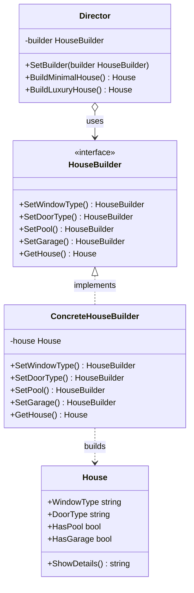

The Builder is a creational design pattern that lets you construct complex objects step by step. Unlike other creational patterns, Builder doesn’t require products to have a common interface. This makes it possible to produce different products using the same construction process.

## Conceptual Explanation & Real-World Analogy

Imagine a complex object that requires laborious, step-by-step initialization of many fields and nested objects. Such initialization code is usually buried inside a monstrous constructor with dozens of parameters, or scattered all over the client code.

For example, let's think about how to create a `House` object. To build a simple house, you need to construct four walls, a floor, install a door, fit a pair of windows, and build a roof. But what if you want a larger, brighter house, with a backyard, a swimming pool, a garage, and central heating? 

The simplest solution is to extend the base `House` class and create a set of subclasses to cover all combinations of the parameters. But eventually, you will end up with a considerable number of subclasses. Any new parameter, like porch style, will require growing this hierarchy even more.

Alternatively, you could create a single giant constructor in the base `House` class with all possible parameters that control the house object. While this eliminates subclasses, it creates another problem: in most cases, most of the parameters will be unused, making the constructor calls look extremely ugly and prone to errors.

The Builder pattern suggests that you extract the object construction code out of its own class and move it to separate objects called *builders*.

The pattern organizes object construction into a set of steps (e.g., `BuildWalls()`, `BuildDoor()`, `BuildPool()`). To create an object, you execute a series of these steps on a builder object. The important part is that you don’t need to call all of the steps. You can call only those steps that are necessary for producing a particular configuration of an object.

A *Director* class defines the order in which to execute the building steps, while the builder provides the implementation for those steps.

---

## Conceptual Diagram

Here is a Mermaid class diagram that shows the structure of the Builder pattern in Go:



---

## Use Case / Problem Scenario

Why do we need this pattern?
In Go, we do not have method overloading, which means we cannot have multiple constructors with the same name but different parameters. If a struct has 15 fields, creating it directly using struct literals requires you to specify all fields, or leave some as default zero values. 

If certain combinations of fields are required for specific configurations, the client code becomes cluttered with initialization logic. The Builder pattern isolates this complexity, providing a fluent interface (method chaining) or a Director to control the creation process, ensuring objects are always instantiated in a valid state.

---

## Golang Code Example

Below is a complete, compilable Go program demonstrating the Builder pattern following the Refactoring Guru style.

```go
package main

import (
	"fmt"
)

// House represents the product. It has various optional features.
type House struct {
	windowType string
	doorType   string
	hasPool    bool
	hasGarage  bool
}

func (h *House) ShowDetails() string {
	return fmt.Sprintf("House details: Windows: %s, Doors: %s, Pool: %t, Garage: %t",
		h.windowType, h.doorType, h.hasPool, h.hasGarage)
}

// HouseBuilder defines the builder interface with steps to construct a house.
type HouseBuilder interface {
	SetWindowType(wType string) HouseBuilder
	SetDoorType(dType string) HouseBuilder
	SetPool(hasPool bool) HouseBuilder
	SetGarage(hasGarage bool) HouseBuilder
	GetHouse() House
}

// ConcreteHouseBuilder implements the HouseBuilder interface.
type ConcreteHouseBuilder struct {
	house House
}

func NewConcreteHouseBuilder() *ConcreteHouseBuilder {
	return &ConcreteHouseBuilder{house: House{}}
}

func (b *ConcreteHouseBuilder) SetWindowType(wType string) HouseBuilder {
	b.house.windowType = wType
	return b
}

func (b *ConcreteHouseBuilder) SetDoorType(dType string) HouseBuilder {
	b.house.doorType = dType
	return b
}

func (b *ConcreteHouseBuilder) SetPool(hasPool bool) HouseBuilder {
	b.house.hasPool = hasPool
	return b
}

func (b *ConcreteHouseBuilder) SetGarage(hasGarage bool) HouseBuilder {
	b.house.hasGarage = hasGarage
	return b
}

func (b *ConcreteHouseBuilder) GetHouse() House {
	// Return a copy of the constructed house and reset the builder for the next use.
	result := b.house
	b.house = House{}
	return result
}

// Director controls the step-by-step construction of houses.
type Director struct {
	builder HouseBuilder
}

func NewDirector(b HouseBuilder) *Director {
	return &Director{builder: b}
}

func (d *Director) SetBuilder(b HouseBuilder) {
	d.builder = b
}

func (d *Director) BuildMinimalHouse() House {
	return d.builder.
		SetWindowType("Wooden Windows").
		SetDoorType("Wooden Door").
		SetPool(false).
		SetGarage(false).
		GetHouse()
}

func (d *Director) BuildLuxuryHouse() House {
	return d.builder.
		SetWindowType("Double Glazed Sliding Windows").
		SetDoorType("Reinforced Steel Smart Door").
		SetPool(true).
		SetGarage(true).
		GetHouse()
}

func main() {
	builder := NewConcreteHouseBuilder()
	director := NewDirector(builder)

	fmt.Println("Director: Building a minimal house...")
	minimalHouse := director.BuildMinimalHouse()
	fmt.Println(minimalHouse.ShowDetails())

	fmt.Println("\nDirector: Building a luxury house...")
	luxuryHouse := director.BuildLuxuryHouse()
	fmt.Println(luxuryHouse.ShowDetails())

	fmt.Println("\nClient: Building a custom house directly using fluent builder steps...")
	customHouse := builder.
		SetWindowType("Stained Glass").
		SetDoorType("Classic Oak Door").
		SetGarage(true).
		GetHouse()
	fmt.Println(customHouse.ShowDetails())
}
```

---

## Summary

### Advantages
- **Incremental Creation**: You can build objects step-by-step, defer construction steps, or run steps recursively.
- **Reusable Construction Code**: You can reuse the same construction code when building various representations of products.
- **Single Responsibility Principle**: You can isolate complex construction code from the business logic of the product.

### Disadvantages
- **Complexity**: The overall complexity of the code may increase since the pattern requires creating multiple new classes/structs.

### When to Use
- Use the Builder pattern to get rid of a "telescoping constructor" (a constructor with a long list of parameters, many of which are optional).
- Use the Builder pattern when you want your code to be able to create different representations of some product (for example, stone and wooden houses).
- Use the Builder pattern to construct complex trees or other composite objects.
