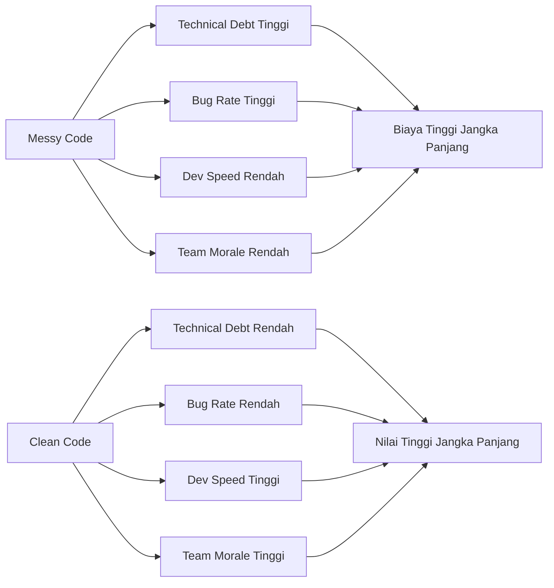

Bayangkan kamu baru bergabung di sebuah tim dan hari pertama langsung dapat tugas: *"Tolong fix bug di endpoint registrasi user, harusnya cepat."* Kamu buka file-nya, dan di sana ada satu fungsi sepanjang 200 baris — validasi, query database, kirim email, logging, semua tercampur aduk tanpa komentar berarti. Nama variabelnya `d`, `tmp`, `x2`. Tidak ada test. Tidak ada dokumentasi.

Tiga hari berlalu. Kamu masih belum berani menyentuh baris yang salah karena takut merusak sesuatu yang lain. Bug sederhana yang seharusnya selesai dalam 30 menit berubah menjadi mimpi buruk seminggu. Inilah harga dari *messy code* — bukan hanya rasa frustrasi, tapi waktu dan uang yang terbuang nyata.

Clean code bukan soal kode yang "cantik". Ini soal *respek* — terhadap rekan tim yang akan membaca kodemu besok, terhadap dirimu sendiri enam bulan lagi, dan terhadap bisnis yang bergantung pada sistem yang kamu bangun.

---

## Biaya Nyata dari Kode yang Berantakan



Setiap keputusan buruk dalam penulisan kode menambah *technical debt*. Semakin besar utang itu, semakin lambat tim bergerak, semakin banyak bug yang muncul, dan semakin lelah para developer. Clean code adalah investasi yang membayar dirinya sendiri berulang kali.

---

## Apa Itu Clean Code?

Robert C. Martin, atau yang akrab disebut "Uncle Bob", mendefinisikan clean code dalam bukunya yang legendaris:

> *"Clean code is code that has been taken care of. Someone has taken the time to keep it simple and orderly."*

Tiga pilar utama clean code:

| Pilar | Artinya |
|---|---|
| **Readable** | Siapapun bisa memahami kode tanpa penjelasan lisan |
| **Maintainable** | Perubahan bisa dilakukan dengan aman dan cepat |
| **Testable** | Kode mudah diuji secara otomatis dan terisolasi |

### Mitos: "Clean Code = Lebih Lambat"

Ini adalah kesalahpahaman paling umum. Memang, menulis clean code membutuhkan sedikit lebih banyak waktu *di awal*. Tapi riset dan pengalaman industri secara konsisten menunjukkan bahwa kode yang bersih **menghemat 10x lebih banyak waktu** dalam jangka panjang — mulai dari debugging, onboarding anggota baru, hingga menambah fitur baru.

---

## Implementasi yang Salah

Ini adalah pola yang sering ditemukan di dunia nyata — satu handler yang mencoba melakukan segalanya:

```go
// ❌ BAD: Satu fungsi melakukan validasi, DB query, kirim email, dan logging
// Ini adalah "God Function" — sulit dibaca, ditest, dan dimaintain

func RegisterUser(w http.ResponseWriter, r *http.Request) {
    // Parse body
    var body map[string]interface{}
    if err := json.NewDecoder(r.Body).Decode(&body); err != nil {
        http.Error(w, "bad request", 400)
        return
    }

    // Validasi manual, tidak ada abstraksi
    email, ok := body["email"].(string)
    if !ok || email == "" {
        http.Error(w, "email required", 400)
        return
    }
    if !strings.Contains(email, "@") {
        http.Error(w, "invalid email", 400)
        return
    }
    password, ok := body["password"].(string)
    if !ok || len(password) < 8 {
        http.Error(w, "password min 8 chars", 400)
        return
    }

    // Query DB langsung di handler — coupling tinggi
    db, err := sql.Open("postgres", os.Getenv("DB_URL"))
    if err != nil {
        log.Println("db error:", err)
        http.Error(w, "server error", 500)
        return
    }
    defer db.Close()

    var exists bool
    db.QueryRow("SELECT EXISTS(SELECT 1 FROM users WHERE email=$1)", email).Scan(&exists)
    if exists {
        http.Error(w, "email already registered", 409)
        return
    }

    hash, _ := bcrypt.GenerateFromPassword([]byte(password), 14)
    _, err = db.Exec("INSERT INTO users (email, password) VALUES ($1, $2)", email, string(hash))
    if err != nil {
        log.Println("insert error:", err)
        http.Error(w, "server error", 500)
        return
    }

    // Kirim email verifikasi — logika bisnis di handler HTTP
    smtpHost := os.Getenv("SMTP_HOST")
    msg := "From: no-reply@app.com\nTo: " + email + "\nSubject: Welcome!\n\nThank you for registering."
    smtp.SendMail(smtpHost+":587", nil, "no-reply@app.com", []string{email}, []byte(msg))

    log.Printf("user registered: %s at %v", email, time.Now())

    w.WriteHeader(201)
    json.NewEncoder(w).Encode(map[string]string{"message": "registered"})
}
```

**Mengapa ini buruk?**
- Satu fungsi melakukan 5+ tanggung jawab berbeda (*Single Responsibility Principle* dilanggar)
- Koneksi DB dibuka di setiap request — performa buruk dan sulit di-mock saat testing
- Tidak bisa ditest secara unit tanpa infrastruktur nyata (DB, SMTP)
- Jika logika email berubah, kamu harus mencarinya di dalam handler HTTP

---

## Implementasi yang Benar

Sekarang kita refactor menjadi fungsi-fungsi kecil yang fokus dan punya nama yang jelas:

```go
// ✅ GOOD: Setiap fungsi punya satu tanggung jawab yang jelas

// --- Model & Request ---

type RegisterRequest struct {
    Email    string `json:"email"`
    Password string `json:"password"`
}

func (r RegisterRequest) Validate() error {
    if r.Email == "" || !strings.Contains(r.Email, "@") {
        return errors.New("invalid email address")
    }
    if len(r.Password) < 8 {
        return errors.New("password must be at least 8 characters")
    }
    return nil
}

// --- Service Layer ---

type UserService struct {
    repo   UserRepository
    mailer Mailer
}

func (s *UserService) Register(ctx context.Context, req RegisterRequest) error {
    if err := req.Validate(); err != nil {
        return fmt.Errorf("validation: %w", err)
    }

    exists, err := s.repo.EmailExists(ctx, req.Email)
    if err != nil {
        return fmt.Errorf("checking email: %w", err)
    }
    if exists {
        return ErrEmailAlreadyRegistered
    }

    hashed, err := hashPassword(req.Password)
    if err != nil {
        return fmt.Errorf("hashing password: %w", err)
    }

    if err := s.repo.CreateUser(ctx, req.Email, hashed); err != nil {
        return fmt.Errorf("creating user: %w", err)
    }

    s.mailer.SendWelcome(req.Email)
    return nil
}

// --- HTTP Handler ---

func (h *UserHandler) Register(w http.ResponseWriter, r *http.Request) {
    var req RegisterRequest
    if err := json.NewDecoder(r.Body).Decode(&req); err != nil {
        respondError(w, http.StatusBadRequest, "invalid request body")
        return
    }

    if err := h.service.Register(r.Context(), req); err != nil {
        handleServiceError(w, err)
        return
    }

    respondJSON(w, http.StatusCreated, map[string]string{"message": "registration successful"})
}
```

**Mengapa ini lebih baik?**
- Handler hanya bertanggung jawab atas HTTP — decode, call service, encode response
- `UserService` bisa ditest secara unit dengan mock `UserRepository` dan `Mailer`
- `Validate()` bisa ditest sendiri tanpa context HTTP apapun
- Mudah dipahami: nama fungsi menjelaskan dirinya sendiri

---

## Use Case: REST API Registrasi User

Dalam aplikasi nyata, struktur ini memungkinkan kita untuk:

1. **Mengganti database** (misal dari PostgreSQL ke MySQL) tanpa menyentuh handler atau service — cukup ganti implementasi `UserRepository`
2. **Mengganti email provider** tanpa mengubah logika bisnis — cukup ganti implementasi `Mailer`
3. **Menulis test yang cepat** tanpa butuh database atau SMTP server sungguhan

Inilah kekuatan clean code: **fleksibilitas dan kepercayaan diri untuk berubah**.

---

## Rangkuman

> **5 Alasan Utama Clean Code Itu Penting:**
>
> 1. 📖 **Mudah Dibaca** — Developer baru bisa onboard lebih cepat
> 2. 🔧 **Mudah Dimaintain** — Perubahan tidak menimbulkan efek domino yang tidak terduga
> 3. 🧪 **Mudah Ditest** — Fungsi kecil dan fokus = unit test yang mudah ditulis
> 4. 💰 **Hemat Biaya** — Mengurangi waktu debugging dan bug production
> 5. 🤝 **Meningkatkan Moral Tim** — Developer lebih bahagia bekerja dengan kode yang bersih

---

## Tantangan untuk Kamu

Buka satu file di project-mu sekarang. Cari fungsi terpanjang yang kamu miliki. Tanyakan pada dirimu:

- Berapa banyak hal yang dilakukan fungsi ini?
- Apakah namanya menjelaskan apa yang dilakukan?
- Bisakah kamu menulis unit test untuk fungsi ini **hari ini** tanpa setup yang rumit?

Jika jawabannya "tidak", itulah kandidat pertama refactoring-mu. Kamu tidak perlu mengerjakan semuanya sekaligus — mulai dari satu fungsi, satu hari.

Bagikan pengalamanmu di kolom komentar! Fungsi seperti apa yang kamu temukan?

---

**🇮🇩 Versi Indonesia** \| **[🇬🇧 English version](/2026/06/16/clean-code-golang-part-1-why-it-matters)**

[Part 2: Penamaan yang Bermakna →](/2026/06/23/clean-code-golang-part-2-meaningful-naming-id)
