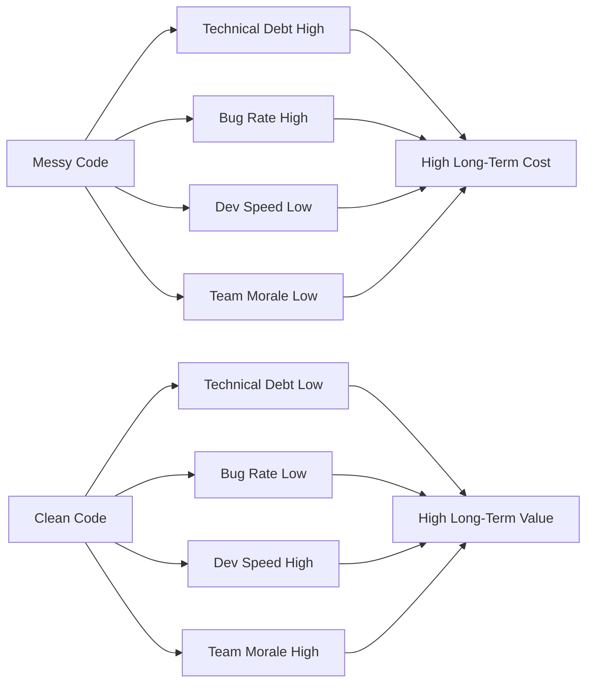

Imagine joining a new team and getting assigned your very first task: *"Just fix the bug in the user registration endpoint — shouldn't take long."* You open the file, and there it is: a single function, 200 lines long — validation, database queries, email sending, logging, all tangled together without a meaningful comment in sight. Variable names like `d`, `tmp`, and `x2`. No tests. No documentation.

Three days pass. You're still afraid to touch the wrong line because one wrong move could break something completely unrelated. A simple bug that should've taken 30 minutes has snowballed into a week-long nightmare. This is the true cost of *messy code* — not just frustration, but real time and money lost.

Clean code isn't about writing code that "looks pretty." It's about *respect* — for the teammate who will read your code tomorrow, for yourself six months from now, and for the business that depends on the system you're building.

---

## The Real Cost of Messy Code



Every poor decision in code accumulates as *technical debt*. The larger that debt grows, the slower the team moves, the more bugs appear, and the more burned out your developers become. Clean code is an investment that pays for itself — again and again.

---

## What Is Clean Code?

Robert C. Martin, widely known as "Uncle Bob," defined clean code in his landmark book:

> *"Clean code is code that has been taken care of. Someone has taken the time to keep it simple and orderly."*

Three core pillars of clean code:

| Pillar | Meaning |
|---|---|
| **Readable** | Anyone can understand the code without a verbal walkthrough |
| **Maintainable** | Changes can be made safely and quickly |
| **Testable** | Code is easy to test in isolation with automated tests |

### The Myth: "Clean Code = Slower Development"

This is the most common misconception. Yes, writing clean code takes a little more time *upfront*. But research and industry experience consistently show that clean code **saves 10x more time** in the long run — from debugging and fixing production bugs, to onboarding new team members, and shipping new features with confidence.

---

## Wrong Implementation

Here's a pattern found all too often in real codebases — one handler that tries to do everything:

```go
// ❌ BAD: One function handles validation, DB queries, email sending, and logging
// This is a "God Function" — hard to read, hard to test, hard to maintain

func RegisterUser(w http.ResponseWriter, r *http.Request) {
    // Parse body
    var body map[string]interface{}
    if err := json.NewDecoder(r.Body).Decode(&body); err != nil {
        http.Error(w, "bad request", 400)
        return
    }

    // Manual validation with zero abstraction
    email, ok := body["email"].(string)
    if !ok || email == "" {
        http.Error(w, "email required", 400)
        return
    }
    if !strings.Contains(email, "@") {
        http.Error(w, "invalid email", 400)
        return
    }
    password, ok := body["password"].(string)
    if !ok || len(password) < 8 {
        http.Error(w, "password min 8 chars", 400)
        return
    }

    // Opening a DB connection per request — terrible for performance and untestable
    db, err := sql.Open("postgres", os.Getenv("DB_URL"))
    if err != nil {
        log.Println("db error:", err)
        http.Error(w, "server error", 500)
        return
    }
    defer db.Close()

    var exists bool
    db.QueryRow("SELECT EXISTS(SELECT 1 FROM users WHERE email=$1)", email).Scan(&exists)
    if exists {
        http.Error(w, "email already registered", 409)
        return
    }

    hash, _ := bcrypt.GenerateFromPassword([]byte(password), 14)
    _, err = db.Exec("INSERT INTO users (email, password) VALUES ($1, $2)", email, string(hash))
    if err != nil {
        log.Println("insert error:", err)
        http.Error(w, "server error", 500)
        return
    }

    // Sending a welcome email — business logic buried inside an HTTP handler
    smtpHost := os.Getenv("SMTP_HOST")
    msg := "From: no-reply@app.com\nTo: " + email + "\nSubject: Welcome!\n\nThank you for registering."
    smtp.SendMail(smtpHost+":587", nil, "no-reply@app.com", []string{email}, []byte(msg))

    log.Printf("user registered: %s at %v", email, time.Now())

    w.WriteHeader(201)
    json.NewEncoder(w).Encode(map[string]string{"message": "registered"})
}
```

**Why this is wrong:**
- A single function carries 5+ distinct responsibilities (violates the *Single Responsibility Principle*)
- The DB connection opens on every request — poor performance and impossible to mock in tests
- Cannot be unit tested without real infrastructure (a live DB and SMTP server)
- If email logic changes, you have to hunt through an HTTP handler to find it

---

## Correct Implementation

Now let's refactor into small, focused functions with clear, self-documenting names:

```go
// ✅ GOOD: Each function has one clear, well-defined responsibility

// --- Model & Request ---

type RegisterRequest struct {
    Email    string `json:"email"`
    Password string `json:"password"`
}

func (r RegisterRequest) Validate() error {
    if r.Email == "" || !strings.Contains(r.Email, "@") {
        return errors.New("invalid email address")
    }
    if len(r.Password) < 8 {
        return errors.New("password must be at least 8 characters")
    }
    return nil
}

// --- Service Layer ---

type UserService struct {
    repo   UserRepository
    mailer Mailer
}

func (s *UserService) Register(ctx context.Context, req RegisterRequest) error {
    if err := req.Validate(); err != nil {
        return fmt.Errorf("validation: %w", err)
    }

    exists, err := s.repo.EmailExists(ctx, req.Email)
    if err != nil {
        return fmt.Errorf("checking email: %w", err)
    }
    if exists {
        return ErrEmailAlreadyRegistered
    }

    hashed, err := hashPassword(req.Password)
    if err != nil {
        return fmt.Errorf("hashing password: %w", err)
    }

    if err := s.repo.CreateUser(ctx, req.Email, hashed); err != nil {
        return fmt.Errorf("creating user: %w", err)
    }

    s.mailer.SendWelcome(req.Email)
    return nil
}

// --- HTTP Handler ---

func (h *UserHandler) Register(w http.ResponseWriter, r *http.Request) {
    var req RegisterRequest
    if err := json.NewDecoder(r.Body).Decode(&req); err != nil {
        respondError(w, http.StatusBadRequest, "invalid request body")
        return
    }

    if err := h.service.Register(r.Context(), req); err != nil {
        handleServiceError(w, err)
        return
    }

    respondJSON(w, http.StatusCreated, map[string]string{"message": "registration successful"})
}
```

**Why this is better:**
- The handler only owns HTTP concerns — decode input, call service, encode response
- `UserService` can be unit tested using mock implementations of `UserRepository` and `Mailer`
- `Validate()` can be tested in complete isolation with no HTTP context needed
- The code reads like plain English — function names explain themselves

---

## Real-World Use Case: User Registration REST API

In a real production application, this clean structure enables you to:

1. **Swap the database** (e.g., from PostgreSQL to MySQL) without touching the handler or service — just replace the `UserRepository` implementation
2. **Switch email providers** (e.g., from SendGrid to AWS SES) without changing any business logic — just replace the `Mailer` implementation
3. **Write fast unit tests** without spinning up a real database or SMTP server

This is the true power of clean code: **the confidence and flexibility to change**.

---

## Summary

> **5 Key Reasons Why Clean Code Matters:**
>
> 1. 📖 **Readable** — New developers can onboard and contribute faster
> 2. 🔧 **Maintainable** — Changes don't cause unexpected cascading failures
> 3. 🧪 **Testable** — Small, focused functions are easy to unit test
> 4. 💰 **Cost-Effective** — Less time spent debugging, fewer production incidents
> 5. 🤝 **Boosts Team Morale** — Developers are happier working in a clean codebase

---

## Your Challenge

Open one file in your current project right now. Find the longest function you have. Ask yourself:

- How many different things does this function do?
- Does its name accurately describe what it does?
- Can you write a unit test for this function **today** without complex setup?

If the answer is "no," that's your first refactoring candidate. You don't have to tackle everything at once — start with one function, one day at a time.

Share your experience in the comments! What kind of function did you find?

---

**[🇮🇩 Versi Indonesia](/2026/06/16/clean-code-golang-part-1-why-it-matters-id)** \| **🇬🇧 English version**

[Part 2: Meaningful Naming →](/2026/06/23/clean-code-golang-part-2-meaningful-naming)
