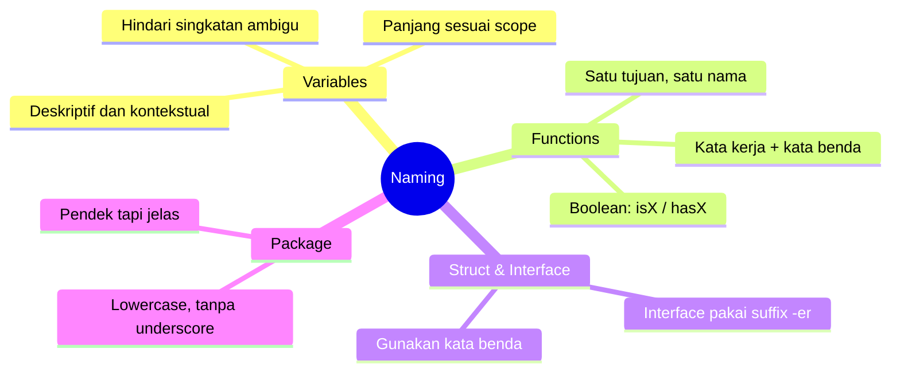

Bayangkan kamu baru bergabung di sebuah tim dan diminta mereview sebuah bug. Kamu membuka file-nya, dan ini yang kamu lihat:

```go
func proc(d *D, tmp int) (interface{}, error) {
    x := getStuff(d.id)
    if x == nil || tmp > x.v {
        return nil, fmt.Errorf("err")
    }
    data2 := h(x)
    return data2, nil
}
```

Dua jam kemudian — setelah buka-tutup empat file lain, tanya dua rekan, dan minum dua cangkir kopi — kamu baru paham bahwa fungsi 20 baris ini melakukan validasi pembayaran. Waktu dua jam hanya untuk *membaca* kode, bukan untuk *memperbaiki* bug-nya.

Ini bukan cerita fiksi. Ini terjadi setiap hari di tim-tim yang meremehkan pentingnya penamaan. Dan kabar baiknya: ini sepenuhnya bisa dicegah.

> **Nama yang baik adalah dokumentasi terbaik yang tidak pernah basi.**

---

## Peta Konsep: Naming di Go



---

## Konvensi Naming di Go

Go punya filosofi yang sederhana tapi kuat soal penamaan. Berikut hal-hal yang wajib kamu pahami:

### 1. Exported vs Unexported

Di Go, huruf kapital pertama menentukan visibilitas. `User` bisa diakses dari luar package, `user` hanya untuk internal.

```go
type User struct { ... }            // ✅ Exported — bisa dipakai package lain
type internalCache struct { ... }   // ✅ Unexported — hanya di dalam package ini
```

### 2. Akronim Ditulis Konsisten

Untuk akronim seperti URL, ID, HTTP — Go convention menggunakan semua huruf kapital (bukan `Url`, `Id`, `Http`).

```go
// ❌ BAD:
func getUserUrl(userId int) string { ... }

// ✅ GOOD:
func getUserURL(userID int) string { ... }
```

### 3. Interface Pakai Suffix `-er`

Interface di Go idealnya dinamai berdasarkan perilakunya, dengan akhiran `-er`.

```go
type Reader interface { Read(p []byte) (n int, err error) }
type Storer interface { Store(key string, value any) error }
type PaymentProcessor interface { ProcessPayment(amount float64) error }
```

### 4. Panjang Nama Sesuai Scope

Variabel yang hanya hidup dalam 2 baris boleh pendek. Variabel yang hidup sepanjang fungsi atau struct harus deskriptif.

```go
// ✅ GOOD: `i` wajar untuk loop counter
for i := 0; i < len(users); i++ { ... }

// ✅ GOOD: nama panjang untuk scope lebar
cachedUser, err := userCache.GetByID(userID)
```

---

## ❌ Implementasi yang Salah

Berikut contoh kode dengan penamaan yang buruk — persis seperti yang kamu temui di awal cerita tadi:

```go
// ❌ BAD: Nama-nama yang tidak bermakna

type D struct {      // D itu apa? Data? Domain? Dokter?
    id  int
    v   float64      // v = value? version? volume?
    ts  int64        // ts = timestamp? test score?
}

// proc = process apa?
func proc(d *D, tmp int) (interface{}, error) {
    x := getStuff(d.id)    // getStuff mendapatkan "stuff" apa?
    if x == nil || tmp > x.v {
        return nil, fmt.Errorf("err")  // error apa?
    }
    data2 := h(x)          // h() = handler? hash? helper?
    return data2, nil
}
```

**Mengapa ini salah?**

- `D`, `x`, `tmp`, `data2` tidak memberikan konteks apapun
- `proc()`, `h()`, `getStuff()` memaksa pembaca menebak-nebak tujuannya
- `fmt.Errorf("err")` adalah error message yang tidak berguna sama sekali
- Satu nama ambigu sudah merepotkan — bayangkan jika seluruh codebase seperti ini

---

## ✅ Implementasi yang Benar

Sekarang kita tulis ulang kode yang sama dengan nama yang bermakna:

```go
// ✅ GOOD: Nama yang jelas dan berbicara sendiri

type Payment struct {
    id        int
    amount    float64
    expiresAt int64
}

// processPayment memvalidasi dan memproses pembayaran user.
// Mengembalikan error jika pembayaran tidak ditemukan atau sudah kedaluwarsa.
func processPayment(payment *Payment, currentUnixTime int64) (*PaymentResult, error) {
    existingPayment, err := getPaymentByID(payment.id)
    if err != nil {
        return nil, fmt.Errorf("payment not found: %w", err)
    }

    isExpired := currentUnixTime > existingPayment.expiresAt
    if isExpired {
        return nil, fmt.Errorf("payment %d has expired", payment.id)
    }

    result := buildPaymentResult(existingPayment)
    return result, nil
}
```

**Mengapa ini lebih baik?**

- `Payment`, `expiresAt`, `currentUnixTime` — langsung paham tanpa dokumentasi tambahan
- `processPayment()`, `getPaymentByID()`, `buildPaymentResult()` — kata kerja + kata benda yang jelas
- `isExpired` — boolean dengan prefix `is` yang konvensional
- Error message yang informatif dengan `%w` untuk wrapping

---

## Use Case: User Authentication Service

Mari kita lihat bagaimana naming yang baik diaplikasikan di sebuah auth service nyata:

```go
package auth

import (
    "context"
    "fmt"
    "time"
)

// UserAuthenticator mendefinisikan kontrak untuk autentikasi user.
type UserAuthenticator interface {
    Authenticate(ctx context.Context, credentials Credentials) (*AuthToken, error)
    RevokeToken(ctx context.Context, tokenID string) error
}

// Credentials menyimpan informasi login dari user.
type Credentials struct {
    Email    string
    Password string
}

// AuthToken adalah token hasil autentikasi yang berhasil.
type AuthToken struct {
    TokenID   string
    UserID    int
    ExpiresAt time.Time
    IssuedAt  time.Time
}

// authService adalah implementasi internal dari UserAuthenticator.
type authService struct {
    userRepo  UserRepository
    tokenRepo TokenRepository
    hasher    PasswordHasher
}

// Authenticate memverifikasi kredensial dan mengembalikan token jika valid.
func (s *authService) Authenticate(ctx context.Context, creds Credentials) (*AuthToken, error) {
    foundUser, err := s.userRepo.FindByEmail(ctx, creds.Email)
    if err != nil {
        return nil, fmt.Errorf("user lookup failed: %w", err)
    }

    isPasswordValid := s.hasher.Compare(creds.Password, foundUser.HashedPassword)
    if !isPasswordValid {
        return nil, ErrInvalidCredentials
    }

    token, err := s.tokenRepo.Create(ctx, foundUser.ID)
    if err != nil {
        return nil, fmt.Errorf("token creation failed: %w", err)
    }

    return token, nil
}
```

Perhatikan betapa mudahnya membaca kode ini. Tanpa satu komentar penjelasan pun, kamu sudah tahu apa yang terjadi di setiap baris.

---

## 📋 Ringkasan: 5 Aturan Naming untuk Go Developer

> **1. Gunakan nama yang mengungkap niat, bukan implementasi**
> `calculateTotalPrice()` lebih baik dari `calc()` atau `doThing()`
>
> **2. Ikuti konvensi akronim Go**
> `userID`, `httpClient`, `getURL()` — bukan `userId`, `httpClient`, `getUrl()`
>
> **3. Beri nama interface dengan suffix `-er`**
> `Reader`, `Storer`, `PaymentProcessor`, `UserAuthenticator`
>
> **4. Boolean harus punya prefix `is`, `has`, atau `can`**
> `isExpired`, `hasPermission`, `canRetry`
>
> **5. Panjang nama sebanding dengan jangkauan scope-nya**
> Loop counter boleh `i`. Field struct harus `expiresAt`, bukan `ea`

---

## 🎯 Challenge untuk Kamu

Buka PR atau commit terakhir yang kamu kerjakan. Temukan **3 variabel atau fungsi** yang namanya bisa diperbaiki, lalu rename dengan aturan di atas.

Kemudian tunjukkan ke rekan tim kamu — tanpa penjelasan. Apakah mereka langsung paham apa yang dilakukan kode itu?

Kalau ya, kamu sudah menulis kode yang berbicara sendiri. 🎉

---

**🇮🇩 Versi Indonesia** \| **[🇬🇧 English version](/2026/06/19/clean-code-golang-part-2-naming)**

← [Part 1: Kenapa Clean Code Penting?](/2026/06/12/clean-code-golang-part-1-why-clean-code-id) \| [Part 3: Functions →](/2026/06/26/clean-code-golang-part-3-functions-id)
