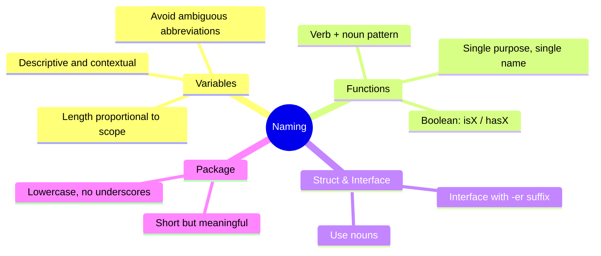

Picture this: you've just joined a new team and you're asked to investigate a bug. You open the file, and this is what greets you:

```go
func proc(d *D, tmp int) (interface{}, error) {
    x := getStuff(d.id)
    if x == nil || tmp > x.v {
        return nil, fmt.Errorf("err")
    }
    data2 := h(x)
    return data2, nil
}
```

Two hours later — after jumping between four other files, pinging two teammates, and brewing a second cup of coffee — you finally figure out that this 20-line function is processing a payment validation. Two hours just to *read* the code. Not to fix the bug. Just to read it.

This isn't a hypothetical. It happens every day on teams that underestimate the power of good naming. And here's the good news: it's entirely preventable.

> **A good name is the best documentation — and it never goes out of date.**

---

## Concept Map: Naming in Go



---

## Go Naming Conventions

Go has a simple but powerful philosophy around naming. Here are the essential things you need to know:

### 1. Exported vs Unexported

In Go, the first letter determines visibility. `User` is accessible from outside the package; `user` is internal only.

```go
type User struct { ... }            // ✅ Exported — accessible by other packages
type internalCache struct { ... }   // ✅ Unexported — internal to this package only
```

### 2. Acronyms Are Written Consistently

For acronyms like URL, ID, HTTP — Go convention uses all caps (not `Url`, `Id`, `Http`).

```go
// ❌ BAD:
func getUserUrl(userId int) string { ... }

// ✅ GOOD:
func getUserURL(userID int) string { ... }
```

### 3. Interfaces Use the `-er` Suffix

Go interfaces are ideally named after the behavior they describe, using an `-er` suffix.

```go
type Reader interface { Read(p []byte) (n int, err error) }
type Storer interface { Store(key string, value any) error }
type PaymentProcessor interface { ProcessPayment(amount float64) error }
```

### 4. Name Length Should Match Scope

A variable that lives for two lines can be short. A variable that lives across a whole function or struct should be descriptive.

```go
// ✅ GOOD: `i` is fine for a loop counter
for i := 0; i < len(users); i++ { ... }

// ✅ GOOD: a longer name for a wider scope
cachedUser, err := userCache.GetByID(userID)
```

---

## ❌ Wrong Implementation

Here's an example of code with terrible naming — exactly what you'd encounter in the story above:

```go
// ❌ BAD: Meaningless names throughout

type D struct {      // What is D? Data? Domain? Doctor?
    id  int
    v   float64      // v = value? version? volume?
    ts  int64        // ts = timestamp? test score?
}

// proc = process what, exactly?
func proc(d *D, tmp int) (interface{}, error) {
    x := getStuff(d.id)    // getStuff gets what "stuff"?
    if x == nil || tmp > x.v {
        return nil, fmt.Errorf("err")  // what error?
    }
    data2 := h(x)          // h() = handler? hash? helper?
    return data2, nil
}
```

**Why this is wrong:**

- `D`, `x`, `tmp`, `data2` give the reader zero context
- `proc()`, `h()`, `getStuff()` force every reader to guess their intent
- `fmt.Errorf("err")` is a completely useless error message
- One ambiguous name is annoying — an entire codebase of them is a nightmare

---

## ✅ Correct Implementation

Now let's rewrite the same logic with meaningful names:

```go
// ✅ GOOD: Clear names that speak for themselves

type Payment struct {
    id        int
    amount    float64
    expiresAt int64
}

// processPayment validates and processes a user's payment.
// Returns an error if the payment is not found or has expired.
func processPayment(payment *Payment, currentUnixTime int64) (*PaymentResult, error) {
    existingPayment, err := getPaymentByID(payment.id)
    if err != nil {
        return nil, fmt.Errorf("payment not found: %w", err)
    }

    isExpired := currentUnixTime > existingPayment.expiresAt
    if isExpired {
        return nil, fmt.Errorf("payment %d has expired", payment.id)
    }

    result := buildPaymentResult(existingPayment)
    return result, nil
}
```

**Why this works:**

- `Payment`, `expiresAt`, `currentUnixTime` — you understand them instantly, no extra docs needed
- `processPayment()`, `getPaymentByID()`, `buildPaymentResult()` — clear verb + noun pairs
- `isExpired` — a boolean with the conventional `is` prefix
- Informative error messages with `%w` for proper error wrapping

---

## Real-World Use Case: User Authentication Service

Here's how proper naming looks applied across a real-world auth service:

```go
package auth

import (
    "context"
    "fmt"
    "time"
)

// UserAuthenticator defines the contract for user authentication.
type UserAuthenticator interface {
    Authenticate(ctx context.Context, credentials Credentials) (*AuthToken, error)
    RevokeToken(ctx context.Context, tokenID string) error
}

// Credentials holds the login information provided by the user.
type Credentials struct {
    Email    string
    Password string
}

// AuthToken represents a token issued after successful authentication.
type AuthToken struct {
    TokenID   string
    UserID    int
    ExpiresAt time.Time
    IssuedAt  time.Time
}

// authService is the internal implementation of UserAuthenticator.
type authService struct {
    userRepo  UserRepository
    tokenRepo TokenRepository
    hasher    PasswordHasher
}

// Authenticate verifies the credentials and returns a token if valid.
func (s *authService) Authenticate(ctx context.Context, creds Credentials) (*AuthToken, error) {
    foundUser, err := s.userRepo.FindByEmail(ctx, creds.Email)
    if err != nil {
        return nil, fmt.Errorf("user lookup failed: %w", err)
    }

    isPasswordValid := s.hasher.Compare(creds.Password, foundUser.HashedPassword)
    if !isPasswordValid {
        return nil, ErrInvalidCredentials
    }

    token, err := s.tokenRepo.Create(ctx, foundUser.ID)
    if err != nil {
        return nil, fmt.Errorf("token creation failed: %w", err)
    }

    return token, nil
}
```

Notice how readable this is. Without a single explanatory comment, you know exactly what every line is doing and why.

---

## 📋 Summary: 5 Naming Rules Every Go Developer Should Know

> **1. Name things by intent, not implementation**
> `calculateTotalPrice()` beats `calc()` or `doThing()` every time
>
> **2. Follow Go's acronym convention**
> `userID`, `httpClient`, `getURL()` — not `userId`, `httpClient`, `getUrl()`
>
> **3. Name interfaces with the `-er` suffix**
> `Reader`, `Storer`, `PaymentProcessor`, `UserAuthenticator`
>
> **4. Prefix booleans with `is`, `has`, or `can`**
> `isExpired`, `hasPermission`, `canRetry`
>
> **5. Name length should be proportional to scope**
> A loop counter can be `i`. A struct field must be `expiresAt`, never `ea`

---

## 🎯 Your Challenge

Open the last PR or commit you worked on. Find **3 variables or functions** whose names could be improved, and rename them using the rules above.

Then show it to a teammate — without any explanation. Do they immediately understand what the code does?

If yes, you've written code that speaks for itself. 🎉

---

**[🇮🇩 Versi Indonesia](/2026/06/19/clean-code-golang-part-2-naming-id)** \| **🇬🇧 English version**

← [Part 1: Why Does Clean Code Matter?](/2026/06/12/clean-code-golang-part-1-why-clean-code) \| [Part 3: Functions →](/2026/06/26/clean-code-golang-part-3-functions)
