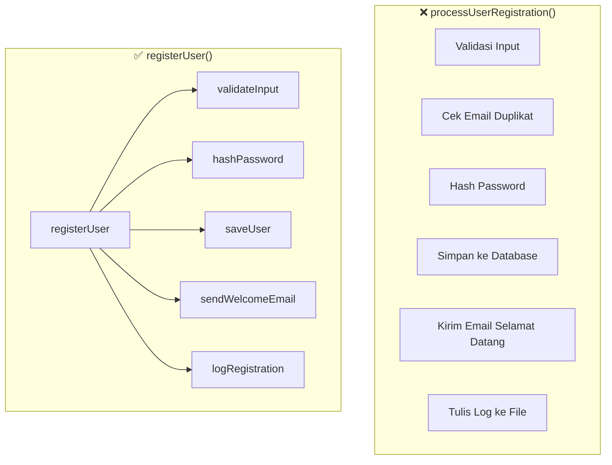

Bayangkan kamu baru bergabung di sebuah tim dan diminta memperbaiki sebuah bug di fitur registrasi pengguna. Kamu buka file-nya, gulir ke bawah, dan menemukan sebuah fungsi bernama `processUserRegistration` — sepanjang **200 baris**. Nafas tertahan sebentar. Di dalamnya ada validasi input, hashing password, penyimpanan ke database, pengiriman email, penulisan log, dan masih banyak lagi — semuanya bercampur dalam satu fungsi monolitik yang mustahil untuk dipahami secara utuh dalam sekali baca.

Kamu mencoba menulis unit test untuk bagian hash password-nya, tapi tidak bisa — karena fungsi itu terlalu bergantung pada database dan email server. Kamu mencoba menggunakan ulang logika validasinya di endpoint lain, tapi tidak bisa — karena logika itu tertanam dalam dan terkait erat dengan langkah-langkah lainnya. Inilah biaya nyata dari fungsi yang mencoba melakukan segalanya.

Prinsip **Single Responsibility Principle (SRP)** pada level fungsi bukan sekadar aturan gaya — ini adalah jaminan bahwa kode kamu bisa diuji, digunakan ulang, dan dipahami oleh orang lain (termasuk dirimu sendiri enam bulan ke depan).

---

## Visualisasi: Satu Fungsi vs. Banyak Tanggung Jawab



Di sisi kiri, satu fungsi menanggung enam tanggung jawab berbeda. Di sisi kanan, `registerUser` bertindak sebagai orkestrator — ia mendelegasikan setiap pekerjaan ke fungsi kecil yang punya satu fokus jelas.

---

## Konsep Inti

### 1. Single Responsibility Principle (SRP)

Sebuah fungsi seharusnya hanya melakukan **satu hal**, dan melakukannya dengan baik. Cara termudah menguji ini: coba jelaskan fungsi tersebut dalam satu kalimat tanpa menggunakan kata "dan". Jika kamu terpaksa menggunakan "dan", fungsi itu sudah melakukan terlalu banyak.

### 2. Ukuran Ideal Fungsi di Go

Tidak ada aturan baku, tapi **~20 baris** adalah patokan yang baik. Jika fungsi tidak muat di satu layar, kemungkinan besar ia bisa dipecah. Go sendiri mendorong gaya ini — fungsi-fungsi di standard library Go umumnya pendek dan fokus.

### 3. Guard Clauses / Early Return

Daripada bersarang dalam blok `if-else` yang dalam, gunakan **early return** untuk menangani kasus-kasus gagal di awal. Ini mengurangi indentasi dan membuat jalur sukses lebih mudah dibaca.

### 4. Hindari Parameter Boolean untuk Mengontrol Perilaku

Parameter `bool` yang digunakan untuk memilih "mode" fungsi adalah bau kode yang kuat. Biasanya artinya fungsi tersebut sebenarnya adalah **dua fungsi** yang disatukan. Pecah menjadi dua fungsi terpisah.

---

## ❌ Implementasi yang Salah

```go
// ❌ BAD: Satu fungsi melakukan segalanya, dengan flag boolean untuk kontrol perilaku
func processUserRegistration(user User, sendEmail bool, logToFile bool) error {
    // Validasi
    if user.Name == "" {
        return errors.New("name is required")
    }
    if user.Email == "" || !strings.Contains(user.Email, "@") {
        return errors.New("invalid email")
    }
    if len(user.Password) < 8 {
        return errors.New("password too short")
    }

    // Cek duplikasi email di DB
    existing, err := db.Query("SELECT id FROM users WHERE email = ?", user.Email)
    if err != nil {
        return err
    }
    if existing.Next() {
        return errors.New("email already registered")
    }

    // Hash password
    hashed, err := bcrypt.GenerateFromPassword([]byte(user.Password), bcrypt.DefaultCost)
    if err != nil {
        return err
    }
    user.Password = string(hashed)

    // Simpan ke database
    _, err = db.Exec("INSERT INTO users (name, email, password) VALUES (?, ?, ?)",
        user.Name, user.Email, user.Password)
    if err != nil {
        return err
    }

    // ❌ BAD: Flag boolean menciptakan dua jalur tersembunyi
    if sendEmail {
        msg := "Welcome, " + user.Name + "!"
        smtp.SendMail("smtp.example.com:587", nil, "no-reply@example.com",
            []string{user.Email}, []byte(msg))
    }

    if logToFile {
        f, _ := os.OpenFile("app.log", os.O_APPEND|os.O_WRONLY, 0644)
        f.WriteString("User registered: " + user.Email + "\n")
        f.Close()
    }

    return nil
}
```

**Mengapa ini buruk?**
- Tidak mungkin diuji secara unit tanpa database, SMTP server, dan filesystem nyata
- Parameter `sendEmail bool` dan `logToFile bool` adalah sinyal bahwa ini sebenarnya beberapa fungsi dalam satu
- Jika logika hash password berubah, kamu harus sentuh fungsi yang juga mengurus email
- Tidak ada bagian yang bisa digunakan ulang di tempat lain

---

## ✅ Implementasi yang Benar

```go
// ✅ GOOD: Setiap fungsi punya satu tanggung jawab

// validateUserInput hanya memvalidasi data pengguna
func validateUserInput(user User) error {
    if user.Name == "" {
        return errors.New("name is required")
    }
    if !strings.Contains(user.Email, "@") {
        return errors.New("invalid email address")
    }
    if len(user.Password) < 8 {
        return errors.New("password must be at least 8 characters")
    }
    return nil
}

// createUser menyimpan pengguna baru ke database dan mengembalikan user yang tersimpan
func createUser(ctx context.Context, db *sql.DB, user User) (User, error) {
    hashed, err := bcrypt.GenerateFromPassword([]byte(user.Password), bcrypt.DefaultCost)
    if err != nil {
        return User{}, fmt.Errorf("hashing password: %w", err)
    }
    user.Password = string(hashed)

    err = db.QueryRowContext(ctx,
        "INSERT INTO users (name, email, password) VALUES (?, ?, ?) RETURNING id",
        user.Name, user.Email, user.Password,
    ).Scan(&user.ID)
    if err != nil {
        return User{}, fmt.Errorf("saving user: %w", err)
    }
    return user, nil
}

// notifyUser mengirim email selamat datang ke pengguna baru
func notifyUser(mailer Mailer, user User) error {
    return mailer.Send(Mail{
        To:      user.Email,
        Subject: "Selamat datang, " + user.Name + "!",
        Body:    "Akun kamu berhasil dibuat.",
    })
}

// RegisterUser adalah orkestrator — hanya mengoordinasikan langkah-langkah
func RegisterUser(ctx context.Context, db *sql.DB, mailer Mailer, logger Logger, user User) error {
    // ✅ GOOD: Guard clause — tangani error lebih awal
    if err := validateUserInput(user); err != nil {
        return fmt.Errorf("validation: %w", err)
    }

    savedUser, err := createUser(ctx, db, user)
    if err != nil {
        return fmt.Errorf("create user: %w", err)
    }

    if err := notifyUser(mailer, savedUser); err != nil {
        // Email gagal tidak menggagalkan registrasi — log saja
        logger.Warn("failed to send welcome email", "user_id", savedUser.ID, "err", err)
    }

    logger.Info("user registered", "user_id", savedUser.ID, "email", savedUser.Email)
    return nil
}
```

**Mengapa ini lebih baik?**
- `validateUserInput` bisa diuji secara unit tanpa dependensi eksternal
- `createUser` bisa di-mock database-nya untuk pengujian
- `notifyUser` bisa diuji dengan mailer palsu (mock)
- `RegisterUser` hanya membaca seperti daftar langkah — mudah dipahami
- Setiap fungsi bisa digunakan ulang di endpoint atau use case lain

---

## Use Case Nyata: HTTP Handler Registrasi

```go
// Handler HTTP yang bersih karena logika bisnis sudah terpisah
func (h *UserHandler) Register(w http.ResponseWriter, r *http.Request) {
    var user User
    if err := json.NewDecoder(r.Body).Decode(&user); err != nil {
        http.Error(w, "invalid request body", http.StatusBadRequest)
        return
    }

    if err := RegisterUser(r.Context(), h.db, h.mailer, h.logger, user); err != nil {
        // ✅ GOOD: Error wrapping memudahkan debugging
        h.logger.Error("registration failed", "err", err)
        http.Error(w, "registration failed", http.StatusInternalServerError)
        return
    }

    w.WriteHeader(http.StatusCreated)
    json.NewEncoder(w).Encode(map[string]string{"status": "ok"})
}
```

Handler ini tipis dan bersih. Ia hanya mengurus HTTP — parsing request, memanggil logika bisnis, dan menulis response. Semua detail ada di lapisan yang tepat.

---

## Rangkuman

> **Aturan emas fungsi bersih di Go:**
> - ✅ Satu fungsi = satu tanggung jawab
> - ✅ Targetkan ~20 baris per fungsi
> - ✅ Gunakan early return (guard clauses) untuk mengurangi nesting
> - ✅ Hindari parameter `bool` yang mengontrol perilaku — pecah jadi dua fungsi
> - ✅ Fungsi orkestrator hanya mendelegasikan, tidak mengimplementasikan detail
> - ✅ Nama fungsi harus cukup jelas sehingga komentarnya tidak diperlukan

---

## 🎯 Tantangan

Buka codebase kamu sekarang. Temukan fungsi terpanjang yang ada. Tanyakan pada dirimu sendiri:

1. Apakah fungsi ini bisa dijelaskan dalam satu kalimat tanpa kata "dan"?
2. Bagian mana yang bisa diekstrak menjadi fungsi tersendiri?
3. Apakah ada parameter `bool` yang menyembunyikan dua perilaku?

Coba pecah fungsi tersebut dan lihat betapa lebih mudahnya kamu menulis test untuknya.

---

**🇮🇩 Versi Indonesia** | **[🇬🇧 English version](/2026/06/23/clean-code-golang-part-3-functions.html)**

← [Part 2: Penamaan yang Bermakna](/2026/06/16/clean-code-golang-part-2-naming-id.html) | [Part 4: Komentar yang Tepat →](/2026/06/30/clean-code-golang-part-4-comments-id.html)
