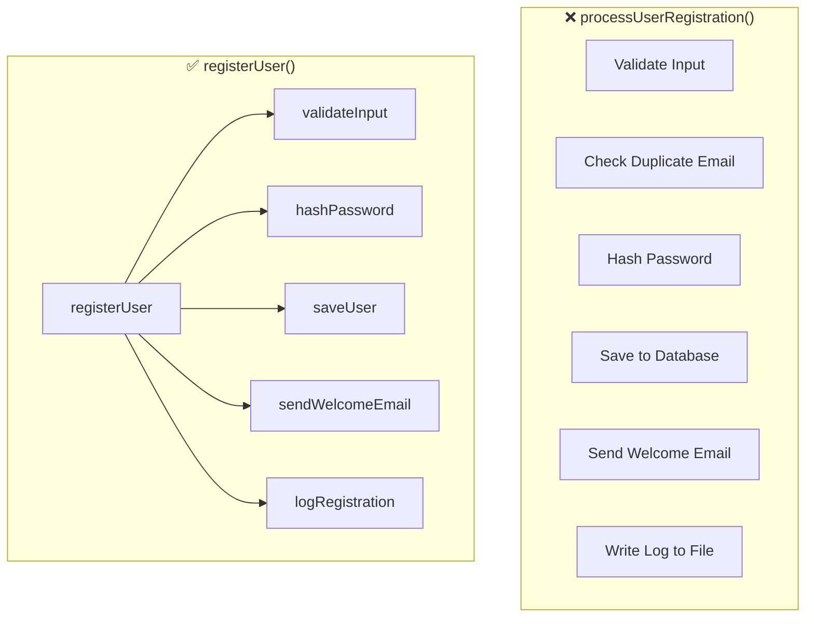

Picture this: you've just joined a team and you're asked to fix a bug in the user registration feature. You open the file, scroll down, and find a function called `processUserRegistration` — **200 lines long**. Your stomach drops. Inside, there's input validation, password hashing, database writes, email sending, log writing, and more — all tangled together in one monolithic function that's impossible to fully grasp in a single read.

You try to write a unit test for the password hashing logic, but you can't — the function is too tightly coupled to a real database and a live SMTP server. You try to reuse the validation logic in another endpoint, but you can't — it's buried deep and intertwined with every other step. This is the real cost of a function that tries to do everything.

The **Single Responsibility Principle (SRP)** at the function level isn't just a style rule — it's a guarantee that your code is testable, reusable, and understandable by others (including yourself six months from now).

---

## Visualisation: One Function vs. Many Responsibilities



On the left, one function shoulders six different responsibilities. On the right, `registerUser` acts as an orchestrator — it delegates each piece of work to a small, single-purpose function.

---

## Core Concepts

### 1. Single Responsibility Principle (SRP)

A function should do **one thing**, and do it well. The simplest test: try describing the function in one sentence without using the word "and". If you're forced to use "and", the function is already doing too much.

### 2. Ideal Function Size in Go

There's no hard rule, but **~20 lines** is a solid benchmark. If the function doesn't fit on one screen, it can probably be broken up. Go itself encourages this style — functions in the Go standard library are generally short and focused.

### 3. Guard Clauses / Early Returns

Instead of deeply nested `if-else` blocks, use **early returns** to handle failure cases up front. This reduces indentation and makes the happy path much easier to read.

### 4. Avoid Boolean Flag Parameters

A `bool` parameter used to select the "mode" of a function is a strong code smell. It usually means the function is actually **two functions** stitched together. Split them apart.

---

## ❌ Wrong Implementation

```go
// ❌ BAD: One function does everything, with boolean flags to control behavior
func processUserRegistration(user User, sendEmail bool, logToFile bool) error {
    // Validate
    if user.Name == "" {
        return errors.New("name is required")
    }
    if user.Email == "" || !strings.Contains(user.Email, "@") {
        return errors.New("invalid email")
    }
    if len(user.Password) < 8 {
        return errors.New("password too short")
    }

    // Check for duplicate email in DB
    existing, err := db.Query("SELECT id FROM users WHERE email = ?", user.Email)
    if err != nil {
        return err
    }
    if existing.Next() {
        return errors.New("email already registered")
    }

    // Hash password
    hashed, err := bcrypt.GenerateFromPassword([]byte(user.Password), bcrypt.DefaultCost)
    if err != nil {
        return err
    }
    user.Password = string(hashed)

    // Save to database
    _, err = db.Exec("INSERT INTO users (name, email, password) VALUES (?, ?, ?)",
        user.Name, user.Email, user.Password)
    if err != nil {
        return err
    }

    // ❌ BAD: Boolean flags hide two separate behaviors inside one function
    if sendEmail {
        msg := "Welcome, " + user.Name + "!"
        smtp.SendMail("smtp.example.com:587", nil, "no-reply@example.com",
            []string{user.Email}, []byte(msg))
    }

    if logToFile {
        f, _ := os.OpenFile("app.log", os.O_APPEND|os.O_WRONLY, 0644)
        f.WriteString("User registered: " + user.Email + "\n")
        f.Close()
    }

    return nil
}
```

**Why this is bad:**
- Impossible to unit test without a real database, SMTP server, and filesystem
- `sendEmail bool` and `logToFile bool` signal that this is actually multiple functions in disguise
- Changing the password hashing logic means touching code that also handles emails
- No part of this can be reused elsewhere

---

## ✅ Correct Implementation

```go
// ✅ GOOD: Each function has a single, clear responsibility

// validateUserInput only validates the user's data
func validateUserInput(user User) error {
    if user.Name == "" {
        return errors.New("name is required")
    }
    if !strings.Contains(user.Email, "@") {
        return errors.New("invalid email address")
    }
    if len(user.Password) < 8 {
        return errors.New("password must be at least 8 characters")
    }
    return nil
}

// createUser persists a new user to the database and returns the saved user
func createUser(ctx context.Context, db *sql.DB, user User) (User, error) {
    hashed, err := bcrypt.GenerateFromPassword([]byte(user.Password), bcrypt.DefaultCost)
    if err != nil {
        return User{}, fmt.Errorf("hashing password: %w", err)
    }
    user.Password = string(hashed)

    err = db.QueryRowContext(ctx,
        "INSERT INTO users (name, email, password) VALUES (?, ?, ?) RETURNING id",
        user.Name, user.Email, user.Password,
    ).Scan(&user.ID)
    if err != nil {
        return User{}, fmt.Errorf("saving user: %w", err)
    }
    return user, nil
}

// notifyUser sends a welcome email to the newly registered user
func notifyUser(mailer Mailer, user User) error {
    return mailer.Send(Mail{
        To:      user.Email,
        Subject: "Welcome, " + user.Name + "!",
        Body:    "Your account has been created successfully.",
    })
}

// RegisterUser is the orchestrator — it coordinates the steps, owns no detail
func RegisterUser(ctx context.Context, db *sql.DB, mailer Mailer, logger Logger, user User) error {
    // ✅ GOOD: Guard clause — fail fast on bad input
    if err := validateUserInput(user); err != nil {
        return fmt.Errorf("validation: %w", err)
    }

    savedUser, err := createUser(ctx, db, user)
    if err != nil {
        return fmt.Errorf("create user: %w", err)
    }

    if err := notifyUser(mailer, savedUser); err != nil {
        // A failed email doesn't fail the registration — just log it
        logger.Warn("failed to send welcome email", "user_id", savedUser.ID, "err", err)
    }

    logger.Info("user registered", "user_id", savedUser.ID, "email", savedUser.Email)
    return nil
}
```

**Why this is better:**
- `validateUserInput` is unit-testable with zero external dependencies
- `createUser` can have its database mocked in tests
- `notifyUser` can be tested with a fake (mock) mailer
- `RegisterUser` reads like a plain-language list of steps — immediately understandable
- Every function is reusable independently in other endpoints or use cases

---

## Real-World Use Case: HTTP Registration Handler

```go
// A clean HTTP handler — business logic lives elsewhere
func (h *UserHandler) Register(w http.ResponseWriter, r *http.Request) {
    var user User
    if err := json.NewDecoder(r.Body).Decode(&user); err != nil {
        http.Error(w, "invalid request body", http.StatusBadRequest)
        return
    }

    if err := RegisterUser(r.Context(), h.db, h.mailer, h.logger, user); err != nil {
        // ✅ GOOD: Wrapped errors provide full context for debugging
        h.logger.Error("registration failed", "err", err)
        http.Error(w, "registration failed", http.StatusInternalServerError)
        return
    }

    w.WriteHeader(http.StatusCreated)
    json.NewEncoder(w).Encode(map[string]string{"status": "ok"})
}
```

This handler is lean and focused. It owns only the HTTP concerns — parsing the request, calling business logic, and writing the response. Every detail lives at the right layer.

---

## Summary

> **Golden rules for clean functions in Go:**
> - ✅ One function = one responsibility
> - ✅ Aim for ~20 lines per function
> - ✅ Use early returns (guard clauses) to reduce nesting
> - ✅ Avoid `bool` parameters that control behavior — split into two functions instead
> - ✅ Orchestrator functions delegate; they don't implement details
> - ✅ A function name should be clear enough that a comment isn't needed

---

## 🎯 Challenge

Open your codebase right now. Find the longest function you have. Ask yourself:

1. Can this function be described in one sentence without the word "and"?
2. Which parts could be extracted into their own function?
3. Are there any `bool` parameters hiding two different behaviors?

Try breaking it apart and see how much easier it becomes to write tests for each piece.

---

**[🇮🇩 Versi Indonesia](/2026/06/23/clean-code-golang-part-3-functions-id.html)** | **🇬🇧 English version**

← [Part 2: Meaningful Naming](/2026/06/16/clean-code-golang-part-2-naming.html) | [Part 4: Meaningful Comments →](/2026/06/30/clean-code-golang-part-4-comments.html)
