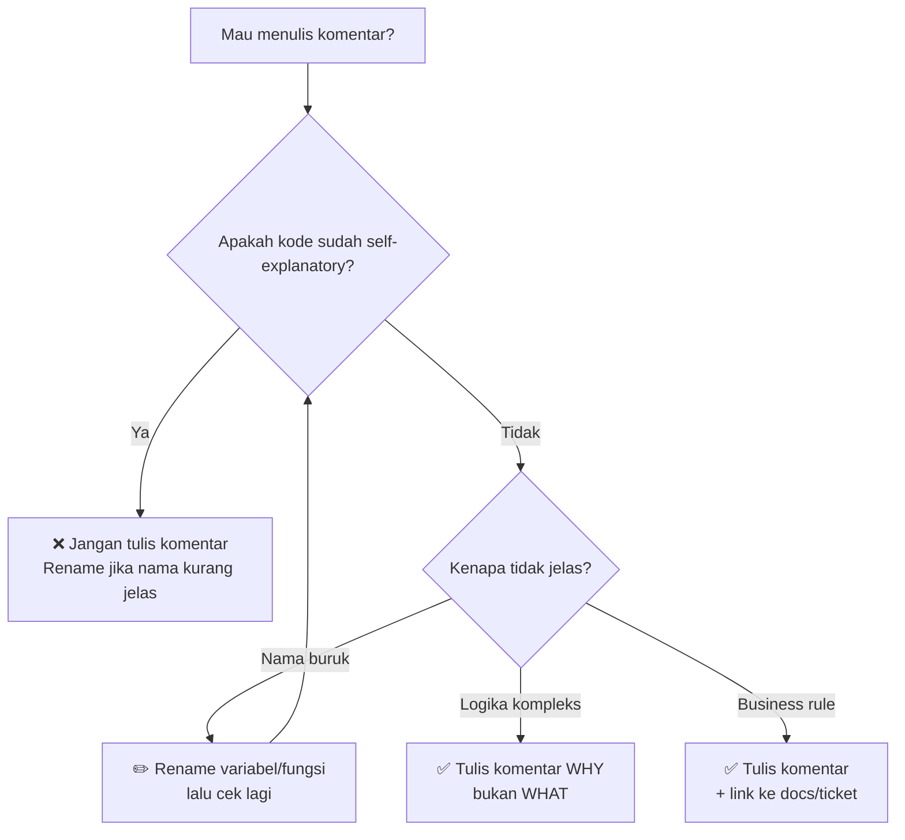

Bayangkan kamu baru bergabung di sebuah tim dan harus memperbaiki bug di modul pembayaran. Kamu membuka file-nya, dan disambut oleh baris seperti ini:

```go
// increment i by 1
i++

// get user
user, err := getUser(id)

// this is the user service
type UserService struct { ... }
```

Komentar di mana-mana. Tapi semuanya hanya mengulang apa yang sudah jelas dari kode. Kamu menggulir lebih jauh, mencari penjelasan tentang kenapa kalkulasi diskon terasa aneh — kok bisa 0% untuk pelanggan baru tapi 15% untuk pelanggan lama yang baru satu transaksi?

Tidak ada komentar sama sekali di sana.

Inilah ironi terbesar dalam dunia komentar kode: programmer menulis komentar untuk hal-hal yang tidak perlu dijelaskan, dan membiarkan hal-hal yang *benar-benar* perlu dijelaskan tanpa komentar apapun. Komentar yang baik bukan tentang kuantitas — melainkan tentang tepat sasaran.

---

## 🗺️ Diagram: Kapan Harus Menulis Komentar?



---

## 🧠 Konsep Inti

### Komentar Harus Menjelaskan MENGAPA, Bukan APA

Kode yang bagus sudah menjelaskan *apa* yang dilakukannya — nama fungsi, nama variabel, dan struktur kode adalah dokumentasi itu sendiri. Yang tidak bisa dijelaskan oleh kode adalah *mengapa* keputusan tertentu diambil.

```go
// ❌ BAD: komentar mengulang kode
// loop through users and check if active
for _, u := range users {
    if u.IsActive { // check if active
        send(u)     // send to user
    }
}

// ✅ GOOD: kode berbicara sendiri, komentar hanya di tempat yang perlu
for _, u := range users {
    if u.IsActive {
        send(u)
    }
}
```

### Konvensi GoDoc

Go punya konvensi komentar khusus untuk dokumentasi publik. Setiap exported identifier harus diawali dengan nama identifier itu sendiri.

```go
// ✅ GOOD: GoDoc convention
// UserService mengelola operasi bisnis terkait pengguna.
type UserService struct {
    repo UserRepository
}

// FindByEmail mencari pengguna berdasarkan alamat email.
// Mengembalikan ErrNotFound jika pengguna tidak ditemukan.
func (s *UserService) FindByEmail(email string) (*User, error) {
    return s.repo.FindByEmail(email)
}
```

### TODO/FIXME dengan Konteks

Jangan tinggalkan TODO tanpa pemilik atau tiket. TODO tanpa konteks adalah utang teknis yang tidak pernah dibayar.

```go
// ❌ BAD: TODO tanpa konteks
// TODO: fix this later

// ✅ GOOD: TODO dengan pemilik dan referensi
// TODO(muklis): Ganti dengan rate limiter per-tenant setelah
// migrasi database selesai. Ref: JIRA-1234
```

### Kode yang Di-comment Out Harus Dihapus

Kode yang di-comment out adalah noise. Gunakan Git untuk sejarah kode — bukan komentar.

```go
// ❌ BAD: kode lama yang tidak dihapus
// func oldCalculate(price float64) float64 {
//     return price * 0.9
// }
func calculate(price float64) float64 {
    return price * getDiscount(price)
}
```

---

## ❌ Implementasi yang Salah

Perhatikan kode berikut — penuh komentar, tapi semuanya tidak berguna. Yang justru butuh penjelasan (aturan bisnis diskon) tidak ada komentarnya sama sekali.

```go
// PaymentService is the payment service
type PaymentService struct {
    db *sql.DB // database
}

// ProcessPayment processes a payment
func (s *PaymentService) ProcessPayment(userID string, amount float64) error {
    // get user from database
    user, err := s.getUser(userID)
    if err != nil {
        // return error if error
        return err
    }

    // check if user is nil
    if user == nil {
        return errors.New("user not found")
    }

    // calculate discount
    discount := 0.0
    if user.TotalOrders > 10 {
        discount = 0.15
    } else if user.TotalOrders == 0 {
        discount = 0.0
    }

    // apply discount to amount
    finalAmount := amount - (amount * discount)

    // charge the user
    return s.charge(user, finalAmount)
}
```

**Mengapa ini salah?**
- Komentar seperti `// get user from database` dan `// return error if error` tidak menambah informasi apapun.
- Logika diskon yang *benar-benar* butuh penjelasan — kenapa 10 order? kenapa 15%? — dibiarkan tanpa komentar.
- `// PaymentService is the payment service` adalah komentar yang mengulang nama itu sendiri.

---

## ✅ Implementasi yang Benar

```go
// PaymentService menangani proses transaksi pembayaran pelanggan.
type PaymentService struct {
    db *sql.DB
}

// ProcessPayment memproses pembayaran untuk pengguna dengan ID tertentu.
// amount dalam satuan rupiah (IDR), sebelum diskon diterapkan.
func (s *PaymentService) ProcessPayment(userID string, amount float64) error {
    user, err := s.getUser(userID)
    if err != nil {
        return fmt.Errorf("mengambil data pengguna: %w", err)
    }

    finalAmount := s.applyLoyaltyDiscount(user, amount)
    return s.charge(user, finalAmount)
}

// applyLoyaltyDiscount menerapkan diskon berdasarkan program loyalitas.
// Diskon 15% diberikan setelah 10 transaksi berhasil — sesuai kebijakan
// retensi pelanggan Q3 2025. Ref: PRD-442, JIRA-1891.
// Pelanggan baru (0 transaksi) tidak mendapat diskon karena program
// ini dirancang untuk retensi, bukan akuisisi.
func (s *PaymentService) applyLoyaltyDiscount(user *User, amount float64) float64 {
    if user.TotalOrders <= 10 {
        return amount
    }
    const loyaltyDiscountRate = 0.15
    return amount - (amount * loyaltyDiscountRate)
}
```

**Mengapa ini benar?**
- GoDoc pada `PaymentService` dan `ProcessPayment` menjelaskan *apa* dan *untuk siapa*.
- Komentar di `applyLoyaltyDiscount` menjelaskan *mengapa* angka 10 dan 15% dipilih — hal yang tidak bisa dipahami hanya dari kode.
- Kode yang jelas dibiarkan berbicara sendiri tanpa komentar tambahan.

---

## 🏗️ Studi Kasus: Payment Processing Service

Dalam sistem pembayaran nyata, ada banyak aturan bisnis yang tidak intuitif. Komentar justru paling berharga di sini — bukan untuk menjelaskan kode, tapi untuk menjelaskan *konteks bisnis* di balik kode.

```go
// ChargeWithRetry mencoba memproses pembayaran hingga maxRetries kali.
//
// Retry hanya dilakukan untuk error jaringan (network timeout, 503).
// Error pembayaran seperti kartu ditolak (4xx) TIDAK di-retry karena
// akan menghasilkan hasil yang sama. Ref: RFC payment gateway v2.3.
func (s *PaymentService) ChargeWithRetry(ctx context.Context, user *User, amount float64) error {
    const maxRetries = 3

    for attempt := range maxRetries {
        err := s.gateway.Charge(ctx, user.PaymentMethodID, amount)
        if err == nil {
            return nil
        }

        // Hentikan retry jika error bersifat terminal (bukan masalah jaringan).
        // Melanjutkan retry pada kartu yang ditolak bisa memicu fraud detection.
        if isTerminalError(err) {
            return err
        }

        backoff := time.Duration(attempt+1) * 500 * time.Millisecond
        time.Sleep(backoff)
    }

    return ErrMaxRetriesExceeded
}
```

---

## 📋 Ringkasan

> **Prinsip komentar yang baik:**
> - ✅ Tulis komentar untuk menjelaskan **MENGAPA**, bukan **APA**
> - ✅ Gunakan GoDoc untuk semua exported identifier (`// NamaFungsi ...`)
> - ✅ TODO/FIXME harus menyertakan pemilik dan referensi tiket
> - ✅ Kode yang di-comment out → hapus, andalkan Git
> - ❌ Hindari komentar yang hanya mengulang apa yang kode sudah jelaskan
> - ❌ Jangan tinggalkan komentar yang sudah tidak relevan (misleading comments)

---

## 💪 Tantangan

Buka file terakhir yang kamu kerjakan. Temukan semua komentar yang hanya mengulang kode (`// get user`, `// return error`, `// loop through list`). Hapus semuanya. Lalu cek — apakah ada logika atau aturan bisnis yang *benar-benar* perlu penjelasan dan belum ada komentarnya? Tambahkan di sana.

Komentar yang benar adalah yang tidak ada pun kamu menyesal karena membutuhkannya.

---

**🇮🇩 Versi Indonesia** \| **[🇬🇧 English version](/2026/06/26/clean-code-golang-part-4-comments)**

← [Part 3: Functions](/2026/06/25/clean-code-golang-part-3-functions-id) \| [Part 5: Error Handling](/2026/06/27/clean-code-golang-part-5-error-handling-id) →
