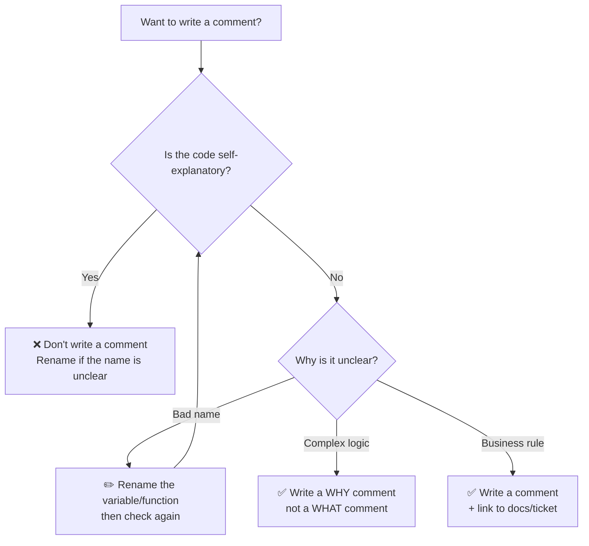

Picture this: you've just joined a new team and need to fix a bug in the payment module. You open the file and are greeted by lines like these:

```go
// increment i by 1
i++

// get user
user, err := getUser(id)

// this is the user service
type UserService struct { ... }
```

Comments everywhere. Yet every single one of them just repeats what the code already says. You scroll further, desperately looking for an explanation of why the discount calculation feels off — why is it 0% for brand-new customers but 15% for loyal ones who've only made one purchase?

Not a single comment there.

This is the greatest irony of code comments: developers write them for things that need no explanation, while the things that *genuinely* need explaining are left bare. Good comments aren't about quantity — they're about precision.

---

## 🗺️ Diagram: When Should You Write a Comment?



---

## 🧠 Core Concepts

### Comments Should Explain WHY, Not WHAT

Well-written code already explains *what* it does — function names, variable names, and code structure are documentation in themselves. What code cannot explain is *why* a particular decision was made.

```go
// ❌ BAD: comment just restates the code
// loop through users and check if active
for _, u := range users {
    if u.IsActive { // check if active
        send(u)     // send to user
    }
}

// ✅ GOOD: code speaks for itself, comments only where truly needed
for _, u := range users {
    if u.IsActive {
        send(u)
    }
}
```

### GoDoc Conventions

Go has a specific commenting convention for public documentation. Every exported identifier should have a comment that begins with the identifier's name.

```go
// ✅ GOOD: GoDoc convention
// UserService handles business operations related to users.
type UserService struct {
    repo UserRepository
}

// FindByEmail looks up a user by their email address.
// Returns ErrNotFound if the user does not exist.
func (s *UserService) FindByEmail(email string) (*User, error) {
    return s.repo.FindByEmail(email)
}
```

### TODO/FIXME With Context

Never leave a TODO without an owner or a ticket reference. A context-free TODO is technical debt that never gets paid.

```go
// ❌ BAD: TODO with no context
// TODO: fix this later

// ✅ GOOD: TODO with owner and reference
// TODO(muklis): Replace with per-tenant rate limiter after
// the database migration is complete. Ref: JIRA-1234
```

### Commented-Out Code Should Be Deleted

Commented-out code is pure noise. Use Git for code history — not comments.

```go
// ❌ BAD: old code left behind
// func oldCalculate(price float64) float64 {
//     return price * 0.9
// }
func calculate(price float64) float64 {
    return price * getDiscount(price)
}
```

---

## ❌ Wrong Implementation

Look at the following code — packed with comments, but none of them useful. The one piece that *actually* needs an explanation (the discount business rule) has none at all.

```go
// PaymentService is the payment service
type PaymentService struct {
    db *sql.DB // database
}

// ProcessPayment processes a payment
func (s *PaymentService) ProcessPayment(userID string, amount float64) error {
    // get user from database
    user, err := s.getUser(userID)
    if err != nil {
        // return error if error
        return err
    }

    // check if user is nil
    if user == nil {
        return errors.New("user not found")
    }

    // calculate discount
    discount := 0.0
    if user.TotalOrders > 10 {
        discount = 0.15
    } else if user.TotalOrders == 0 {
        discount = 0.0
    }

    // apply discount to amount
    finalAmount := amount - (amount * discount)

    // charge the user
    return s.charge(user, finalAmount)
}
```

**Why is this wrong?**
- Comments like `// get user from database` and `// return error if error` add zero information.
- The discount logic — which *genuinely* needs explanation (why 10 orders? why 15%?) — is left completely uncommented.
- `// PaymentService is the payment service` is a comment that just echoes the name itself.

---

## ✅ Correct Implementation

```go
// PaymentService handles customer payment transaction processing.
type PaymentService struct {
    db *sql.DB
}

// ProcessPayment processes a payment for the given user ID.
// amount is in Indonesian Rupiah (IDR), before any discounts are applied.
func (s *PaymentService) ProcessPayment(userID string, amount float64) error {
    user, err := s.getUser(userID)
    if err != nil {
        return fmt.Errorf("fetching user: %w", err)
    }

    finalAmount := s.applyLoyaltyDiscount(user, amount)
    return s.charge(user, finalAmount)
}

// applyLoyaltyDiscount applies a discount based on the loyalty program.
// A 15% discount is granted after 10 successful transactions — per the
// Q3 2025 customer retention policy. Ref: PRD-442, JIRA-1891.
// New customers (0 transactions) receive no discount because this program
// targets retention, not acquisition.
func (s *PaymentService) applyLoyaltyDiscount(user *User, amount float64) float64 {
    if user.TotalOrders <= 10 {
        return amount
    }
    const loyaltyDiscountRate = 0.15
    return amount - (amount * loyaltyDiscountRate)
}
```

**Why is this right?**
- GoDoc on `PaymentService` and `ProcessPayment` explains *what* each does and for *whom*.
- The comment on `applyLoyaltyDiscount` explains *why* the numbers 10 and 15% were chosen — something that cannot be inferred from the code alone.
- Clear code is left to speak for itself without redundant annotations.

---

## 🏗️ Real-World Use Case: Payment Processing Service

In a real payment system, non-obvious business rules are everywhere. Comments are most valuable precisely here — not to explain the code, but to explain the *business context* behind it.

```go
// ChargeWithRetry attempts to process a payment up to maxRetries times.
//
// Retries are performed only for transient network errors (timeouts, 503s).
// Terminal payment errors such as card declines (4xx) are NOT retried because
// they will yield the same result. Ref: payment gateway RFC v2.3.
func (s *PaymentService) ChargeWithRetry(ctx context.Context, user *User, amount float64) error {
    const maxRetries = 3

    for attempt := range maxRetries {
        err := s.gateway.Charge(ctx, user.PaymentMethodID, amount)
        if err == nil {
            return nil
        }

        // Stop retrying on terminal errors (non-network failures).
        // Retrying a declined card could trigger the gateway's fraud detection.
        if isTerminalError(err) {
            return err
        }

        backoff := time.Duration(attempt+1) * 500 * time.Millisecond
        time.Sleep(backoff)
    }

    return ErrMaxRetriesExceeded
}
```

---

## 📋 Summary

> **Principles of good comments:**
> - ✅ Write comments to explain **WHY**, not **WHAT**
> - ✅ Use GoDoc for all exported identifiers (`// FunctionName ...`)
> - ✅ TODO/FIXME must include an owner and a ticket reference
> - ✅ Commented-out code → delete it, rely on Git
> - ❌ Avoid comments that only restate what the code already says
> - ❌ Never leave stale comments that no longer reflect reality (misleading comments)

---

## 💪 Challenge

Open the last file you worked on. Find every comment that merely echoes the code (`// get user`, `// return error`, `// loop through list`). Delete them all. Then check — is there any logic or business rule that *genuinely* needs an explanation and currently has none? Add a comment there.

The right comment is the one whose absence you'd actually regret.

---

**[🇮🇩 Indonesian version](/2026/06/26/clean-code-golang-part-4-comments-id)** \| **🇬🇧 English version**

← [Part 3: Functions](/2026/06/25/clean-code-golang-part-3-functions) \| [Part 5: Error Handling](/2026/06/27/clean-code-golang-part-5-error-handling) →
