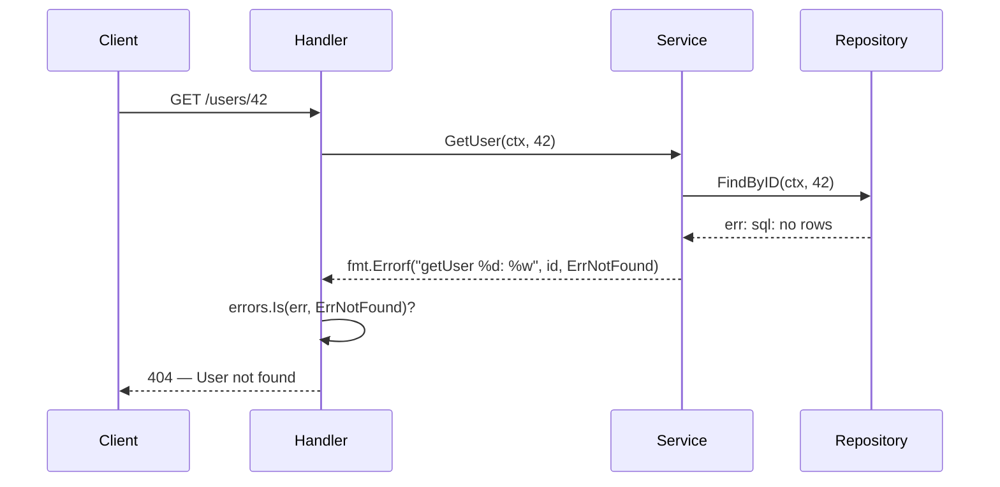

Bayangkan ini: sistem kamu berjalan normal di production, tapi ada laporan dari beberapa user yang bilang data mereka tidak tersimpan. Tim mulai panik. Kamu buka log — sepi. Tidak ada error sama sekali. Setelah dua hari penyelidikan intensif, akhirnya ditemukan satu baris kode yang menjadi biang kerok:

```go
_ = userRepo.Save(ctx, user)
```

Seseorang, entah siapa, memutuskan untuk *membuang* error dari operasi simpan data karena "nanti diurus". Error itu terus terjadi setiap hari, ribuan kali, tapi sistem diam saja. Tidak ada log, tidak ada alert, tidak ada yang tahu. Data user hilang begitu saja.

Inilah yang terjadi ketika kita tidak menghormati error. Di Go, error bukan pengecualian (*exception*) yang bisa ditangkap di level atas lalu dilupakan — error adalah nilai yang harus kamu bawa, periksa, dan tangani dengan seksama di setiap langkah.

---

## Bagaimana Error Seharusnya Mengalir

Berikut gambaran propagasi error yang sehat dalam arsitektur berlapis:



Error naik dari lapisan terbawah, dibungkus dengan konteks di setiap lapisan, dan hanya *ditangani* (diubah menjadi respons atau aksi) di lapisan yang tepat.

---

## Konsep Inti: Error sebagai Nilai

Go memilih filosofi yang berbeda dari kebanyakan bahasa: **error adalah nilai biasa**, bukan mekanisme kontrol alur yang ajaib. Ini memiliki konsekuensi penting: kamu *bisa* mengabaikan error (tapi jangan pernah lakukan itu), dan kamu bertanggung jawab penuh atas setiap error yang muncul.

### Error Wrapping dengan `fmt.Errorf` dan `%w`

Sejak Go 1.13, kita bisa membungkus error dengan konteks menggunakan verb `%w`:

```go
err := repo.FindByID(ctx, id)
if err != nil {
    return fmt.Errorf("getUser %d: %w", id, err)
}
```

`%w` berbeda dari `%v` — ia menyimpan referensi ke error asli, sehingga bisa diperiksa dengan `errors.Is()` dan `errors.As()` dari level manapun dalam call stack.

### Sentinel Errors dan Custom Error Types

**Sentinel errors** adalah error yang didefinisikan sebagai variabel global, digunakan untuk membandingkan jenis error:

```go
var ErrNotFound = errors.New("not found")
var ErrUnauthorized = errors.New("unauthorized")
```

**Custom error types** digunakan ketika kamu butuh membawa data tambahan bersama error:

```go
type ValidationError struct {
    Field   string
    Message string
}

func (e *ValidationError) Error() string {
    return fmt.Sprintf("validation failed on %s: %s", e.Field, e.Message)
}
```

### `errors.Is()` dan `errors.As()`

- `errors.Is(err, target)` — memeriksa apakah error (atau pembungkusnya) sama dengan `target`
- `errors.As(err, &target)` — mengekstrak error ke tipe tertentu jika cocok

---

## ❌ Implementasi yang Salah

```go
// ❌ BAD: Mengabaikan error — dosa terbesar
func (s *UserService) CreateUser(ctx context.Context, u User) {
    _ = s.repo.Save(ctx, u) // Error dibuang, tidak ada yang tahu kalau gagal
}

// ❌ BAD: Panic untuk semua error — terlalu dramatis
func getConfig(path string) Config {
    data, err := os.ReadFile(path)
    if err != nil {
        panic(err) // Satu file tidak ada = seluruh server mati
    }
    // ...
}

// ❌ BAD: Wrap tanpa konteks — tidak membantu saat debugging
func (r *userRepo) FindByID(ctx context.Context, id int) (*User, error) {
    row := r.db.QueryRowContext(ctx, "SELECT * FROM users WHERE id = ?", id)
    var u User
    if err := row.Scan(&u.ID, &u.Name); err != nil {
        return nil, fmt.Errorf("error: %w", err) // "error: sql: no rows" — tidak informatif
    }
    return &u, nil
}

// ❌ BAD: Log di setiap layer — log noise yang menyiksa
func (s *UserService) GetUser(ctx context.Context, id int) (*User, error) {
    user, err := s.repo.FindByID(ctx, id)
    if err != nil {
        log.Printf("repo error: %v", err) // Log di sini...
        return nil, err
    }
    return user, nil
}

func (h *UserHandler) GetUser(w http.ResponseWriter, r *http.Request) {
    // ...
    user, err := h.svc.GetUser(r.Context(), id)
    if err != nil {
        log.Printf("service error: %v", err) // ...dan log lagi di sini
        http.Error(w, "error", 500)
    }
}
```

**Mengapa salah?**
- `_ = ...` menyembunyikan kegagalan. Sistem terus berjalan seolah tidak terjadi apa-apa.
- `panic` untuk error yang bisa dipulihkan membunuh seluruh server.
- Wrap tanpa konteks seperti `"error: sql: no rows"` tidak memberi tahu kamu *operasi mana* yang gagal.
- Log di setiap layer menghasilkan baris log duplikat untuk satu error yang sama — menyulitkan investigasi.

---

## ✅ Implementasi yang Benar

```go
// sentinel errors — didefinisikan di package domain
var (
    ErrNotFound     = errors.New("not found")
    ErrUnauthorized = errors.New("unauthorized")
)

// custom error type untuk validasi
type ValidationError struct {
    Field   string
    Message string
}

func (e *ValidationError) Error() string {
    return fmt.Sprintf("validation failed on %s: %s", e.Field, e.Message)
}

// ✅ GOOD: Repository — wrap dengan konteks yang informatif
func (r *userRepo) FindByID(ctx context.Context, id int) (*User, error) {
    row := r.db.QueryRowContext(ctx, "SELECT id, name, email FROM users WHERE id = $1", id)
    var u User
    if err := row.Scan(&u.ID, &u.Name, &u.Email); err != nil {
        if errors.Is(err, sql.ErrNoRows) {
            return nil, fmt.Errorf("userRepo.FindByID %d: %w", id, ErrNotFound)
        }
        return nil, fmt.Errorf("userRepo.FindByID %d: %w", id, err)
    }
    return &u, nil
}

// ✅ GOOD: Service — tambah konteks, jangan log, biarkan naik
func (s *UserService) GetUser(ctx context.Context, id int) (*User, error) {
    user, err := s.repo.FindByID(ctx, id)
    if err != nil {
        return nil, fmt.Errorf("UserService.GetUser: %w", err)
    }
    return user, nil
}

// ✅ GOOD: Handler — tangani di sini, log sekali, respons sesuai
func (h *UserHandler) GetUser(w http.ResponseWriter, r *http.Request) {
    idStr := r.PathValue("id")
    id, err := strconv.Atoi(idStr)
    if err != nil {
        http.Error(w, "invalid user id", http.StatusBadRequest)
        return
    }

    user, err := h.svc.GetUser(r.Context(), id)
    if err != nil {
        if errors.Is(err, ErrNotFound) {
            http.Error(w, "user not found", http.StatusNotFound)
            return
        }

        var valErr *ValidationError
        if errors.As(err, &valErr) {
            http.Error(w, valErr.Message, http.StatusBadRequest)
            return
        }

        // Error tak terduga: log sekali, respons generik
        log.Printf("ERROR GetUser id=%d: %v", id, err)
        http.Error(w, "internal server error", http.StatusInternalServerError)
        return
    }

    w.Header().Set("Content-Type", "application/json")
    json.NewEncoder(w).Encode(user)
}
```

**Mengapa benar?**
- Setiap layer menambahkan konteks (`userRepo.FindByID 42: not found`) — saat error sampai di log, kamu langsung tahu perjalanan lengkapnya.
- `errors.Is()` di handler bisa mendeteksi `ErrNotFound` meskipun sudah dibungkus berkali-kali.
- Log hanya terjadi **sekali**, di tempat yang paling tahu cara merespons error tersebut.
- Tidak ada `panic`, tidak ada `_`, tidak ada yang disembunyikan.

---

## 5 Aturan Emas Error Handling di Go

> **1. Jangan pernah buang error.** `_ = fn()` hanya boleh digunakan ketika kamu 100% yakin hasilnya tidak penting — dan itu sangat jarang.
>
> **2. Wrap dengan konteks yang bermakna.** Gunakan `fmt.Errorf("operasi yang gagal: %w", err)` agar error message menceritakan sebuah kisah.
>
> **3. Tangani error satu kali, di layer yang tepat.** Pilih: wrap lalu teruskan, atau tangani lalu selesai. Jangan keduanya sekaligus.
>
> **4. Gunakan sentinel errors dan custom types.** Sentinel untuk perbandingan sederhana, custom types untuk membawa data tambahan.
>
> **5. Log hanya di paling atas.** Lapisan bawah tidak perlu log — mereka tidak punya cukup konteks untuk membuat log yang bermakna.

---

## Tantangan untuk Kamu

Buka satu file Go di codebase-mu. Cari semua kemunculan `_ =` dan `if err != nil { return err }` tanpa wrapping. Hitung berapa banyak yang kamu temukan. Sekarang perbaiki setidaknya tiga di antaranya dengan menambahkan konteks yang tepat menggunakan `fmt.Errorf` dan `%w`.

Setelah itu, tambahkan satu sentinel error untuk kasus "not found" di repository layer-mu dan propagasikan hingga ke HTTP handler. Rasakan bedanya saat debugging berikutnya.

---

**🇮🇩 Versi Indonesia** | **[🇬🇧 English version](/2026/06/30/clean-code-golang-part-5-error-handling.html)**

← [Part 4: Comments & Documentation](/2026/06/15/clean-code-golang-part-4-comments-id.html) | [Part 6: Package Structure →](/2026/07/15/clean-code-golang-part-6-structure-id.html)
