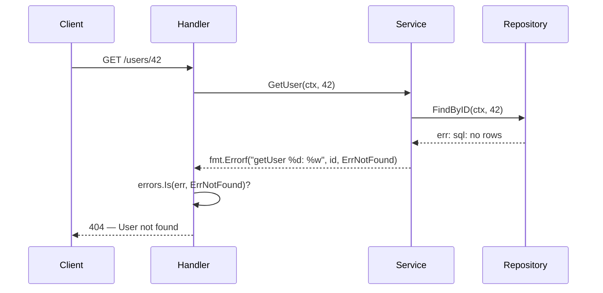

Picture this: your system is running fine in production, but users start reporting that their data isn't being saved. The team panics. You open the logs — silence. Not a single error in sight. After two days of intense investigation, someone finally finds the culprit — a single line of code:

```go
_ = userRepo.Save(ctx, user)
```

Someone, at some point, decided to *discard* the error from a save operation because they'd "deal with it later." That error kept happening every day, thousands of times, while the system carried on obliviously. No logs, no alerts, no one knew. User data vanished into thin air.

This is what happens when we don't respect errors. In Go, errors aren't exceptions you catch at the top and forget — they are **values** that you carry, inspect, and handle deliberately at every step of the way.

---

## How Errors Should Flow

Here's what healthy error propagation looks like in a layered architecture:



Errors bubble up from the lowest layer, get wrapped with context at each layer, and are only *handled* (converted into a response or action) at the layer that has enough context to do so meaningfully.

---

## Core Concepts: Errors as Values

Go deliberately chose a different philosophy from most languages: **errors are ordinary values**, not magical control-flow mechanisms. This has an important consequence: you *can* ignore an error (but never do it), and you are fully responsible for every error that surfaces.

### Error Wrapping with `fmt.Errorf` and `%w`

Since Go 1.13, we can wrap errors with contextual information using the `%w` verb:

```go
err := repo.FindByID(ctx, id)
if err != nil {
    return fmt.Errorf("getUser %d: %w", id, err)
}
```

`%w` is different from `%v` — it preserves a reference to the original error, allowing `errors.Is()` and `errors.As()` to unwrap and inspect it from anywhere in the call stack.

### Sentinel Errors and Custom Error Types

**Sentinel errors** are globally defined error variables used for type comparisons:

```go
var ErrNotFound = errors.New("not found")
var ErrUnauthorized = errors.New("unauthorized")
```

**Custom error types** are used when you need to carry additional data alongside the error:

```go
type ValidationError struct {
    Field   string
    Message string
}

func (e *ValidationError) Error() string {
    return fmt.Sprintf("validation failed on %s: %s", e.Field, e.Message)
}
```

### `errors.Is()` and `errors.As()`

- `errors.Is(err, target)` — checks whether the error (or any in its chain) matches `target`
- `errors.As(err, &target)` — extracts an error into a specific type if it matches

---

## ❌ Wrong Implementation

```go
// ❌ BAD: Ignoring errors — the cardinal sin
func (s *UserService) CreateUser(ctx context.Context, u User) {
    _ = s.repo.Save(ctx, u) // Error discarded; failure is completely invisible
}

// ❌ BAD: Panic on every error — way too dramatic
func getConfig(path string) Config {
    data, err := os.ReadFile(path)
    if err != nil {
        panic(err) // One missing file = entire server crashes
    }
    // ...
}

// ❌ BAD: Wrapping without context — useless during debugging
func (r *userRepo) FindByID(ctx context.Context, id int) (*User, error) {
    row := r.db.QueryRowContext(ctx, "SELECT * FROM users WHERE id = ?", id)
    var u User
    if err := row.Scan(&u.ID, &u.Name); err != nil {
        return nil, fmt.Errorf("error: %w", err) // "error: sql: no rows" — tells you nothing
    }
    return &u, nil
}

// ❌ BAD: Logging at every layer — a logspam nightmare
func (s *UserService) GetUser(ctx context.Context, id int) (*User, error) {
    user, err := s.repo.FindByID(ctx, id)
    if err != nil {
        log.Printf("repo error: %v", err) // Logged here...
        return nil, err
    }
    return user, nil
}

func (h *UserHandler) GetUser(w http.ResponseWriter, r *http.Request) {
    // ...
    user, err := h.svc.GetUser(r.Context(), id)
    if err != nil {
        log.Printf("service error: %v", err) // ...and logged again here
        http.Error(w, "error", 500)
    }
}
```

**Why it's wrong:**
- `_ = ...` hides failures completely. The system keeps running as if nothing happened.
- `panic` for recoverable errors kills the entire server process.
- Wrapping without context like `"error: sql: no rows"` doesn't tell you *which operation* failed.
- Logging at every layer produces duplicate log lines for a single error — making incident investigation a nightmare.

---

## ✅ Correct Implementation

```go
// Sentinel errors — defined in the domain package
var (
    ErrNotFound     = errors.New("not found")
    ErrUnauthorized = errors.New("unauthorized")
)

// Custom error type for validation failures
type ValidationError struct {
    Field   string
    Message string
}

func (e *ValidationError) Error() string {
    return fmt.Sprintf("validation failed on %s: %s", e.Field, e.Message)
}

// ✅ GOOD: Repository — wrap with informative context
func (r *userRepo) FindByID(ctx context.Context, id int) (*User, error) {
    row := r.db.QueryRowContext(ctx, "SELECT id, name, email FROM users WHERE id = $1", id)
    var u User
    if err := row.Scan(&u.ID, &u.Name, &u.Email); err != nil {
        if errors.Is(err, sql.ErrNoRows) {
            return nil, fmt.Errorf("userRepo.FindByID %d: %w", id, ErrNotFound)
        }
        return nil, fmt.Errorf("userRepo.FindByID %d: %w", id, err)
    }
    return &u, nil
}

// ✅ GOOD: Service — add context, don't log, let it propagate
func (s *UserService) GetUser(ctx context.Context, id int) (*User, error) {
    user, err := s.repo.FindByID(ctx, id)
    if err != nil {
        return nil, fmt.Errorf("UserService.GetUser: %w", err)
    }
    return user, nil
}

// ✅ GOOD: Handler — handle here, log once, respond appropriately
func (h *UserHandler) GetUser(w http.ResponseWriter, r *http.Request) {
    idStr := r.PathValue("id")
    id, err := strconv.Atoi(idStr)
    if err != nil {
        http.Error(w, "invalid user id", http.StatusBadRequest)
        return
    }

    user, err := h.svc.GetUser(r.Context(), id)
    if err != nil {
        // Match against known error types
        if errors.Is(err, ErrNotFound) {
            http.Error(w, "user not found", http.StatusNotFound)
            return
        }

        // Extract detail from custom error types
        var valErr *ValidationError
        if errors.As(err, &valErr) {
            http.Error(w, valErr.Message, http.StatusBadRequest)
            return
        }

        // Unexpected error: log once, respond generically
        log.Printf("ERROR GetUser id=%d: %v", id, err)
        http.Error(w, "internal server error", http.StatusInternalServerError)
        return
    }

    w.Header().Set("Content-Type", "application/json")
    json.NewEncoder(w).Encode(user)
}
```

**Why it's right:**
- Each layer adds context (`UserService.GetUser: userRepo.FindByID 42: not found`) — by the time the error reaches the log, it tells a complete story.
- `errors.Is()` in the handler correctly detects `ErrNotFound` even when wrapped multiple times.
- Logging happens **once**, at the layer that has the most context to make the log meaningful.
- No `panic`, no `_`, nothing hidden.

---

## 5 Golden Rules for Error Handling in Go

> **1. Never discard an error.** `_ = fn()` is only acceptable when you are 100% certain the result doesn't matter — which is almost never.
>
> **2. Wrap with meaningful context.** Use `fmt.Errorf("failed operation: %w", err)` so that error messages tell a story about what went wrong and where.
>
> **3. Handle an error once, at the right layer.** Choose one: wrap it and pass it up, or handle it and stop. Never do both at the same time.
>
> **4. Use sentinel errors and custom types.** Sentinels for simple comparisons, custom types when you need to carry structured data with the error.
>
> **5. Log only at the top.** Lower layers don't have enough context to write a meaningful log entry — let errors bubble up to where they can be properly recorded.

---

## Your Challenge

Open one Go file in your codebase. Search for every occurrence of `_ =` and every bare `if err != nil { return err }` without any wrapping. Count how many you find. Now fix at least three of them by adding proper context with `fmt.Errorf` and `%w`.

Then, add one sentinel error for the "not found" case in your repository layer and propagate it all the way up to the HTTP handler. Notice how much easier the next debugging session becomes.

---

**[🇮🇩 Versi Indonesia](/2026/06/30/clean-code-golang-part-5-error-handling-id.html)** | **🇬🇧 English version**

← [Part 4: Comments & Documentation](/2026/06/15/clean-code-golang-part-4-comments.html) | [Part 6: Package Structure →](/2026/07/15/clean-code-golang-part-6-structure.html)
