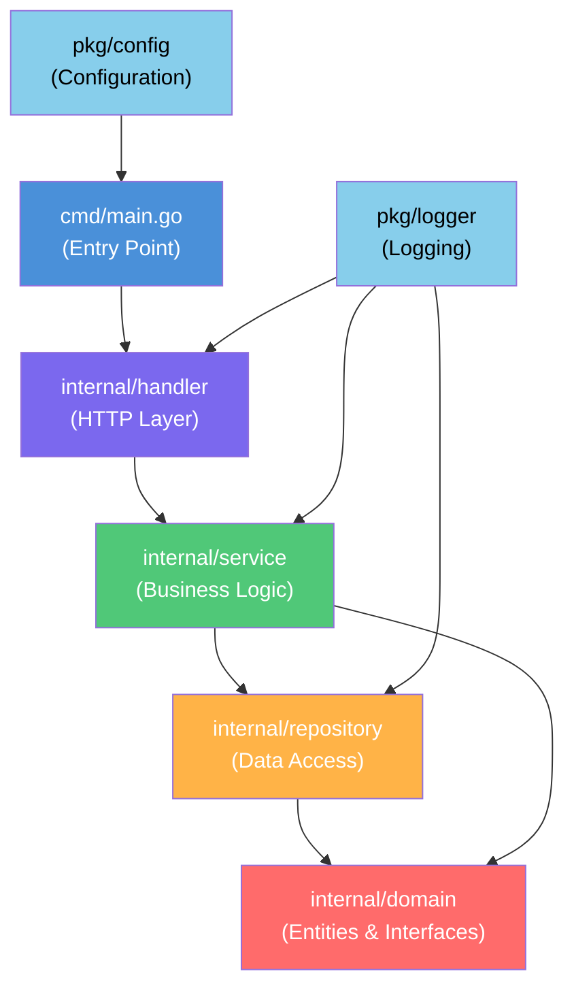

Bayangkan kamu bergabung dengan sebuah tim dan diminta untuk memperbaiki bug di proyek Go yang sudah berjalan selama dua tahun. Kamu membuka repositori, dan menemukan satu folder `main` berisi 50+ file — `handler_user.go`, `db_query.go`, `business_logic.go`, `utils.go`, semuanya berdampingan tanpa struktur yang jelas. Fungsi HTTP handler langsung memanggil query database. Logika bisnis tersebar di mana-mana. Tidak ada interface, tidak ada pemisahan tanggung jawab.

Kamu mencoba menulis unit test, tapi tidak bisa — karena semua fungsi bergantung langsung pada koneksi database nyata. Kamu mencoba menelusuri sebuah fitur, tapi harus melompat ke sana kemari antar file yang tidak terorganisir. Setelah satu jam, kamu menyerah dan bilang ke tim: *"Proyek ini butuh refactoring besar-besaran."*

Inilah yang terjadi ketika struktur proyek diabaikan sejak awal. Struktur bukan sekadar estetika — ia adalah fondasi yang menentukan seberapa mudah proyek bisa diuji, dikembangkan, dan dipelihara jangka panjang.

---

## Visualisasi Arsitektur Berlapis



Dependensi hanya mengalir **ke bawah** — layer atas bergantung pada layer bawah, bukan sebaliknya. `domain` tidak bergantung pada siapa pun. Inilah inti dari *dependency inversion*.

---

## Konsep Inti

### 1. Standard Go Project Layout

Go tidak memaksakan struktur tertentu, tapi komunitas sudah menyepakati konvensi yang terbukti efektif:

```
myproject/
├── cmd/
│   └── main.go          # Entry point aplikasi
├── internal/            # Kode privat, tidak bisa diimpor dari luar
│   ├── domain/          # Entity & interface (tidak bergantung pada siapapun)
│   ├── repository/      # Implementasi akses data
│   ├── service/         # Logika bisnis
│   └── handler/         # HTTP handler
└── pkg/                 # Library yang boleh digunakan pihak luar
    ├── config/
    └── logger/
```

### 2. Package Cohesion & Coupling

**Cohesion tinggi** berarti satu package punya satu tanggung jawab yang jelas. **Coupling rendah** berarti package tidak terlalu bergantung satu sama lain. Gunakan interface untuk memutus ketergantungan langsung antar layer.

### 3. Package `internal`

Package `internal` adalah fitur Go yang mencegah kode diimpor oleh modul lain di luar direktori induknya. Ini memaksa enkapsulasi yang baik — detail implementasi tetap tersembunyi dari dunia luar.

### 4. Hindari Circular Dependencies

Go tidak mengizinkan circular import. Ini bukan bug — ini adalah fitur yang mendorong desain yang bersih. Jika kamu mengalami circular dependency, itu sinyal bahwa ada layer yang perlu dipisah atau interface yang hilang.

---

## ❌ Implementasi yang Salah

```go
// ❌ BAD: Semua dalam satu package, handler langsung akses DB
package main

import (
    "database/sql"
    "encoding/json"
    "net/http"
)

var db *sql.DB

// Handler langsung berisi logika bisnis DAN query database
func GetUserHandler(w http.ResponseWriter, r *http.Request) {
    id := r.URL.Query().Get("id")

    // ❌ BAD: Query DB langsung di handler
    var name, email string
    err := db.QueryRow("SELECT name, email FROM users WHERE id = $1", id).
        Scan(&name, &email)
    if err != nil {
        http.Error(w, "User not found", 404)
        return
    }

    // ❌ BAD: Logika bisnis di handler
    if email == "" {
        email = "no-email@example.com"
    }

    // Tidak ada interface, tidak bisa di-mock saat testing
    json.NewEncoder(w).Encode(map[string]string{
        "name":  name,
        "email": email,
    })
}
```

**Mengapa ini salah?**
- Handler tahu terlalu banyak — ia harus handle HTTP, query DB, sekaligus logika bisnis
- Tidak bisa di-unit test tanpa database nyata
- Jika query berubah, kamu harus mencari di seluruh handler
- Tidak ada kontrak (interface) yang jelas antar komponen

---

## ✅ Implementasi yang Benar

**Layer 1 — Domain (tidak bergantung pada siapapun):**

```go
// ✅ GOOD: internal/domain/user.go
package domain

// Entity murni, tidak ada dependensi eksternal
type User struct {
    ID    string
    Name  string
    Email string
}

// Interface — kontrak yang harus dipenuhi oleh layer repository
type UserRepository interface {
    FindByID(id string) (*User, error)
}

// Interface untuk service
type UserService interface {
    GetUser(id string) (*User, error)
}
```

**Layer 2 — Repository (implementasi akses data):**

```go
// ✅ GOOD: internal/repository/user_postgres.go
package repository

import (
    "database/sql"
    "myproject/internal/domain"
)

type userPostgresRepo struct {
    db *sql.DB
}

// Constructor — dependency injection
func NewUserPostgresRepo(db *sql.DB) domain.UserRepository {
    return &userPostgresRepo{db: db}
}

func (r *userPostgresRepo) FindByID(id string) (*domain.User, error) {
    user := &domain.User{}
    err := r.db.QueryRow(
        "SELECT id, name, email FROM users WHERE id = $1", id,
    ).Scan(&user.ID, &user.Name, &user.Email)
    if err != nil {
        return nil, err
    }
    return user, nil
}
```

**Layer 3 — Service (logika bisnis):**

```go
// ✅ GOOD: internal/service/user_service.go
package service

import "myproject/internal/domain"

type userService struct {
    repo domain.UserRepository // bergantung pada interface, bukan implementasi
}

func NewUserService(repo domain.UserRepository) domain.UserService {
    return &userService{repo: repo}
}

func (s *userService) GetUser(id string) (*domain.User, error) {
    user, err := s.repo.FindByID(id)
    if err != nil {
        return nil, err
    }
    // Logika bisnis terisolasi di sini
    if user.Email == "" {
        user.Email = "no-email@example.com"
    }
    return user, nil
}
```

**Layer 4 — Handler (hanya urusan HTTP):**

```go
// ✅ GOOD: internal/handler/user_handler.go
package handler

import (
    "encoding/json"
    "net/http"
    "myproject/internal/domain"
)

type UserHandler struct {
    service domain.UserService
}

func NewUserHandler(service domain.UserService) *UserHandler {
    return &UserHandler{service: service}
}

func (h *UserHandler) GetUser(w http.ResponseWriter, r *http.Request) {
    id := r.URL.Query().Get("id")
    user, err := h.service.GetUser(id)
    if err != nil {
        http.Error(w, "User not found", http.StatusNotFound)
        return
    }
    w.Header().Set("Content-Type", "application/json")
    json.NewEncoder(w).Encode(user)
}
```

**Wiring semua di `cmd/main.go`:**

```go
// ✅ GOOD: cmd/main.go — hanya tempat wiring dependensi
package main

import (
    "net/http"
    "myproject/internal/handler"
    "myproject/internal/repository"
    "myproject/internal/service"
)

func main() {
    db := initDB() // inisialisasi database

    userRepo := repository.NewUserPostgresRepo(db)
    userSvc  := service.NewUserService(userRepo)
    userHdlr := handler.NewUserHandler(userSvc)

    http.HandleFunc("/users", userHdlr.GetUser)
    http.ListenAndServe(":8080", nil)
}
```

**Mengapa ini benar?**
- Setiap layer punya satu tanggung jawab yang jelas
- `UserService` bisa di-unit test dengan mock `UserRepository`
- Mengganti PostgreSQL ke MySQL hanya perlu membuat implementasi baru, tanpa mengubah service atau handler
- Dependency mengalir searah: handler → service → repository → domain

---

## Ringkasan

> **Prinsip Utama Struktur Proyek Go:**
> - 📁 Gunakan `internal/` untuk enkapsulasi kode privat
> - 🎯 Satu package, satu tanggung jawab (high cohesion)
> - 🔌 Bergantung pada interface, bukan implementasi konkret
> - ⬇️ Dependensi hanya mengalir satu arah (tidak ada circular)
> - 🏗️ Wiring dependensi dilakukan di `cmd/main.go` (composition root)
> - 🧪 Struktur yang baik membuat unit testing menjadi mudah

---

## 🎯 Challenge

Ambil salah satu proyek Go yang sedang kamu kerjakan (atau proyek open source yang kamu kenal), lalu:

1. **Gambar dependency graph** dari package-package yang ada
2. **Identifikasi coupling yang bermasalah** — adakah handler yang langsung akses database? Adakah circular import?
3. **Rancang ulang strukturnya** menggunakan pola berlapis yang telah kita bahas
4. **Coba tulis satu unit test** untuk service layer menggunakan mock repository

Kadang menggambar dependency graph di atas kertas lebih efektif daripada langsung refactoring. Mulai dari sana!

---

**🇮🇩 Versi Indonesia** | **[🇬🇧 English version](/2026/07/03/clean-code-golang-part-6-structure)**

← [Part 5: Error Handling](/2026/06/26/clean-code-golang-part-5-error-handling-id) | [Part 7: Testing](/2026/07/10/clean-code-golang-part-7-testing-id) →
