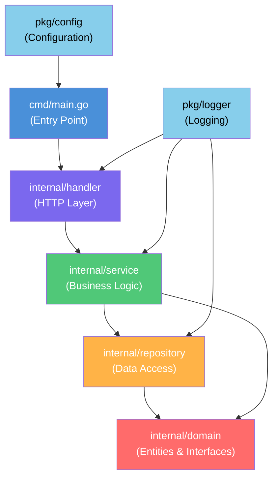

Imagine joining a new team and being asked to fix a bug in a Go project that's been running for two years. You open the repository and find a single `main` package containing 50+ files — `handler_user.go`, `db_query.go`, `business_logic.go`, `utils.go` — all sitting side by side with no clear organization. HTTP handlers call the database directly. Business logic is scattered everywhere. No interfaces, no separation of concerns.

You try to write a unit test, but you can't — every function depends directly on a real database connection. You try to trace a feature, but you're constantly jumping between unrelated files. After an hour, you give up and tell the team: *"This project needs a major refactor."*

This is what happens when project structure is neglected from the start. Structure isn't just aesthetics — it's the foundation that determines how easily a project can be tested, extended, and maintained over time.

---

## Visualizing Layered Architecture



Dependencies flow **downward only** — upper layers depend on lower layers, never the reverse. `domain` depends on nothing. This is the essence of *dependency inversion*.

---

## Core Concepts

### 1. Standard Go Project Layout

Go doesn't enforce a specific structure, but the community has settled on conventions that are proven to work well:

```
myproject/
├── cmd/
│   └── main.go          # Application entry point
├── internal/            # Private code, cannot be imported externally
│   ├── domain/          # Entities & interfaces (depends on nothing)
│   ├── repository/      # Data access implementations
│   ├── service/         # Business logic
│   └── handler/         # HTTP handlers
└── pkg/                 # Libraries safe for external use
    ├── config/
    └── logger/
```

### 2. Package Cohesion & Coupling

**High cohesion** means a single package has one clear responsibility. **Low coupling** means packages don't depend heavily on each other. Use interfaces to break direct dependencies between layers.

### 3. The `internal` Package

The `internal` package is a Go feature that prevents code from being imported by modules outside its parent directory. It enforces good encapsulation — implementation details stay hidden from the outside world.

### 4. Avoid Circular Dependencies

Go does not allow circular imports. This isn't a bug — it's a feature that pushes you toward clean design. If you hit a circular dependency, it's a signal that a layer needs to be split or an interface is missing.

---

## ❌ Wrong Implementation

```go
// ❌ BAD: Everything in one package, handler directly accesses DB
package main

import (
    "database/sql"
    "encoding/json"
    "net/http"
)

var db *sql.DB

// Handler contains business logic AND database queries
func GetUserHandler(w http.ResponseWriter, r *http.Request) {
    id := r.URL.Query().Get("id")

    // ❌ BAD: Raw DB query inside the handler
    var name, email string
    err := db.QueryRow("SELECT name, email FROM users WHERE id = $1", id).
        Scan(&name, &email)
    if err != nil {
        http.Error(w, "User not found", 404)
        return
    }

    // ❌ BAD: Business logic leaking into the handler
    if email == "" {
        email = "no-email@example.com"
    }

    // No interface — impossible to mock during testing
    json.NewEncoder(w).Encode(map[string]string{
        "name":  name,
        "email": email,
    })
}
```

**Why is this wrong?**
- The handler knows too much — it handles HTTP, runs DB queries, and applies business logic all at once
- Cannot be unit tested without a real database
- Changing the query means searching across all handlers
- No clear contracts (interfaces) between components

---

## ✅ Correct Implementation

**Layer 1 — Domain (depends on nothing):**

```go
// ✅ GOOD: internal/domain/user.go
package domain

// Pure entity — no external dependencies
type User struct {
    ID    string
    Name  string
    Email string
}

// Interface — the contract the repository layer must fulfill
type UserRepository interface {
    FindByID(id string) (*User, error)
}

// Interface for the service layer
type UserService interface {
    GetUser(id string) (*User, error)
}
```

**Layer 2 — Repository (data access implementation):**

```go
// ✅ GOOD: internal/repository/user_postgres.go
package repository

import (
    "database/sql"
    "myproject/internal/domain"
)

type userPostgresRepo struct {
    db *sql.DB
}

// Constructor — dependency injection
func NewUserPostgresRepo(db *sql.DB) domain.UserRepository {
    return &userPostgresRepo{db: db}
}

func (r *userPostgresRepo) FindByID(id string) (*domain.User, error) {
    user := &domain.User{}
    err := r.db.QueryRow(
        "SELECT id, name, email FROM users WHERE id = $1", id,
    ).Scan(&user.ID, &user.Name, &user.Email)
    if err != nil {
        return nil, err
    }
    return user, nil
}
```

**Layer 3 — Service (business logic):**

```go
// ✅ GOOD: internal/service/user_service.go
package service

import "myproject/internal/domain"

type userService struct {
    repo domain.UserRepository // depends on interface, not concrete type
}

func NewUserService(repo domain.UserRepository) domain.UserService {
    return &userService{repo: repo}
}

func (s *userService) GetUser(id string) (*domain.User, error) {
    user, err := s.repo.FindByID(id)
    if err != nil {
        return nil, err
    }
    // Business logic is isolated here
    if user.Email == "" {
        user.Email = "no-email@example.com"
    }
    return user, nil
}
```

**Layer 4 — Handler (HTTP concerns only):**

```go
// ✅ GOOD: internal/handler/user_handler.go
package handler

import (
    "encoding/json"
    "net/http"
    "myproject/internal/domain"
)

type UserHandler struct {
    service domain.UserService
}

func NewUserHandler(service domain.UserService) *UserHandler {
    return &UserHandler{service: service}
}

func (h *UserHandler) GetUser(w http.ResponseWriter, r *http.Request) {
    id := r.URL.Query().Get("id")
    user, err := h.service.GetUser(id)
    if err != nil {
        http.Error(w, "User not found", http.StatusNotFound)
        return
    }
    w.Header().Set("Content-Type", "application/json")
    json.NewEncoder(w).Encode(user)
}
```

**Wire everything together in `cmd/main.go`:**

```go
// ✅ GOOD: cmd/main.go — the composition root, wiring only
package main

import (
    "net/http"
    "myproject/internal/handler"
    "myproject/internal/repository"
    "myproject/internal/service"
)

func main() {
    db := initDB() // initialize database connection

    userRepo := repository.NewUserPostgresRepo(db)
    userSvc  := service.NewUserService(userRepo)
    userHdlr := handler.NewUserHandler(userSvc)

    http.HandleFunc("/users", userHdlr.GetUser)
    http.ListenAndServe(":8080", nil)
}
```

**Why is this right?**
- Each layer has a single, well-defined responsibility
- `UserService` can be unit tested using a mock `UserRepository`
- Switching from PostgreSQL to MySQL only requires a new implementation — service and handler stay untouched
- Dependencies flow in one direction: handler → service → repository → domain

---

## Summary

> **Key Principles for Go Project Structure:**
> - 📁 Use `internal/` to encapsulate private code
> - 🎯 One package, one responsibility (high cohesion)
> - 🔌 Depend on interfaces, not concrete implementations
> - ⬇️ Dependencies flow in one direction only (no circular deps)
> - 🏗️ Wire dependencies in `cmd/main.go` (the composition root)
> - 🧪 Good structure makes unit testing straightforward

---

## 🎯 Challenge

Pick a Go project you're currently working on (or a familiar open source project), then:

1. **Draw the dependency graph** of all the packages involved
2. **Identify problematic coupling** — are there handlers calling the database directly? Any circular imports?
3. **Redesign the structure** using the layered pattern we covered
4. **Write one unit test** for the service layer using a mock repository

Sometimes drawing the dependency graph on paper is more effective than jumping straight into refactoring. Start there!

---

**[🇮🇩 Indonesian version](/2026/07/03/clean-code-golang-part-6-structure-id)** | **🇬🇧 English version**

← [Part 5: Error Handling](/2026/06/26/clean-code-golang-part-5-error-handling) | [Part 7: Testing](/2026/07/10/clean-code-golang-part-7-testing) →
