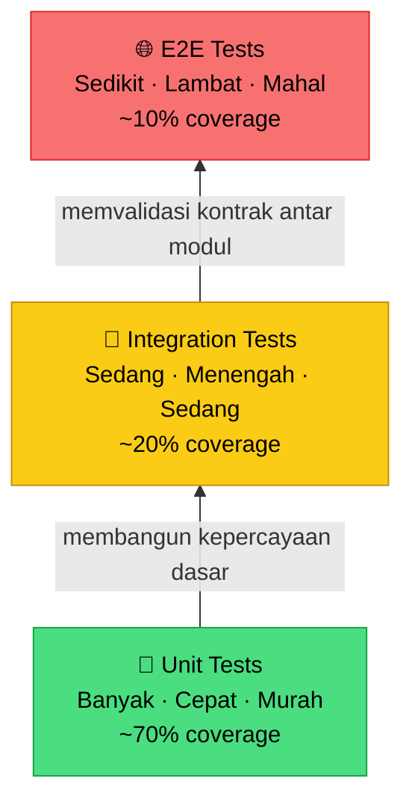

Bayangkan kamu bergabung ke sebuah tim dan diminta melakukan *refactor* sederhana — mengubah cara validasi email di `UserService`. "Gampang," pikirmu. Dua jam kemudian, kamu *push* ke production. Lima menit kemudian, Slack meledak. Fitur registrasi rusak. Fitur login rusak. Notifikasi email tidak terkirim. Bahkan halaman profil ikut error.

Yang lebih menyesakkan? Tidak ada yang tahu persis *kapan* fitur-fitur itu mulai rusak, karena tidak ada satu pun test yang menjaganya. Tim menghabiskan tiga jam berikutnya melakukan debugging manual, menelusuri log satu per satu. Semua ini hanya karena "refactor kecil" tanpa pelindung apapun.

Inilah yang terjadi ketika test coverage-mu 0%. Test bukan sekadar kewajiban teknis — **test adalah dokumentasi yang tidak pernah berbohong**. Kode bisa outdated, komentar bisa salah, tapi test yang hijau tidak bisa bohong soal perilaku sistem.

## Piramida Testing

Sebelum masuk ke kode, penting untuk memahami di mana kita harus menghabiskan energi saat menulis test.



Unit test adalah pondasi — banyak, cepat, dan murah untuk dijalankan. Integration test memvalidasi bahwa modul-modul bekerja sama dengan benar. E2E test mensimulasikan alur pengguna nyata, tapi jumlahnya harus sedikit karena lambat dan mahal. Jangan balik piramida ini.

## Konsep Inti

### Konvensi Penamaan: `TestNamaFungsi_Skenario_HasilYangDiharapkan`

Nama test adalah dokumentasi pertama yang dibaca developer. Bandingkan dua nama ini:

- `Test1()` → tidak menjelaskan apa-apa
- `TestCreateUser_DuplicateEmail_ReturnsError()` → langsung paham: fungsi apa, kondisi apa, hasil apa

### Table-Driven Tests — Idiom Go yang Sesungguhnya

Go mendorong pola *table-driven test*: definisikan semua skenario dalam sebuah slice struct, lalu iterasi dengan `t.Run()`. Ini membuat test lebih ringkas, mudah ditambah skenario baru, dan mudah dibaca.

### Mocking dengan Interface

Jangan bergantung pada database nyata di unit test. Gunakan interface agar implementasinya bisa diganti dengan mock — test jadi cepat, deterministik, dan bisa dijalankan di mana saja tanpa setup infrastruktur.

## ❌ Implementasi yang Salah

```go
// ❌ BAD: Nama tidak informatif, tidak table-driven,
// bergantung pada DB nyata, dan menguji implementasi bukan perilaku.

var db *sql.DB // koneksi DB nyata — test tidak bisa jalan tanpa PostgreSQL!

func TestUser(t *testing.T) {
    // Apa yang diuji? Input apa? Hasil yang diharapkan apa?
    u := User{Email: "test@example.com", Name: "Test"}
    err := CreateUser(db, u)
    if err != nil {
        t.Error("failed")
    }
}

func Test1(t *testing.T) {
    // Nama "Test1" tidak menjelaskan apapun
    u := User{Email: "test@example.com", Name: "Test"}
    err := CreateUser(db, u)
    // Tidak mengecek apakah error yang dikembalikan adalah tipe yang benar
    if err == nil {
        t.Error("should fail")
    }
}

func TestCreateUserImpl(t *testing.T) {
    // ❌ Menguji detail implementasi internal, bukan perilaku publik
    repo := &UserRepository{}
    repo.mu.Lock() // mengakses mutex internal — sangat rapuh!
    defer repo.mu.Unlock()
}
```

**Kenapa ini salah?**
- `TestUser` dan `Test1` tidak mendeskripsikan skenario atau hasil yang diharapkan
- Bergantung pada koneksi database nyata — test tidak bisa dijalankan di CI tanpa setup PostgreSQL
- Menguji detail implementasi internal (mutex) yang bisa berubah kapan saja
- Tidak ada pemisahan skenario; semua dicampur dalam satu fungsi

## ✅ Implementasi yang Benar

Pertama, definisikan interface untuk repository agar bisa di-mock:

```go
// ✅ GOOD: Interface yang bersih untuk dependency injection dan mocking

package user

import "errors"

// UserRepository mendefinisikan kontrak akses data user.
type UserRepository interface {
    FindByEmail(email string) (*User, error)
    Save(user *User) (*User, error)
}

// User adalah domain model kita.
type User struct {
    ID    int
    Name  string
    Email string
}

// UserService berisi business logic pembuatan user.
type UserService struct {
    repo UserRepository
}

func NewUserService(repo UserRepository) *UserService {
    return &UserService{repo: repo}
}

var (
    ErrDuplicateEmail = errors.New("email already registered")
    ErrInvalidInput   = errors.New("invalid input")
)

func (s *UserService) CreateUser(name, email string) (*User, error) {
    if name == "" || email == "" {
        return nil, ErrInvalidInput
    }

    existing, _ := s.repo.FindByEmail(email)
    if existing != nil {
        return nil, ErrDuplicateEmail
    }

    return s.repo.Save(&User{Name: name, Email: email})
}
```

Sekarang, mock dan table-driven test yang sesungguhnya:

```go
// ✅ GOOD: Table-driven test dengan nama deskriptif, mock bersih,
// dan setiap skenario terdokumentasi dengan sendirinya.

package user_test

import (
    "errors"
    "testing"
)

// mockUserRepo adalah implementasi mock dari UserRepository.
type mockUserRepo struct {
    findByEmailFn func(email string) (*User, error)
    saveFn        func(user *User) (*User, error)
}

func (m *mockUserRepo) FindByEmail(email string) (*User, error) {
    return m.findByEmailFn(email)
}

func (m *mockUserRepo) Save(user *User) (*User, error) {
    return m.saveFn(user)
}

func TestCreateUser_Scenarios(t *testing.T) {
    // Setiap test case adalah dokumentasi satu skenario bisnis.
    testCases := []struct {
        name          string
        inputName     string
        inputEmail    string
        mockRepo      *mockUserRepo
        expectedUser  *User
        expectedError error
    }{
        {
            name:       "ValidInput_ReturnsCreatedUser",
            inputName:  "Budi Santoso",
            inputEmail: "budi@example.com",
            mockRepo: &mockUserRepo{
                findByEmailFn: func(email string) (*User, error) {
                    return nil, nil // email belum terdaftar
                },
                saveFn: func(u *User) (*User, error) {
                    u.ID = 1
                    return u, nil
                },
            },
            expectedUser:  &User{ID: 1, Name: "Budi Santoso", Email: "budi@example.com"},
            expectedError: nil,
        },
        {
            name:       "DuplicateEmail_ReturnsErrDuplicateEmail",
            inputName:  "Budi Lain",
            inputEmail: "budi@example.com",
            mockRepo: &mockUserRepo{
                findByEmailFn: func(email string) (*User, error) {
                    return &User{ID: 99, Email: email}, nil // email sudah ada!
                },
                saveFn: func(u *User) (*User, error) {
                    return nil, nil // tidak akan dipanggil
                },
            },
            expectedUser:  nil,
            expectedError: ErrDuplicateEmail,
        },
        {
            name:       "EmptyName_ReturnsErrInvalidInput",
            inputName:  "",
            inputEmail: "budi@example.com",
            mockRepo:   &mockUserRepo{},
            expectedUser:  nil,
            expectedError: ErrInvalidInput,
        },
        {
            name:       "EmptyEmail_ReturnsErrInvalidInput",
            inputName:  "Budi Santoso",
            inputEmail: "",
            mockRepo:   &mockUserRepo{},
            expectedUser:  nil,
            expectedError: ErrInvalidInput,
        },
        {
            name:       "RepositoryError_PropagatesError",
            inputName:  "Budi Santoso",
            inputEmail: "budi@example.com",
            mockRepo: &mockUserRepo{
                findByEmailFn: func(email string) (*User, error) {
                    return nil, nil
                },
                saveFn: func(u *User) (*User, error) {
                    return nil, errors.New("database connection lost")
                },
            },
            expectedUser:  nil,
            expectedError: errors.New("database connection lost"),
        },
    }

    for _, tc := range testCases {
        t.Run(tc.name, func(t *testing.T) {
            // Arrange
            svc := NewUserService(tc.mockRepo)

            // Act
            gotUser, gotErr := svc.CreateUser(tc.inputName, tc.inputEmail)

            // Assert
            if tc.expectedError != nil {
                if gotErr == nil {
                    t.Fatalf("expected error %q, got nil", tc.expectedError)
                }
                if gotErr.Error() != tc.expectedError.Error() {
                    t.Errorf("expected error %q, got %q", tc.expectedError, gotErr)
                }
                return
            }

            if gotErr != nil {
                t.Fatalf("expected no error, got %q", gotErr)
            }
            if gotUser.ID != tc.expectedUser.ID || gotUser.Email != tc.expectedUser.Email {
                t.Errorf("expected user %+v, got %+v", tc.expectedUser, gotUser)
            }
        })
    }
}
```

**Kenapa ini benar?**
- Nama setiap subtest mendeskripsikan skenario dan hasil secara eksplisit
- Mock menggunakan interface — tidak butuh database nyata, jalan di mana saja
- Pola Arrange-Act-Assert membuat setiap test mudah dibaca
- Menambah skenario baru cukup tambah satu entry di slice, tidak perlu fungsi baru

## Studi Kasus Nyata: Output `go test` sebagai Dokumentasi

Ketika kamu menjalankan test di atas dengan `-v`, outputnya menjadi dokumentasi yang hidup:

```
--- PASS: TestCreateUser_Scenarios (0.00s)
    --- PASS: TestCreateUser_Scenarios/ValidInput_ReturnsCreatedUser (0.00s)
    --- PASS: TestCreateUser_Scenarios/DuplicateEmail_ReturnsErrDuplicateEmail (0.00s)
    --- PASS: TestCreateUser_Scenarios/EmptyName_ReturnsErrInvalidInput (0.00s)
    --- PASS: TestCreateUser_Scenarios/EmptyEmail_ReturnsErrInvalidInput (0.00s)
    --- PASS: TestCreateUser_Scenarios/RepositoryError_PropagatesError (0.00s)
```

Siapapun yang membaca output ini — bahkan non-developer — langsung paham apa yang dilakukan `CreateUser` dalam setiap kondisi. Ini adalah dokumentasi yang selalu *up-to-date* karena ia dieksekusi setiap kali CI berjalan.

## Ringkasan: 5 Aturan Test sebagai Dokumentasi

> **📋 Lima Aturan Emas Testing**
>
> 1. **Nama test = spesifikasi**: `TestFungsi_Kondisi_HasilYangDiharapkan`
> 2. **Table-driven test** untuk semua skenario di satu tempat
> 3. **Mock via interface**, jangan pernah bergantung pada infrastruktur nyata di unit test
> 4. **Uji perilaku, bukan implementasi** — jika refactor internal tidak merusak test, test-mu sudah benar
> 5. **Pola Arrange-Act-Assert** agar setiap test mudah dibaca dan di-debug

## 🎯 Challenge

Ambil satu fungsi service paling kritis di proyekmu sekarang. Tulis table-driven test dengan minimal 5 skenario: input valid, input kosong, duplikasi, error dari dependency, dan edge case unik bisnismu. Jalankan dengan `go test -v -run TestNamaFungsimu` dan baca outputnya seperti membaca dokumentasi.

---

**🇮🇩 Versi Indonesia** | **[🇬🇧 English version](/2026/07/07/clean-code-golang-part-7-testing.html)**

← [Part 6: Struktur Kode](/2026/06/30/clean-code-golang-part-6-structure-id.html) | [Part 8: Refactoring](/2026/07/14/clean-code-golang-part-8-refactoring-id.html) →
