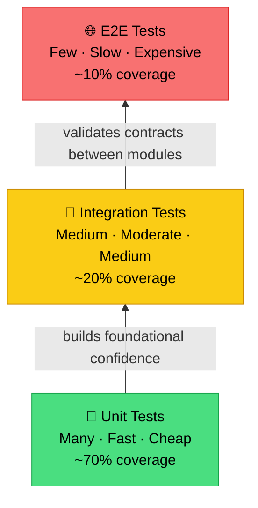

Imagine joining a team and being asked to do a "simple refactor" — changing how email validation works in `UserService`. "Easy enough," you think. Two hours later, you push to production. Five minutes after that, Slack explodes. The registration feature is broken. Login is broken. Email notifications aren't sending. Even the profile page is throwing errors.

What makes it worse? Nobody knows exactly *when* those features broke, because not a single test was guarding them. The team spends the next three hours doing manual debugging, crawling through logs one by one. All of this from a "small refactor" with zero safety net.

This is what 0% test coverage looks like in practice. Tests are not just a technical obligation — **tests are documentation that never lies**. Code can become outdated, comments can be wrong, but a green test suite cannot lie about how the system behaves.

## The Testing Pyramid

Before diving into code, it's worth understanding where to invest your testing energy.



Unit tests are the foundation — many, fast, and cheap to run. Integration tests validate that modules collaborate correctly. E2E tests simulate real user flows but should be kept few because they are slow and expensive. Never invert this pyramid.

## Core Concepts

### Naming Convention: `TestFunctionName_Scenario_ExpectedResult`

A test's name is the first documentation a developer reads. Compare these two:

- `Test1()` → tells you nothing
- `TestCreateUser_DuplicateEmail_ReturnsError()` → immediately clear: which function, what condition, what outcome

### Table-Driven Tests — The Idiomatic Go Pattern

Go strongly encourages the *table-driven test* pattern: define all scenarios in a slice of structs, then iterate using `t.Run()`. This makes tests concise, easy to extend with new scenarios, and easy to read at a glance.

### Mocking with Interfaces

Never depend on a real database in unit tests. Use interfaces so the implementation can be swapped with a mock — your tests become fast, deterministic, and runnable anywhere without infrastructure setup.

## ❌ Wrong Implementation

```go
// ❌ BAD: Uninformative names, no table-driven approach,
// depends on a real DB, and tests implementation details instead of behavior.

var db *sql.DB // real DB connection — tests can't run without PostgreSQL!

func TestUser(t *testing.T) {
    // What is being tested? What input? What is the expected result?
    u := User{Email: "test@example.com", Name: "Test"}
    err := CreateUser(db, u)
    if err != nil {
        t.Error("failed")
    }
}

func Test1(t *testing.T) {
    // "Test1" explains absolutely nothing
    u := User{Email: "test@example.com", Name: "Test"}
    err := CreateUser(db, u)
    // Doesn't check if the returned error is the correct type
    if err == nil {
        t.Error("should fail")
    }
}

func TestCreateUserImpl(t *testing.T) {
    // ❌ Testing internal implementation details, not public behavior
    repo := &UserRepository{}
    repo.mu.Lock() // accessing an internal mutex — extremely brittle!
    defer repo.mu.Unlock()
}
```

**Why this is wrong:**
- `TestUser` and `Test1` don't describe the scenario or expected outcome
- Depends on a real database connection — tests can't run in CI without a PostgreSQL setup
- Tests internal implementation details (the mutex) that can change at any time
- No separation of scenarios; everything is crammed into one function

## ✅ Correct Implementation

First, define an interface for the repository so it can be mocked:

```go
// ✅ GOOD: Clean interface for dependency injection and mocking

package user

import "errors"

// UserRepository defines the contract for user data access.
type UserRepository interface {
    FindByEmail(email string) (*User, error)
    Save(user *User) (*User, error)
}

// User is our domain model.
type User struct {
    ID    int
    Name  string
    Email string
}

// UserService holds the business logic for user creation.
type UserService struct {
    repo UserRepository
}

func NewUserService(repo UserRepository) *UserService {
    return &UserService{repo: repo}
}

var (
    ErrDuplicateEmail = errors.New("email already registered")
    ErrInvalidInput   = errors.New("invalid input")
)

func (s *UserService) CreateUser(name, email string) (*User, error) {
    if name == "" || email == "" {
        return nil, ErrInvalidInput
    }

    existing, _ := s.repo.FindByEmail(email)
    if existing != nil {
        return nil, ErrDuplicateEmail
    }

    return s.repo.Save(&User{Name: name, Email: email})
}
```

Now the mock and the proper table-driven tests:

```go
// ✅ GOOD: Table-driven tests with descriptive names, clean mocks,
// and every scenario self-documenting.

package user_test

import (
    "errors"
    "testing"
)

// mockUserRepo is a mock implementation of UserRepository.
type mockUserRepo struct {
    findByEmailFn func(email string) (*User, error)
    saveFn        func(user *User) (*User, error)
}

func (m *mockUserRepo) FindByEmail(email string) (*User, error) {
    return m.findByEmailFn(email)
}

func (m *mockUserRepo) Save(user *User) (*User, error) {
    return m.saveFn(user)
}

func TestCreateUser_Scenarios(t *testing.T) {
    // Each test case documents one business scenario.
    testCases := []struct {
        name          string
        inputName     string
        inputEmail    string
        mockRepo      *mockUserRepo
        expectedUser  *User
        expectedError error
    }{
        {
            name:       "ValidInput_ReturnsCreatedUser",
            inputName:  "Alice Smith",
            inputEmail: "alice@example.com",
            mockRepo: &mockUserRepo{
                findByEmailFn: func(email string) (*User, error) {
                    return nil, nil // email not yet registered
                },
                saveFn: func(u *User) (*User, error) {
                    u.ID = 1
                    return u, nil
                },
            },
            expectedUser:  &User{ID: 1, Name: "Alice Smith", Email: "alice@example.com"},
            expectedError: nil,
        },
        {
            name:       "DuplicateEmail_ReturnsErrDuplicateEmail",
            inputName:  "Another Alice",
            inputEmail: "alice@example.com",
            mockRepo: &mockUserRepo{
                findByEmailFn: func(email string) (*User, error) {
                    return &User{ID: 99, Email: email}, nil // email already exists!
                },
                saveFn: func(u *User) (*User, error) {
                    return nil, nil // will not be called
                },
            },
            expectedUser:  nil,
            expectedError: ErrDuplicateEmail,
        },
        {
            name:       "EmptyName_ReturnsErrInvalidInput",
            inputName:  "",
            inputEmail: "alice@example.com",
            mockRepo:   &mockUserRepo{}, // mock won't be called
            expectedUser:  nil,
            expectedError: ErrInvalidInput,
        },
        {
            name:       "EmptyEmail_ReturnsErrInvalidInput",
            inputName:  "Alice Smith",
            inputEmail: "",
            mockRepo:   &mockUserRepo{}, // mock won't be called
            expectedUser:  nil,
            expectedError: ErrInvalidInput,
        },
        {
            name:       "RepositoryError_PropagatesError",
            inputName:  "Alice Smith",
            inputEmail: "alice@example.com",
            mockRepo: &mockUserRepo{
                findByEmailFn: func(email string) (*User, error) {
                    return nil, nil
                },
                saveFn: func(u *User) (*User, error) {
                    return nil, errors.New("database connection lost")
                },
            },
            expectedUser:  nil,
            expectedError: errors.New("database connection lost"),
        },
    }

    for _, tc := range testCases {
        t.Run(tc.name, func(t *testing.T) {
            // Arrange
            svc := NewUserService(tc.mockRepo)

            // Act
            gotUser, gotErr := svc.CreateUser(tc.inputName, tc.inputEmail)

            // Assert
            if tc.expectedError != nil {
                if gotErr == nil {
                    t.Fatalf("expected error %q, got nil", tc.expectedError)
                }
                if gotErr.Error() != tc.expectedError.Error() {
                    t.Errorf("expected error %q, got %q", tc.expectedError, gotErr)
                }
                return
            }

            if gotErr != nil {
                t.Fatalf("expected no error, got %q", gotErr)
            }
            if gotUser.ID != tc.expectedUser.ID || gotUser.Email != tc.expectedUser.Email {
                t.Errorf("expected user %+v, got %+v", tc.expectedUser, gotUser)
            }
        })
    }
}
```

**Why this is right:**
- Every subtest name explicitly describes the scenario and expected outcome
- Mocks use interfaces — no real database needed, runs anywhere
- The Arrange-Act-Assert pattern makes each test easy to read and debug
- Adding a new scenario is just adding one entry to the slice — no new function needed

## Real-World Use Case: `go test` Output as Living Documentation

When you run the tests above with `-v`, the output becomes living documentation:

```
--- PASS: TestCreateUser_Scenarios (0.00s)
    --- PASS: TestCreateUser_Scenarios/ValidInput_ReturnsCreatedUser (0.00s)
    --- PASS: TestCreateUser_Scenarios/DuplicateEmail_ReturnsErrDuplicateEmail (0.00s)
    --- PASS: TestCreateUser_Scenarios/EmptyName_ReturnsErrInvalidInput (0.00s)
    --- PASS: TestCreateUser_Scenarios/EmptyEmail_ReturnsErrInvalidInput (0.00s)
    --- PASS: TestCreateUser_Scenarios/RepositoryError_PropagatesError (0.00s)
```

Anyone reading this output — even a non-developer — immediately understands what `CreateUser` does in every condition. This is documentation that's *always* up to date because it's executed every single time CI runs.

## Summary: 5 Rules for Tests as Documentation

> **📋 Five Golden Rules of Testing as Documentation**
>
> 1. **Test name = specification**: `TestFunction_Condition_ExpectedResult`
> 2. **Table-driven tests** to keep all scenarios in one place
> 3. **Mock via interfaces** — never depend on real infrastructure in unit tests
> 4. **Test behavior, not implementation** — if an internal refactor doesn't break your tests, your tests are correct
> 5. **Arrange-Act-Assert pattern** so every test is easy to read and debug

## 🎯 Challenge

Pick the single most critical service function in your current project. Write a table-driven test with at least 5 scenarios: valid input, empty input, a duplicate/conflict case, a dependency error, and a unique edge case from your business domain. Run it with `go test -v -run TestYourFunctionName` and read the output like you'd read documentation.

---

**[🇮🇩 Indonesian version](/2026/07/07/clean-code-golang-part-7-testing-id.html)** | **🇬🇧 English version**

← [Part 6: Code Structure](/2026/06/30/clean-code-golang-part-6-structure.html) | [Part 8: Refactoring](/2026/07/14/clean-code-golang-part-8-refactoring.html) →
