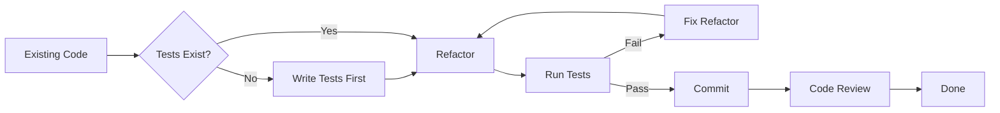

Jumat sore, jam 4 lebih. Deadline sprint sudah lewat dua hari yang lalu. Arif, seorang backend engineer senior di sebuah startup fintech, membuka file `order.go` yang sudah bertahun-tahun tidak disentuh. Fungsinya? Satu fungsi, 300 baris, nama variabel `x`, `tmp`, `d2`. Dia menggeleng — "ini harus dirapikan." Dan karena percaya diri, dia langsung refactor tanpa membuat satu pun unit test.

Sabtu pagi, alarm notifikasi berbunyi. Production down. Order tidak bisa diproses. Saldo pelanggan terpotong tapi barang tidak dikirim. Arif menghabiskan seluruh akhir pekan me-rollback perubahan, debug, dan menulis postmortem yang memalukan. Senin paginya, dia menulis satu kalimat di sticky note yang ditempel di monitornya: **"Refactoring tanpa safety net adalah judi."**

Itulah pelajaran yang kita bahas hari ini. Refactoring bukan soal mengubah kode karena terlihat jelek — melainkan tentang **memperbaiki struktur tanpa mengubah perilaku**, dengan jaring pengaman yang kokoh.

---

## Siklus Refactoring yang Aman

Sebelum menyentuh satu baris pun kode lama, pastikan Anda mengikuti siklus ini:



Aturannya sederhana: **jangan refactor jika belum ada test**. Test adalah jaring pengaman Anda. Jika test sudah ada dan tetap hijau setelah refactoring, Anda bisa yakin perilaku kode tidak berubah.

---

## Konsep Inti

### Boy Scout Rule

> *"Leave the campsite cleaner than you found it."*
> — Robert C. Martin

Dalam konteks kode: setiap kali Anda membuka sebuah file, tinggalkan dalam kondisi sedikit lebih baik dari sebelumnya. Bukan berarti harus refactor total — cukup rename satu variabel yang membingungkan, pecah satu fungsi yang terlalu panjang, atau hapus komentar yang sudah basi.

### Teknik Refactoring Umum

| Teknik | Penjelasan |
|---|---|
| **Extract Method** | Pisahkan blok logika ke fungsi tersendiri |
| **Rename** | Beri nama yang mencerminkan maksud sebenarnya |
| **Extract Interface** | Abstraksi dependensi agar mudah diganti/ditest |
| **Move Function** | Pindahkan fungsi ke package yang lebih sesuai |

### Code Smells yang Perlu Diwaspadai

- **Long Method** — fungsi lebih dari ~20 baris, tanda tanggung jawab terlalu banyak
- **Feature Envy** — fungsi lebih banyak mengakses data struct lain daripada miliknya sendiri
- **Primitive Obsession** — mengoper 6 parameter `string` terpisah padahal harusnya satu struct
- **Data Clumps** — kelompok data yang selalu muncul bersama tapi belum dijadikan struct

---

## ❌ Implementasi yang Salah

Berikut adalah fungsi pemrosesan order yang khas dari codebase yang belum pernah disentuh:

```go
// ❌ BAD: Satu fungsi dengan terlalu banyak tanggung jawab,
// primitive obsession, dan magic numbers

func processOrder(custName string, custEmail string, custPhone string,
    itemName string, itemQty int, itemPrice float64) (string, error) {

    // validasi manual yang tersebar
    if custName == "" || custEmail == "" || custPhone == "" {
        return "", fmt.Errorf("customer data incomplete")
    }
    if itemQty <= 0 || itemPrice <= 0 {
        return "", fmt.Errorf("invalid item")
    }

    // magic number: apa itu 1.11? Pajak? Diskon?
    total := float64(itemQty) * itemPrice * 1.11

    // logika diskon tertanam di sini
    if total > 500000 {
        total = total * 0.95
    }

    // logging, DB insert, email — semua di sini
    log.Printf("Processing order for %s (%s)", custName, custEmail)
    orderID := fmt.Sprintf("ORD-%d", time.Now().Unix())
    // db.Insert(...)  <- bayangkan ini ada
    // email.Send(...) <- dan ini juga
    log.Printf("Order %s created, total: %.2f", orderID, total)

    return orderID, nil
}
```

**Mengapa salah?**
- 6 parameter primitif yang bisa salah urutan kapan saja
- Magic number `1.11` dan `0.95` tanpa penjelasan
- Validasi, kalkulasi, logging, dan persistensi bercampur dalam satu fungsi
- Tidak bisa ditest secara terisolasi

---

## ✅ Implementasi yang Benar

Setelah refactoring bertahap dengan test di setiap langkah:

```go
// ✅ GOOD: Setelah refactoring — struct yang tepat, konstanta bernama,
// dan fungsi dengan tanggung jawab tunggal

// Extract Method + Primitive Obsession fix
type Customer struct {
    Name  string
    Email string
    Phone string
}

type OrderItem struct {
    Name     string
    Quantity int
    Price    float64
}

// Named constants menggantikan magic numbers
const (
    taxRate          = 0.11
    bulkDiscountRate = 0.05
    bulkDiscountMin  = 500_000.0
)

func (c Customer) validate() error {
    if c.Name == "" || c.Email == "" || c.Phone == "" {
        return fmt.Errorf("customer data incomplete")
    }
    return nil
}

func (item OrderItem) validate() error {
    if item.Quantity <= 0 || item.Price <= 0 {
        return fmt.Errorf("invalid order item: %s", item.Name)
    }
    return nil
}

// Extract Method: kalkulasi total berdiri sendiri dan bisa ditest
func calculateTotal(item OrderItem) float64 {
    total := float64(item.Quantity) * item.Price * (1 + taxRate)
    if total > bulkDiscountMin {
        total *= (1 - bulkDiscountRate)
    }
    return total
}

// Fungsi utama kini bersih dan mudah dibaca
func processOrder(customer Customer, item OrderItem) (string, error) {
    if err := customer.validate(); err != nil {
        return "", err
    }
    if err := item.validate(); err != nil {
        return "", err
    }

    total := calculateTotal(item)
    orderID := generateOrderID()

    log.Printf("Order %s created for %s, total: %.2f", orderID, customer.Name, total)
    return orderID, nil
}

func generateOrderID() string {
    return fmt.Sprintf("ORD-%d", time.Now().Unix())
}
```

**Mengapa benar?**
- Struct `Customer` dan `OrderItem` menggantikan 6 parameter primitif
- Konstanta bernama menggantikan magic numbers
- Setiap fungsi punya satu tanggung jawab yang jelas
- Setiap bagian bisa ditest secara independen

---

## Use Case Nyata: Refactoring Bertahap

Bayangkan Anda punya fungsi `processOrder` versi buruk di atas. Berikut urutan refactoring yang aman:

**Langkah 1 — Tulis test dulu (sebelum ubah apapun):**

```go
func TestCalculateTotal_WithBulkDiscount(t *testing.T) {
    item := OrderItem{Name: "Laptop", Quantity: 10, Price: 60_000}
    got := calculateTotal(item)
    want := 10 * 60_000.0 * 1.11 * 0.95
    if math.Abs(got-want) > 0.01 {
        t.Errorf("got %.2f, want %.2f", got, want)
    }
}
```

**Langkah 2 — Extract Method:** Pisahkan `calculateTotal` ke fungsi tersendiri. Jalankan test → harus tetap hijau.

**Langkah 3 — Fix Primitive Obsession:** Buat struct `Customer` dan `OrderItem`. Update signature fungsi. Jalankan test → harus tetap hijau.

**Langkah 4 — Named Constants:** Ganti `1.11` dengan `taxRate`, `0.95` dengan `1 - bulkDiscountRate`. Jalankan test → harus tetap hijau.

**Langkah 5 — Commit dan code review.**

Setiap langkah kecil, setiap langkah aman.

---

## Ringkasan

> **Kunci Refactoring yang Aman:**
> - 🧪 **Test dulu, refactor kemudian** — jangan pernah sebaliknya
> - 🏕️ **Boy Scout Rule** — tinggalkan kode lebih bersih dari sebelumnya
> - 🔬 **Langkah kecil** — satu teknik, satu commit, satu PR
> - 🏷️ **Nama yang jelas** — konstanta, fungsi, dan struct yang mencerminkan maksud
> - 👃 **Kenali code smells** — Long Method, Primitive Obsession, Feature Envy, Data Clumps

---

## 🎯 Challenge

**Terapkan Boy Scout Rule hari ini:**

Buka file Go mana saja yang akan Anda sentuh minggu ini. Sebelum menambahkan fitur baru, lakukan **satu** hal kecil:
- Rename variabel `d` menjadi `discount`
- Pisahkan satu blok logika menjadi fungsi tersendiri
- Ganti satu magic number dengan konstanta bernama

Satu perubahan kecil. Satu commit terpisah. Tulis di commit message: `refactor: apply boy scout rule`.

---

## 🎉 Selamat! Kamu Telah Menyelesaikan Seri Clean Code dengan Go!

Ini adalah bagian terakhir dari seri **Clean Code dengan Go**. Kamu telah menempuh perjalanan dari nama variabel yang bermakna hingga refactoring yang aman. Berikut adalah indeks lengkap semua part:

| Part | Topik | Link |
|------|-------|------|
| 1 | Meaningful Names — Nama yang Bermakna | [Baca](/2026-06-05-clean-code-golang-part-1-meaningful-names-id) |
| 2 | Functions — Fungsi yang Bersih | [Baca](/2026-06-06-clean-code-golang-part-2-functions-id) |
| 3 | Comments — Komentar yang Tepat | [Baca](/2026-06-07-clean-code-golang-part-3-comments-id) |
| 4 | Error Handling — Tangani Error dengan Elegan | [Baca](/2026-06-08-clean-code-golang-part-4-error-handling-id) |
| 5 | Formatting & Structure — Kode yang Rapi | [Baca](/2026-06-09-clean-code-golang-part-5-formatting-id) |
| 6 | SOLID Principles — Desain yang Kokoh | [Baca](/2026-06-10-clean-code-golang-part-6-solid-id) |
| 7 | Testing — Test yang Bersih | [Baca](/2026-06-11-clean-code-golang-part-7-testing-id) |
| **8** | **Refactoring — Perbaiki Tanpa Merusak** | **Kamu di sini** |

Terima kasih sudah mengikuti seri ini sampai akhir. Sekarang giliran kamu untuk menerapkannya — satu fungsi, satu commit, satu hari pada satu waktu. 🚀

---

**🇮🇩 Versi Indonesia** | **[🇬🇧 English version](/2026-07-10-clean-code-golang-part-8-refactoring)**

← [Part 7: Testing — Test yang Bersih](/2026-06-11-clean-code-golang-part-7-testing-id) | Ini adalah bagian terakhir dari seri ini 🏁
