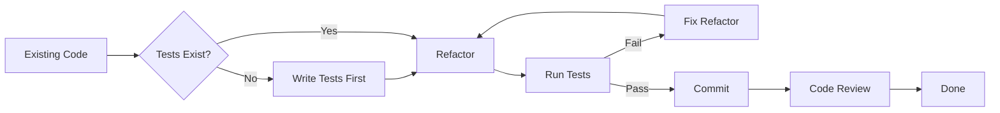

It was a Friday afternoon. Sprint deadline had already passed two days ago. Alex, a senior backend engineer at a fintech startup, opened `order.go` — a file untouched for years. One function. Three hundred lines. Variable names like `x`, `tmp`, `d2`. He shook his head. *"This needs to be cleaned up."* Feeling confident, he dove straight into refactoring without writing a single unit test.

Saturday morning, his phone exploded with alerts. Production was down. Orders couldn't be processed. Customer balances were being debited but items never shipped. Alex spent the entire weekend rolling back changes, debugging, and writing a painful postmortem. Monday morning, he stuck a note to his monitor with one sentence: **"Refactoring without a safety net is gambling."**

That's the lesson of today's post. Refactoring isn't about rewriting code because it looks ugly — it's about **improving structure without changing behavior**, backed by a solid safety net.

---

## The Safe Refactoring Cycle

Before touching a single line of existing code, make sure you follow this cycle:



The rule is simple: **never refactor without tests**. Tests are your safety net. If your tests existed before and still pass after refactoring, you can be confident the code's behavior hasn't changed.

---

## Core Concepts

### The Boy Scout Rule

> *"Leave the campsite cleaner than you found it."*
> — Robert C. Martin

In code terms: every time you open a file, leave it a little better than you found it. This doesn't mean a full rewrite — just rename one confusing variable, extract one overly-long block into a function, or delete one stale comment.

### Common Refactoring Techniques

| Technique | Description |
|---|---|
| **Extract Method** | Pull a block of logic into its own named function |
| **Rename** | Give variables, functions, and types names that reveal intent |
| **Extract Interface** | Abstract a dependency so it can be swapped or mocked in tests |
| **Move Function** | Relocate a function to a more appropriate package |

### Code Smells to Watch For

- **Long Method** — functions over ~20 lines often signal too many responsibilities
- **Feature Envy** — a function that accesses another struct's data more than its own
- **Primitive Obsession** — passing 6 separate `string` parameters instead of a single struct
- **Data Clumps** — groups of data that always appear together but haven't been made into a struct

---

## ❌ Wrong Implementation

Here's a typical order-processing function from an untouched codebase:

```go
// ❌ BAD: One function with too many responsibilities,
// primitive obsession, and magic numbers

func processOrder(custName string, custEmail string, custPhone string,
    itemName string, itemQty int, itemPrice float64) (string, error) {

    // scattered manual validation
    if custName == "" || custEmail == "" || custPhone == "" {
        return "", fmt.Errorf("customer data incomplete")
    }
    if itemQty <= 0 || itemPrice <= 0 {
        return "", fmt.Errorf("invalid item")
    }

    // magic number: what is 1.11? Tax? Some markup?
    total := float64(itemQty) * itemPrice * 1.11

    // embedded discount logic
    if total > 500000 {
        total = total * 0.95
    }

    // logging, DB insert, email — all crammed in here
    log.Printf("Processing order for %s (%s)", custName, custEmail)
    orderID := fmt.Sprintf("ORD-%d", time.Now().Unix())
    // db.Insert(...)  <- imagine this is here
    // email.Send(...) <- and this too
    log.Printf("Order %s created, total: %.2f", orderID, total)

    return orderID, nil
}
```

**Why it's wrong:**
- 6 primitive parameters that can be passed in the wrong order at any call site
- Magic numbers `1.11` and `0.95` with no explanation
- Validation, calculation, logging, and persistence all tangled together
- Impossible to test individual parts in isolation

---

## ✅ Correct Implementation

After incremental refactoring with tests at every step:

```go
// ✅ GOOD: After refactoring — proper domain structs, named constants,
// and functions with a single clear responsibility

// Extract Method + Primitive Obsession fix
type Customer struct {
    Name  string
    Email string
    Phone string
}

type OrderItem struct {
    Name     string
    Quantity int
    Price    float64
}

// Named constants replacing magic numbers
const (
    taxRate          = 0.11
    bulkDiscountRate = 0.05
    bulkDiscountMin  = 500_000.0
)

func (c Customer) validate() error {
    if c.Name == "" || c.Email == "" || c.Phone == "" {
        return fmt.Errorf("customer data incomplete")
    }
    return nil
}

func (item OrderItem) validate() error {
    if item.Quantity <= 0 || item.Price <= 0 {
        return fmt.Errorf("invalid order item: %s", item.Name)
    }
    return nil
}

// Extract Method: total calculation stands alone and is independently testable
func calculateTotal(item OrderItem) float64 {
    total := float64(item.Quantity) * item.Price * (1 + taxRate)
    if total > bulkDiscountMin {
        total *= (1 - bulkDiscountRate)
    }
    return total
}

// The main function is now clean and readable at a glance
func processOrder(customer Customer, item OrderItem) (string, error) {
    if err := customer.validate(); err != nil {
        return "", err
    }
    if err := item.validate(); err != nil {
        return "", err
    }

    total := calculateTotal(item)
    orderID := generateOrderID()

    log.Printf("Order %s created for %s, total: %.2f", orderID, customer.Name, total)
    return orderID, nil
}

func generateOrderID() string {
    return fmt.Sprintf("ORD-%d", time.Now().Unix())
}
```

**Why it's right:**
- `Customer` and `OrderItem` structs replace 6 primitive parameters
- Named constants replace magic numbers, making intent explicit
- Each function has one clear responsibility
- Every part can be tested independently

---

## Real-World Use Case: Step-by-Step Refactoring

Imagine you have the bad `processOrder` function above. Here's the safe sequence to refactor it:

**Step 1 — Write tests first (before changing anything):**

```go
func TestCalculateTotal_WithBulkDiscount(t *testing.T) {
    item := OrderItem{Name: "Laptop", Quantity: 10, Price: 60_000}
    got := calculateTotal(item)
    want := 10 * 60_000.0 * 1.11 * 0.95
    if math.Abs(got-want) > 0.01 {
        t.Errorf("got %.2f, want %.2f", got, want)
    }
}
```

**Step 2 — Extract Method:** Pull `calculateTotal` into its own function. Run tests → must stay green.

**Step 3 — Fix Primitive Obsession:** Create `Customer` and `OrderItem` structs. Update function signatures. Run tests → must stay green.

**Step 4 — Named Constants:** Replace `1.11` with `taxRate`, `0.95` with `1 - bulkDiscountRate`. Run tests → must stay green.

**Step 5 — Commit and open a code review.**

Small steps. Every step safe.

---

## Summary

> **Keys to Safe Refactoring:**
> - 🧪 **Tests first, refactor second** — never the other way around
> - 🏕️ **Boy Scout Rule** — leave code cleaner than you found it
> - 🔬 **Small steps** — one technique, one commit, one PR
> - 🏷️ **Clear names** — constants, functions, and structs that reveal intent
> - 👃 **Recognize code smells** — Long Method, Primitive Obsession, Feature Envy, Data Clumps

---

## 🎯 Challenge

**Apply the Boy Scout Rule today:**

Open any Go file you plan to touch this week. Before adding the new feature, do **one** small thing:
- Rename a variable `d` to `discount`
- Extract one logic block into its own named function
- Replace one magic number with a named constant

One small change. One separate commit. Write in the commit message: `refactor: apply boy scout rule`.

---

## 🎉 Congratulations! You Have Completed the Clean Code with Go Series!

This is the final part of the **Clean Code with Go** series. You've traveled all the way from meaningful variable names to safe refactoring. Here is the full index of every part:

| Part | Topic | Link |
|------|-------|------|
| 1 | Meaningful Names | [Read](/2026-06-05-clean-code-golang-part-1-meaningful-names) |
| 2 | Functions — Writing Clean Functions | [Read](/2026-06-06-clean-code-golang-part-2-functions) |
| 3 | Comments — Write Comments That Add Value | [Read](/2026-06-07-clean-code-golang-part-3-comments) |
| 4 | Error Handling — Handle Errors Gracefully | [Read](/2026-06-08-clean-code-golang-part-4-error-handling) |
| 5 | Formatting & Structure — Clean Code Layout | [Read](/2026-06-09-clean-code-golang-part-5-formatting) |
| 6 | SOLID Principles — Robust Design | [Read](/2026-06-10-clean-code-golang-part-6-solid) |
| 7 | Testing — Clean Tests | [Read](/2026-06-11-clean-code-golang-part-7-testing) |
| **8** | **Refactoring — Improve Without Breaking** | **You are here** |

Thank you for following this series all the way to the end. Now it's your turn to apply these principles — one function, one commit, one day at a time. 🚀

---

**[🇮🇩 Versi Indonesia](/2026-07-10-clean-code-golang-part-8-refactoring-id)** | **🇬🇧 English version**

← [Part 7: Testing — Clean Tests](/2026-06-11-clean-code-golang-part-7-testing) | This is the final part of the series 🏁
