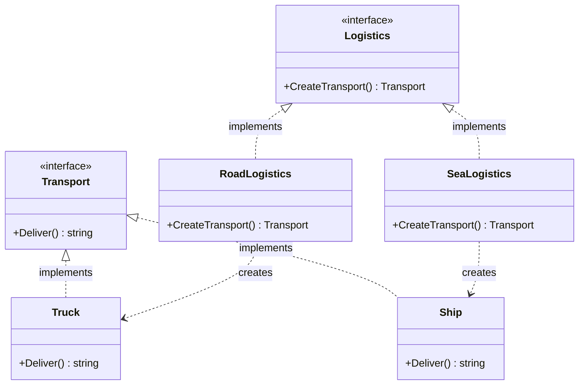

Factory Method adalah creational design pattern yang menyediakan interface untuk membuat objek di superclass, tetapi memungkinkan subclass atau implementasi konkret untuk mengubah jenis objek yang akan dibuat. Di Go, karena kita tidak memiliki pewarisan kelas (inheritance) tradisional, kita mengimplementasikan pola ini menggunakan interface, struct, dan fungsi factory.

## Penjelasan Konseptual & Analogi Dunia Nyata

Bayangkan Anda sedang membangun aplikasi manajemen logistik. Saat bisnis Anda dimulai, Anda hanya menawarkan transportasi darat. Akibatnya, sebagian besar kode Anda berada di dalam struct `Truck`. Setelah beberapa tahun, perusahaan Anda menjadi sangat populer, dan Anda mulai menawarkan transportasi laut.

Ini adalah kabar baik bagi bisnis, tetapi mimpi buruk bagi arsitektur perangkat lunak Anda. Sebagian besar basis kode Anda terikat erat dengan struct `Truck`. Menambahkan `Ship` (Kapal) memerlukan perubahan pada seluruh basis kode. Jika nanti Anda memutuskan untuk menambahkan transportasi udara, Anda harus melakukan perubahan disruptif yang sama lagi.

Pola Factory Method memecahkan masalah ini dengan menyarankan agar Anda mengganti pemanggilan konstruksi objek langsung (menggunakan inisialisasi struct) dengan pemanggilan ke *factory method* khusus. Objek-objek tersebut masih dibuat, tetapi dibuat melalui interface yang sama.

Dalam analogi logistik kita:
1. **Product Interface**: Interface `Transport` yang mendefinisikan method `Deliver()`.
2. **Concrete Products**: Struct `Truck` dan `Ship` yang mengimplementasikan `Transport`.
3. **Creator**: Interface atau base struct `Logistics` yang mendeklarasikan factory method `CreateTransport()`.
4. **Concrete Creators**: Struct `RoadLogistics` dan `SeaLogistics` yang mengimplementasikan `CreateTransport()` untuk masing-masing mengembalikan `Truck` atau `Ship`.

---

## Diagram Konseptual

Berikut adalah diagram kelas Mermaid yang menunjukkan struktur pola Factory Method di Go:



---

## Use Case / Skenario Masalah

Mengapa kita membutuhkan pola ini?
Dalam banyak aplikasi, Anda ingin memisahkan kode yang *menggunakan* produk dari kode yang *membuat* produk tersebut. Jika logika bisnis Anda secara langsung menginisialisasi struct konkret, setiap perubahan pada proses inisialisasi atau pengenalan jenis baru memaksa Anda untuk memodifikasi logika bisnis.

Dengan menggunakan Factory Method, Anda dapat memperkenalkan jenis produk baru ke dalam aplikasi tanpa merusak kode klien yang sudah ada. Kode klien berinteraksi semata-mata dengan interface `Transport` dan `Logistics`, menjaga kode tetap mudah dipelihara, diperluas, dan mematuhi Open/Closed Principle.

---

## Contoh Kode Golang

Di bawah ini adalah program Go lengkap yang dapat dikompilasi, mendemonstrasikan pola Factory Method sesuai dengan gaya Refactoring Guru.

```go
package main

import (
	"fmt"
)

// Transport mendefinisikan interface yang harus diimplementasikan oleh semua produk konkret.
type Transport interface {
	Deliver() string
}

// Truck adalah produk konkret yang mengimplementasikan Transport.
type Truck struct {
	model string
}

func (t *Truck) Deliver() string {
	return fmt.Sprintf("Mengirim kargo melalui darat menggunakan %s dalam kontainer box.", t.model)
}

// Ship adalah produk konkret yang mengimplementasikan Transport.
type Ship struct {
	name string
}

func (s *Ship) Deliver() string {
	return fmt.Sprintf("Mengirim kargo melalui laut menggunakan %s menyeberangi samudra.", s.name)
}

// Logistics mendefinisikan interface creator yang mendeklarasikan factory method.
type Logistics interface {
	CreateTransport() Transport
}

// RoadLogistics adalah creator konkret untuk transportasi darat.
type RoadLogistics struct {
	truckModel string
}

func (r *RoadLogistics) CreateTransport() Transport {
	// Mengembalikan Truck konkret yang di-cast ke interface Transport
	return &Truck{model: r.truckModel}
}

// SeaLogistics adalah creator konkret untuk transportasi laut.
type SeaLogistics struct {
	shipName string
}

func (s *SeaLogistics) CreateTransport() Transport {
	// Mengembalikan Ship konkret yang di-cast ke interface Transport
	return &Ship{name: s.shipName}
}

// ClientCode menunjukkan bagaimana aplikasi berinteraksi dengan interface.
func ClientCode(l Logistics) {
	transport := l.CreateTransport()
	fmt.Println("Klien: Saya tidak mengetahui kelas konkret dari creator, tetapi ini tetap berfungsi.")
	fmt.Printf("Hasil: %s\n\n", transport.Deliver())
}

func main() {
	fmt.Println("Aplikasi: Dijalankan dengan RoadLogistics.")
	roadLogistics := &RoadLogistics{truckModel: "Volvo FH16"}
	ClientCode(roadLogistics)

	fmt.Println("Aplikasi: Dijalankan dengan SeaLogistics.")
	seaLogistics := &SeaLogistics{shipName: "Ever Given"}
	ClientCode(seaLogistics)
}
```

---

## Ringkasan

### Keuntungan
- **Pemisahan (Decoupling)**: Anda menghindari ketergantungan yang erat antara creator dan produk konkret.
- **Single Responsibility Principle**: Anda dapat memindahkan kode pembuatan produk ke satu tempat dalam program, membuat kode lebih mudah didukung.
- **Open/Closed Principle**: Anda dapat memperkenalkan jenis produk baru ke dalam program tanpa merusak kode klien yang sudah ada.

### Kekurangan
- **Kompleksitas**: Kode dapat menjadi lebih rumit karena Anda perlu memperkenalkan banyak interface dan struct baru untuk menerapkan pola ini.

### Kapan Menggunakan
- Gunakan Factory Method ketika Anda tidak tahu sebelumnya jenis dan dependensi pasti dari objek yang harus digunakan oleh kode Anda.
- Gunakan Factory Method ketika Anda ingin menghemat sumber daya sistem dengan menggunakan kembali objek yang sudah ada daripada membangunnya kembali setiap saat.
- Gunakan Factory Method ketika Anda ingin memberi pengguna pustaka (library) atau framework Anda cara untuk memperluas komponen internalnya.
