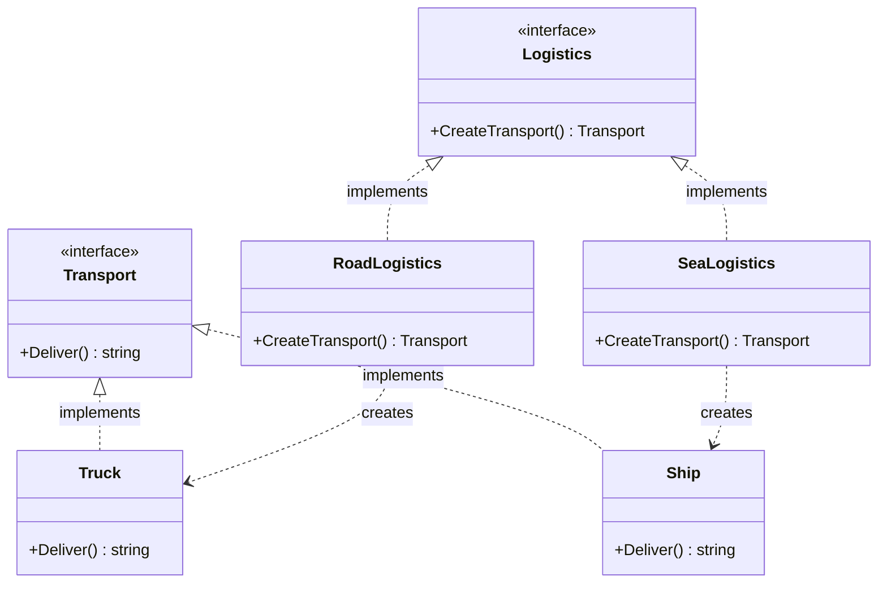

The Factory Method is a creational design pattern that provides an interface for creating objects in a superclass, but allows subclasses or concrete implementations to alter the type of objects that will be created. In Go, since we do not have traditional class inheritance, we implement this pattern using interfaces, structs, and factory functions.

## Conceptual Explanation & Real-World Analogy

Imagine you are building a logistics management application. When your business starts, you only offer road transportation. Consequently, the bulk of your code resides inside a `Truck` class. After a few years, your company becomes highly popular, and you start offering sea transportation. 

This is fantastic news for business, but a nightmare for your software architecture. Most of your codebase is coupled to the `Truck` class. Adding a `Ship` would require making changes to the entire codebase. If you later decide to add air transport, you will have to make the same disruptive changes all over again.

The Factory Method pattern solves this by suggesting that you replace direct object construction calls (using `new` or struct initializers) with calls to a special *factory method*. Don't worry—the objects are still created, but they are created through a common interface.

In our logistics analogy:
1. **Product Interface**: A `Transport` interface that defines a `Deliver()` method.
2. **Concrete Products**: `Truck` and `Ship` structs that implement `Transport`.
3. **Creator**: A `Logistics` interface or base struct that declares the factory method `CreateTransport()`.
4. **Concrete Creators**: `RoadLogistics` and `SeaLogistics` structs that implement or override `CreateTransport()` to return a `Truck` or `Ship` respectively.

---

## Conceptual Diagram

Here is a Mermaid class diagram that shows the structure of the Factory Method pattern in Go:



---

## Use Case / Problem Scenario

Why do we need this pattern?
In many applications, you want to decouple the code that *uses* a product from the code that *creates* the product. If your business logic directly instantiates concrete structs, any change to the initialization process or the introduction of new types forces you to modify the business logic.

By using the Factory Method, you can introduce new product types into the application without breaking existing client code. The client code interacts solely with the `Transport` interface and the `Logistics` interface, keeping the code highly maintainable, extensible, and adhering to the Open/Closed Principle.

---

## Golang Code Example

Below is a complete, compilable Go program demonstrating the Factory Method pattern following the Refactoring Guru style.

```go
package main

import (
	"fmt"
)

// Transport defines the interface that all concrete products must implement.
type Transport interface {
	Deliver() string
}

// Truck is a concrete product implementing Transport.
type Truck struct {
	model string
}

func (t *Truck) Deliver() string {
	return fmt.Sprintf("Delivering cargo by land using %s in a box container.", t.model)
}

// Ship is a concrete product implementing Transport.
type Ship struct {
	name string
}

func (s *Ship) Deliver() string {
	return fmt.Sprintf("Delivering cargo by sea using %s across the ocean.", s.name)
}

// Logistics defines the creator interface declaring the factory method.
type Logistics interface {
	CreateTransport() Transport
}

// RoadLogistics is a concrete creator for road transportation.
type RoadLogistics struct {
	truckModel string
}

func (r *RoadLogistics) CreateTransport() Transport {
	// Returns a concrete Truck cast to the Transport interface
	return &Truck{model: r.truckModel}
}

// SeaLogistics is a concrete creator for sea transportation.
type SeaLogistics struct {
	shipName string
}

func (s *SeaLogistics) CreateTransport() Transport {
	// Returns a concrete Ship cast to the Transport interface
	return &Ship{name: s.shipName}
}

// ClientCode demonstrates how the application interacts with the interfaces.
func ClientCode(l Logistics) {
	transport := l.CreateTransport()
	fmt.Println("Client: I am not aware of the concrete creator's class, but it still works.")
	fmt.Printf("Result: %s\n\n", transport.Deliver())
}

func main() {
	fmt.Println("App: Launched with RoadLogistics.")
	roadLogistics := &RoadLogistics{truckModel: "Volvo FH16"}
	ClientCode(roadLogistics)

	fmt.Println("App: Launched with SeaLogistics.")
	seaLogistics := &SeaLogistics{shipName: "Ever Given"}
	ClientCode(seaLogistics)
}
```

---

## Summary

### Advantages
- **Decoupling**: You avoid tight coupling between the creator and the concrete products.
- **Single Responsibility Principle**: You can move the product creation code into one place in the program, making the code easier to support.
- **Open/Closed Principle**: You can introduce new types of products into the program without breaking existing client code.

### Disadvantages
- **Complexity**: The code may become more complicated since you need to introduce a lot of new interfaces and structs to implement the pattern.

### When to Use
- Use the Factory Method when you don't know beforehand the exact types and dependencies of the objects your code should work with.
- Use the Factory Method when you want to save system resources by reusing existing objects instead of rebuilding them each time.
- Use the Factory Method when you want to provide users of your library or framework with a way to extend its internal components.
