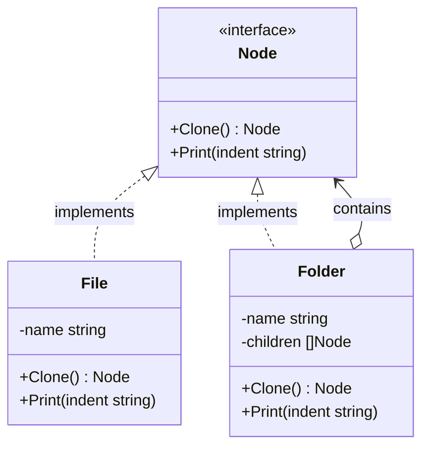

Prototype adalah creational design pattern yang memungkinkan Anda menyalin objek yang ada tanpa membuat kode Anda bergantung pada kelas objek tersebut. Di Go, kita mengimplementasikan pola ini dengan mengekspos metode `Clone()` pada suatu interface, memungkinkan objek mengembalikan salinan dari diri mereka sendiri.

## Penjelasan Konseptual & Analogi Dunia Nyata

Bayangkan Anda memiliki sebuah objek, dan Anda ingin membuat salinan persis dari objek tersebut. Bagaimana Anda melakukannya?

Pertama, Anda harus membuat objek baru dari struct yang sama. Kemudian Anda harus menelusuri semua field dari objek asli dan menyalin nilainya ke objek baru. Terlihat mudah, bukan? Tetapi ada kendalanya. Tidak semua objek dapat disalin dengan cara itu karena beberapa field objek mungkin bersifat privat dan tidak terlihat dari luar objek itu sendiri.

Ada masalah lain. Karena Anda harus mengetahui jenis struct objek untuk membuat duplikat, kode Anda menjadi bergantung pada struct tersebut. Jika Anda hanya mengetahui interface yang diikuti oleh objek tersebut, Anda tidak akan dapat membuat salinan dari objek tersebut.

Pola Prototype mendelegasikan proses kloning ke objek aktual yang sedang dikloning. Pola ini mendeklarasikan interface umum untuk semua objek yang mendukung kloning. Interface ini biasanya hanya berisi satu metode `Clone()`.

Implementasi metode `Clone()` di semua kelas sangat mirip. Metode ini membuat objek dari struct saat ini dan membawa semua nilai field dari objek lama ke objek baru. Anda bahkan dapat menyalin field privat karena sebagian besar bahasa pemrograman mengizinkan objek mengakses field privat dari objek lain yang termasuk dalam kelas/struct yang sama.

Analogi dunia nyata yang sangat baik adalah pembelahan sel mitosis. Dalam biologi, sebuah sel membelah diri untuk membentuk dua sel yang identik secara genetik. Sel asli bertindak sebagai prototype, memulai duplikasi strukturnya sendiri.

---

## Diagram Konseptual

Berikut adalah diagram kelas Mermaid yang menunjukkan struktur pola Prototype di Go:



---

## Use Case / Skenario Masalah

Mengapa kita membutuhkan pola ini?
Di Go, menyalin struct dapat dilakukan hanya melalui penugasan (assignment) langsung (misalnya, `copy := original`). Namun, ini melakukan **shallow copy** (penyalinan dangkal). Jika struct berisi pointer, slice, atau map, objek asli dan objek salinan akan menunjuk ke lokasi memori yang sama. Memodifikasi slice di objek hasil kloning secara tidak sengaja akan mengubah objek asli.

Pola Prototype sangat penting ketika:
1. Anda perlu melakukan **deep copy** (penyalinan mendalam) dari struktur yang kompleks (seperti tree, graph, atau konfigurasi bersarang).
2. Anda ingin membuat duplikat dari objek yang diteruskan ke kode Anda melalui interface, tanpa menghubungkan kode Anda ke struct konkret mereka.

---

## Contoh Kode Golang

Di bawah ini adalah program Go lengkap yang dapat dikompilasi, mendemonstrasikan pola Prototype dengan sistem File dan Folder hierarkis. Ini menunjukkan bagaimana sebuah folder secara rekursif mengkloning semua anaknya untuk mencapai deep copy yang lengkap.

```go
package main

import (
	"fmt"
)

// Node mewakili interface prototype untuk elemen sistem file.
type Node interface {
	Clone() Node
	Print(indent string)
}

// File adalah prototype konkret yang mewakili file.
type File struct {
	name string
}

func NewFile(name string) *File {
	return &File{name: name}
}

func (f *File) Clone() Node {
	// Penyalinan struct dasar berfungsi di sini karena File hanya berisi string (tipe primitif).
	return &File{name: f.name + "_clone"}
}

func (f *File) Print(indent string) {
	fmt.Printf("%s- File: %s\n", indent, f.name)
}

// Folder adalah prototype konkret yang mewakili folder yang berisi node lain.
type Folder struct {
	name     string
	children []Node
}

func NewFolder(name string) *Folder {
	return &Folder{name: name}
}

func (f *Folder) AddChild(child Node) {
	f.children = append(f.children, child)
}

func (f *Folder) Clone() Node {
	// Untuk melakukan deep copy, kita mengkloning folder itu sendiri,
	// lalu secara rekursif mengkloning semua anaknya.
	cloneFolder := &Folder{name: f.name + "_clone"}
	
	var clonedChildren []Node
	for _, child := range f.children {
		clonedChildren = append(clonedChildren, child.Clone())
	}
	cloneFolder.children = clonedChildren
	
	return cloneFolder
}

func (f *Folder) Print(indent string) {
	fmt.Printf("%s+ Folder: %s\n", indent, f.name)
	for _, child := range f.children {
		child.Print(indent + "  ")
	}
}

func main() {
	// 1. Membuat struktur direktori
	file1 := NewFile("config.yaml")
	file2 := NewFile("main.go")
	file3 := NewFile("README.md")

	srcFolder := NewFolder("src")
	srcFolder.AddChild(file2)

	rootFolder := NewFolder("project_root")
	rootFolder.AddChild(file1)
	rootFolder.AddChild(srcFolder)
	rootFolder.AddChild(file3)

	fmt.Println("--- Tree Asli ---")
	rootFolder.Print("")

	// 2. Kloning seluruh direktori menggunakan metode Clone dari prototype
	fmt.Println("\n--- Mengkloning Seluruh Struktur Folder ---")
	clonedRoot := rootFolder.Clone()

	fmt.Println("\n--- Tree Hasil Kloning ---")
	clonedRoot.Print("")

	// 3. Memverifikasi bahwa perubahan pada klon tidak memengaruhi yang asli
	fmt.Println("\n--- Memverifikasi Pemisahan Deep Copy ---")
	
	// Menambahkan file baru ke direktori hasil kloning
	if folderClone, ok := clonedRoot.(*Folder); ok {
		folderClone.AddChild(NewFile("docker-compose.yml"))
	}
	
	fmt.Println("\n--- Tree Asli setelah Modifikasi Kloning ---")
	rootFolder.Print("")

	fmt.Println("\n--- Tree Kloning setelah Modifikasi Kloning ---")
	clonedRoot.Print("")
}
```

---

## Ringkasan

### Keuntungan
- **Pemisahan (Decoupling)**: Anda dapat mengkloning objek tanpa terikat ke kelas/struct konkret mereka.
- **Mengurangi Overhead Inisialisasi**: Anda dapat menyingkirkan kode inisialisasi yang berulang demi mengkloning prototype yang sudah dikonfigurasi sebelumnya.
- **Penanganan Deep Copy**: Menyediakan cara standar dan bersih untuk menangani hierarki objek yang kompleks dan operasi penyalinan mendalam.

### Kekurangan
- **Referensi Melingkar (Circular References)**: Mengkloning objek kompleks yang memiliki referensi melingkar bisa sangat rumit untuk diimplementasikan.

### Kapan Menggunakan
- Gunakan pola Prototype ketika kode Anda tidak boleh bergantung pada kelas konkret dari objek yang perlu Anda salin.
- Gunakan pola Prototype ketika Anda ingin mengurangi jumlah subclass yang hanya berbeda dalam cara mereka menginisialisasi objek masing-masing.
- Gunakan pola Prototype ketika Anda perlu menduplikasi konfigurasi kompleks, struct bersarang, atau objek dengan field privat.
