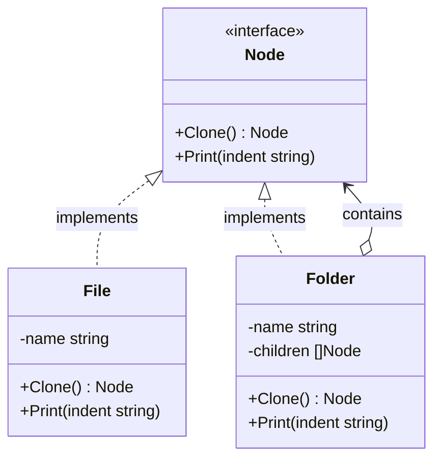

The Prototype is a creational design pattern that lets you copy existing objects without making your code dependent on their classes. In Go, we implement this pattern by exposing a `Clone()` method on an interface, allowing objects to return a duplicate of themselves.

## Conceptual Explanation & Real-World Analogy

Imagine you have an object, and you want to create an exact copy of it. How would you do it? 

First, you must create a new object of the same class. Then you have to go through all the fields of the original object and copy their values over to the new object. Nice and easy, right? But there’s a catch. Not all objects can be copied that way because some of the object’s fields might be private and invisible from outside the object itself.

There is another problem. Since you have to know the object's class to create a duplicate, your code becomes dependent on that class. If you only know the interface that the object follows, you won't be able to instantiate a copy of it.

The Prototype pattern delegates the cloning process to the actual objects that are being cloned. The pattern declares a common interface for all objects that support cloning. This interface usually contains a single `Clone()` method.

The implementation of the `Clone()` method in all classes is very similar. The method creates an object of the current class and carries over all of the field values of the old object to the new one. You can even copy private fields because most programming languages allow objects to access private fields of other objects that belong to the same class.

An excellent real-world analogy is mitotic cell division. In biology, a cell divides to form two genetically identical cells. The original cell acts as a prototype, initiating the duplication of its own structure.

---

## Conceptual Diagram

Here is a Mermaid class diagram that shows the structure of the Prototype pattern in Go:



---

## Use Case / Problem Scenario

Why do we need this pattern?
In Go, copying a struct can be done simply via assignment (e.g., `copy := original`). However, this performs a **shallow copy**. If the struct contains pointers, slices, or maps, both the original and the copy will point to the same underlying memory locations. Modifying a slice in the cloned object will inadvertently modify the original object.

The Prototype pattern is essential when:
1. You need to perform a **deep copy** of complex structures (such as trees, graphs, or nested configurations).
2. You want to instantiate duplicates of objects that are passed to your code via interfaces, without coupling your code to their concrete structs.

---

## Golang Code Example

Below is a complete, compilable Go program demonstrating the Prototype pattern with a hierarchical File and Folder system. It showcases how a folder recursively clones all its children to achieve a complete deep copy.

```go
package main

import (
	"fmt"
)

// Node represents the prototype interface for file system elements.
type Node interface {
	Clone() Node
	Print(indent string)
}

// File is a concrete prototype representing a file.
type File struct {
	name string
}

func NewFile(name string) *File {
	return &File{name: name}
}

func (f *File) Clone() Node {
	// A basic struct copy works here since File contains only a string (primitive type).
	return &File{name: f.name + "_clone"}
}

func (f *File) Print(indent string) {
	fmt.Printf("%s- File: %s\n", indent, f.name)
}

// Folder is a concrete prototype representing a folder containing other nodes.
type Folder struct {
	name     string
	children []Node
}

func NewFolder(name string) *Folder {
	return &Folder{name: name}
}

func (f *Folder) AddChild(child Node) {
	f.children = append(f.children, child)
}

func (f *Folder) Clone() Node {
	// To perform a deep copy, we clone the folder itself,
	// and then recursively clone all of its children.
	cloneFolder := &Folder{name: f.name + "_clone"}
	
	var clonedChildren []Node
	for _, child := range f.children {
		clonedChildren = append(clonedChildren, child.Clone())
	}
	cloneFolder.children = clonedChildren
	
	return cloneFolder
}

func (f *Folder) Print(indent string) {
	fmt.Printf("%s+ Folder: %s\n", indent, f.name)
	for _, child := range f.children {
		child.Print(indent + "  ")
	}
}

func main() {
	// 1. Create a directory structure
	file1 := NewFile("config.yaml")
	file2 := NewFile("main.go")
	file3 := NewFile("README.md")

	srcFolder := NewFolder("src")
	srcFolder.AddChild(file2)

	rootFolder := NewFolder("project_root")
	rootFolder.AddChild(file1)
	rootFolder.AddChild(srcFolder)
	rootFolder.AddChild(file3)

	fmt.Println("--- Original Tree ---")
	rootFolder.Print("")

	// 2. Clone the directory tree using the prototype's Clone method
	fmt.Println("\n--- Cloning the Entire Folder Tree ---")
	clonedRoot := rootFolder.Clone()

	fmt.Println("\n--- Cloned Tree ---")
	clonedRoot.Print("")

	// 3. Verify that changes to the clone do not affect the original
	fmt.Println("\n--- Verifying Deep Copy Separation ---")
	
	// Add a new file to the cloned directory
	if folderClone, ok := clonedRoot.(*Folder); ok {
		folderClone.AddChild(NewFile("docker-compose.yml"))
	}
	
	fmt.Println("\n--- Original Tree after Clone Modification ---")
	rootFolder.Print("")

	fmt.Println("\n--- Cloned Tree after Clone Modification ---")
	clonedRoot.Print("")
}
```

---

## Summary

### Advantages
- **Decoupling**: You can clone objects without coupling them to their concrete classes.
- **Reduced Initialization Overhead**: You can get rid of repeated initialization code in favor of cloning a pre-configured prototype.
- **Deep Copy Handling**: It provides a clean, standardized way to handle complex object hierarchies and deep copy operations.

### Disadvantages
- **Circular References**: Cloning complex objects that have circular references can be extremely tricky to implement.

### When to Use
- Use the Prototype pattern when your code shouldn’t depend on the concrete classes of objects that you need to copy.
- Use the Prototype pattern when you want to reduce the number of subclasses that only differ in the way they initialize their respective objects.
- Use the Prototype pattern when you need to duplicate complex configurations, nested structs, or objects with private fields.
