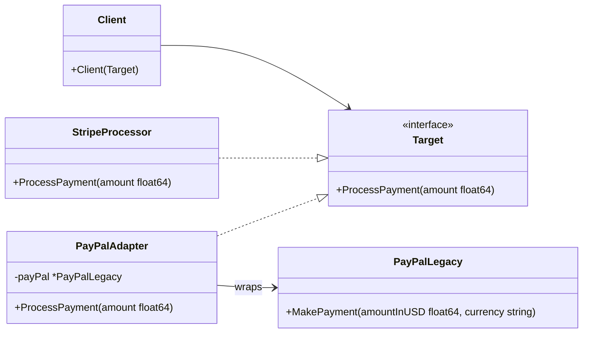

Bayangkan kamu sedang bepergian dari Indonesia ke Amerika Serikat. Kamu membawa laptop kesayanganmu, tetapi setibanya di hotel, kamu menyadari bahwa kamu tidak bisa mencolokkan chargermu ke stopkontak di dinding. Stopkontak di hotel tersebut menggunakan slot pipih khas Amerika, sedangkan colokan chargermu berkaki bulat standar Indonesia (stopkontak tipe C/F).

Kamu tentu tidak akan membeli laptop baru, juga tidak akan membongkar stopkontak hotel untuk mengganti kabelnya. Solusinya adalah menggunakan **adapter colokan listrik**. Adapter ini berada di tengah-tengah: ia menyajikan colokan pipih ke stopkontak dinding, dan menyediakan lubang bulat untuk charger laptopmu. Ia menerjemahkan satu interface colokan ke interface colokan lainnya.

Dalam rekayasa perangkat lunak, **Adapter Pattern** melakukan hal yang sama. Ini adalah design pattern struktural yang memungkinkan objek dengan interface tidak kompatibel untuk bekerja sama.

---

## Diagram Konseptual

Adapter pattern menggunakan metode komposisi untuk membungkus class yang sudah ada (**Adaptee**) dengan interface baru (**Target**) yang diharapkan oleh client.



Pada diagram di atas:
- **Client**: Kode aplikasi utama yang memanggil interface `Target`.
- **Target**: Interface standar yang diharapkan oleh Client.
- **Adaptee**: Komponen legacy atau library pihak ketiga yang memiliki interface tidak kompatibel, tetapi ingin kita gunakan kembali.
- **Adapter**: Kelas perantara yang mengimplementasikan interface `Target` dan menerjemahkan panggilan tersebut ke `Adaptee`.

---

## Skenario Kasus Penggunaan

Misalkan kamu sedang membangun platform e-commerce. Pada awalnya, sistem dirancang untuk bekerja hanya dengan gateway pembayaran **Stripe**. Kode checkout langsung memanggil interface `PaymentProcessor` yang cocok dengan signature milik Stripe.

Kemudian, bisnis memutuskan untuk mendukung **PayPal** untuk mempermudah transaksi internasional. Namun, SDK PayPal memiliki signature API yang sangat berbeda: ia membutuhkan nominal uang beserta string mata uang, dan menggunakan nama method `MakePayment` alih-alih `ProcessPayment`.

Mengubah kode checkout secara langsung untuk mengakomodasi berbagai signature pembayaran yang berbeda akan melanggar **Open/Closed Principle** dan mengotori kode. Menggunakan Adapter memungkinkan kita untuk menyambungkan PayPal ke infrastruktur checkout yang sudah ada tanpa mengubah kode checkout tersebut.

---

## Implementasi Golang

Berikut adalah implementasi lengkap dan idiomatik dari Adapter pattern dalam bahasa Go mengikuti gaya penulisan Refactoring Guru.

```go
package main

import (
	"fmt"
)

// Target mendefinisikan interface standar yang diharapkan oleh aplikasi kita.
type PaymentProcessor interface {
	ProcessPayment(amount float64) bool
}

// StripeProcessor adalah implementasi konkret dari interface Target.
type StripeProcessor struct{}

func (s *StripeProcessor) ProcessPayment(amount float64) bool {
	fmt.Printf("[Stripe] Berhasil memproses pembayaran sebesar $%.2f\n", amount)
	return true
}

// PayPalLegacy merepresentasikan Adaptee. Objek ini memiliki interface yang tidak kompatibel
// sehingga tidak bisa dipanggil langsung oleh kode checkout kita.
type PayPalLegacy struct{}

func (p *PayPalLegacy) MakePayment(amountInUSD float64, currency string) bool {
	fmt.Printf("[PayPal] Berhasil memproses pembayaran sebesar %.2f %s menggunakan SDK lama\n", amountInUSD, currency)
	return true
}

// PayPalAdapter mengimplementasikan interface PaymentProcessor (Target)
// dengan membungkus struct PayPalLegacy (Adaptee).
type PayPalAdapter struct {
	payPalService *PayPalLegacy
}

// ProcessPayment bertindak sebagai lapisan penerjemah.
func (a *PayPalAdapter) ProcessPayment(amount float64) bool {
	// Menerjemahkan panggilan client ke dalam parameter yang diharapkan oleh PayPal
	return a.payPalService.MakePayment(amount, "USD")
}

// Client merepresentasikan layanan checkout pada e-commerce kita.
type CheckoutService struct {
	processor PaymentProcessor
}

func (c *CheckoutService) CompleteCheckout(total float64) {
	fmt.Println("Memulai proses checkout...")
	success := c.processor.ProcessPayment(total)
	if success {
		fmt.Println("Checkout selesai dengan sukses!")
	} else {
		fmt.Println("Checkout gagal: pembayaran ditolak.")
	}
	fmt.Println("------------------------------------------------")
}

func main() {
	// 1. Menggunakan Stripe Processor bawaan
	stripe := &StripeProcessor{}
	checkoutWithStripe := &CheckoutService{processor: stripe}
	checkoutWithStripe.CompleteCheckout(99.99)

	// 2. Menggunakan PayPal melalui Adapter
	payPalSDKLama := &PayPalLegacy{}
	payPalAdapter := &PayPalAdapter{payPalService: payPalSDKLama}
	checkoutWithPayPal := &CheckoutService{processor: payPalAdapter}
	checkoutWithPayPal.CompleteCheckout(49.50)
}
```

---

## Ringkasan

### Keuntungan
- **Single Responsibility Principle (SRP)**: Kamu dapat memisahkan logika konversi interface dari logika bisnis utama aplikasi.
- **Open/Closed Principle (OCP)**: Kamu dapat menambahkan adapter baru ke dalam aplikasi tanpa merusak kode client yang sudah berjalan.
- **Reusability**: Memungkinkan penggunaan kembali library lama atau pihak ketiga yang handal meskipun interfacenya tidak cocok dengan sistem baru.

### Kerugian
- **Kompleksitas**: Kompleksitas kode meningkat karena bertambahnya interface dan struct baru.
- **Overhead**: Proses translasi interface menambahkan sedikit overhead eksekusi, walaupun pada sistem backend modern hal ini hampir tidak terasa dampaknya.

### Kapan Harus Digunakan
- Ketika ingin menggunakan library atau package yang sudah ada, namun interfacenya tidak cocok dengan struktur codebase barumu.
- Ketika mengintegrasikan beberapa library pihak ketiga yang memiliki fungsi serupa tetapi dengan signature API yang berbeda-beda.
- Ketika membutuhkan pewarisan dari beberapa class yang ada namun mereka tidak memiliki kesamaan fungsi dasar, dan kamu tidak diperbolehkan mengubah kode induknya.
