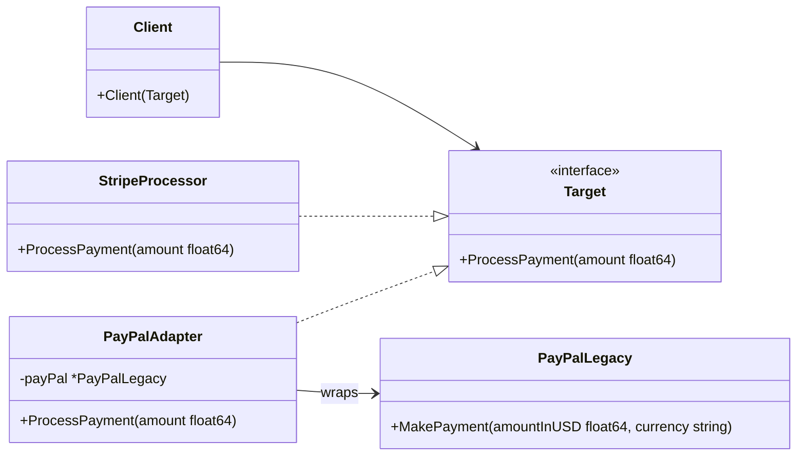

Imagine you are traveling from the US to Europe. You pack your favorite laptop, but when you arrive at your hotel, you realize you cannot plug it into the wall. The wall outlet uses round European pins, while your laptop charger uses flat American prongs. 

You don't buy a new laptop, nor do you rewire the hotel's electrical system. Instead, you use a simple **plug adapter**. The adapter sits in the middle, presenting a European plug to the wall socket and providing an American outlet to your charger. It translates one interface to another.

In software engineering, the **Adapter Pattern** does exactly this. It is a structural design pattern that allows objects with incompatible interfaces to collaborate.

---

## Conceptual Diagram

The Adapter pattern uses composition to wrap an existing class (the **Adaptee**) with a new interface (the **Target**) that the client expects.



In this diagram:
- **Client**: The business logic that interacts with the `Target` interface.
- **Target**: The interface that the Client expects to interact with.
- **Adaptee**: The legacy or third-party component with an incompatible interface that we want to reuse.
- **Adapter**: The middleman implementing the `Target` interface and translating calls to the `Adaptee`.

---

## Use Case & Scenario

Suppose you are building an e-commerce platform. Initially, your system was designed to work only with the **Stripe** payment gateway. The client code directly calls a `PaymentProcessor` interface that matches Stripe's signature.

Later, the business decides to support **PayPal** to expand globally. However, PayPal's SDK has a completely different API signature: it requires both the amount and a currency string, and uses a method named `MakePayment` instead of `ProcessPayment`. 

Modifying the core billing logic to accommodate multiple different payment method signatures directly would violate the **Open/Closed Principle** and clutter the code. Using an Adapter allows us to plug PayPal into our existing infrastructure seamlessly.

---

## Golang Implementation

Below is a complete, idiomatic Go implementation of the Adapter pattern following the Refactoring Guru style.

```go
package main

import (
	"fmt"
)

// Target defines the standard interface that our client application expects.
type PaymentProcessor interface {
	ProcessPayment(amount float64) bool
}

// StripeProcessor is a concrete implementation of the Target interface.
type StripeProcessor struct{}

func (s *StripeProcessor) ProcessPayment(amount float64) bool {
	fmt.Printf("[Stripe] Successfully processed payment of $%.2f\n", amount)
	return true
}

// PayPalLegacy represents our Adaptee. It has an incompatible interface
// that our client cannot call directly.
type PayPalLegacy struct{}

func (p *PayPalLegacy) MakePayment(amountInUSD float64, currency string) bool {
	fmt.Printf("[PayPal] Successfully processed payment of %.2f %s using legacy SDK\n", amountInUSD, currency)
	return true
}

// PayPalAdapter implements the PaymentProcessor (Target) interface
// by wrapping the PayPalLegacy (Adaptee) struct.
type PayPalAdapter struct {
	payPalService *PayPalLegacy
}

// ProcessPayment acts as the translation layer.
func (a *PayPalAdapter) ProcessPayment(amount float64) bool {
	// Translate the client call into the parameters expected by PayPal
	return a.payPalService.MakePayment(amount, "USD")
}

// Client represents the e-commerce checkout flow.
type CheckoutService struct {
	processor PaymentProcessor
}

func (c *CheckoutService) CompleteCheckout(total float64) {
	fmt.Println("Starting checkout process...")
	success := c.processor.ProcessPayment(total)
	if success {
		fmt.Println("Checkout completed successfully!")
	} else {
		fmt.Println("Checkout failed: payment rejected.")
	}
	fmt.Println("------------------------------------------------")
}

func main() {
	// 1. Using our default Stripe Processor
	stripe := &StripeProcessor{}
	checkoutWithStripe := &CheckoutService{processor: stripe}
	checkoutWithStripe.CompleteCheckout(99.99)

	// 2. Using PayPal via the Adapter
	payPalLegacySDK := &PayPalLegacy{}
	payPalAdapter := &PayPalAdapter{payPalService: payPalLegacySDK}
	checkoutWithPayPal := &CheckoutService{processor: payPalAdapter}
	checkoutWithPayPal.CompleteCheckout(49.50)
}
```

---

## Summary

### Advantages
- **Single Responsibility Principle (SRP)**: You can separate the interface or data conversion code from the primary business logic.
- **Open/Closed Principle (OCP)**: You can introduce new adapters into the program without breaking existing client code.
- **Reusability**: You can reuse existing legacy code or third-party libraries even if their interfaces don't match the new system requirements.

### Disadvantages
- **Complexity**: The overall complexity of the code increases because you need to introduce new interfaces and structs.
- **Overhead**: Sometimes, direct interface translation adds a tiny, negligible performance overhead, though this is rarely an issue in modern backend systems.

### When to Use
- When you want to use an existing package or class, but its interface does not match the rest of your codebase.
- When you need to integrate multiple third-party libraries that provide similar functionality but have different API signatures.
- When you need to use several existing subclasses that lack some common functionality, and you don't want to modify their parent class code.
