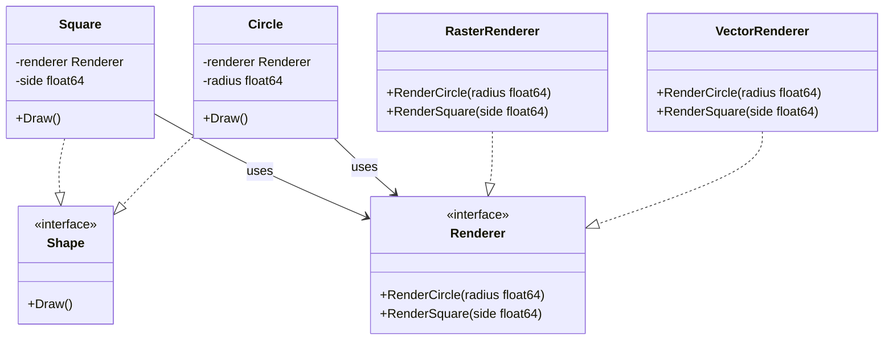

Bayangkan kamu memiliki sebuah remote control dan sebuah televisi. Remote control tersebut memiliki tombol fisik seperti "Power", "Volume Up", dan "Channel Down". Di sisi lain, televisi adalah perangkat fisik sesungguhnya yang memproses sinyal elektronik, menyalakan layar, dan mengeluarkan suara melalui speaker.

Remote control bertindak sebagai **abstraksi** (interface yang kamu gunakan untuk berinteraksi), sedangkan televisi merepresentasikan **implementasi** (sistem nyata yang melakukan tugas di belakang layar).

Jika kamu memutuskan untuk membeli TV baru (misalnya, mengganti TV Sony dengan TV LG), kamu tidak perlu membeli remote control yang benar-benar berbeda dari awal. Selama kedua TV tersebut memahami protokol sinyal remote yang sama, remote controlmu dapat bekerja dengan keduanya. Remote control (abstraksi) dan televisi (implementasi) dipisahkan. Keduanya bisa dikembangkan secara independen.

Dalam desain perangkat lunak, konsep ini disebut sebagai **Bridge Pattern**. Ini adalah design pattern struktural yang membagi class besar atau kumpulan class yang saling berhubungan erat menjadi dua hierarki terpisah — abstraksi dan implementasi — yang dapat dikembangkan secara independen satu sama lain.

---

## Diagram Konseptual

Alih-alih membuat matriks class yang sangat banyak (misal: `RedCircle`, `BlueCircle`, `RedSquare`, `BlueSquare`), Bridge pattern membagi desain menjadi dua hierarki terpisah:
1. **Abstraction**: Menyimpan logika kontrol tingkat tinggi dan meneruskan pekerjaan ke objek implementasi.
2. **Implementation**: Mendefinisikan interface untuk semua operasi spesifik platform.



---

## Skenario Kasus Penggunaan

Misalkan kamu sedang membangun library grafis lintas platform. Kamu memiliki bentuk geometri seperti lingkaran (`Circle`) dan persegi (`Square`), dan kamu perlu menggambarnya dalam berbagai format, seperti **Vector graphics** (SVG) atau **Raster graphics** (PNG/Piksel).

Jika menggunakan pewarisan kelas (inheritance) biasa, hierarki class akan tumbuh secara eksponensial:
- `VectorCircle`
- `RasterCircle`
- `VectorSquare`
- `RasterSquare`

Jika kamu menambahkan bentuk baru (misal: `Triangle`) atau engine rendering baru (misal: `3DRenderer`), kamu harus membuat banyak class baru. Masalah ini dikenal dengan istilah **class explosion** (ledakan kelas).

Bridge pattern memecahkan masalah ini dengan membuat "jembatan" (bridge) antara bentuk geometri (abstraksi) dan engine rendering (implementasi).

---

## Implementasi Golang

Berikut adalah implementasi lengkap dan idiomatik dari Bridge pattern dalam bahasa Go.

```go
package main

import (
	"fmt"
)

// ==========================================
// 1. Interface Implementation (Implementasi)
// ==========================================

// Renderer mendefinisikan interface untuk menggambar bentuk pada platform tertentu.
type Renderer interface {
	RenderCircle(radius float64)
	RenderSquare(side float64)
}

// ==========================================
// 2. Concrete Implementations (Implementasi Konkret)
// ==========================================

// VectorRenderer menggambar bentuk menggunakan instruksi grafis vektor.
type VectorRenderer struct{}

func (v *VectorRenderer) RenderCircle(radius float64) {
	fmt.Printf("Menggambar lingkaran dengan radius %.2f sebagai grafis Vektor.\n", radius)
}

func (v *VectorRenderer) RenderSquare(side float64) {
	fmt.Printf("Menggambar persegi dengan sisi %.2f sebagai grafis Vektor.\n", side)
}

// RasterRenderer menggambar bentuk sebagai kisi-kisi piksel raster.
type RasterRenderer struct{}

func (r *RasterRenderer) RenderCircle(radius float64) {
	fmt.Printf("Menggambar lingkaran dengan radius %.2f sebagai piksel Raster.\n", radius)
}

func (r *RasterRenderer) RenderSquare(side float64) {
	fmt.Printf("Menggambar persegi dengan sisi %.2f sebagai piksel Raster.\n", side)
}

// ==========================================
// 3. Interface Abstraction (Abstraksi)
// ==========================================

// Shape mendefinisikan interface tingkat tinggi untuk bentuk geometri.
type Shape interface {
	Draw()
}

// ==========================================
// 4. Refined Abstractions (Abstraksi Terperinci)
// ==========================================

// Circle adalah abstraksi terperinci untuk bentuk lingkaran.
type Circle struct {
	radius   float64
	renderer Renderer // Ini adalah link Bridge
}

func NewCircle(radius float64, renderer Renderer) *Circle {
	return &Circle{
		radius:   radius,
		renderer: renderer,
	}
}

func (c *Circle) Draw() {
	// Mendelegasikan tugas menggambar ke interface implementasi
	c.renderer.RenderCircle(c.radius)
}

// Square adalah abstraksi terperinci untuk bentuk persegi.
type Square struct {
	side     float64
	renderer Renderer // Ini adalah link Bridge
}

func NewSquare(side float64, renderer Renderer) *Square {
	return &Square{
		side:     side,
		renderer: renderer,
	}
}

func (s *Square) Draw() {
	// Mendelegasikan tugas menggambar ke interface implementasi
	s.renderer.RenderSquare(s.side)
}

// ==========================================
// 5. Eksekusi Client
// ==========================================

func main() {
	// Inisialisasi engine renderer platform
	vectorEngine := &VectorRenderer{}
	rasterEngine := &RasterRenderer{}

	// Menggambar bentuk Vektor
	fmt.Println("--- Pipeline Grafis Vektor ---")
	lingkaranVektor := NewCircle(5.0, vectorEngine)
	persegiVektor := NewSquare(10.0, vectorEngine)
	lingkaranVektor.Draw()
	persegiVektor.Draw()

	fmt.Println("\n--- Pipeline Piksel Raster ---")
	// Menggambar bentuk Raster
	lingkaranRaster := NewCircle(5.0, rasterEngine)
	persegiRaster := NewSquare(10.0, rasterEngine)
	lingkaranRaster.Draw()
	persegiRaster.Draw()
}
```

---

## Ringkasan

### Keuntungan
- **Decoupling**: Memisahkan hierarki abstraksi dan implementasi, membuatnya sangat mudah untuk mengubah salah satu sisi tanpa mengganggu sisi lainnya.
- **Pengembangan Lintas Platform**: Memudahkan penulisan kode yang independen terhadap platform, yang dengan cepat dapat beradaptasi ke berbagai jenis platform (seperti Windows/macOS, Vektor/Raster).
- **Open/Closed Principle**: Kamu dapat memperkenalkan abstraksi dan implementasi baru secara independen satu sama lain.
- **Single Responsibility Principle**: Memisahkan logika tingkat tinggi dari bentuk geometri dari detail teknis penggambaran grafis di platform tertentu.

### Kerugian
- **Kompleksitas**: Pola ini memperkenalkan lapisan perantara baru, yang dapat membuat kode menjadi sedikit lebih sulit dibaca bagi pemula.
- **Perencanaan di Awal**: Memerlukan identifikasi hierarki terpisah sejak awal tahap desain, yang bisa jadi berlebihan untuk aplikasi skala kecil.

### Kapan Harus Digunakan
- Ketika ingin membagi kelas besar yang memiliki beberapa variasi fungsionalitas (misalnya, jika kelas tersebut bekerja dengan beberapa jenis server database).
- Ketika ingin memperluas fungsionalitas kelas dalam beberapa dimensi yang saling bebas (seperti tipe bentuk geometri dan jenis sistem operasi).
- Ketika ingin berbagi implementasi di antara beberapa objek abstraksi (seperti kumpulan koneksi database yang digunakan bersama oleh beberapa handler).
