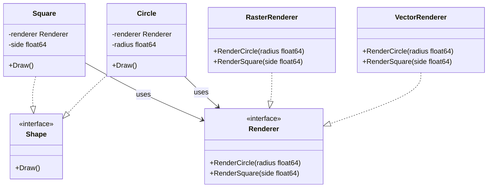

Imagine you have a remote control and a TV. The remote control has buttons like "Power", "Volume Up", and "Channel Down". The television, on the other hand, is the physical device that actually powers on, speakers that generate sound, and a screen that displays channels. 

The remote control acts as an **abstraction** (the interface you interact with), while the television represents the **implementation** (the actual system doing the work). 

If you decide to buy a new TV (say, switching from a Sony TV to an LG TV), you don't need a completely different type of remote control. As long as both TVs follow the same electronic signaling protocol, the remote control works with either. The remote control (abstraction) and the television (implementation) are separated. They can vary independently.

In software design, this is called the **Bridge Pattern**. It is a structural design pattern that lets you split a large class or a set of closely related classes into two separate hierarchies — abstraction and implementation — which can be developed independently of each other.

---

## Conceptual Diagram

Instead of creating a giant matrix of classes (e.g., `RedCircle`, `BlueCircle`, `RedSquare`, `BlueSquare`), the Bridge pattern splits the design into two hierarchies:
1. **Abstraction**: Contains high-level control logic and delegates work to the implementation object.
2. **Implementation**: Defines the interface for all concrete platform-specific operations.



---

## Use Case & Scenario

Suppose you are building a cross-platform graphics library. You have shapes like circles and squares, and you need to render them in different formats, such as **Vector graphics** (SVG) or **Raster graphics** (PNG/Pixels).

If you use inheritance, your class hierarchy grows exponentially:
- `VectorCircle`
- `RasterCircle`
- `VectorSquare`
- `RasterSquare`

If you add a new shape (e.g., `Triangle`) or a new renderer (e.g., `3DRenderer`), you must create many new classes. This is known as a **class explosion**. 

The Bridge pattern solves this by creating a "bridge" between the shapes (abstraction) and the rendering engines (implementation).

---

## Golang Implementation

Here is a complete, idiomatic Go implementation of the Bridge pattern.

```go
package main

import (
	"fmt"
)

// ==========================================
// 1. The Implementation Interface
// ==========================================

// Renderer defines the interface for rendering shapes on a specific platform.
type Renderer interface {
	RenderCircle(radius float64)
	RenderSquare(side float64)
}

// ==========================================
// 2. Concrete Implementations
// ==========================================

// VectorRenderer renders shapes using vector drawing instructions.
type VectorRenderer struct{}

func (v *VectorRenderer) RenderCircle(radius float64) {
	fmt.Printf("Drawing a circle with radius %.2f as Vector graphics.\n", radius)
}

func (v *VectorRenderer) RenderSquare(side float64) {
	fmt.Printf("Drawing a square with side %.2f as Vector graphics.\n", side)
}

// RasterRenderer renders shapes as a grid of pixels.
type RasterRenderer struct{}

func (r *RasterRenderer) RenderCircle(radius float64) {
	fmt.Printf("Drawing a circle with radius %.2f as Raster pixels.\n", radius)
}

func (r *RasterRenderer) RenderSquare(side float64) {
	fmt.Printf("Drawing a square with side %.2f as Raster pixels.\n", side)
}

// ==========================================
// 3. The Abstraction Interface
// ==========================================

// Shape defines the high-level interface for shapes.
type Shape interface {
	Draw()
}

// ==========================================
// 4. Refined Abstractions
// ==========================================

// Circle is a refined abstraction representing a circular shape.
type Circle struct {
	radius   float64
	renderer Renderer // This is the Bridge link
}

func NewCircle(radius float64, renderer Renderer) *Circle {
	return &Circle{
		radius:   radius,
		renderer: renderer,
	}
}

func (c *Circle) Draw() {
	// Delegate the draw call to the implementation interface
	c.renderer.RenderCircle(c.radius)
}

// Square is another refined abstraction representing a square shape.
type Square struct {
	side     float64
	renderer Renderer // This is the Bridge link
}

func NewSquare(side float64, renderer Renderer) *Square {
	return &Square{
		side:     side,
		renderer: renderer,
	}
}

func (s *Square) Draw() {
	// Delegate the draw call to the implementation interface
	s.renderer.RenderSquare(s.side)
}

// ==========================================
// 5. Client Execution
// ==========================================

func main() {
	// Initialize the platform renderers
	vectorEngine := &VectorRenderer{}
	rasterEngine := &RasterRenderer{}

	// Draw Vector shapes
	fmt.Println("--- Vector Graphic Pipeline ---")
	circleInVector := NewCircle(5.0, vectorEngine)
	squareInVector := NewSquare(10.0, vectorEngine)
	circleInVector.Draw()
	squareInVector.Draw()

	fmt.Println("\n--- Raster Pixel Pipeline ---")
	// Draw Raster shapes
	circleInRaster := NewCircle(5.0, rasterEngine)
	squareInRaster := NewSquare(10.0, rasterEngine)
	circleInRaster.Draw()
	squareInRaster.Draw()
}
```

---

## Summary

### Advantages
- **Decoupling**: Separates abstraction and implementation hierarchies, making it easier to change or replace one without modifying the other.
- **Cross-Platform Development**: Allows you to write platform-independent code that easily adapts to multiple platforms (e.g., Windows/macOS, Vector/Raster).
- **Open/Closed Principle**: You can introduce new abstractions and implementations independently from each other.
- **Single Responsibility Principle**: High-level shape logic is decoupled from platform-specific rendering details.

### Disadvantages
- **Complexity**: The pattern introduces additional levels of indirection, which can make the code harder to trace or understand for beginners.
- **Upfront Planning**: Requires identifying separate hierarchies early in the design stage, which might be overkill for simple applications.

### When to Use
- When you want to divide a monolithic class that has multiple variants of some functionality (for example, if the class can work with various database servers).
- When you need to extend a class in several independent dimensions (e.g., Shape type and OS platform).
- When you need to share an implementation among multiple abstraction objects (like a pool of database connections shared across several handlers).
