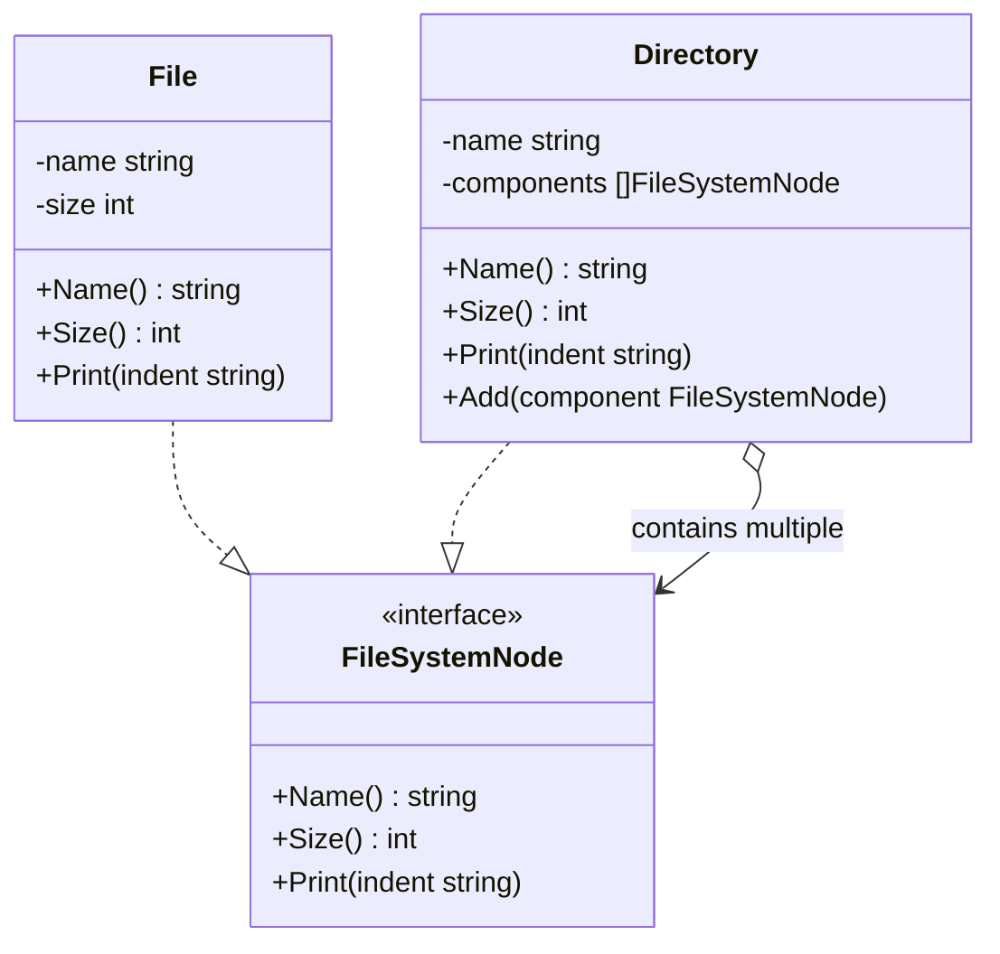

Bayangkan kamu sedang melihat file explorer di komputermu. Kamu memiliki folder bernama `Documents`. Di dalam folder ini, terdapat beberapa file individu seperti `resume.pdf` dan `photo.png`. Kamu juga memiliki folder lain bernama `Projects`, yang berisi file kode bernama `main.go`.

Ketika kamu ingin mengetahui ukuran satu file, kamu cukup memeriksa metadata file tersebut. Namun, jika kamu ingin mengetahui ukuran sebuah folder, kamu mengharapkan komputer secara otomatis memindai folder tersebut, menemukan semua file dan subfolder di dalamnya, menghitung ukurannya, dan menjumlahkannya secara rekursif.

Satu hal yang penting: dari sudut pandang pengguna, baik file maupun folder adalah **node sistem berkas**. Kamu dapat menyalin, menghapus, atau melihat properti dari keduanya. **Composite Pattern** memungkinkan kita memperlakukan objek individual (File) dan komposisi dari objek-objek tersebut (Folder) dengan cara yang seragam.

---

## Diagram Konseptual

Composite pattern mengatur objek ke dalam struktur pohon (tree) untuk merepresentasikan hierarki part-whole (bagian-keseluruhan).



Pada struktur di atas:
- **Component (`FileSystemNode`)**: Interface yang mendefinisikan operasi umum baik untuk elemen sederhana maupun elemen kompleks dalam pohon.
- **Leaf (`File`)**: Elemen dasar dari pohon yang tidak memiliki anak. Elemen ini mengimplementasikan interface component secara langsung.
- **Composite (`Directory`)**: Elemen kompleks yang memiliki anak (bisa berupa Leaf atau Composite lainnya). Elemen ini mengimplementasikan method component dengan mendelegasikan tugas ke anak-anaknya.

---

## Skenario Kasus Penggunaan

Jika kamu sedang membangun modul sistem berkas atau mesin pembuat XML/HTML, kamu akan sering berurusan dengan komponen terstruktur pohon.

Tanpa Composite pattern, kamu harus menulis pengecekan kondisi (if-else) di mana-mana:
```go
if node.IsDirectory() {
    // Lakukan perulangan di dalam folder dan jumlahkan ukurannya
} else {
    // Cukup kembalikan ukuran file
}
```

Hal ini menyebabkan kode menjadi berantakan dan melanggar **Open/Closed Principle**, karena menambahkan tipe node baru (seperti Symlink atau Shortcut) akan memaksamu mengubah semua fungsi penelusuran. Composite pattern mengeliminasi pengecekan ini dengan menyediakan interface yang seragam.

---

## Implementasi Golang

Berikut adalah implementasi lengkap dan siap jalan dari Composite pattern dalam bahasa Go yang menyimulasikan sistem berkas.

```go
package main

import (
	"fmt"
)

// ==========================================
// 1. Interface Component
// ==========================================

// FileSystemNode mendefinisikan perilaku yang harus dimiliki oleh File maupun Directory.
type FileSystemNode interface {
	Name() string
	Size() int
	Print(indent string)
}

// ==========================================
// 2. Leaf Component (File)
// ==========================================

// File merepresentasikan node daun (leaf) di dalam hierarki. Objek ini tidak memiliki anak.
type File struct {
	name string
	size int
}

func NewFile(name string, size int) *File {
	return &File{name: name, size: size}
}

func (f *File) Name() string {
	return f.name
}

func (f *File) Size() int {
	return f.size
}

func (f *File) Print(indent string) {
	fmt.Printf("%s📄 %s (%d bytes)\n", indent, f.name, f.size)
}

// ==========================================
// 3. Composite Component (Directory)
// ==========================================

// Directory merepresentasikan node komposit yang dapat menampung file atau directory lainnya.
type Directory struct {
	name       string
	components []FileSystemNode
}

func NewDirectory(name string) *Directory {
	return &Directory{
		name:       name,
		components: make([]FileSystemNode, 0),
	}
}

func (d *Directory) Name() string {
	return d.name
}

// Add memasukkan file atau folder baru ke dalam direktori ini.
func (d *Directory) Add(node FileSystemNode) {
	d.components = append(d.components, node)
}

// Size menghitung total ukuran direktori secara rekursif dengan menjumlahkan ukuran seluruh anak.
func (d *Directory) Size() int {
	total := 0
	for _, node := range d.components {
		total += node.Size() // Panggilan rekursif
	}
	return total
}

func (d *Directory) Print(indent string) {
	fmt.Printf("%s📁 %s/\n", indent, d.name)
	for _, node := range d.components {
		node.Print(indent + "  ") // Cetak rekursif
	}
}

// ==========================================
// 4. Eksekusi Client
// ==========================================

func main() {
	// Membuat file individual (Leaves)
	file1 := NewFile("resume.pdf", 1200)
	file2 := NewFile("cover_letter.docx", 800)
	file3 := NewFile("avatar.png", 5000)
	file4 := NewFile("main.go", 1500)

	// Membuat direktori utama (Root)
	rootDir := NewDirectory("Home")

	// Membuat sub-direktori (Composites)
	docsDir := NewDirectory("Documents")
	picsDir := NewDirectory("Pictures")
	codeDir := NewDirectory("SourceCode")

	// Menyusun struktur pohon
	docsDir.Add(file1)
	docsDir.Add(file2)

	picsDir.Add(file3)

	codeDir.Add(file4)

	// Menambahkan sub-folder ke direktori root
	rootDir.Add(docsDir)
	rootDir.Add(picsDir)
	rootDir.Add(codeDir)

	// Menambahkan file langsung di root directory
	readme := NewFile("README.md", 250)
	rootDir.Add(readme)

	// Menampilkan struktur direktori dan ukurannya secara seragam
	fmt.Println("--- Struktur Pohon File System ---")
	rootDir.Print("")

	fmt.Println("\n--- Kalkulasi API yang Seragam ---")
	fmt.Printf("Ukuran file tunggal '%s': %d bytes\n", file1.Name(), file1.Size())
	fmt.Printf("Total Ukuran subfolder '%s': %d bytes\n", docsDir.Name(), docsDir.Size())
	fmt.Printf("Total Ukuran seluruh direktori '%s': %d bytes\n", rootDir.Name(), rootDir.Size())
}
```

---

## Ringkasan

### Keuntungan
- **Polimorfisme**: Client dapat memperlakukan objek tunggal dan komposit secara seragam. Tidak perlu menulis percabangan kode untuk mencari tahu tipe objek.
- **Kemudahan Ekstensi**: Kamu bisa menambahkan tipe komponen baru ke dalam pohon tanpa mengubah kode client (Open/Closed Principle).
- **Menyederhanakan Kode Client**: Client tidak perlu memusingkan bagaimana proses rekursi di dalam struktur komposit berjalan.

### Kerugian
- **Generalisasi yang Berlebihan**: Membuat interface yang terlalu umum terkadang memaksamu mendeklarasikan method kosong atau tidak didukung pada leaf node (misalnya jika kita menaruh method `Add` langsung di interface `FileSystemNode`, maka struct `File` terpaksa harus mengembalikan error atau panic).
- **Type Safety**: Menjadi lebih sulit untuk membatasi jenis objek yang bisa dimasukkan ke dalam komposit jika interfacenya dibuat terlalu luas.

### Kapan Harus Digunakan
- Ketika ingin merepresentasikan hierarki objek berbentuk pohon (seperti direktori file, struktur organisasi, atau pohon komponen UI).
- Ketika ingin kode client memperlakukan elemen sederhana (leaf) dan elemen kompleks (composite) secara sama tanpa membedakannya.
