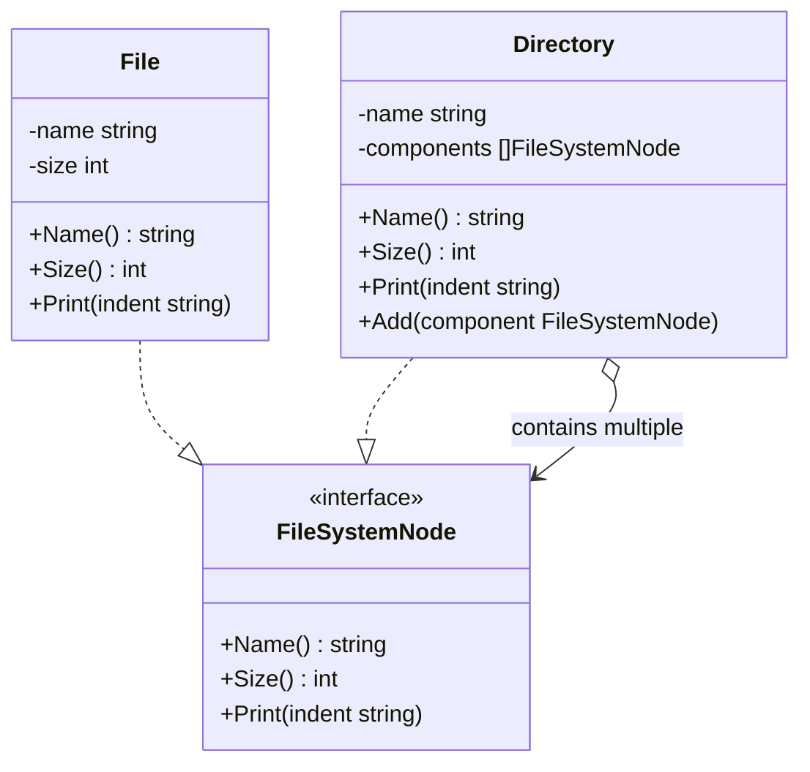

Imagine you are looking at your computer's file explorer. You have a folder named `Documents`. Inside this folder, you have a few individual files like `resume.pdf` and `photo.png`. You also have another folder named `Projects`, which contains a code file named `main.go`. 

When you want to know the size of a single file, you simply check its metadata. When you want to know the size of a folder, you expect the computer to scan the folder, find all files and subfolders inside it, calculate their sizes, and sum them up recursively. 

Crucially, from the user's perspective, both files and folders are **file system nodes**. You can copy them, delete them, or view their properties. The **Composite Pattern** allows you to treat individual objects (Files) and compositions of objects (Folders) uniformly.

---

## Conceptual Diagram

The Composite pattern organizes objects into a tree structure to represent part-whole hierarchies. 



In this structure:
- **Component (`FileSystemNode`)**: The interface common to both simple and complex elements of the tree.
- **Leaf (`File`)**: A basic element that has no children. It implements the component interface directly.
- **Composite (`Directory`)**: A complex element containing child components (both Leaves and other Composites). It implements component methods by delegating the work to its children.

---

## Use Case & Scenario

If you are developing a file system utility or an XML/HTML rendering engine, you frequently deal with tree-structured components. 

Without the Composite pattern, you would have to write conditional checks everywhere:
```go
if node.IsDirectory() {
    // Loop through directory files and sum up size
} else {
    // Just return file size
}
```

This leads to messy code that violates the **Open/Closed Principle**, because introducing a new node type (like a Symlink or a Shortcut) would require changing all the traversal and processing algorithms. The Composite pattern eliminates these checks by defining a unified interface.

---

## Golang Implementation

Below is a complete and compilable implementation of the Composite pattern in Go, simulating a file system.

```go
package main

import (
	"fmt"
)

// ==========================================
// 1. The Component Interface
// ==========================================

// FileSystemNode defines behaviors that both Files and Directories must share.
type FileSystemNode interface {
	Name() string
	Size() int
	Print(indent string)
}

// ==========================================
// 2. The Leaf Component (File)
// ==========================================

// File represents a leaf node in the hierarchy. It cannot contain other nodes.
type File struct {
	name string
	size int
}

func NewFile(name string, size int) *File {
	return &File{name: name, size: size}
}

func (f *File) Name() string {
	return f.name
}

func (f *File) Size() int {
	return f.size
}

func (f *File) Print(indent string) {
	fmt.Printf("%s📄 %s (%d bytes)\n", indent, f.name, f.size)
}

// ==========================================
// 3. The Composite Component (Directory)
// ==========================================

// Directory represents a composite node that can contain files or other directories.
type Directory struct {
	name       string
	components []FileSystemNode
}

func NewDirectory(name string) *Directory {
	return &Directory{
		name:       name,
		components: make([]FileSystemNode, 0),
	}
}

func (d *Directory) Name() string {
	return d.name
}

// Add appends a new file or directory into this directory.
func (d *Directory) Add(node FileSystemNode) {
	d.components = append(d.components, node)
}

// Size calculates the total size recursively by summing the size of all children.
func (d *Directory) Size() int {
	total := 0
	for _, node := range d.components {
		total += node.Size() // Recursive call
	}
	return total
}

func (d *Directory) Print(indent string) {
	fmt.Printf("%s📁 %s/\n", indent, d.name)
	for _, node := range d.components {
		node.Print(indent + "  ") // Recursive print
	}
}

// ==========================================
// 4. Client Execution
// ==========================================

func main() {
	// Create individual files (Leaves)
	file1 := NewFile("resume.pdf", 1200)
	file2 := NewFile("cover_letter.docx", 800)
	file3 := NewFile("avatar.png", 5000)
	file4 := NewFile("main.go", 1500)

	// Create root directory
	rootDir := NewDirectory("Home")

	// Create subdirectories (Composites)
	docsDir := NewDirectory("Documents")
	picsDir := NewDirectory("Pictures")
	codeDir := NewDirectory("SourceCode")

	// Assemble the tree structure
	docsDir.Add(file1)
	docsDir.Add(file2)

	picsDir.Add(file3)

	codeDir.Add(file4)

	// Add subfolders to root
	rootDir.Add(docsDir)
	rootDir.Add(picsDir)
	rootDir.Add(codeDir)

	// Add a loose file to root directory
	readme := NewFile("README.md", 250)
	rootDir.Add(readme)

	// Print directory structure and total size uniformly
	fmt.Println("--- File System Tree Structure ---")
	rootDir.Print("")

	fmt.Println("\n--- Uniform API Calculations ---")
	fmt.Printf("Size of single file '%s': %d bytes\n", file1.Name(), file1.Size())
	fmt.Printf("Total Size of subfolder '%s': %d bytes\n", docsDir.Name(), docsDir.Size())
	fmt.Printf("Total Size of entire '%s' directory: %d bytes\n", rootDir.Name(), rootDir.Size())
}
```

---

## Summary

### Advantages
- **Polymorphism**: Clients can treat leaf nodes and composites uniformly. You don't need to write conditional statements to determine the type of an object.
- **Ease of Extension**: You can add new components to the tree without altering client code or existing classes (Open/Closed Principle).
- **Simplifies Client Code**: The client doesn't need to worry about the internal recursive nature of the composite structures.

### Disadvantages
- **Over-Generalization**: Defining a common interface might force you to declare empty or unsupported operations on leaf elements (for example, if you wanted an `Add` method on the `FileSystemNode` interface, a `File` would have to return an error or panic).
- **Type Safety**: It can be harder to restrict the type of elements that can be added to a composite if the interface is too general.

### When to Use
- When you need to represent a tree-like hierarchy of objects (e.g., file systems, organization structures, UI component trees).
- When you want the client code to treat both simple elements (leaves) and complex components (composites) in the exact same way.
