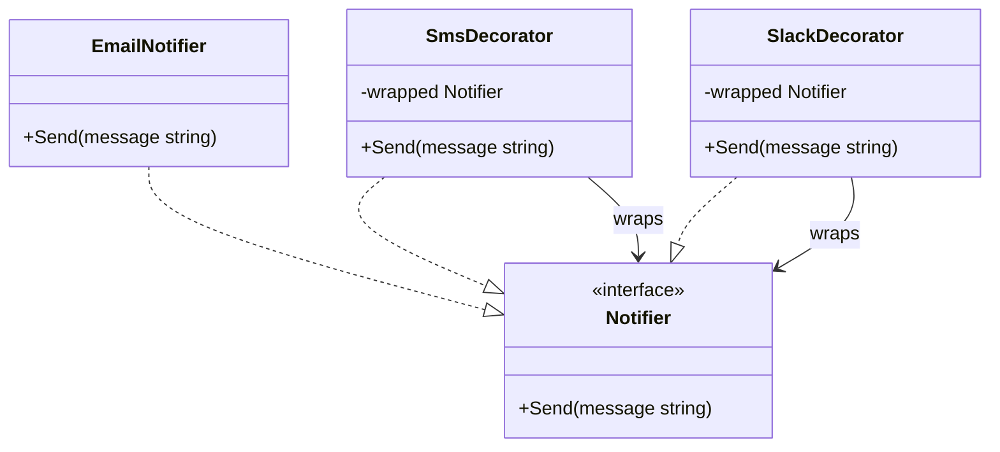

Bayangkan kamu sedang memesan secangkir kopi di kafe lokal. Kamu memulai dengan memesan **Kopi Hitam** polos. Kemudian, kamu ingin menyesuaikannya dengan seleramu: kamu menambahkan **Susu** agar lebih creamy, lalu menambahkan **Sirup Caramel** untuk rasa manis ekstra.

Setiap bahan tambahan tersebut tidak mengubah kopi hitam dasar yang kamu pesan; melainkan membungkusnya, menambahkan rasa (perilaku baru), dan menaikkan harga totalnya. Kamu bebas menambahkan topping atau pemanis sebanyak yang kamu suka, menumpuknya satu per satu di atas kopi dasarmu.

Dalam desain perangkat lunak, konsep ini disebut **Decorator Pattern**. Ini adalah design pattern struktural yang memungkinkan kita menambahkan perilaku atau tanggung jawab baru ke dalam suatu objek secara dinamis dengan memasukkan objek tersebut ke dalam objek pembungkus (wrapper) khusus.

---

## Diagram Konseptual

Decorator pattern menggunakan metode komposisi alih-alih pewarisan (inheritance) untuk memperluas fungsionalitas. Di dalam bahasa Go, hal ini dicapai dengan menanamkan interface ke dalam struct.



Pada diagram di atas:
- **Component (`Notifier`)**: Interface umum bagi objek-objek yang ingin ditambahkan tanggung jawabnya secara dinamis.
- **Concrete Component (`EmailNotifier`)**: Objek dasar yang akan dibungkus dan ditambahkan perilakunya.
- **Decorator (`SmsDecorator`, `SlackDecorator`)**: Struct yang menyimpan referensi ke objek Component dan memiliki method yang sesuai dengan interface Component tersebut.

---

## Skenario Kasus Penggunaan

Misalkan kamu sedang membangun modul notifikasi sistem. Pada awalnya, sistem hanya mengirimkan notifikasi melalui **Email**.

Di kemudian hari, pengguna meminta agar notifikasi juga bisa dikirimkan lewat **SMS** dan **Slack**. Bahkan, pengguna mungkin ingin menerima Email saja, Email + SMS, atau bahkan ketiganya sekaligus.

Jika mencoba mengimplementasikan ini menggunakan pewarisan kelas biasa, kamu akan menghadapi ledakan kombinasi kelas (combination explosion):
- `EmailAndSmsNotifier`
- `EmailAndSlackNotifier`
- `SmsAndSlackNotifier`
- `EmailSmsAndSlackNotifier`

Dengan Decorator pattern, kamu bisa menggabungkan saluran notifikasi ini secara dinamis saat runtime sesuai dengan preferensi pengguna, tanpa perlu membuat class kombinasi baru.

---

## Implementasi Golang

Berikut adalah implementasi lengkap dan idiomatik dari Decorator pattern dalam bahasa Go.

```go
package main

import (
	"fmt"
)

// ==========================================
// 1. Interface Component
// ==========================================

// Notifier mendefinisikan interface bersama untuk mengirimkan pesan peringatan.
type Notifier interface {
	Send(message string)
}

// ==========================================
// 2. Concrete Component
// ==========================================

// EmailNotifier adalah implementasi notifikasi dasar kita.
type EmailNotifier struct{}

func (e *EmailNotifier) Send(message string) {
	fmt.Printf("[Email] Mengirim pesan: %s\n", message)
}

// ==========================================
// 3. Concrete Decorators
// ==========================================

// SmsDecorator membungkus Notifier dan menambahkan kemampuan pengiriman SMS.
type SmsDecorator struct {
	wrapped Notifier
}

func NewSmsDecorator(n Notifier) *SmsDecorator {
	return &SmsDecorator{wrapped: n}
}

func (s *SmsDecorator) Send(message string) {
	// Pertama, jalankan method Send dari objek yang dibungkus
	s.wrapped.Send(message)
	// Kedua, jalankan perilaku spesifik SMS
	fmt.Printf("[SMS] Mengirim SMS: %s\n", message)
}

// SlackDecorator membungkus Notifier dan menambahkan pengiriman ke saluran Slack.
type SlackDecorator struct {
	wrapped Notifier
}

func NewSlackDecorator(n Notifier) *SlackDecorator {
	return &SlackDecorator{wrapped: n}
}

func (sd *SlackDecorator) Send(message string) {
	// Pertama, jalankan method Send dari objek yang dibungkus
	sd.wrapped.Send(message)
	// Kedua, jalankan perilaku spesifik Slack
	fmt.Printf("[Slack] Mengirim alert ke channel: %s\n", message)
}

// ==========================================
// 4. Eksekusi Client
// ==========================================

func main() {
	// Skenario 1: Pengguna hanya ingin menerima notifikasi via Email
	fmt.Println("--- Pengguna 1: Hanya Email ---")
	hanyaEmail := &EmailNotifier{}
	hanyaEmail.Send("Pesanan Anda telah dikirim.")

	// Skenario 2: Pengguna ingin menerima notifikasi Email + SMS
	fmt.Println("\n--- Pengguna 2: Email + SMS ---")
	emailDanSms := NewSmsDecorator(&EmailNotifier{})
	emailAndSms := emailDanSms
	emailAndSms.Send("Batas memori server hampir penuh.")

	// Skenario 3: Pengguna ingin menerima Email + SMS + Slack
	fmt.Println("\n--- Pengguna 3: Semua Saluran (Email + SMS + Slack) ---")
	// Perhatikan bagaimana kita menumpuk decorator satu sama lain
	semuaSaluran := NewSlackDecorator(NewSmsDecorator(&EmailNotifier{}))
	semuaSaluran.Send("Backup database berhasil diselesaikan.")
}
```

---

## Ringkasan

### Keuntungan
- **Fleksibilitas**: Kamu bisa menggabungkan beberapa perilaku secara dinamis dengan membungkus objek dengan banyak decorator sekaligus.
- **Single Responsibility Principle**: Kelas yang monolitik dengan banyak variasi perilaku dapat dipecah menjadi beberapa kelas decorator kecil yang fokus pada satu tugas.
- **Modifikasi saat Runtime**: Penambahan atau pengurangan tanggung jawab objek dapat dilakukan saat aplikasi berjalan, hal yang tidak bisa dilakukan oleh pewarisan statis kelas.

### Kerugian
- **Ketergantungan Urutan**: Urutan penumpukan decorator sering kali memengaruhi hasil akhir (misal: memadukan decorator enkripsi dan decorator kompresi data dalam urutan yang salah akan merusak output).
- **Sulit Di-debug**: Menemukan bug bisa menjadi tantangan karena jalannya kode berpindah-pindah di dalam objek wrapper bersarang yang berlapis-lapis.
- **Boilerplate**: Kita perlu menulis method pendelegasian yang berulang untuk meneruskan panggilan dari decorator ke objek dasar yang dibungkusnya.

### Kapan Harus Digunakan
- Ketika ingin memberikan tanggung jawab tambahan pada objek saat runtime tanpa merusak kode client yang memanggil objek tersebut.
- Ketika perpanjangan perilaku dengan inheritance tidak memungkinkan (misalnya karena bahasa pemrograman seperti Go tidak mendukung inheritance).
- Ketika ingin menambahkan fungsionalitas pelengkap kecil (seperti logging, caching, atau enkripsi) tanpa mengotori logika bisnis utama kelas.
