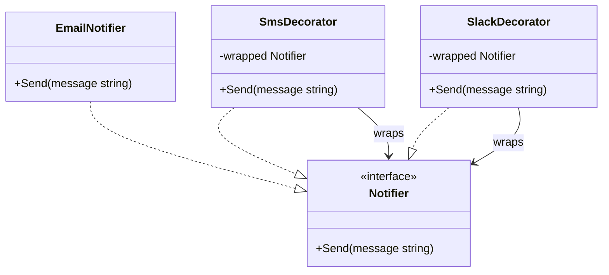

Imagine you want to buy a cup of coffee at a local cafe. You start with a plain **Black Coffee**. Then, you decide to customize it: you add **Milk** to make it creamier, and then you add **Syrup** for extra sweetness. 

Each addition doesn't change the underlying coffee itself; instead, it wraps it, adding new ingredients (behaviors) and updating the final price. You can add as many toppings or mixers as you like, layering them on top of one another.

In software design, the **Decorator Pattern** allows you to dynamically attach new responsibilities to objects. It is a structural design pattern that wraps a target object in special wrapper structures that contain the new behaviors.

---

## Conceptual Diagram

The Decorator pattern uses composition instead of inheritance to extend functionality. In Go, this is achieved by embedding interfaces inside structs.



In this diagram:
- **Component (`Notifier`)**: Defines the interface for objects that can have responsibilities added to them dynamically.
- **Concrete Component (`EmailNotifier`)**: The basic object to which additional behaviors can be attached.
- **Decorator (`SmsDecorator`, `SlackDecorator`)**: Structs that maintain a reference to a Component object and define an interface that conforms to the Component's interface.

---

## Use Case & Scenario

Suppose you are building a system notification library. Initially, your system only sends notifications via **Email**. 

Later, you want to allow users to receive alerts via **SMS** and **Slack** as well. A user might want to receive only Email notifications, or Email + SMS, or even all three at the same time.

If you try to implement this using inheritance or static structures, you end up with a combination explosion:
- `EmailAndSmsNotifier`
- `EmailAndSlackNotifier`
- `SmsAndSlackNotifier`
- `EmailSmsAndSlackNotifier`

Using the Decorator pattern, you can combine these notification channels dynamically at runtime depending on user preferences, without creating any combination classes.

---

## Golang Implementation

Here is a complete, idiomatic implementation of the Decorator pattern in Go.

```go
package main

import (
	"fmt"
)

// ==========================================
// 1. The Component Interface
// ==========================================

// Notifier defines the common interface for sending alert messages.
type Notifier interface {
	Send(message string)
}

// ==========================================
// 2. Concrete Component
// ==========================================

// EmailNotifier is our base notification implementation.
type EmailNotifier struct{}

func (e *EmailNotifier) Send(message string) {
	fmt.Printf("[Email] Sending message: %s\n", message)
}

// ==========================================
// 3. Concrete Decorators
// ==========================================

// SmsDecorator wraps a Notifier and adds SMS sending capability.
type SmsDecorator struct {
	wrapped Notifier
}

func NewSmsDecorator(n Notifier) *SmsDecorator {
	return &SmsDecorator{wrapped: n}
}

func (s *SmsDecorator) Send(message string) {
	// First, trigger the wrapped notifier's Send method
	s.wrapped.Send(message)
	// Then, execute the SMS specific behavior
	fmt.Printf("[SMS] Sending text message: %s\n", message)
}

// SlackDecorator wraps a Notifier and adds Slack message delivery.
type SlackDecorator struct {
	wrapped Notifier
}

func NewSlackDecorator(n Notifier) *SlackDecorator {
	return &SlackDecorator{wrapped: n}
}

func (sd *SlackDecorator) Send(message string) {
	// First, trigger the wrapped notifier's Send method
	sd.wrapped.Send(message)
	// Then, execute the Slack specific behavior
	fmt.Printf("[Slack] Sending channel alert: %s\n", message)
}

// ==========================================
// 4. Client Execution
// ==========================================

func main() {
	// Scenario 1: A user wants to receive only Email notifications
	fmt.Println("--- User 1: Email Only ---")
	emailOnly := &EmailNotifier{}
	emailOnly.Send("Your order has been shipped.")

	// Scenario 2: A user wants to receive Email + SMS alerts
	fmt.Println("\n--- User 2: Email + SMS ---")
	emailAndSms := NewSmsDecorator(&EmailNotifier{})
	emailAndSms.Send("Critical system resource limit reached.")

	// Scenario 3: A user wants to receive Email + SMS + Slack alerts
	fmt.Println("\n--- User 3: All Channels (Email + SMS + Slack) ---")
	// Notice how we stack the decorators together
	allChannels := NewSlackDecorator(NewSmsDecorator(&EmailNotifier{}))
	allChannels.Send("Database backup completed successfully.")
}
```

---

## Summary

### Advantages
- **Flexibility**: You can combine several behaviors dynamically by wrapping objects with multiple decorators.
- **Single Responsibility Principle**: You can divide a monolithic class that has many possible behaviors into several smaller, specialized classes.
- **Runtime Modification**: You can add or remove responsibilities from an object at runtime, which is impossible with standard compilation-time inheritance.

### Disadvantages
- **Order Dependency**: The order in which decorators are stacked can matter (e.g., if one decorator encrypts data and another compresses it, stacking them in the wrong order changes the behavior).
- **Hard to Debug**: Finding bugs can be challenging because the code is structured inside multiple nested wrapper objects, making trace logs longer.
- **Boilerplate**: In some languages, implementing decorators requires writing a lot of delegating methods that simply pass calls to the wrapped object.

### When to Use
- When you need to assign extra behaviors to objects at runtime without breaking the code that uses these objects.
- When it is awkward or impossible to extend an object's behavior using inheritance (e.g., Go doesn't support inheritance).
- When you want to add minor modifications to a behavior (like adding logging, caching, or data validation) without cluttering the primary business logic.
