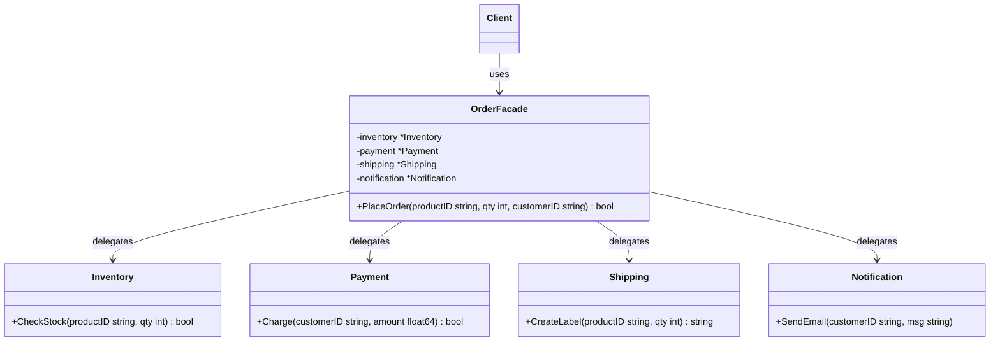

Bayangkan kamu ingin memesan makanan menggunakan aplikasi ojek online di ponselmu. Kamu membuka aplikasi, menekan tombol untuk memesan pizza, dan melakukan pembayaran. Dalam beberapa menit, makanan hangat pun tiba di depan pintumu.

Di balik layar, proses yang sangat besar dan rumit telah terjadi: aplikasi tersebut memvalidasi stok restoran, mengesahkan kartu kredit atau dompet digitalmu melalui gateway pembayaran, memberi tahu staf dapur untuk memasak, mencarikan driver terdekat, dan melacak lokasi GPS driver tersebut.

Sebagai pelanggan, kamu tidak perlu menelepon bagian dapur restoran, berbicara dengan prosesor pembayaran, atau berkoordinasi langsung dengan driver. Aplikasi memberikan satu interface yang sederhana dan terpadu untuk menyembunyikan semua kerumitan tersebut. Aplikasi tersebut bertindak sebagai **Facade**.

Dalam rekayasa perangkat lunak, **Facade Pattern** adalah design pattern struktural yang menyediakan interface yang disederhanakan untuk mengakses sistem kelas, library, atau framework yang kompleks.

---

## Diagram Konseptual

Facade pattern bertindak sebagai titik masuk (entry point) sederhana ke subsistem yang kompleks. Alih-alih membuat kode client berinteraksi dengan puluhan class, client hanya berkomunikasi dengan Facade.



Pada diagram di atas:
- **Facade (`OrderFacade`)**: Menyediakan akses mudah ke fitur-fitur tertentu dari subsistem. Facade tahu ke mana harus meneruskan permintaan client dan bagaimana menggerakkan bagian-bagian di dalamnya.
- **Additional Facades** (Opsional): Dapat dibuat jika dirasa satu kelas facade sudah mulai terlalu besar dan menangani fitur yang tidak berkaitan.
- **Subsystem Classes (`Inventory`, `Payment`, dll.)**: Komponen kompleks dari sistem. Mereka beroperasi secara mandiri dan tidak mengetahui keberadaan Facade.

---

## Skenario Kasus Penggunaan

Dalam arsitektur microservices atau monolit modern yang modular, tindakan bisnis sederhana (seperti checkout barang) sering kali memerlukan koordinasi panggilan ke beberapa layanan internal:
1. **Layanan Inventaris (Inventory)** untuk memesan stok barang.
2. **Layanan Pembayaran (Payment)** untuk mendebet saldo pengguna.
3. **Layanan Pengiriman (Shipping)** untuk mengatur kurir pengiriman barang.
4. **Layanan Notifikasi (Notification)** untuk mengirimkan email konfirmasi.

Jika kode client (seperti frontend web atau aplikasi mobile) harus memanggil keempat layanan ini satu per satu secara langsung, kode client akan sangat bergantung pada desain backend kita. Hal ini juga memicu banyak request jaringan (network round-trips) dan menjadi mimpi buruk dalam pemeliharaan. Sebuah Facade membungkus koordinasi ini menjadi satu endpoint API yang bersih di sisi backend.

---

## Implementasi Golang

Berikut adalah implementasi lengkap dan idiomatik dari Facade pattern dalam bahasa Go untuk menyimulasikan alur pemesanan e-commerce.

```go
package main

import (
	"fmt"
)

// ==========================================
// 1. Komponen-Komponen Subsistem
// ==========================================

// Inventory menangani validasi stok barang.
type Inventory struct{}

func (i *Inventory) CheckStock(productID string, qty int) bool {
	fmt.Printf("[Inventory] Memeriksa stok untuk produk '%s'... Tersedia!\n", productID)
	return true
}

// Payment menangani pemrosesan transaksi keuangan.
type Payment struct{}

func (p *Payment) Charge(customerID string, amount float64) bool {
	fmt.Printf("[Payment] Mendebet $%.2f dari pelanggan '%s'... Sukses!\n", amount, customerID)
	return true
}

// Shipping mengelola label pengiriman dan kurir.
type Shipping struct{}

func (s *Shipping) CreateLabel(productID string, qty int) string {
	trackingID := "TRK-987654321-XYZ"
	fmt.Printf("[Shipping] Label pengiriman dibuat. Nomor Resi: %s\n", trackingID)
	return trackingID
}

// Notification mengirimkan pesan ke pelanggan.
type Notification struct{}

func (n *Notification) SendEmail(customerID string, message string) {
	fmt.Printf("[Notification] Email dikirim ke '%s': %s\n", customerID, message)
}

// ==========================================
// 2. The Facade
// ==========================================

// OrderFacade membungkus subsistem yang kompleks di balik satu API sederhana.
type OrderFacade struct {
	inventory    *Inventory
	payment      *Payment
	shipping     *Shipping
	notification *Notification
}

func NewOrderFacade() *OrderFacade {
	return &OrderFacade{
		inventory:    &Inventory{},
		payment:      &Payment{},
		shipping:     &Shipping{},
		notification: &Notification{},
	}
}

// PlaceOrder mengoordinasikan interaksi antar subsistem di belakang layar.
func (f *OrderFacade) PlaceOrder(productID string, qty int, customerID string, cost float64) bool {
	fmt.Println("--- Proses dimulai oleh Facade ---")

	// Langkah 1: Periksa stok barang
	if !f.inventory.CheckStock(productID, qty) {
		fmt.Println("Pemesanan gagal: Stok habis.")
		return false
	}

	// Langkah 2: Proses Pembayaran
	if !f.payment.Charge(customerID, cost) {
		fmt.Println("Pemesanan gagal: Pembayaran ditolak.")
		return false
	}

	// Langkah 3: Atur Pengiriman Barang
	trackingID := f.shipping.CreateLabel(productID, qty)

	// Langkah 4: Kirim Notifikasi Konfirmasi
	pesanKonfirmasi := fmt.Sprintf("Pesanan Anda untuk %d unit '%s' telah diproses. Lacak di: %s", qty, productID, trackingID)
	f.notification.SendEmail(customerID, pesanKonfirmasi)

	fmt.Println("--- Proses selesai dengan sukses oleh Facade ---")
	return true
}

// ==========================================
// 3. Eksekusi Client
// ==========================================

func main() {
	// Client hanya berinteraksi dengan Facade.
	// Client tidak perlu tahu detail cara kerja Inventory, Payment, Shipping, atau Notification.
	sistemPemesanan := NewOrderFacade()

	sukses := sistemPemesanan.PlaceOrder("MacBookPro-M3", 1, "user_902", 1999.99)
	if sukses {
		fmt.Println("Hasil: Checkout Berhasil!")
	} else {
		fmt.Println("Hasil: Checkout Gagal.")
	}
}
```

---

## Ringkasan

### Keuntungan
- **Decoupling**: Mengisolasi kode client dari detail teknis komponen subsistem yang kompleks.
- **Kemudahan Penggunaan**: Menyediakan gerbang masuk yang sederhana ke subsistem, membuat kode lebih mudah dibaca dan dipelihara.
- **Mengurangi Ketergantungan**: Mengurangi jumlah import dan dependensi pada kode client, menjaga binary client tetap ramping.

### Kerugian
- **Resiko God Object**: Facade dapat dengan mudah tumbuh menjadi "God Object" (kelas yang mengetahui dan melakukan terlalu banyak hal) jika kamu mencoba mengarahkan setiap fitur subsistem melaluinya.
- **Bypass Subsistem**: Pola ini tidak mencegah client melewati Facade untuk mengakses class subsistem secara langsung, yang dapat menyebabkan penyimpangan arsitektur jika tidak dijaga dengan aturan visibilitas package Go.

### Kapan Harus Digunakan
- Ketika ingin menyediakan interface sederhana atau interface default untuk subsistem yang rumit.
- Ketika ingin menyusun subsistem ke dalam beberapa lapisan (layer). Kamu dapat menggunakan facade sebagai gerbang masuk untuk setiap tingkatan lapisan.
- Ketika ingin meminimalkan ketergantungan (coupling) antara client dan subsistem.
