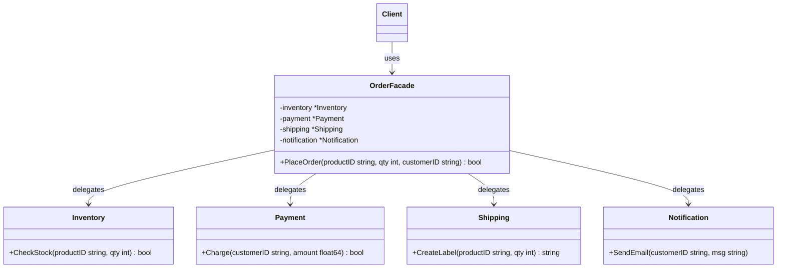

Imagine you want to order food using a delivery app on your phone. You open the app, tap a button to order a pizza, and make the payment. Within minutes, the food arrives at your door.

Behind the scenes, a massive and highly complex operation took place: the app validated the restaurant's inventory, authorized your credit card through a payment gateway, notified the kitchen staff to cook, dispatched a nearby delivery driver, and tracked the GPS location of the driver. 

As a customer, you didn't have to call the kitchen, talk to the payment processor, or coordinate with the driver yourself. The app presented you with a simple, unified interface that hid all the complexity. The app is a **Facade**.

In software engineering, the **Facade Pattern** is a structural design pattern that provides a simplified interface to a complex system of classes, library, or framework.

---

## Conceptual Diagram

The Facade pattern acts as a simplified entry point to a complex subsystem. Instead of making client code interact with dozens of classes, the client communicates only with the Facade.



In this diagram:
- **Facade (`OrderFacade`)**: Provides convenient access to a particular part of the subsystem's features. It knows where to direct the client's request and how to operate all the moving parts.
- **Additional Facades** (Optional): Can be created to prevent spoiling a single facade with unrelated features.
- **Subsystem Classes (`Inventory`, `Payment`, etc.)**: Complex components of the system. They operate independently and do not know about the Facade's existence.

---

## Use Case & Scenario

In modern microservices or modular monolith architectures, a simple business action (like checkout) often requires orchestrating calls to multiple internal services:
1. **Inventory service** to reserve the stock.
2. **Account balance or Payment service** to charge the user.
3. **Logistics or Shipping service** to arrange the parcel delivery.
4. **Notification service** to send a confirmation email.

If the client code (for example, a web frontend or mobile app) had to call all four of these services individually, the client code would be tightly coupled to our backend design, requiring multiple round-trips over the network and creating a maintenance nightmare. A Facade wraps this coordination into a single, clean API endpoint on the backend.

---

## Golang Implementation

Below is a complete, idiomatic Go implementation of the Facade pattern simulating an e-commerce order process.

```go
package main

import (
	"fmt"
)

// ==========================================
// 1. Subsystem Components
// ==========================================

// Inventory handles stock validation.
type Inventory struct{}

func (i *Inventory) CheckStock(productID string, qty int) bool {
	fmt.Printf("[Inventory] Checking stock for product '%s'... Available!\n", productID)
	return true
}

// Payment handles charge authorizations.
type Payment struct{}

func (p *Payment) Charge(customerID string, amount float64) bool {
	fmt.Printf("[Payment] Charging $%.2f to customer '%s'... Success!\n", amount, customerID)
	return true
}

// Shipping manages shipping labels and courier dispatch.
type Shipping struct{}

func (s *Shipping) CreateLabel(productID string, qty int) string {
	trackingID := "TRK-987654321-XYZ"
	fmt.Printf("[Shipping] Shipping label created. Tracking ID: %s\n", trackingID)
	return trackingID
}

// Notification handles customer messaging.
type Notification struct{}

func (n *Notification) SendEmail(customerID string, message string) {
	fmt.Printf("[Notification] Email sent to customer '%s': %s\n", customerID, message)
}

// ==========================================
// 2. The Facade
// ==========================================

// OrderFacade wraps the complex subsystems behind a single simplified API.
type OrderFacade struct {
	inventory    *Inventory
	payment      *Payment
	shipping     *Shipping
	notification *Notification
}

func NewOrderFacade() *OrderFacade {
	return &OrderFacade{
		inventory:    &Inventory{},
		payment:      &Payment{},
		shipping:     &Shipping{},
		notification: &Notification{},
	}
}

// PlaceOrder orchestrates all subsystem interactions.
func (f *OrderFacade) PlaceOrder(productID string, qty int, customerID string, cost float64) bool {
	fmt.Println("--- Process started by Facade ---")

	// Step 1: Check inventory
	if !f.inventory.CheckStock(productID, qty) {
		fmt.Println("Order failed: Out of stock.")
		return false
	}

	// Step 2: Authorize Payment
	if !f.payment.Charge(customerID, cost) {
		fmt.Println("Order failed: Payment rejected.")
		return false
	}

	// Step 3: Arrange Shipping
	trackingID := f.shipping.CreateLabel(productID, qty)

	// Step 4: Send Notification
	confirmMsg := fmt.Sprintf("Your order for %d unit(s) of '%s' has been processed. Track here: %s", qty, productID, trackingID)
	f.notification.SendEmail(customerID, confirmMsg)

	fmt.Println("--- Process successfully completed by Facade ---")
	return true
}

// ==========================================
// 3. Client Execution
// ==========================================

func main() {
	// The client only interacts with the Facade.
	// It doesn't need to know about Inventory, Payment, Shipping, or Notification internals.
	orderSystem := NewOrderFacade()

	success := orderSystem.PlaceOrder("MacBookPro-M3", 1, "user_902", 1999.99)
	if success {
		fmt.Println("Result: Checkout successful!")
	} else {
		fmt.Println("Result: Checkout failed.")
	}
}
```

---

## Summary

### Advantages
- **Decoupling**: You isolate your client code from the complex details of the subsystem components.
- **Ease of Use**: Provides a simplified entry point to a subsystem, making code easier to read and maintain.
- **Reduced Dependencies**: Reduces the number of imports and dependencies in client code, keeping client binaries smaller and dependencies clean.

### Disadvantages
- **Risk of God Object**: A facade can easily become a "God Object" (a class that knows and does too much) if you try to route every single subsystem feature through it.
- **Subsystem Bypassing**: The pattern does not prevent clients from bypassing the facade to access subsystem classes directly, which can lead to architectural drift if not guarded by package visibility rules.

### When to Use
- When you need to provide a simple or default interface to a complex subsystem.
- When you want to structure a subsystem into layers. You can use facades to define entry points for each level of subsystem layers.
- When you want to minimize coupling between clients and the subsystems.
