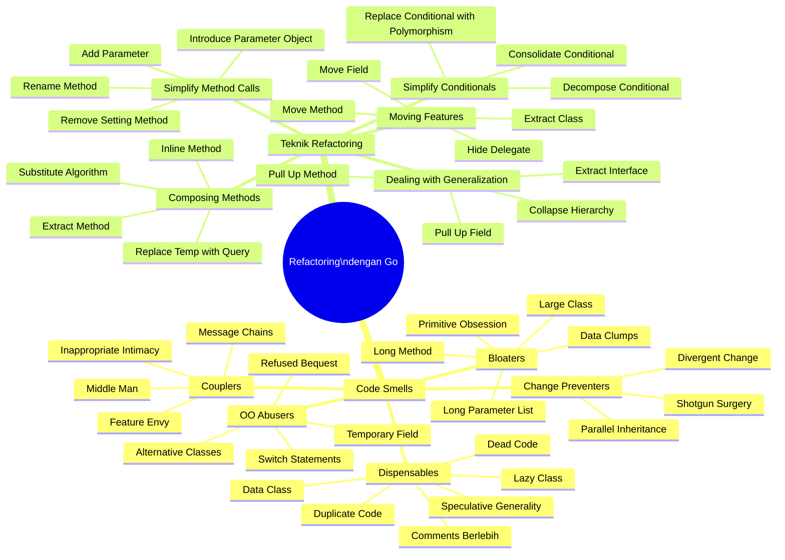
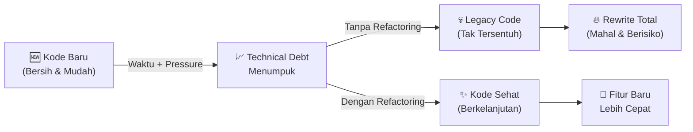
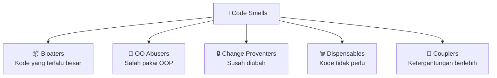
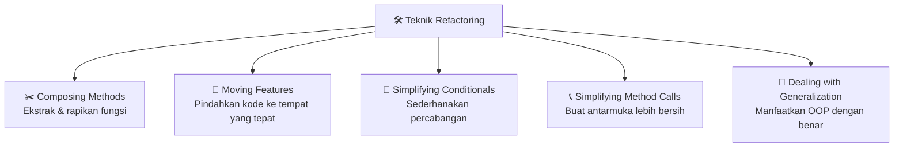

Pernahkah kamu membuka kode yang kamu tulis sendiri enam bulan lalu, lalu terdiam dan berpikir: *"Siapa yang menulis ini?!"* — padahal kamu tahu itu dirimu sendiri. Atau mungkin kamu sudah berulang kali mendengar frasa *"jangan sentuh dulu, nanti rusak"* saat diskusi sprint planning. Kalau pernah, selamat datang di klub yang sangat ramai.

Kode yang buruk bukan lahir dari developer yang malas atau tidak kompeten. Ia lahir dari **tekanan deadline**, **perubahan requirement yang terus-menerus**, dan keputusan jangka pendek yang menumpuk menjadi **technical debt** yang makin besar setiap harinya. Di sinilah **Refactoring** hadir — bukan sebagai solusi ajaib, tapi sebagai disiplin yang sistematis untuk membuat kode kembali sehat, tanpa mengubah perilakunya.

Seri ini terinspirasi dari buku **"Dive Into Refactoring"** oleh Alexander Shvets — salah satu referensi paling praktis dan menyeluruh tentang refactoring yang pernah ada. Semua contoh kode akan ditulis dalam **Go (Golang)**.

---

## 🎯 Takeaway

Setelah membaca seri ini, kamu akan:

- ✅ Memahami apa itu refactoring dan kapan harus (dan tidak boleh) melakukannya
- ✅ Mengenali **22 jenis Code Smells** — sinyal bahwa kode butuh perhatian
- ✅ Menguasai **teknik-teknik refactoring** yang sudah terbukti efektif
- ✅ Mampu mengaplikasikan semua konsep langsung dalam **kode Go**
- ✅ Punya keberanian untuk *memperbaiki* kode yang sudah ada tanpa takut merusak

---

## 🗺️ Peta Seri Refactoring



---

## 🔍 Apa Itu Refactoring?

> **"Refactoring adalah proses mengubah struktur internal kode perangkat lunak tanpa mengubah perilaku eksternalnya."**
> — Martin Fowler

Lebih tepatnya, refactoring adalah **teknik yang terdisiplin** untuk membersihkan kode, yang meminimalkan peluang munculnya bug baru. Saat kita melakukan refactoring, kita melakukan serangkaian transformasi kecil — masing-masing "terlalu kecil untuk dianggap risiko" — tetapi efek kumulatifnya bisa menghasilkan restrukturisasi besar yang dramatis.

### Apa yang BUKAN Refactoring?

Banyak yang keliru mengartikan refactoring. Mari luruskan:

| Bukan Refactoring ❌ | Refactoring ✅ |
|---|---|
| Menulis ulang kode dari nol | Memperbaiki struktur kode yang sudah ada |
| Menambahkan fitur baru | Hanya mengubah *bagaimana* fitur itu dibuat |
| Memperbaiki bug | Tidak mengubah perilaku eksternal |
| Mengoptimasi performa | (bisa jadi efek samping, tapi bukan tujuan utama) |

### Refactoring vs. Clean Code

Jika *Clean Code* mengajarkan kita **cara menulis kode yang baik sejak awal**, maka *Refactoring* mengajarkan kita **cara memperbaiki kode yang sudah ada**. Keduanya saling melengkapi — dan seri ini adalah kelanjutan alami dari perjalanan belajar menulis kode yang berkualitas.

---

## 🤔 Mengapa Refactoring Itu Penting?

Tanpa refactoring yang disiplin, kode cenderung memburuk seiring waktu. Fenomena ini sering disebut **software rot** atau *code entropy*. Setiap tambahan fitur, setiap patch bug yang terburu-buru, setiap deadline yang dipaksakan — semua menambah lapisan kompleksitas.



### Tiga Manfaat Utama Refactoring

**1. 🧹 Memperbaiki Desain yang Memburuk**
Tanpa refactoring reguler, kode kehilangan strukturnya karena perubahan yang dilakukan tanpa melihat gambar besar. Semakin susah memahami kode, semakin sulit mempertahankan strukturnya.

**2. 🔎 Membuat Kode Lebih Mudah Dipahami**
Saat kamu harus memodifikasi kode orang lain, kamu harus memahaminya dulu. Refactoring memaksa kamu memahami kode secara mendalam — dan saat memahaminya, kamu memperbaikinya agar orang lain (atau dirimu di masa depan) lebih mudah memahaminya juga.

**3. 🐛 Membantu Menemukan Bug Lebih Cepat**
Saat kamu memperjelas struktur kode, kamu seringkali melihat *asumsi* yang tersembunyi — dan asumsi tersebut seringkali adalah bug yang belum meledak. Refactoring seperti menerangi ruang gelap: tiba-tiba kamu bisa melihat semua yang ada di sana.

---

## ⚠️ Kapan Harus Refactoring?

### Sinyal-Sinyal yang Tidak Boleh Diabaikan

Ini adalah contoh kode Go yang menunjukkan **technical debt yang nyata** — tipe kode yang *terasa* perlu di-refactor tapi sering dibiarkan karena "masih jalan":

```go
// ❌ BAD: Ini adalah "God Function" yang melakukan terlalu banyak hal sekaligus.
// Ciri-ciri yang langsung terlihat:
// 1. Nama fungsi tidak jelas (process)
// 2. Parameter terlalu banyak dan bertipe primitif
// 3. Logika if-else berlapis
// 4. Magic numbers (0.1, 0.2, 100, 50)
// 5. Comment yang menjelaskan "apa" bukan "mengapa"

func process(t string, a float64, q int, m bool, code string, uid int) float64 {
    var result float64

    // hitung harga
    if t == "A" {
        result = a * float64(q)
    } else if t == "B" {
        result = a * float64(q) * 0.9 // diskon 10%
    } else if t == "C" {
        result = a * float64(q) * 0.8 // diskon 20%
    } else {
        result = a * float64(q)
    }

    // apply membership
    if m {
        if result > 100 {
            result = result * 0.95 // member diskon 5%
        }
    }

    // cek voucher
    if code == "HEMAT10" {
        result = result - (result * 0.1)
    } else if code == "HEMAT20" {
        result = result - (result * 0.2)
    }

    // minimum order
    if result < 50 {
        result = result + 15 // ongkos kirim
    }

    // log transaksi (tapi pakai fmt, bukan logger proper)
    fmt.Printf("uid=%d type=%s total=%.2f\n", uid, t, result)

    return result
}
```

**Apa yang salah dengan kode ini?**

| Masalah | Dampak |
|---|---|
| Nama `process`, `t`, `a`, `q`, `m` tidak bermakna | Butuh 5 menit hanya untuk mengerti parameter-nya |
| Magic numbers `0.9`, `0.8`, `100`, `50`, `15` | Susah diubah, mudah salah |
| Satu fungsi: hitung harga + diskon + voucher + shipping + logging | Tidak bisa ditest per bagian |
| Switch-case manual via `if-else` berlapis | Jika tipe produk bertambah, fungsi ini makin panjang |
| `fmt.Printf` untuk logging | Tidak bisa dikonfigurasi, tidak ada level log |

Ini bukan kode buatan sendiri — ini adalah kode yang *sangat umum ditemukan* di codebase yang berusia lebih dari satu tahun dan dipegang oleh banyak tangan.

Kode seperti inilah yang akan kita pelajari cara memperbaikinya, step-by-step, melalui seri ini.

---

## 🧬 Dua Pilar Seri Ini

Seri ini dibagi menjadi dua bagian besar yang saling melengkapi:

### Bagian 1: Code Smells (Part 1–5)
**Code Smell** bukan bug — kode tetap berjalan. Tapi ia adalah *sinyal* bahwa ada sesuatu yang salah dengan desain. Seperti bau yang mengindikasikan makanan mulai membusuk — kamu tidak perlu melihat bakteri untuk tahu ada masalah.

Ada **5 kategori Code Smell** yang akan kita bahas:



### Bagian 2: Teknik Refactoring (Part 6–10)
Setelah tahu **apa** yang salah, kita belajar **bagaimana** memperbaikinya. Ada **5 kategori teknik** yang sudah terbukti efektif:



---

## 📚 Daftar Isi Lengkap Seri

| # | Judul | Kategori | Link |
|---|---|---|---|
| 1 | **Code Smells: Bloaters** | Code Smells | [Baca →](/refactoring-part-1-bloaters-id) |
| 2 | **Code Smells: Object-Orientation Abusers** | Code Smells | [Baca →](/refactoring-part-2-oo-abusers-id) |
| 3 | **Code Smells: Change Preventers** | Code Smells | [Baca →](/refactoring-part-3-change-preventers-id) |
| 4 | **Code Smells: Dispensables** | Code Smells | [Baca →](/refactoring-part-4-dispensables-id) |
| 5 | **Code Smells: Couplers** | Code Smells | [Baca →](/refactoring-part-5-couplers-id) |
| 6 | **Teknik Refactoring: Composing Methods** | Teknik | [Baca →](/refactoring-part-6-composing-methods-id) |
| 7 | **Teknik Refactoring: Moving Features Between Objects** | Teknik | [Baca →](/refactoring-part-7-moving-features-id) |
| 8 | **Teknik Refactoring: Simplifying Conditional Expressions** | Teknik | [Baca →](/refactoring-part-8-simplify-conditionals-id) |
| 9 | **Teknik Refactoring: Simplifying Method Calls** | Teknik | [Baca →](/refactoring-part-9-simplify-method-calls-id) |
| 10 | **Teknik Refactoring: Dealing with Generalization** | Teknik | [Baca →](/refactoring-part-10-generalization-id) |

---

## 🏁 Cara Terbaik Mengikuti Seri Ini

Seri ini dirancang untuk dibaca **secara berurutan**, tapi setiap bagian juga bisa dibaca secara mandiri sebagai referensi.

**Untuk Pemula:** Mulai dari Part 1 dan ikuti urutan — kamu akan membangun pemahaman yang solid tentang mengapa kode bermasalah sebelum belajar cara memperbaikinya.

**Untuk yang Sudah Berpengalaman:** Gunakan tabel di atas sebagai referensi cepat. Kalau sedang review kode dan merasa ada yang tidak beres tapi tidak tahu namanya, cari di bagian Code Smells. Kalau sudah tahu masalahnya dan butuh solusi, langsung ke bagian Teknik.

**Rekomendasi Praktis:**
1. 📖 Baca konsepnya
2. 🔍 Identifikasi pola yang sama di kode proyekmu sendiri
3. 🛠️ Coba terapkan tekniknya — dengan **tests yang ada** sebagai safety net
4. 🔁 Ulangi secara berkala

> **💡 Catatan Penting:** Sebelum melakukan refactoring, pastikan kamu punya **test yang memadai**. Refactoring tanpa test ibarat renovasi rumah tanpa peta — kamu mungkin tidak tahu kalau dinding yang kamu robohkan adalah dinding penopang.

---

## 📝 Ringkasan

Refactoring bukan kemewahan — ia adalah **kebutuhan profesional** setiap developer yang peduli pada kualitas pekerjaannya. Berikut poin-poin kunci yang perlu diingat:

- 🦨 **Code Smells** adalah sinyal, bukan vonis — mereka memberi tahu kita *di mana* harus melihat
- 🛠️ **Teknik Refactoring** adalah toolkit yang sudah terbukti untuk memperbaiki kode secara sistematis
- 🧪 **Tests adalah safety net** — jangan refactor tanpa mereka
- ⏱️ **Mulai kecil** — satu metode, satu kelas, satu hari. Konsistensi mengalahkan intensitas
- 📈 **Investasi jangka panjang** — waktu yang diluangkan untuk refactoring hari ini menghemat jam debugging di masa depan

Seri ini akan menjadi kompas kamu dalam perjalanan membuat kode Go yang tidak hanya *jalan*, tapi juga *hidup dengan sehat* dan bisa berkembang bersama kebutuhan bisnis yang berubah.

Selamat datang di perjalanan refactoring! 🚀

---

**🇮🇩 Versi Indonesia** \| [🇬🇧 English Version](/refactoring-intro)

[Mulai Belajar: Part 1 — Code Smells: Bloaters →](/refactoring-part-1-bloaters-id)
