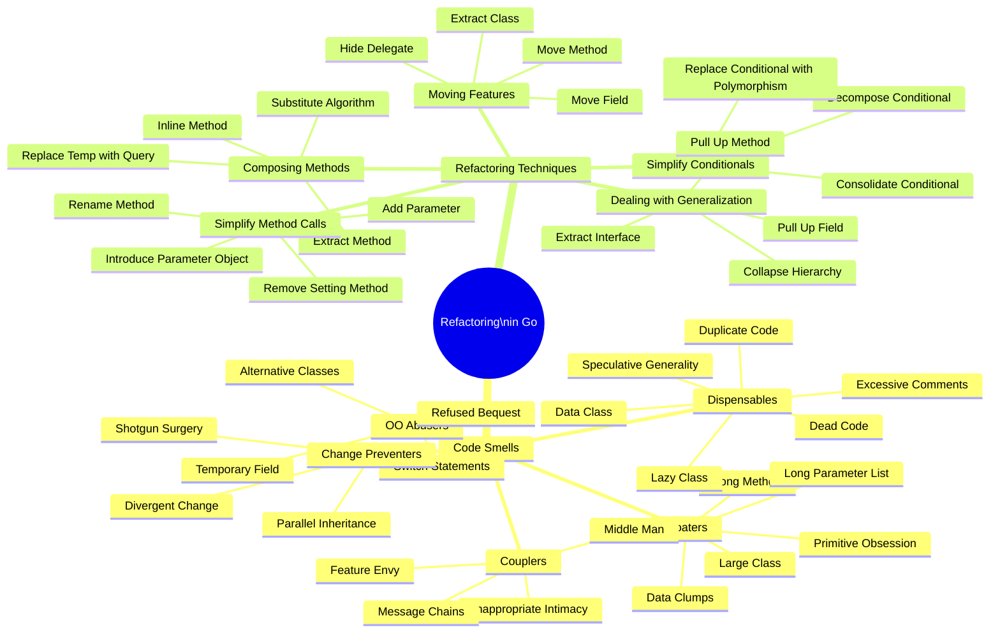
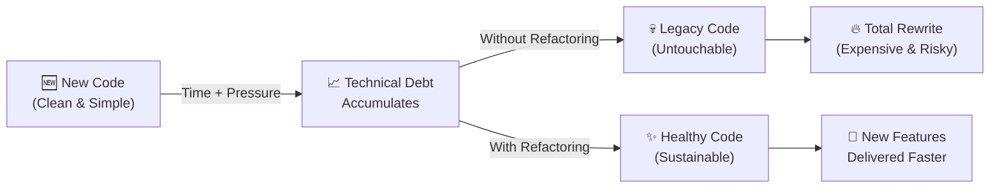
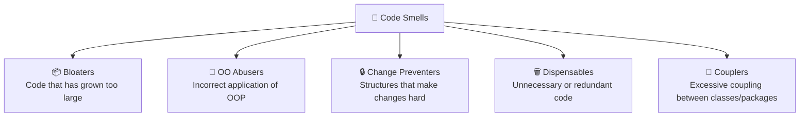
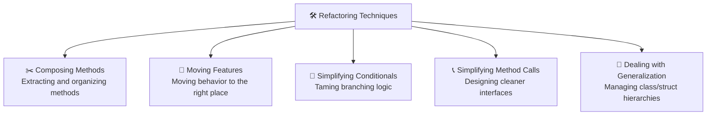

Have you ever opened a codebase you wrote just six months ago and found yourself thinking: *"Who wrote this garbage?"* only to realize it was you? Or perhaps you've heard the dreaded words *"don't touch that module, it'll break everything"* during a sprint planning meeting. If this sounds familiar, you are not alone. Bad code isn't usually the result of lazy developers; it is born from deadline pressure, changing requirements, and short-term hacks that gradually pile up into a massive mountain of **technical debt**. This is where **Refactoring** comes in—not as a magic wand, but as a disciplined, systematic way to clean up your code without changing its external behavior.

This 10-part series is heavily inspired by Alexander Shvets’ masterpiece, **\"Dive Into Refactoring\"**—one of the most practical and comprehensive guides on the subject. We will explore each concept using **Go (Golang)** as our primary language, showing you how to transform cluttered code into clean, maintainable, and idiomatic Go.

---

## 🎯 Takeaway

After reading this series, you will:

- ✅ Understand the core philosophy of refactoring and when (and when not) to do it
- ✅ Recognize **22 common Code Smells** that signal your Go code needs help
- ✅ Master time-tested **refactoring techniques** to cleanly restructure your logic
- ✅ Apply all these concepts practically to real-world **Go code**
- ✅ Gain the confidence to refactor legacy codebases without fear of breaking them

---

## 🗺️ Refactoring Series Mind Map

Here is the visual roadmap of the entire series, divided into **Code Smells** (identifying the problems) and **Refactoring Techniques** (applying the solutions):



---

## 🔍 What is Refactoring?

> **\"Refactoring is the process of changing a software system in such a way that it does not alter the external behavior of the code yet improves its internal structure.\"**
> — Martin Fowler

At its core, refactoring is a **disciplined technique** for cleaning up code that minimizes the chance of introducing bugs. When refactoring, you make a series of small, behavior-preserving transformations (often referred to as \"micro-refactorings\"). Individually, these changes might seem too trivial to matter, but their cumulative effect can lead to dramatic improvements in design, readability, and maintenance.

### What Refactoring is NOT

To understand refactoring, it is equally important to understand what it is not:

| Not Refactoring ❌ | Refactoring ✅ |
|---|---|
| Rewriting code from scratch | Improving the structure of existing code |
| Adding new features or API endpoints | Modifying only *how* existing features are implemented |
| Fixing bugs or changing output | Keeping external behavior exactly the same |
| Optimizing performance | (Although often a side effect, it is not the primary goal) |

### Refactoring vs. Clean Code

If *Clean Code* is about **how to write good code from the beginning**, then *Refactoring* is about **how to fix existing code**. They are two sides of the same coin. Understanding code smells and refactoring techniques equips you with the vocabulary to explain *why* a piece of code is hard to work with and *how* to systematically clean it up.

---

## 🤔 Why Refactoring Matters

Without a disciplined approach to refactoring, codebases naturally deteriorate over time. This phenomenon is often called **software rot** or *code entropy*. Every new feature, rushed bug fix, and tight deadline adds another layer of complexity.



### Three Key Benefits of Refactoring

1. **🧹 Improves Software Design:** Without regular refactoring, the design of a program drifts and decays. As people change code to meet short-term goals, they often do so without fully understanding the overall architecture. Refactoring helps keep the code structured and clean.
2. **🔎 Makes Software Easier to Understand:** Code is read far more often than it is written. When you refactor, you actively make the code more readable and self-documenting for your teammates (and your future self).
3. **🐛 Helps Find Bugs Faster:** Cleaning up code is like shining a light into a dark, dusty attic. As you untangle the structure of a program, you will often find hidden bugs, edge cases, and flawed assumptions that had been buried under layers of spaghetti code.

---

## ⚠️ When to Refactor?

The best time to refactor is not during a dedicated \"refactoring sprint\" (which product managers rarely approve), but rather as a natural part of your daily development workflow. Shvets recommends using the **Rule of Three**:
1. When you do something for the first time, just get it done.
2. When you do something similar for the second time, wince at the duplication but do it anyway.
3. When you do something for the third time, start refactoring.

### Technical Debt in the Wild: A Go Example

Let's look at a typical example of bad code in Go. This is a \"God Function\" that is plagued by multiple code smells: it is too long, takes too many parameters, has nested conditionals, uses magic values, and violates the Single Responsibility Principle.

### Bad Code Example (❌)

```go
package main

import "fmt"

// ❌ BAD: This is a "God Function" that does too many things at once.
// Immediately noticeable code smells:
// 1. Vague function name (process)
// 2. Too many primitive parameters (Long Parameter List)
// 3. Nested if-else logic (Complexity)
// 4. Magic numbers (0.1, 0.2, 100, 50, 15)
// 5. Comments explaining "what" the code does instead of "why"
func process(t string, a float64, q int, m bool, code string, uid int) float64 {
	var result float64

	// Calculate base price
	if t == "A" {
		result = a * float64(q)
	} else if t == "B" {
		result = a * float64(q) * 0.9 // 10% discount
	} else if t == "C" {
		result = a * float64(q) * 0.8 // 20% discount
	} else {
		result = a * float64(q)
	}

	// Apply membership discount
	if m {
		if result > 100 {
			result = result * 0.95 // 5% member discount
		}
	}

	// Check voucher code
	if code == "HEMAT10" {
		result = result - (result * 0.1)
	} else if code == "HEMAT20" {
		result = result - (result * 0.2)
	}

	// Minimum order checks
	if result < 50 {
		result = result + 15 // Shipping fee
	}

	// Log transaction (but uses fmt instead of a proper logger)
	fmt.Printf("uid=%d type=%s total=%.2f\n", uid, t, result)

	return result
}
```

If you need to add a new product type "D", or support a new discount coupon, or change the shipping rules, this function will grow even longer and more fragile.

### Refactored Fix (✅)

To resolve these issues, we can apply several refactoring techniques:
- **Extract Method/Function** to split each responsibility into a small, descriptive helper.
- **Introduce Parameter Object** to combine the messy parameters into a structured order request.
- **Replace Magic Numbers with Constants** to make variables self-documenting.
- **Replace Conditional with Switch** where appropriate.

Here is the refactored, clean Go version:

```go
package main

import (
	"log"
)

// Define custom domain types to prevent primitive obsession.
type ProductType string

const (
	ProductTypeA ProductType = "A"
	ProductTypeB ProductType = "B"
	ProductTypeC ProductType = "C"
)

// Replace magic numbers with meaningful constants.
const (
	MinOrderForFreeShipping = 50.0
	ShippingFee             = 15.0
	MemberDiscountThreshold = 100.0
	MemberDiscountRate      = 0.05
)

// OrderRequest groups related fields into a single struct (Introduce Parameter Object).
type OrderRequest struct {
	ProductType ProductType
	UnitPrice   float64
	Quantity    int
	IsMember    bool
	VoucherCode string
	UserID      int
}

// ✅ GOOD: A highly readable function delegating specific responsibilities to helper functions.
func CalculateOrderTotal(req OrderRequest) float64 {
	total := calculateBasePrice(req.ProductType, req.UnitPrice, req.Quantity)
	total = applyMemberDiscount(total, req.IsMember)
	total = applyVoucherDiscount(total, req.VoucherCode)
	total = applyShippingFee(total)

	logTransaction(req.UserID, req.ProductType, total)
	return total
}

func calculateBasePrice(t ProductType, price float64, qty int) float64 {
	base := price * float64(qty)
	switch t {
	case ProductTypeB:
		return base * 0.90 // 10% discount
	case ProductTypeC:
		return base * 0.80 // 20% discount
	default:
		return base
	}
}

func applyMemberDiscount(currentTotal float64, isMember bool) float64 {
	if isMember && currentTotal > MemberDiscountThreshold {
		return currentTotal * (1.0 - MemberDiscountRate)
	}
	return currentTotal
}

func applyVoucherDiscount(currentTotal float64, voucherCode string) float64 {
	switch voucherCode {
	case "HEMAT10":
		return currentTotal * 0.90
	case "HEMAT20":
		return currentTotal * 0.80
	default:
		return currentTotal
	}
}

func applyShippingFee(currentTotal float64) float64 {
	if currentTotal < MinOrderForFreeShipping {
		return currentTotal + ShippingFee
	}
	return currentTotal
}

func logTransaction(userID int, productType ProductType, total float64) {
	// Uses a proper logger rather than printing directly to stdout
	log.Printf("Transaction processed: UserID=%d, Type=%s, Total=%.2f", userID, productType, total)
}
```

---

## 🧬 The Two Pillars of This Series

To help you master refactoring, this series is organized into two primary pillars:

### Pillar 1: Code Smells (Parts 1–5)
A **Code Smell** is not a bug or compile error. It is a structural pattern in your code that indicates a deeper design problem. Just like a bad smell from a refrigerator suggests food is spoiling, a code smell indicates that your code is becoming harder to maintain.

We will cover **5 categories of Code Smells**:



### Pillar 2: Refactoring Techniques (Parts 6–10)
Once you know **what** is wrong (the smell), you need to know **how** to fix it. We will cover **5 categories of Refactoring Techniques**:



---

## 📚 Complete Series Roadmap

| Part | Title | Category | Link |
| :---: | :--- | :--- | :--- |
| 1 | **Code Smells: Bloaters** | Code Smells | [Read →](/refactoring-part-1-bloaters) |
| 2 | **Code Smells: Object-Orientation Abusers** | Code Smells | [Read →](/refactoring-part-2-oo-abusers) |
| 3 | **Code Smells: Change Preventers** | Code Smells | [Read →](/refactoring-part-3-change-preventers) |
| 4 | **Code Smells: Dispensables** | Code Smells | [Read →](/refactoring-part-4-dispensables) |
| 5 | **Code Smells: Couplers** | Code Smells | [Read →](/refactoring-part-5-couplers) |
| 6 | **Refactoring Techniques: Composing Methods** | Refactoring Techniques | [Read →](/refactoring-part-6-composing-methods) |
| 7 | **Refactoring Techniques: Moving Features Between Objects** | Refactoring Techniques | [Read →](/refactoring-part-7-moving-features) |
| 8 | **Refactoring Techniques: Simplifying Conditional Expressions** | Refactoring Techniques | [Read →](/refactoring-part-8-simplify-conditionals) |
| 9 | **Refactoring Techniques: Simplifying Method Calls** | Refactoring Techniques | [Read →](/refactoring-part-9-simplify-method-calls) |
| 10 | **Refactoring Techniques: Dealing with Generalization** | Refactoring Techniques | [Read →](/refactoring-part-10-generalization) |

---

## 🏁 Best Way to Follow This Series

This series is designed to be read **in order**, but each post also stands alone as a quick reference guide.

- **For Beginners:** Start from Part 1 and go in sequence. You will build a solid understanding of *why* certain patterns are problematic before learning how to fix them.
- **For Experienced Developers:** Use the table above as a index. If you are reviewing code and feel like something is wrong but cannot name it, browse the **Code Smells** section. If you already know the problem and need a recipe to resolve it, jump straight to the **Refactoring Techniques** section.

**Practical Workflow:**
1. 📖 **Read** the concept.
2. 🔍 **Identify** similar patterns in your current codebase.
3. 🛠️ **Apply** the refactoring technique—using **existing unit tests** as a safety net.
4. 🔁 **Repeat** as a habit.

> **💡 Important Note:** Before refactoring, ensure you have **sufficient test coverage**. Refactoring without tests is like renovating a house without a blueprint—you won't know if you've accidentally knocked down a load-bearing wall until the roof collapses.

---

## 📝 Summary

Refactoring is not a luxury or a chore; it is a **professional necessity** for any developer who cares about the longevity of their work. Keep these key takeaways in mind:

- 🦨 **Code Smells are signals, not rules** — they point you to where code might need attention.
- 🛠️ **Refactoring Techniques are tools** — they provide proven, structured steps to safely transform your design.
- 🧪 **Tests are your safety net** — never refactor code that lacks reliable tests.
- ⏱️ **Start small** — clean up one function, one struct, or one package at a time. Consistency beats intensity.
- 📈 **Long-term investment** — spending an hour refactoring today saves days of debugging and frustration tomorrow.

This series is designed to be your guide on your journey to writing Go code that is not just functional, but also clean, elegant, and ready to evolve with your business needs.

Welcome to the refactoring journey! 🚀

---

[🇮🇩 Versi Indonesia](/refactoring-intro-id) | **🇬🇧 English Version**

[Start Learning: Part 1 — Code Smells: Bloaters →](/refactoring-part-1-bloaters)
