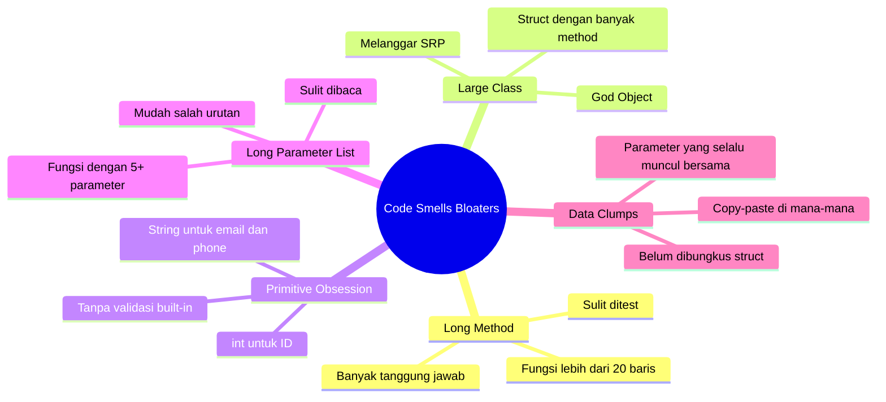
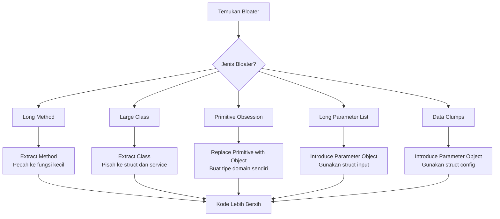

Kamu pernah membuka file Go dan mendapati sebuah fungsi yang panjangnya 300 baris? Atau sebuah struct yang punya 40 method berbeda? Atau fungsi yang dipanggil dengan 8 argumen berurutan sehingga kamu harus terus scroll ke atas untuk mengingat urutan parameternya? Kalau ya, selamat — kamu baru saja bertemu dengan **Bloaters**.

Bloaters adalah kategori *code smell* pertama dan paling umum ditemukan di codebase nyata. Namanya sangat tepat: ini adalah kode yang sudah *bengkak* karena terlalu banyak tanggung jawab, terlalu banyak data, atau terlalu banyak parameter yang ditumpuk tanpa struktur yang jelas. Bloaters tidak muncul dalam semalam — mereka tumbuh perlahan, sedikit demi sedikit, setiap kali seseorang menambahkan "satu fitur kecil lagi" tanpa memikirkan konsekuensi jangka panjang.

Di post ini kita akan bedah tuntas 5 jenis Bloaters, kenali tandanya, dan pelajari cara memperbaikinya dengan Go.

---

## 🎯 Takeaway

Setelah membaca artikel ini, kamu akan:

- ✅ Memahami apa itu **Code Smell Bloaters** dan mengapa mereka berbahaya
- ✅ Mengenali **5 jenis Bloaters**: Long Method, Large Class, Primitive Obsession, Long Parameter List, dan Data Clumps
- ✅ Mampu mengidentifikasi Bloaters di kodebase Go milikmu sendiri
- ✅ Mengetahui teknik refactoring yang tepat untuk setiap jenis Bloater
- ✅ Melihat contoh kode nyata *sebelum* dan *sesudah* refactoring

---

## Peta Jenis Bloaters



---

## 1. Long Method — Fungsi yang Terlalu Panjang

### Apa itu?

*Long Method* adalah fungsi yang terlalu panjang sehingga sulit dipahami, ditest, dan dimaintain. Robert C. Martin menyarankan fungsi idealnya hanya **5–20 baris**. Fungsi yang panjang hampir selalu berarti dia melakukan lebih dari satu hal.

### Tanda-tandanya:
- Fungsi lebih dari 30 baris
- Kamu perlu scroll untuk membaca satu fungsi
- Ada komentar seperti `// Step 1:`, `// Step 2:` di dalam fungsi
- Fungsi punya lebih dari satu "level abstraksi"

### Contoh Bad Code (❌)

```go
// ❌ BAD: Fungsi processOrder melakukan terlalu banyak hal —
// validasi, kalkulasi harga, kalkulasi diskon, kalkulasi pajak,
// pembuatan order ID, simpan ke DB, dan kirim notifikasi.
// Semua dalam satu fungsi! Mustahil ditest secara terisolasi.

func processOrder(
    customerName, customerEmail string,
    productID string,
    quantity int,
) (string, error) {
    // === VALIDASI ===
    if customerName == "" {
        return "", fmt.Errorf("customer name is required")
    }
    if customerEmail == "" || !strings.Contains(customerEmail, "@") {
        return "", fmt.Errorf("invalid customer email")
    }
    if productID == "" {
        return "", fmt.Errorf("product ID is required")
    }
    if quantity <= 0 {
        return "", fmt.Errorf("quantity must be greater than 0")
    }

    // === AMBIL DATA PRODUK (simulasi) ===
    var productName string
    var productPrice float64
    if productID == "P001" {
        productName = "Laptop"
        productPrice = 15_000_000
    } else if productID == "P002" {
        productName = "Mouse"
        productPrice = 250_000
    } else {
        return "", fmt.Errorf("product not found: %s", productID)
    }

    // === KALKULASI HARGA ===
    subtotal := productPrice * float64(quantity)

    // === KALKULASI DISKON ===
    var discount float64
    if subtotal >= 10_000_000 {
        discount = subtotal * 0.10 // diskon 10%
    } else if subtotal >= 5_000_000 {
        discount = subtotal * 0.05 // diskon 5%
    }
    afterDiscount := subtotal - discount

    // === KALKULASI PAJAK ===
    tax := afterDiscount * 0.11 // PPN 11%
    total := afterDiscount + tax

    // === BUAT ORDER ID ===
    orderID := fmt.Sprintf("ORD-%d-%s", time.Now().Unix(), productID)

    // === SIMPAN KE DATABASE (simulasi) ===
    log.Printf("[DB] INSERT order: id=%s customer=%s product=%s qty=%d total=%.2f",
        orderID, customerName, productName, quantity, total)

    // === KIRIM NOTIFIKASI EMAIL (simulasi) ===
    log.Printf("[EMAIL] Sending order confirmation to %s for order %s", customerEmail, orderID)

    log.Printf("Order %s processed successfully. Total: Rp %.2f", orderID, total)
    return orderID, nil
}
```

### Perbaikan (✅)

Pecah ke fungsi-fungsi kecil dengan tanggung jawab tunggal:

```go
// ✅ GOOD: Setiap fungsi punya satu tanggung jawab yang jelas.
// Mudah dibaca, mudah ditest, mudah dimaintain.

type Customer struct {
    Name  string
    Email string
}

type Product struct {
    ID    string
    Name  string
    Price float64
}

type OrderSummary struct {
    OrderID  string
    Product  Product
    Quantity int
    Subtotal float64
    Discount float64
    Tax      float64
    Total    float64
}

const (
    taxRate            = 0.11
    discountTierHigh   = 10_000_000.0
    discountRateHigh   = 0.10
    discountTierMedium = 5_000_000.0
    discountRateMedium = 0.05
)

func (c Customer) validate() error {
    if c.Name == "" {
        return fmt.Errorf("customer name is required")
    }
    if c.Email == "" || !strings.Contains(c.Email, "@") {
        return fmt.Errorf("invalid customer email: %s", c.Email)
    }
    return nil
}

func findProduct(productID string) (Product, error) {
    catalog := map[string]Product{
        "P001": {ID: "P001", Name: "Laptop", Price: 15_000_000},
        "P002": {ID: "P002", Name: "Mouse", Price: 250_000},
    }
    p, ok := catalog[productID]
    if !ok {
        return Product{}, fmt.Errorf("product not found: %s", productID)
    }
    return p, nil
}

func calculateDiscount(subtotal float64) float64 {
    switch {
    case subtotal >= discountTierHigh:
        return subtotal * discountRateHigh
    case subtotal >= discountTierMedium:
        return subtotal * discountRateMedium
    default:
        return 0
    }
}

func buildOrderSummary(customer Customer, product Product, quantity int) OrderSummary {
    subtotal := product.Price * float64(quantity)
    discount := calculateDiscount(subtotal)
    afterDiscount := subtotal - discount
    tax := afterDiscount * taxRate
    return OrderSummary{
        OrderID:  fmt.Sprintf("ORD-%d-%s", time.Now().Unix(), product.ID),
        Product:  product,
        Quantity: quantity,
        Subtotal: subtotal,
        Discount: discount,
        Tax:      tax,
        Total:    afterDiscount + tax,
    }
}

// Fungsi utama kini ringkas dan mudah dibaca seperti prosa
func processOrder(customer Customer, productID string, quantity int) (string, error) {
    if err := customer.validate(); err != nil {
        return "", err
    }
    if quantity <= 0 {
        return "", fmt.Errorf("quantity must be greater than 0")
    }
    product, err := findProduct(productID)
    if err != nil {
        return "", err
    }
    summary := buildOrderSummary(customer, product, quantity)
    saveOrder(summary)
    sendOrderConfirmation(customer.Email, summary)
    return summary.OrderID, nil
}
```

**Mengapa lebih baik?**
- `calculateDiscount` dan `buildOrderSummary` bisa ditest secara independen tanpa DB/email
- Setiap fungsi namanya menjelaskan **apa** yang dilakukan
- Menambah logika diskon baru? Cukup sentuh `calculateDiscount` saja

---

## 2. Large Class — Struct yang Terlalu Besar

### Apa itu?

*Large Class* (atau *God Object*) adalah sebuah struct yang mencoba tahu dan melakukan terlalu banyak hal. Dalam Go, ini sering muncul sebagai sebuah struct dengan belasan method yang tidak berkaitan satu sama lain.

### Tanda-tandanya:
- Struct dengan 15+ method
- Method-method yang tidak saling berkaitan (misalnya ada method validasi, DB, email, logging, dan formatting sekaligus)
- Field yang hanya digunakan oleh sebagian method saja
- Nama yang terlalu generik: `UserManager`, `AppService`, `Handler`

### Contoh Bad Code (❌)

```go
// ❌ BAD: Struct User ini adalah God Object.
// Dia tahu cara menyimpan dirinya ke DB, mengirim email,
// mengelola sesi, dan menghitung statistik — semuanya!
// Ini melanggar Single Responsibility Principle secara terang-terangan.

type User struct {
    ID        int
    Name      string
    Email     string
    Password  string
    Role      string
    CreatedAt time.Time
    db        *sql.DB
    smtpHost  string
}

func (u *User) Save() error {
    _, err := u.db.Exec(
        "INSERT INTO users (name, email, password, role) VALUES ($1,$2,$3,$4)",
        u.Name, u.Email, u.Password, u.Role,
    )
    return err
}

func (u *User) Update() error {
    _, err := u.db.Exec(
        "UPDATE users SET name=$1, email=$2, role=$3 WHERE id=$4",
        u.Name, u.Email, u.Role, u.ID,
    )
    return err
}

func (u *User) Delete() error {
    _, err := u.db.Exec("DELETE FROM users WHERE id=$1", u.ID)
    return err
}

func (u *User) SendWelcomeEmail() error {
    msg := fmt.Sprintf("Halo %s, selamat datang!", u.Name)
    return smtp.SendMail(u.smtpHost+":587", nil,
        "noreply@app.com", []string{u.Email}, []byte(msg))
}

func (u *User) SendPasswordResetEmail(token string) error {
    msg := fmt.Sprintf("Klik link berikut untuk reset password: /reset?token=%s", token)
    return smtp.SendMail(u.smtpHost+":587", nil,
        "noreply@app.com", []string{u.Email}, []byte(msg))
}

func (u *User) GenerateSessionToken() string {
    return fmt.Sprintf("sess-%d-%d", u.ID, time.Now().Unix())
}

func (u *User) ValidatePassword(plain string) bool {
    err := bcrypt.CompareHashAndPassword([]byte(u.Password), []byte(plain))
    return err == nil
}

func (u *User) IsAdmin() bool {
    return u.Role == "admin"
}

func (u *User) CountOrders() (int, error) {
    var count int
    err := u.db.QueryRow("SELECT COUNT(*) FROM orders WHERE user_id=$1", u.ID).Scan(&count)
    return count, err
}
```

### Perbaikan (✅)

Pecah menjadi beberapa struct/service dengan tanggung jawab yang jelas:

```go
// ✅ GOOD: Setiap komponen punya satu tanggung jawab.
// User hanyalah model data murni. Logic bisnis dipisah ke service yang tepat.

// Model murni: hanya menyimpan data dan method yang sangat erat dengan data
type User struct {
    ID        int
    Name      string
    Email     string
    Password  string
    Role      string
    CreatedAt time.Time
}

func (u User) IsAdmin() bool {
    return u.Role == "admin"
}

func (u User) ValidatePassword(plain string) bool {
    err := bcrypt.CompareHashAndPassword([]byte(u.Password), []byte(plain))
    return err == nil
}

// UserRepository: bertanggung jawab atas persistensi data ke DB
type UserRepository struct {
    db *sql.DB
}

func (r *UserRepository) Save(ctx context.Context, u User) error {
    _, err := r.db.ExecContext(ctx,
        "INSERT INTO users (name, email, password, role) VALUES ($1,$2,$3,$4)",
        u.Name, u.Email, u.Password, u.Role,
    )
    return err
}

func (r *UserRepository) Update(ctx context.Context, u User) error {
    _, err := r.db.ExecContext(ctx,
        "UPDATE users SET name=$1, email=$2, role=$3 WHERE id=$4",
        u.Name, u.Email, u.Role, u.ID,
    )
    return err
}

func (r *UserRepository) Delete(ctx context.Context, id int) error {
    _, err := r.db.ExecContext(ctx, "DELETE FROM users WHERE id=$1", id)
    return err
}

func (r *UserRepository) CountOrders(ctx context.Context, userID int) (int, error) {
    var count int
    err := r.db.QueryRowContext(ctx,
        "SELECT COUNT(*) FROM orders WHERE user_id=$1", userID,
    ).Scan(&count)
    return count, err
}

// UserMailer: bertanggung jawab atas pengiriman email ke user
type UserMailer struct {
    smtpHost string
    from     string
}

func (m *UserMailer) SendWelcome(u User) error {
    body := fmt.Sprintf("Halo %s, selamat datang di platform kami!", u.Name)
    return m.send(u.Email, "Selamat Datang!", body)
}

func (m *UserMailer) SendPasswordReset(u User, token string) error {
    body := fmt.Sprintf("Klik link berikut: /reset?token=%s", token)
    return m.send(u.Email, "Reset Password", body)
}

func (m *UserMailer) send(to, subject, body string) error {
    msg := fmt.Sprintf("From: %s\nTo: %s\nSubject: %s\n\n%s",
        m.from, to, subject, body)
    return smtp.SendMail(m.smtpHost+":587", nil, m.from, []string{to}, []byte(msg))
}

// AuthService: bertanggung jawab atas sesi dan autentikasi
type AuthService struct {
    repo *UserRepository
}

func (s *AuthService) GenerateSessionToken(u User) string {
    return fmt.Sprintf("sess-%d-%d", u.ID, time.Now().Unix())
}
```

**Mengapa lebih baik?**
- `UserRepository` bisa diganti implementasi lain (mock) untuk testing tanpa DB nyata
- `UserMailer` bisa diswap dengan provider email berbeda tanpa menyentuh logika lain
- Unit test `AuthService.GenerateSessionToken` tidak membutuhkan koneksi DB atau SMTP

---

## 3. Primitive Obsession — Terlalu Bergantung pada Tipe Primitif

### Apa itu?

*Primitive Obsession* terjadi ketika kita menggunakan tipe data primitif (`string`, `int`, `float64`) untuk merepresentasikan konsep domain yang seharusnya punya tipe tersendiri. Akibatnya: tidak ada validasi bawaan, mudah tertukar, dan makna data menjadi ambigu.

### Tanda-tandanya:
- Email disimpan sebagai `string` biasa tanpa validasi
- Nomor telepon disimpan sebagai `string` tanpa format yang konsisten
- Uang disimpan sebagai `float64` (berbahaya karena floating point!)
- ID dari berbagai entitas semua bertipe `int` dan mudah tertukar

### Contoh Bad Code (❌)

```go
// ❌ BAD: Semua field bertipe primitif.
// Tidak ada yang mencegah kamu mengisi email dengan "ini bukan email"
// atau mengisi phone dengan format sembarangan.
// UserID dan ProductID sama-sama int — bisa tertukar saat memanggil fungsi!

type Order struct {
    UserID    int     // bisa tertukar dengan ProductID
    ProductID int     // bisa tertukar dengan UserID
    Email     string  // tidak ada validasi format email
    Phone     string  // bisa "abc", "  ", atau string kosong
    Amount    float64 // float64 untuk uang — presisi bisa hilang!
    Status    string  // bisa typo: "PANDING", "payed", dst
}

// Fungsi ini bisa dipanggil dengan argumen tertukar dan compiler tidak protes:
func createOrder(userID, productID int, email, phone string, amount float64) {
    // ...
}

// Bug yang halus: semua valid secara tipe, tapi data rusak
// createOrder(42, 7, "bukan-email", "abc-phone", -100.50)
```

### Perbaikan (✅)

Buat tipe domain yang membawa validasi bawaan:

```go
// ✅ GOOD: Setiap konsep domain punya tipe tersendiri.
// Compiler membantu menghindari kesalahan, dan validasi ada di satu tempat.

// Tipe ID yang tidak bisa tertukar satu sama lain
type UserID int
type ProductID int
type OrderID string

// Email dengan validasi bawaan
type Email string

func NewEmail(raw string) (Email, error) {
    raw = strings.TrimSpace(strings.ToLower(raw))
    if !strings.Contains(raw, "@") || !strings.Contains(raw, ".") {
        return "", fmt.Errorf("invalid email format: %q", raw)
    }
    return Email(raw), nil
}

func (e Email) String() string { return string(e) }

// PhoneNumber dengan validasi dan normalisasi
type PhoneNumber string

func NewPhoneNumber(raw string) (PhoneNumber, error) {
    cleaned := regexp.MustCompile(`[^\d+]`).ReplaceAllString(raw, "")
    if len(cleaned) < 9 || len(cleaned) > 15 {
        return "", fmt.Errorf("invalid phone number: %q", raw)
    }
    return PhoneNumber(cleaned), nil
}

// Money: hindari float64 untuk uang — simpan dalam satuan terkecil (integer)
type Money int64

func NewMoney(rupiah int64) (Money, error) {
    if rupiah < 0 {
        return 0, fmt.Errorf("amount cannot be negative: %d", rupiah)
    }
    return Money(rupiah), nil
}

func (m Money) String() string { return fmt.Sprintf("Rp %d", int64(m)) }

// OrderStatus sebagai tipe dengan nilai yang terdefinisi
type OrderStatus string

const (
    OrderStatusPending   OrderStatus = "pending"
    OrderStatusPaid      OrderStatus = "paid"
    OrderStatusShipped   OrderStatus = "shipped"
    OrderStatusCompleted OrderStatus = "completed"
    OrderStatusCancelled OrderStatus = "cancelled"
)

func (s OrderStatus) IsValid() bool {
    switch s {
    case OrderStatusPending, OrderStatusPaid,
        OrderStatusShipped, OrderStatusCompleted, OrderStatusCancelled:
        return true
    }
    return false
}

// Order dengan tipe yang kuat — compiler menjadi pelindung kita
type Order struct {
    ID        OrderID
    UserID    UserID      // tidak bisa tertukar dengan ProductID
    ProductID ProductID   // tidak bisa tertukar dengan UserID
    Email     Email       // sudah tervalidasi saat dibuat
    Phone     PhoneNumber
    Amount    Money       // aman dari floating-point precision issue
    Status    OrderStatus
}

// Sekarang compiler langsung error jika userID dan productID tertukar:
// createOrder(ProductID(42), UserID(7), ...) → compile error!
func createOrder(userID UserID, productID ProductID, email Email, amount Money) Order {
    return Order{
        ID:        OrderID(fmt.Sprintf("ORD-%d", time.Now().Unix())),
        UserID:    userID,
        ProductID: productID,
        Email:     email,
        Amount:    amount,
        Status:    OrderStatusPending,
    }
}
```

**Mengapa lebih baik?**
- `UserID` dan `ProductID` tidak bisa tertukar — compiler yang menjaga
- `Email` dan `PhoneNumber` selalu valid karena validasi ada di constructor-nya
- `Money` sebagai `int64` menghindari masalah floating-point (`0.1 + 0.2 != 0.3` di float64)
- `OrderStatus` hanya bisa berisi nilai yang sudah terdefinisi — tidak ada lagi typo

---

## 4. Long Parameter List — Daftar Parameter yang Terlalu Panjang

### Apa itu?

*Long Parameter List* terjadi ketika sebuah fungsi memiliki terlalu banyak parameter — umumnya lebih dari 3–4 parameter. Semakin banyak parameter, semakin tinggi risiko salah urutan, semakin sulit dibaca, dan semakin susah di-mock saat testing.

### Tanda-tandanya:
- Fungsi dengan 5+ parameter
- Banyak parameter bertipe sama berurutan (misalnya 4 `string` berturut-turut)
- Kamu harus terus buka definisi fungsi untuk ingat urutan parameternya
- Banyak parameter yang sering diisi dengan nilai default/zero value

### Contoh Bad Code (❌)

```go
// ❌ BAD: Fungsi createUser dengan 7 parameter.
// Siapa yang bisa ingat urutannya? name dulu atau email?
// role di posisi berapa? Sangat mudah salah urutan.

func createUser(
    name string,
    email string,
    phone string,
    age int,
    role string,
    address string,
    isVerified bool,
) (*User, error) {
    // implementasi...
    return &User{}, nil
}

// Memanggil fungsi ini adalah mimpi buruk:
user, err := createUser(
    "Budi Santoso",
    "budi@example.com",
    "08123456789",
    28,
    "admin",          // role? atau address?
    "Jl. Merdeka 1",  // address? yakin ini urutan yang benar?
    true,
)

// Bug yang tidak ketahuan compiler:
user2, err2 := createUser(
    "Ani",
    "ani@example.com",
    "admin",           // ❌ phone dan role tertukar!
    25,
    "08199999999",     // ❌ ini seharusnya phone, bukan role
    "Jl. Sudirman",
    false,
)
// Compiler tidak akan protes karena semua bertipe string
_ = user
_ = user2
_ = err
_ = err2
```

### Perbaikan (✅)

Gunakan struct sebagai parameter tunggal:

```go
// ✅ GOOD: Gunakan struct CreateUserInput sebagai satu-satunya parameter.
// Setiap field bernama, tidak ada lagi kebingungan urutan.
// Mudah diperluas di masa depan tanpa mengubah signature fungsi.

type CreateUserInput struct {
    Name       string
    Email      string
    Phone      string
    Age        int
    Role       string
    Address    string
    IsVerified bool
}

func (in CreateUserInput) validate() error {
    if strings.TrimSpace(in.Name) == "" {
        return fmt.Errorf("name is required")
    }
    if !strings.Contains(in.Email, "@") {
        return fmt.Errorf("invalid email: %s", in.Email)
    }
    if in.Age < 0 || in.Age > 150 {
        return fmt.Errorf("invalid age: %d", in.Age)
    }
    validRoles := map[string]bool{"admin": true, "user": true, "moderator": true}
    if !validRoles[in.Role] {
        return fmt.Errorf("invalid role: %s", in.Role)
    }
    return nil
}

func createUser(input CreateUserInput) (*User, error) {
    if err := input.validate(); err != nil {
        return nil, fmt.Errorf("createUser: %w", err)
    }
    return &User{
        Name:      input.Name,
        Email:     input.Email,
        Phone:     input.Phone,
        Role:      input.Role,
        CreatedAt: time.Now(),
    }, nil
}

// Pemanggilan kini sangat jelas dan tidak mungkin salah urutan:
user, err := createUser(CreateUserInput{
    Name:       "Budi Santoso",
    Email:      "budi@example.com",
    Phone:      "08123456789",
    Age:        28,
    Role:       "admin",
    Address:    "Jl. Merdeka No. 1",
    IsVerified: true,
})

// Menambah field baru di masa depan? Cukup tambahkan ke struct.
// Semua pemanggilan lama TIDAK perlu diubah karena pakai named fields.
_ = user
_ = err
```

**Mengapa lebih baik?**
- Named fields membuat pemanggilan fungsi *self-documenting*
- Tidak ada risiko salah urutan parameter
- Menambah parameter baru tidak membutuhkan perubahan di semua titik pemanggilan
- `validate()` bisa ditest secara independen tanpa memanggil `createUser`

---

## 5. Data Clumps — Kelompok Data yang Selalu Muncul Bersama

### Apa itu?

*Data Clumps* terjadi ketika sekelompok data selalu muncul bersama di berbagai tempat — di parameter fungsi, di field struct, atau di variabel lokal — tapi belum pernah dibungkus dalam sebuah struct yang bermakna. Jika kamu melihat dua atau lebih data yang selalu berpasangan, itu adalah sinyal kuat bahwa mereka seharusnya menjadi satu tipe tersendiri.

### Tanda-tandanya:
- Sekelompok variabel yang selalu dideklarasikan bersama
- Parameter `host, port, user, password, dbname` selalu muncul bersamaan di banyak fungsi
- Copy-paste kelompok parameter yang sama di seluruh codebase

### Contoh Bad Code (❌)

```go
// ❌ BAD: Parameter koneksi database selalu muncul bersama
// di setiap fungsi yang butuh koneksi DB.
// Ini adalah Data Clumps — 5 variabel yang tidak pernah dipisah,
// tapi juga tidak pernah dibungkus menjadi satu unit yang bermakna.

func connectDB(host, port, user, password, dbname string) (*sql.DB, error) {
    dsn := fmt.Sprintf("host=%s port=%s user=%s password=%s dbname=%s sslmode=disable",
        host, port, user, password, dbname)
    return sql.Open("postgres", dsn)
}

func pingDB(host, port, user, password, dbname string) error {
    db, err := connectDB(host, port, user, password, dbname)
    if err != nil {
        return err
    }
    defer db.Close()
    return db.Ping()
}

func runMigration(host, port, user, password, dbname, migrationsDir string) error {
    db, err := connectDB(host, port, user, password, dbname)
    if err != nil {
        return err
    }
    defer db.Close()
    log.Printf("Running migrations from %s on %s:%s/%s", migrationsDir, host, port, dbname)
    return nil
}

// Di main.go, semua variabel ini juga selalu muncul bersama:
func main() {
    host     := os.Getenv("DB_HOST")
    port     := os.Getenv("DB_PORT")
    user     := os.Getenv("DB_USER")
    password := os.Getenv("DB_PASSWORD")
    dbname   := os.Getenv("DB_NAME")

    // Dan selalu diteruskan bersama ke semua fungsi — copy-paste!
    db, _ := connectDB(host, port, user, password, dbname)
    _      = pingDB(host, port, user, password, dbname)
    _      = runMigration(host, port, user, password, dbname, "./migrations")
    _ = db
}
```

### Perbaikan (✅)

Bungkus Data Clumps dalam sebuah struct bermakna:

```go
// ✅ GOOD: DBConfig membungkus semua data konfigurasi DB dalam satu struct.
// Satu tempat untuk validasi, satu tempat untuk logika DSN,
// dan tidak ada lagi copy-paste parameter di mana-mana.

type DBConfig struct {
    Host     string
    Port     string
    User     string
    Password string
    DBName   string
    SSLMode  string
}

func NewDBConfig(host, port, user, password, dbname string) DBConfig {
    sslMode := "disable"
    if host != "localhost" && host != "127.0.0.1" {
        sslMode = "require" // SSL wajib untuk host non-lokal
    }
    return DBConfig{
        Host: host, Port: port, User: user,
        Password: password, DBName: dbname, SSLMode: sslMode,
    }
}

// Logika DSN ada di satu tempat — jika format berubah, cukup edit di sini
func (c DBConfig) DSN() string {
    return fmt.Sprintf(
        "host=%s port=%s user=%s password=%s dbname=%s sslmode=%s",
        c.Host, c.Port, c.User, c.Password, c.DBName, c.SSLMode,
    )
}

func (c DBConfig) validate() error {
    if c.Host == "" {
        return fmt.Errorf("DB_HOST is required")
    }
    if c.Port == "" {
        return fmt.Errorf("DB_PORT is required")
    }
    if c.DBName == "" {
        return fmt.Errorf("DB_NAME is required")
    }
    return nil
}

// Muat dari environment variables — validasi sekali di awal program
func DBConfigFromEnv() (DBConfig, error) {
    cfg := DBConfig{
        Host:     os.Getenv("DB_HOST"),
        Port:     os.Getenv("DB_PORT"),
        User:     os.Getenv("DB_USER"),
        Password: os.Getenv("DB_PASSWORD"),
        DBName:   os.Getenv("DB_NAME"),
        SSLMode:  "disable",
    }
    if err := cfg.validate(); err != nil {
        return DBConfig{}, fmt.Errorf("invalid DB config: %w", err)
    }
    return cfg, nil
}

// Semua fungsi kini menerima satu argumen yang bermakna — bersih!
func connectDB(cfg DBConfig) (*sql.DB, error) {
    return sql.Open("postgres", cfg.DSN())
}

func pingDB(cfg DBConfig) error {
    db, err := connectDB(cfg)
    if err != nil {
        return err
    }
    defer db.Close()
    return db.Ping()
}

func runMigration(cfg DBConfig, migrationsDir string) error {
    db, err := connectDB(cfg)
    if err != nil {
        return err
    }
    defer db.Close()
    log.Printf("Running migrations from %s on %s:%s/%s",
        migrationsDir, cfg.Host, cfg.Port, cfg.DBName)
    return nil
}

// main.go kini bersih dan mudah dipahami
func main() {
    cfg, err := DBConfigFromEnv()
    if err != nil {
        log.Fatalf("failed to load DB config: %v", err)
    }

    if err := pingDB(cfg); err != nil {
        log.Fatalf("DB ping failed: %v", err)
    }

    if err := runMigration(cfg, "./migrations"); err != nil {
        log.Fatalf("migration failed: %v", err)
    }

    db, err := connectDB(cfg)
    if err != nil {
        log.Fatalf("failed to connect: %v", err)
    }
    defer db.Close()
    // ...
}
```

**Mengapa lebih baik?**
- `DBConfig` bisa divalidasi sekali di awal program, bukan berulang di setiap fungsi
- Logika DSN ada di satu tempat — jika format DSN berubah, cukup edit method `DSN()`
- Menambah field baru (misalnya `MaxConnections`) tidak memerlukan perubahan di semua signature fungsi
- Mudah di-inject sebagai dependency dan di-mock dalam testing

---

## Tabel Ringkasan Teknik Refactoring



| Code Smell | Gejala Utama | Teknik Refactoring |
|---|---|---|
| **Long Method** | Fungsi lebih dari 20–30 baris | Extract Method — pecah ke fungsi kecil |
| **Large Class** | Struct dengan 15+ method tidak berkaitan | Extract Class — pisah ke service/repo |
| **Primitive Obsession** | `string` untuk email, `int` untuk ID | Replace Primitive with Object |
| **Long Parameter List** | Fungsi dengan 5+ parameter | Introduce Parameter Object (struct input) |
| **Data Clumps** | Sekelompok variabel selalu bersama | Introduce Parameter Object (struct config) |

---

## 📝 Ringkasan

Bloaters adalah kategori code smells yang tumbuh perlahan tanpa disadari. Setiap kali kamu menambahkan "satu kondisi kecil" atau "satu parameter lagi", kamu mungkin sedang memberi makan Bloater yang sudah ada. Kuncinya adalah **mengenali lebih awal** sebelum kode terlanjur terlalu besar untuk direfactor dengan aman.

> **Ingat 5 Bloaters ini:**
>
> 1. 📏 **Long Method** — Jika fungsimu lebih dari 20–30 baris, pecah dengan *Extract Method*
> 2. 🏛️ **Large Class** — Jika struct-mu punya lebih dari 10 method yang tidak berkaitan, pisah dengan *Extract Class*
> 3. 🧩 **Primitive Obsession** — Buat tipe domain tersendiri untuk Email, Money, UserID, dan Status
> 4. 📋 **Long Parameter List** — Lebih dari 3–4 parameter? Buat struct input
> 5. 🔗 **Data Clumps** — Kelompok variabel yang selalu bersama? Bungkus dalam struct bermakna

Refactoring Bloaters bukan tentang membuat kode terlihat cantik — ini tentang **membuat kode mudah ditest, mudah diubah, dan mudah dipahami** oleh siapapun yang membacanya, termasuk dirimu sendiri enam bulan ke depan.

> 💡 **Tips Praktis:** Mulai hari ini, setiap kali kamu menulis fungsi baru, tanyakan pada dirimu: *"Apakah fungsi ini melakukan lebih dari satu hal?"* Jika ya, itu tanda pertama Long Method atau Large Class sedang lahir. Tangkap sebelum berkembang!

---

**🇮🇩 Versi Indonesia** | **[🇬🇧 English Version](/refactoring-part-1-bloaters)**
