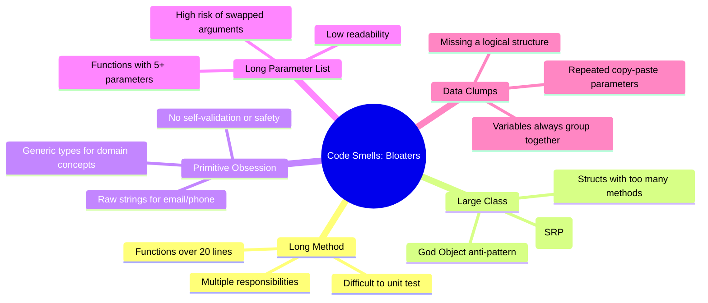
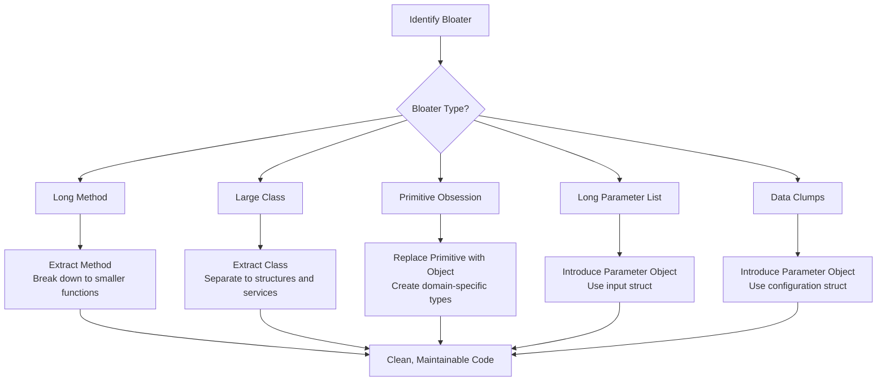

Have you ever opened a Go file only to find a 300-line function staring back at you? Or a struct with 40 distinct methods? How about a function that requires eight arguments in a row, forcing you to scroll back and forth just to check the parameter order? If any of this sounds familiar, welcome to the world of **Bloaters**.

Bloaters are the first and most common category of code smells you'll encounter in real-world codebases. The name says it all: these are parts of your code that have bloated out of proportion due to excessive responsibilities, too much data, or too many parameters piled up without a clear structure. Bloaters don't appear overnight. They grow slowly, line by line, every time someone adds "just one more quick feature" without thinking about the long-term impact on the codebase.

In this post, we will dissect the five types of Bloaters, learn how to identify them, and walk through refactoring them using Go.

---

## 🎯 Takeaway

After reading this article, you will:

- ✅ Understand what **Bloater Code Smells** are and why they harm codebase health
- ✅ Recognize the **5 types of Bloaters**: Long Method, Large Class, Primitive Obsession, Long Parameter List, and Data Clumps
- ✅ Be able to spot Bloaters within your own Go codebase
- ✅ Master the appropriate refactoring techniques for each Bloater type
- ✅ Compare real-world Go code examples *before* and *after* refactoring

---

## The Map of Bloaters

Before we dive into the details, let's visualize how these code smells are categorized and how they impact your codebase.



---

## 1. Long Method — Functions Doing Too Much

### What is it?

A *Long Method* is a function that has grown so large that it becomes hard to read, test, and maintain. Robert C. Martin (Uncle Bob) suggests that the ideal function should only be **5 to 20 lines** long. A long function is a strong signal that it is doing more than one thing, violating the Single Responsibility Principle.

### Symptoms:
- The function exceeds 30 lines of code.
- You have to scroll vertically to read the entire function.
- You see comments like `// Step 1:`, `// Step 2:` inside the code to separate logic.
- The function mixes multiple levels of abstraction (e.g., parsing raw strings, doing database queries, and formatting email templates).

### Bad Code Example (❌)

```go
// ❌ BAD: The processOrder function is doing way too much.
// It validates data, fetches product details, calculates prices, discounts,
// taxes, generates an order ID, saves it to the database, and sends email notifications.
// Testing this function in isolation is nearly impossible.

func processOrder(
    customerName, customerEmail string,
    productID string,
    quantity int,
) (string, error) {
    // === VALIDATION ===
    if customerName == "" {
        return "", fmt.Errorf("customer name is required")
    }
    if customerEmail == "" || !strings.Contains(customerEmail, "@") {
        return "", fmt.Errorf("invalid customer email")
    }
    if productID == "" {
        return "", fmt.Errorf("product ID is required")
    }
    if quantity <= 0 {
        return "", fmt.Errorf("quantity must be greater than 0")
    }

    // === FETCH PRODUCT DATA (Simulated) ===
    var productName string
    var productPrice float64
    if productID == "P001" {
        productName = "Laptop"
        productPrice = 15_000_000
    } else if productID == "P002" {
        productName = "Mouse"
        productPrice = 250_000
    } else {
        return "", fmt.Errorf("product not found: %s", productID)
    }

    // === CALCULATE PRICE ===
    subtotal := productPrice * float64(quantity)

    // === CALCULATE DISCOUNT ===
    var discount float64
    if subtotal >= 10_000_000 {
        discount = subtotal * 0.10 // 10% discount
    } else if subtotal >= 5_000_000 {
        discount = subtotal * 0.05 // 5% discount
    }
    afterDiscount := subtotal - discount

    // === CALCULATE TAX ===
    tax := afterDiscount * 0.11 // 11% VAT
    total := afterDiscount + tax

    // === GENERATE ORDER ID ===
    orderID := fmt.Sprintf("ORD-%d-%s", time.Now().Unix(), productID)

    // === SAVE TO DATABASE (Simulated) ===
    log.Printf("[DB] INSERT order: id=%s customer=%s product=%s qty=%d total=%.2f",
        orderID, customerName, productName, quantity, total)

    // === SEND EMAIL NOTIFICATION (Simulated) ===
    log.Printf("[EMAIL] Sending order confirmation to %s for order %s", customerEmail, orderID)

    log.Printf("Order %s processed successfully. Total: Rp %.2f", orderID, total)
    return orderID, nil
}
```

### Fix (✅)

To fix this, we break the function down into smaller, highly focused helpers, each with a single responsibility:

```go
// ✅ GOOD: Each function has one clear responsibility.
// It is readable, testable, and maintainable.

type Customer struct {
    Name  string
    Email string
}

type Product struct {
    ID    string
    Name  string
    Price float64
}

type OrderSummary struct {
    OrderID  string
    Product  Product
    Quantity int
    Subtotal float64
    Discount float64
    Tax      float64
    Total    float64
}

const (
    taxRate            = 0.11
    discountTierHigh   = 10_000_000.0
    discountRateHigh   = 0.10
    discountTierMedium = 5_000_000.0
    discountRateMedium = 0.05
)

func (c Customer) validate() error {
    if c.Name == "" {
        return fmt.Errorf("customer name is required")
    }
    if c.Email == "" || !strings.Contains(c.Email, "@") {
        return fmt.Errorf("invalid customer email: %s", c.Email)
    }
    return nil
}

func findProduct(productID string) (Product, error) {
    catalog := map[string]Product{
        "P001": {ID: "P001", Name: "Laptop", Price: 15_000_000},
        "P002": {ID: "P002", Name: "Mouse", Price: 250_000},
    }
    p, ok := catalog[productID]
    if !ok {
        return Product{}, fmt.Errorf("product not found: %s", productID)
    }
    return p, nil
}

func calculateDiscount(subtotal float64) float64 {
    switch {
    case subtotal >= discountTierHigh:
        return subtotal * discountRateHigh
    case subtotal >= discountTierMedium:
        return subtotal * discountRateMedium
    default:
        return 0
    }
}

func buildOrderSummary(customer Customer, product Product, quantity int) OrderSummary {
    subtotal := product.Price * float64(quantity)
    discount := calculateDiscount(subtotal)
    afterDiscount := subtotal - discount
    tax := afterDiscount * taxRate
    return OrderSummary{
        OrderID:  fmt.Sprintf("ORD-%d-%s", time.Now().Unix(), product.ID),
        Product:  product,
        Quantity: quantity,
        Subtotal: subtotal,
        Discount: discount,
        Tax:      tax,
        Total:    afterDiscount + tax,
    }
}

func saveOrder(summary OrderSummary) {
    log.Printf("[DB] INSERT order: id=%s product=%s qty=%d total=%.2f",
        summary.OrderID, summary.Product.Name, summary.Quantity, summary.Total)
}

func sendOrderConfirmation(email string, summary OrderSummary) {
    log.Printf("[EMAIL] Sending order confirmation to %s for order %s", email, summary.OrderID)
}

// The main orchestration function is now short, readable, and reads like prose
func processOrder(customer Customer, productID string, quantity int) (string, error) {
    if err := customer.validate(); err != nil {
        return "", err
    }
    if quantity <= 0 {
        return "", fmt.Errorf("quantity must be greater than 0")
    }
    product, err := findProduct(productID)
    if err != nil {
        return "", err
    }
    summary := buildOrderSummary(customer, product, quantity)
    saveOrder(summary)
    sendOrderConfirmation(customer.Email, summary)
    return summary.OrderID, nil
}
```

**Why is this better?**
- `calculateDiscount` and `buildOrderSummary` can now be unit tested independently without mocking databases or network connections.
- Each function's name tells you exactly **what** it does.
- If you need to add a new discount tier in the future, you only touch `calculateDiscount`.

---

## 2. Large Class — Structures Doing Too Much

### What is it?

A *Large Class* (often called a *God Object*) is a class or struct that tries to know and do too much. In Go, this often manifests as a struct with dozens of methods that are unrelated to each other.

### Symptoms:
- A struct has 15 or more methods.
- The methods deal with unrelated concerns (e.g., a single struct has validation, DB query execution, email sending, logging, and string formatting methods).
- Some fields in the struct are only used by a small fraction of the methods.
- The struct name is highly generic, like `UserManager`, `AppService`, or `Handler`.

### Bad Code Example (❌)

```go
// ❌ BAD: This User struct is a God Object.
// It knows how to save itself to the database, send emails,
// manage sessions, and count orders — everything!
// This is a direct violation of the Single Responsibility Principle.

type User struct {
    ID        int
    Name      string
    Email     string
    Password  string
    Role      string
    CreatedAt time.Time
    db        *sql.DB
    smtpHost  string
}

func (u *User) Save() error {
    _, err := u.db.Exec(
        "INSERT INTO users (name, email, password, role) VALUES ($1,$2,$3,$4)",
        u.Name, u.Email, u.Password, u.Role,
    )
    return err
}

func (u *User) Update() error {
    _, err := u.db.Exec(
        "UPDATE users SET name=$1, email=$2, role=$3 WHERE id=$4",
        u.Name, u.Email, u.Role, u.ID,
    )
    return err
}

func (u *User) Delete() error {
    _, err := u.db.Exec("DELETE FROM users WHERE id=$1", u.ID)
    return err
}

func (u *User) SendWelcomeEmail() error {
    msg := fmt.Sprintf("Hello %s, welcome aboard!", u.Name)
    return smtp.SendMail(u.smtpHost+":587", nil,
        "noreply@app.com", []string{u.Email}, []byte(msg))
}

func (u *User) SendPasswordResetEmail(token string) error {
    msg := fmt.Sprintf("Click the link to reset your password: /reset?token=%s", token)
    return smtp.SendMail(u.smtpHost+":587", nil,
        "noreply@app.com", []string{u.Email}, []byte(msg))
}

func (u *User) GenerateSessionToken() string {
    return fmt.Sprintf("sess-%d-%d", u.ID, time.Now().Unix())
}

func (u *User) ValidatePassword(plain string) bool {
    err := bcrypt.CompareHashAndPassword([]byte(u.Password), []byte(plain))
    return err == nil
}

func (u *User) IsAdmin() bool {
    return u.Role == "admin"
}

func (u *User) CountOrders() (int, error) {
    var count int
    err := u.db.QueryRow("SELECT COUNT(*) FROM orders WHERE user_id=$1", u.ID).Scan(&count)
    return count, err
}
```

### Fix (✅)

To fix this, we split the struct into distinct structs and services, each dedicated to a single domain concern:

```go
// ✅ GOOD: Every component has a single responsibility.
// The User struct is now a pure data model. Business logic is delegated to specialized services.

// Pure domain data model: holds data and simple helper methods directly related to it
type User struct {
    ID        int
    Name      string
    Email     string
    Password  string
    Role      string
    CreatedAt time.Time
}

func (u User) IsAdmin() bool {
    return u.Role == "admin"
}

func (u User) ValidatePassword(plain string) bool {
    err := bcrypt.CompareHashAndPassword([]byte(u.Password), []byte(plain))
    return err == nil
}

// UserRepository: manages database persistence
type UserRepository struct {
    db *sql.DB
}

func (r *UserRepository) Save(ctx context.Context, u User) error {
    _, err := r.db.ExecContext(ctx,
        "INSERT INTO users (name, email, password, role) VALUES ($1,$2,$3,$4)",
        u.Name, u.Email, u.Password, u.Role,
    )
    return err
}

func (r *UserRepository) Update(ctx context.Context, u User) error {
    _, err := r.db.ExecContext(ctx,
        "UPDATE users SET name=$1, email=$2, role=$3 WHERE id=$4",
        u.Name, u.Email, u.Role, u.ID,
    )
    return err
}

func (r *UserRepository) Delete(ctx context.Context, id int) error {
    _, err := r.db.ExecContext(ctx, "DELETE FROM users WHERE id=$1", id)
    return err
}

func (r *UserRepository) CountOrders(ctx context.Context, userID int) (int, error) {
    var count int
    err := r.db.QueryRowContext(ctx,
        "SELECT COUNT(*) FROM orders WHERE user_id=$1", userID,
    ).Scan(&count)
    return count, err
}

// UserMailer: manages outgoing email communication
type UserMailer struct {
    smtpHost string
    from     string
}

func (m *UserMailer) SendWelcome(u User) error {
    body := fmt.Sprintf("Hello %s, welcome to our platform!", u.Name)
    return m.send(u.Email, "Welcome!", body)
}

func (m *UserMailer) SendPasswordReset(u User, token string) error {
    body := fmt.Sprintf("Click the link to reset your password: /reset?token=%s", token)
    return m.send(u.Email, "Reset Password", body)
}

func (m *UserMailer) send(to, subject, body string) error {
    msg := fmt.Sprintf("From: %s\nTo: %s\nSubject: %s\n\n%s",
        m.from, to, subject, body)
    return smtp.SendMail(m.smtpHost+":587", nil, m.from, []string{to}, []byte(msg))
}

// AuthService: manages authentication and sessions
type AuthService struct {
    repo *UserRepository
}

func (s *AuthService) GenerateSessionToken(u User) string {
    return fmt.Sprintf("sess-%d-%d", u.ID, time.Now().Unix())
}
```

**Why is this better?**
- `UserRepository` can be swapped with a mock implementation in unit tests, allowing you to test other services without a database dependency.
- `UserMailer` can be swapped for a different email provider without modifying user management logic.
- Testing session token generation inside `AuthService` no longer requires establishing connection to database or SMTP host.

---

## 3. Primitive Obsession — Over-reliance on Basic Types

### What is it?

*Primitive Obsession* occurs when you use raw primitive data types (`string`, `int`, `float64`) to represent domain concepts that carry distinct rules, validations, or meanings. This leads to issues like validation duplication, easily swapped parameters, and ambiguous data interpretation.

### Symptoms:
- Email addresses are stored as plain strings with no guaranteed validation.
- Phone numbers are stored as arbitrary strings, leading to inconsistent formatting.
- Monetary amounts are represented as `float64` (a dangerous practice due to floating-point precision loss).
- IDs of different domain entities are all plain integers, making it easy to swap them by accident.

### Bad Code Example (❌)

```go
// ❌ BAD: All fields use primitive types.
// Nothing prevents you from setting the Email field to "not-an-email"
// or passing an arbitrary string to Phone.
// UserID and ProductID are both int — making it easy to swap them in function calls.

type Order struct {
    UserID    int     // Can easily be swapped with ProductID
    ProductID int     // Can easily be swapped with UserID
    Email     string  // No validation for email formatting
    Phone     string  // Can be "abc", "   ", or empty
    Amount    float64 // Using float64 for money — precision loss risk!
    Status    string  // Vulnerable to typos: "PANDING", "payed", etc.
}

// This function can be called with swapped arguments and the compiler won't complain:
func createOrder(userID, productID int, email, phone string, amount float64) {
    // ...
}

// A subtle bug: everything compiles, but the data is completely invalid
// createOrder(42, 7, "not-an-email", "abc-phone", -100.50)
```

### Fix (✅)

Create domain-specific types that validate and wrap these primitives:

```go
// ✅ GOOD: Each domain concept is represented by its own type.
// The compiler prevents accidental swaps, and validation is centralized.

// Strong types for IDs to prevent parameter swapping
type UserID int
type ProductID int
type OrderID string

// Email type with built-in validation
type Email string

func NewEmail(raw string) (Email, error) {
    raw = strings.TrimSpace(strings.ToLower(raw))
    if !strings.Contains(raw, "@") || !strings.Contains(raw, ".") {
        return "", fmt.Errorf("invalid email format: %q", raw)
    }
    return Email(raw), nil
}

func (e Email) String() string { return string(e) }

// PhoneNumber type with normalization
type PhoneNumber string

func NewPhoneNumber(raw string) (PhoneNumber, error) {
    cleaned := regexp.MustCompile(`[^\d+]`).ReplaceAllString(raw, "")
    if len(cleaned) < 9 || len(cleaned) > 15 {
        return "", fmt.Errorf("invalid phone number: %q", raw)
    }
    return PhoneNumber(cleaned), nil
}

// Money type: avoid float64. Represent currency in its smallest unit (e.g. cents/cents-equivalent) as an integer.
type Money int64

func NewMoney(cents int64) (Money, error) {
    if cents < 0 {
        return 0, fmt.Errorf("amount cannot be negative: %d", cents)
    }
    return Money(cents), nil
}

func (m Money) String() string { return fmt.Sprintf("$%.2f", float64(m)/100.0) }

// OrderStatus type with pre-defined allowed values
type OrderStatus string

const (
    OrderStatusPending   OrderStatus = "pending"
    OrderStatusPaid      OrderStatus = "paid"
    OrderStatusShipped   OrderStatus = "shipped"
    OrderStatusCompleted OrderStatus = "completed"
    OrderStatusCancelled OrderStatus = "cancelled"
)

func (s OrderStatus) IsValid() bool {
    switch s {
    case OrderStatusPending, OrderStatusPaid,
        OrderStatusShipped, OrderStatusCompleted, OrderStatusCancelled:
        return true
    }
    return false
}

// Type-safe Order struct
type Order struct {
    ID        OrderID
    UserID    UserID      // Cannot be swapped with ProductID
    ProductID ProductID   // Cannot be swapped with UserID
    Email     Email       // Validated upon creation
    Phone     PhoneNumber
    Amount    Money       // Immune to floating-point rounding errors
    Status    OrderStatus
}

// Now, the compiler throws an error if userID and productID are swapped:
// createOrder(ProductID(42), UserID(7), ...) -> Compile Error!
func createOrder(userID UserID, productID ProductID, email Email, amount Money) Order {
    return Order{
        ID:        OrderID(fmt.Sprintf("ORD-%d", time.Now().Unix())),
        UserID:    userID,
        ProductID: productID,
        Email:     email,
        Amount:    amount,
        Status:    OrderStatusPending,
    }
}
```

**Why is this better?**
- `UserID` and `ProductID` cannot be accidentally swapped because they are different types under the hood.
- `Email` and `PhoneNumber` are guaranteed to be valid at the point of creation.
- `Money` as an `int64` avoids floating-point precision issues (e.g., `0.1 + 0.2 != 0.3` in standard float arithmetic).
- `OrderStatus` is type-safe, preventing syntax and spelling typos.

---

## 4. Long Parameter List — Functions with Too Many Arguments

### What is it?

A *Long Parameter List* occurs when a function requires too many arguments—usually more than 3 or 4. The more parameters a function has, the harder it is to read, the higher the risk of swapping arguments of the same type, and the more complicated it becomes to mock or test.

### Symptoms:
- A function has 5 or more parameters.
- There are multiple parameters of the same type in sequence (e.g., 4 consecutive `string` variables).
- You frequently have to look up the function signature to remember the correct order of parameters.
- Several parameters are often passed as zero values or default values.

### Bad Code Example (❌)

```go
// ❌ BAD: The createUser function takes 7 parameters.
// Remembering the correct order is a nightmare. Does name go first, or email?
// What about the role position? Swapping arguments is extremely easy here.

func createUser(
    name string,
    email string,
    phone string,
    age int,
    role string,
    address string,
    isVerified bool,
) (*User, error) {
    // implementation...
    return &User{}, nil
}

// Calling this function is painful:
user, err := createUser(
    "John Doe",
    "john@example.com",
    "1234567890",
    28,
    "admin",          // Is this role or address?
    "123 Main St",    // Are you sure this is the right place?
    true,
)

// A bug that compiles successfully but corrupts the data:
user2, err2 := createUser(
    "Jane Doe",
    "jane@example.com",
    "admin",           // ❌ phone and role swapped!
    25,
    "0987654321",      // ❌ phone passed where role was expected
    "456 Oak St",
    false,
)
// The compiler remains silent since both are strings.
_ = user
_ = user2
_ = err
_ = err2
```

### Fix (✅)

Introduce a **Parameter Object** (a struct) to encapsulate the inputs:

```go
// ✅ GOOD: Use a CreateUserInput struct as the single argument.
// Every parameter is named, eliminating ordering mistakes.
// Adding new parameters later doesn't break existing call sites.

type CreateUserInput struct {
    Name       string
    Email      string
    Phone      string
    Age        int
    Role       string
    Address    string
    IsVerified bool
}

func (in CreateUserInput) validate() error {
    if strings.TrimSpace(in.Name) == "" {
        return fmt.Errorf("name is required")
    }
    if !strings.Contains(in.Email, "@") {
        return fmt.Errorf("invalid email: %s", in.Email)
    }
    if in.Age < 0 || in.Age > 150 {
        return fmt.Errorf("invalid age: %d", in.Age)
    }
    validRoles := map[string]bool{"admin": true, "user": true, "moderator": true}
    if !validRoles[in.Role] {
        return fmt.Errorf("invalid role: %s", in.Role)
    }
    return nil
}

func createUser(input CreateUserInput) (*User, error) {
    if err := input.validate(); err != nil {
        return nil, fmt.Errorf("createUser: %w", err)
    }
    return &User{
        Name:      input.Name,
        Email:     input.Email,
        Phone:     input.Phone,
        Role:      input.Role,
        CreatedAt: time.Now(),
    }, nil
}

// The call site is now clean, safe, and self-documenting:
user, err := createUser(CreateUserInput{
    Name:       "John Doe",
    Email:      "john@example.com",
    Phone:      "1234567890",
    Age:        28,
    Role:       "admin",
    Address:    "123 Main St",
    IsVerified: true,
})

// Need to add a new parameter tomorrow? Just add it to the struct.
// Older code calls won't break because Go initializes missing struct fields to their zero values.
_ = user
_ = err
```

**Why is this better?**
- Named fields make function calls self-documenting.
- No risk of swapping parameters of the same type.
- Modifying the parameters doesn't break existing calls throughout the codebase.
- Input validation (`validate()`) can be unit tested in isolation.

---

## 5. Data Clumps — Groups of Data That Always Go Together

### What is it?

*Data Clumps* happen when several parameters or fields are consistently grouped together across various parts of the codebase, yet they haven't been formalised into a single coherent structure. If you see two or more fields that are always paired up, it is a clear sign that they belong inside a single struct.

### Symptoms:
- A group of variables is repeatedly declared together.
- Database credentials like `host, port, user, password, dbname` are passed together to multiple functions.
- You find yourself copying and pasting the exact same set of parameter lists in different parts of your code.

### Bad Code Example (❌)

```go
// ❌ BAD: Database connection parameters are repeated across every function that needs access.
// These 5 variables represent Data Clumps. They are never used in isolation
// but are never structured as a unified configuration unit.

func connectDB(host, port, user, password, dbname string) (*sql.DB, error) {
    dsn := fmt.Sprintf("host=%s port=%s user=%s password=%s dbname=%s sslmode=disable",
        host, port, user, password, dbname)
    return sql.Open("postgres", dsn)
}

func pingDB(host, port, user, password, dbname string) error {
    db, err := connectDB(host, port, user, password, dbname)
    if err != nil {
        return err
    }
    defer db.Close()
    return db.Ping()
}

func runMigration(host, port, user, password, dbname, migrationsDir string) error {
    db, err := connectDB(host, port, user, password, dbname)
    if err != nil {
        return err
    }
    defer db.Close()
    log.Printf("Running migrations from %s on %s:%s/%s", migrationsDir, host, port, dbname)
    return nil
}

// In main.go, these variables are also declared together:
func main() {
    host     := os.Getenv("DB_HOST")
    port     := os.Getenv("DB_PORT")
    user     := os.Getenv("DB_USER")
    password := os.Getenv("DB_PASSWORD")
    dbname   := os.Getenv("DB_NAME")

    // Repeated copy-pasting of arguments to every function call:
    db, _ := connectDB(host, port, user, password, dbname)
    _      = pingDB(host, port, user, password, dbname)
    _      = runMigration(host, port, user, password, dbname, "./migrations")
    _ = db
}
```

### Fix (✅)

Encapsulate the related variables in a single struct:

```go
// ✅ GOOD: DBConfig wraps all configuration fields in a single struct.
// It centralizes validation and DSN formatting, and eliminates copy-pasted arguments.

type DBConfig struct {
    Host     string
    Port     string
    User     string
    Password string
    DBName   string
    SSLMode  string
}

func NewDBConfig(host, port, user, password, dbname string) DBConfig {
    sslMode := "disable"
    if host != "localhost" && host != "127.0.0.1" {
        sslMode = "require" // Enforce SSL for external hosts
    }
    return DBConfig{
        Host: host, Port: port, User: user,
        Password: password, DBName: dbname, SSLMode: sslMode,
    }
}

// Centralized DSN generation logic
func (c DBConfig) DSN() string {
    return fmt.Sprintf(
        "host=%s port=%s user=%s password=%s dbname=%s sslmode=%s",
        c.Host, c.Port, c.User, c.Password, c.DBName, c.SSLMode,
    )
}

func (c DBConfig) validate() error {
    if c.Host == "" {
        return fmt.Errorf("DB_HOST is required")
    }
    if c.Port == "" {
        return fmt.Errorf("DB_PORT is required")
    }
    if c.DBName == "" {
        return fmt.Errorf("DB_NAME is required")
    }
    return nil
}

// Parse configuration from environment variables
func DBConfigFromEnv() (DBConfig, error) {
    cfg := DBConfig{
        Host:     os.Getenv("DB_HOST"),
        Port:     os.Getenv("DB_PORT"),
        User:     os.Getenv("DB_USER"),
        Password: os.Getenv("DB_PASSWORD"),
        DBName:   os.Getenv("DB_NAME"),
        SSLMode:  "disable",
    }
    if err := cfg.validate(); err != nil {
        return DBConfig{}, fmt.Errorf("invalid DB config: %w", err)
    }
    return cfg, nil
}

// Functions now accept a single, meaningful argument:
func connectDB(cfg DBConfig) (*sql.DB, error) {
    return sql.Open("postgres", cfg.DSN())
}

func pingDB(cfg DBConfig) error {
    db, err := connectDB(cfg)
    if err != nil {
        return err
    }
    defer db.Close()
    return db.Ping()
}

func runMigration(cfg DBConfig, migrationsDir string) error {
    db, err := connectDB(cfg)
    if err != nil {
        return err
    }
    defer db.Close()
    log.Printf("Running migrations from %s on %s:%s/%s",
        migrationsDir, cfg.Host, cfg.Port, cfg.DBName)
    return nil
}

// Clean and readable main.go execution:
func main() {
    cfg, err := DBConfigFromEnv()
    if err != nil {
        log.Fatalf("failed to load DB config: %v", err)
    }

    if err := pingDB(cfg); err != nil {
        log.Fatalf("DB ping failed: %v", err)
    }

    if err := runMigration(cfg, "./migrations"); err != nil {
        log.Fatalf("migration failed: %v", err)
    }

    db, err := connectDB(cfg)
    if err != nil {
        log.Fatalf("failed to connect: %v", err)
    }
    defer db.Close()
    // ...
}
```

**Why is this better?**
- DB configuration is validated once during startup rather than multiple times across different files.
- DSN formation logic is kept in one place. If you switch to another SQL driver or format, you only modify the `DSN()` method.
- Adding database parameters (e.g., `MaxConnections` or `MaxIdleTime`) doesn't require modifying the signature of existing functions.
- Highly testable and easy to mock.

---

## Refactoring Path Decision Matrix

When you encounter a bloater, you can use the decision chart and summary below to decide on the appropriate refactoring path:



| Code Smell | Key Symptom | Refactoring Technique |
|---|---|---|
| **Long Method** | Function longer than 20–30 lines | Extract Method (split into smaller helper functions) |
| **Large Class** | Struct with 15+ unrelated methods | Extract Class (distribute duties into services/repos) |
| **Primitive Obsession** | Raw `string` for email/phone, `int` for ID | Replace Primitive with Object (custom domain types) |
| **Long Parameter List** | Function with 5+ parameters | Introduce Parameter Object (encapsulate into input struct) |
| **Data Clumps** | A group of parameters always passed together | Introduce Parameter Object (encapsulate into config struct) |

---

## 📝 Summary / Recap

Bloaters are code smells that creep in gradually. Every time we write a minor workaround, add a quick condition, or append another parameter, we might be feeding an existing Bloater. The trick is to **recognize them early** before the codebase becomes too complex to refactor safely.

> **Keep these 5 Bloaters in mind:**
>
> 1. 📏 **Long Method** — If a function crosses 20–30 lines, split it up using *Extract Method*.
> 2. 🏛️ **Large Class** — If a struct contains over 10 unrelated methods, break it down using *Extract Class*.
> 3. 🧩 **Primitive Obsession** — Use distinct custom types for domain concepts like `Email`, `Money`, `UserID`, and `Status`.
> 4. 📋 **Long Parameter List** — If a function has 4+ parameters, replace them with a single input struct.
> 5. 🔗 **Data Clumps** — If variables always appear as a group, encapsulate them in a structured configuration object.

Refactoring Bloaters is not just about making code look clean; it is about **making it testable, flexible, and easy to comprehend** for anyone reading it—including yourself six months down the line.

> 💡 **Practical Tip:** From today, whenever you write a new function, ask yourself: *"Is this function performing more than one task?"* If yes, that's your first sign of a Long Method or Large Class. Address it before it grows!

---

[🇮🇩 Versi Indonesia](/refactoring-part-1-bloaters-id) | 🇬🇧 English Version
