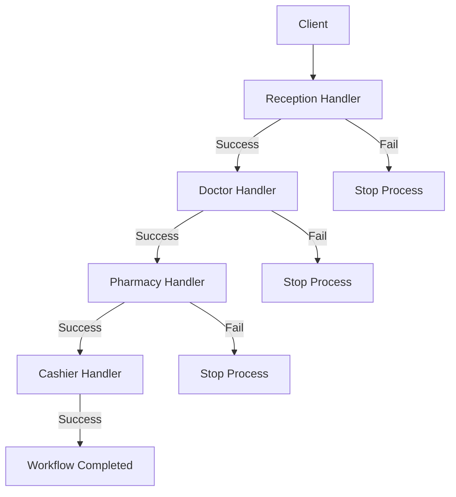

Dalam rekayasa perangkat lunak, kita sering kali perlu memproses sebuah request melalui beberapa tahap seperti validasi, pencatatan log, otentikasi, atau logika bisnis lainnya. Menulis sebuah fungsi monolitik raksasa yang menangani semua tahapan ini membuat kode menjadi rentan error, sulit diuji, dan memiliki ketergantungan yang ketat (*tight coupling*).

**Chain of Responsibility Design Pattern** adalah behavioral pattern yang memecahkan masalah ini dengan cara meneruskan request ke dalam rantai pemroses (*handlers*). Setelah menerima request, setiap handler akan memutuskan apakah akan memproses request tersebut atau langsung meneruskannya ke handler berikutnya di dalam rantai.

---

## Analogi Konseptual: Kunjungan ke Rumah Sakit

Bayangkan seorang pasien yang datang ke rumah sakit untuk melakukan pemeriksaan medis secara menyeluruh (*checkup*). Pasien tidak langsung berinteraksi dengan semua bagian rumah sakit sekaligus. Sebaliknya, mereka mengikuti alur kerja terstruktur:
1.  **Pendaftaran (Reception)**: Pasien mendaftar dan mendapatkan nomor rekam medis.
2.  **Dokter (Doctor)**: Dokter memeriksa kondisi fisik pasien dan menuliskan resep obat.
3.  **Apotek (Pharmacy)**: Apoteker menyiapkan obat sesuai resep yang ditulis dokter.
4.  **Kasir (Cashier)**: Kasir memproses pembayaran obat dan tindakan medis.

Setiap bagian/departemen ini merepresentasikan satu "handler" dalam rantai pemrosesan. Jika pendaftaran gagal mendaftarkan pasien, proses akan langsung berhenti. Jika sukses, pasien akan terus diarahkan dari satu bagian ke bagian berikutnya hingga seluruh rangkaian selesai.

---

## Diagram Konseptual

Berikut adalah diagram Mermaid yang menunjukkan alur request melalui rantai pemrosesan (*chain of handlers*):



---

## Skenario Masalah & Use Case

Dalam pengembangan backend menggunakan Go, kita sangat sering membangun pipeline middleware untuk request HTTP. Sebagai contoh, sebelum sebuah API mengembalikan data, request tersebut mungkin perlu melalui tahap berikut:
1.  Verifikasi token akses (*authentication*).
2.  Validasi struktur format request JSON.
3.  Verifikasi hak akses (*authorization*).
4.  Pembatasan jumlah request (*rate limiting*).

Jika kita menuliskan seluruh logika pemeriksaan ini di dalam satu controller HTTP, kode akan menjadi sangat kotor dan tidak dapat digunakan kembali untuk endpoint lainnya. Dengan Chain of Responsibility pattern, kita dapat menulis modul middleware terpisah dan merangkainya secara dinamis.

---

## Contoh Kode Golang

Di bawah ini adalah contoh kode Go lengkap yang siap dikompilasi, mendemonstrasikan implementasi alur pemeriksaan pasien di rumah sakit menggunakan Chain of Responsibility pattern.

```go
package main

import (
	"fmt"
)

// Patient merepresentasikan objek data request yang akan mengalir dalam rantai handler.
type Patient struct {
	Name              string
	RegistrationDone  bool
	DoctorCheckUpDone bool
	MedicineDone      bool
	PaymentDone       bool
}

// ---------------------------------------------------------
// 1. Handler Interface
// ---------------------------------------------------------

// Department mendefinisikan kontrak kerja bagi setiap handler di dalam rantai.
type Department interface {
	Execute(*Patient)
	SetNext(Department)
}

// ---------------------------------------------------------
// 2. Concrete Handlers
// ---------------------------------------------------------

// Reception bertindak sebagai handler pendaftaran.
type Reception struct {
	next Department
}

func (r *Reception) Execute(p *Patient) {
	if p.RegistrationDone {
		fmt.Printf("Reception: Pasien '%s' sudah terdaftar. Meneruskan ke bagian berikutnya.\n", p.Name)
		r.executeNext(p)
		return
	}
	fmt.Printf("Reception: Mendaftarkan pasien '%s'...\n", p.Name)
	p.RegistrationDone = true
	r.executeNext(p)
}

func (r *Reception) SetNext(next Department) {
	r.next = next
}

func (r *Reception) executeNext(p *Patient) {
	if r.next != nil {
		r.next.Execute(p)
	}
}

// Doctor bertindak sebagai handler pemeriksaan dokter.
type Doctor struct {
	next Department
}

func (d *Doctor) Execute(p *Patient) {
	if p.DoctorCheckUpDone {
		fmt.Printf("Doctor: Pasien '%s' sudah diperiksa dokter. Meneruskan ke bagian berikutnya.\n", p.Name)
		d.executeNext(p)
		return
	}
	fmt.Printf("Doctor: Memeriksa kesehatan pasien '%s' dan menulis resep...\n", p.Name)
	p.DoctorCheckUpDone = true
	d.executeNext(p)
}

func (d *Doctor) SetNext(next Department) {
	d.next = next
}

func (d *Doctor) executeNext(p *Patient) {
	if d.next != nil {
		d.next.Execute(p)
	}
}

// Pharmacy bertindak sebagai handler penyiapan obat di apotek.
type Pharmacy struct {
	next Department
}

func (ph *Pharmacy) Execute(p *Patient) {
	if p.MedicineDone {
		fmt.Printf("Pharmacy: Pasien '%s' sudah menerima obat. Meneruskan ke bagian berikutnya.\n", p.Name)
		ph.executeNext(p)
		return
	}
	fmt.Printf("Pharmacy: Menyiapkan dan menyerahkan obat untuk pasien '%s'...\n", p.Name)
	p.MedicineDone = true
	ph.executeNext(p)
}

func (ph *Pharmacy) SetNext(next Department) {
	ph.next = next
}

func (ph *Pharmacy) executeNext(p *Patient) {
	if ph.next != nil {
		ph.next.Execute(p)
	}
}

// Cashier bertindak sebagai handler pembayaran di kasir.
type Cashier struct {
	next Department
}

func (c *Cashier) Execute(p *Patient) {
	if p.PaymentDone {
		fmt.Printf("Cashier: Pasien '%s' sudah melunasi pembayaran.\n", p.Name)
		return
	}
	fmt.Printf("Cashier: Memproses pembayaran dari pasien '%s'...\n", p.Name)
	p.PaymentDone = true
}

func (c *Cashier) SetNext(next Department) {
	c.next = next
}

// ---------------------------------------------------------
// 3. Client Code / Simulasi
// ---------------------------------------------------------

func main() {
	// 1. Inisialisasi setiap departemen (handler)
	cashier := &Cashier{}
	pharmacy := &Pharmacy{}
	doctor := &Doctor{}
	reception := &Reception{}

	// 2. Susun rantai pemrosesan: Pendaftaran -> Dokter -> Apotek -> Kasir
	reception.SetNext(doctor)
	doctor.SetNext(pharmacy)
	pharmacy.SetNext(cashier)

	// 3. Buat objek pasien
	patientJohn := &Patient{Name: "John Doe"}
	patientAlice := &Patient{
		Name:             "Alice Smith",
		RegistrationDone: true, // Alice sudah mendaftar online sebelumnya
	}

	// 4. Proses pasien John (Alur penuh)
	fmt.Println("--- Memproses Pasien: John Doe ---")
	reception.Execute(patientJohn)

	// 5. Proses pasien Alice (Secara otomatis melewati loket pendaftaran)
	fmt.Println("\n--- Memproses Pasien: Alice Smith ---")
	reception.Execute(patientAlice)
}
```

---

## Ringkasan

### Keuntungan
*   **Decoupling (Mengurangi Ketergantungan)**: Pengirim request tidak perlu mengetahui siapa penerima/pemroses request tersebut secara spesifik. Cukup panggil handler pertama.
*   **Single Responsibility Principle**: Anda dapat memisahkan kelas-kelas pemrosesan logika validasi yang berbeda ke dalam modul masing-masing.
*   **Open/Closed Principle**: Anda dapat menambahkan handler baru atau mengubah urutan rantai secara dinamis di kode tanpa merusak logika yang sudah ada.
*   **Fleksibilitas Tinggi**: Memungkinkan pengaturan alur pemrosesan secara dinamis saat program berjalan (*runtime*).

### Kerugian
*   **Jaminan Pengiriman Lemah**: Request bisa saja mencapai ujung rantai tanpa pernah diproses jika tidak ada satu pun handler yang memprosesnya.
*   **Tantangan Debugging**: Struktur pemanggilan yang menyerupai rantai bertumpuk dapat mempersulit pelacakan (*tracing*) dan debugging saat terjadi kesalahan alur.

### Kapan Harus Digunakan
*   Ketika aplikasi perlu memproses request dalam urutan tahapan tertentu, namun tipe request dan rangkaian pemrosesannya bervariasi secara dinamis.
*   Ketika mengeksekusi serangkaian pemeriksaan dalam urutan tertentu merupakan kebutuhan mutlak sistem.
*   Ketika susunan handler beserta urutan eksekusinya perlu diubah-ubah di level konfigurasi runtime.
