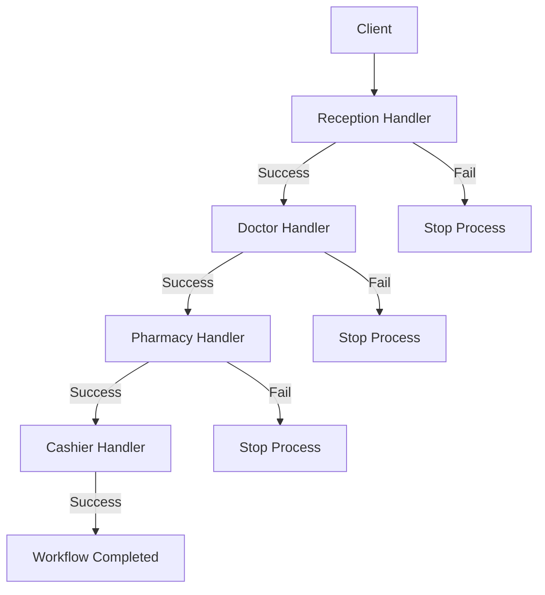

In software engineering, we often need to process a single request through multiple validation, logging, authentication, or business logic steps. Writing a monolithic function that handles all these steps makes the code brittle, hard to test, and tightly coupled. 

The **Chain of Responsibility Design Pattern** is a behavioral pattern that solves this by letting you pass requests along a chain of handlers. Upon receiving a request, each handler decides either to process the request or to pass it to the next handler in the chain.

---

## Conceptual Analogy: The Hospital Visit

Think of a patient visiting a hospital for a medical checkup. The patient doesn't interact with all departments at once. Instead, they follow a structured workflow:
1.  **Reception**: The patient registers and gets their chart.
2.  **Doctor**: The doctor examines the patient and writes a prescription.
3.  **Pharmacy**: The pharmacist prepares the prescribed medicine.
4.  **Cashier**: The cashier handles the payment and invoices.

Each department represents a "handler" in a chain. If the reception fails to register the patient, the process stops. Otherwise, the patient is passed sequentially from one department to the next until the checkup is complete.

---

## Conceptual Diagram

Here is a Mermaid diagram showing the flow of a request through the chain of handlers:



---

## Use Case / Problem Scenario

In Go backend development, we frequently build middleware pipelines for HTTP requests. For instance, before an API endpoint returns data, it might need to:
1.  Verify the authentication token.
2.  Validate the JSON request body.
3.  Check if the user has appropriate roles.
4.  Rate-limit the request.

If we write all this logic inside a single HTTP controller handler, the code becomes messy and cannot be reused across other endpoints. The Chain of Responsibility pattern allows us to write separate, independent middleware structs and chain them dynamically.

---

## Golang Code Example

Below is a complete, compilable Go example illustrating the pattern through the hospital department scenario.

```go
package main

import (
	"fmt"
)

// Patient represents the request data object passing through the chain.
type Patient struct {
	Name              string
	RegistrationDone  bool
	DoctorCheckUpDone bool
	MedicineDone      bool
	PaymentDone       bool
}

// ---------------------------------------------------------
// 1. Handler Interface
// ---------------------------------------------------------

// Department defines the contract for every handler in the chain.
type Department interface {
	Execute(*Patient)
	SetNext(Department)
}

// BaseDepartment provides common helper capabilities if needed.
// However, in Go, composition is used to make implementing handlers clean.

// ---------------------------------------------------------
// 2. Concrete Handlers
// ---------------------------------------------------------

// Reception department handler.
type Reception struct {
	next Department
}

func (r *Reception) Execute(p *Patient) {
	if p.RegistrationDone {
		fmt.Printf("Reception: Patient '%s' is already registered. Passing to next.\n", p.Name)
		r.executeNext(p)
		return
	}
	fmt.Printf("Reception: Registering patient '%s'...\n", p.Name)
	p.RegistrationDone = true
	r.executeNext(p)
}

func (r *Reception) SetNext(next Department) {
	r.next = next
}

func (r *Reception) executeNext(p *Patient) {
	if r.next != nil {
		r.next.Execute(p)
	}
}

// Doctor department handler.
type Doctor struct {
	next Department
}

func (d *Doctor) Execute(p *Patient) {
	if p.DoctorCheckUpDone {
		fmt.Printf("Doctor: Patient '%s' checkup already completed. Passing to next.\n", p.Name)
		d.executeNext(p)
		return
	}
	fmt.Printf("Doctor: Examining patient '%s' and writing prescription...\n", p.Name)
	p.DoctorCheckUpDone = true
	d.executeNext(p)
}

func (d *Doctor) SetNext(next Department) {
	d.next = next
}

func (d *Doctor) executeNext(p *Patient) {
	if d.next != nil {
		d.next.Execute(p)
	}
}

// Pharmacy department handler.
type Pharmacy struct {
	next Department
}

func (ph *Pharmacy) Execute(p *Patient) {
	if p.MedicineDone {
		fmt.Printf("Pharmacy: Patient '%s' already received medication. Passing to next.\n", p.Name)
		ph.executeNext(p)
		return
	}
	fmt.Printf("Pharmacy: Dispensing medicine to patient '%s'...\n", p.Name)
	p.MedicineDone = true
	ph.executeNext(p)
}

func (ph *Pharmacy) SetNext(next Department) {
	ph.next = next
}

func (ph *Pharmacy) executeNext(p *Patient) {
	if ph.next != nil {
		ph.next.Execute(p)
	}
}

// Cashier department handler.
type Cashier struct {
	next Department
}

func (c *Cashier) Execute(p *Patient) {
	if p.PaymentDone {
		fmt.Printf("Cashier: Patient '%s' has already paid.\n", p.Name)
		return
	}
	fmt.Printf("Cashier: Collecting payment from patient '%s'...\n", p.Name)
	p.PaymentDone = true
}

func (c *Cashier) SetNext(next Department) {
	c.next = next
}

// ---------------------------------------------------------
// 3. Client Code / Simulation
// ---------------------------------------------------------

func main() {
	// 1. Initialize all departments (handlers)
	cashier := &Cashier{}
	pharmacy := &Pharmacy{}
	doctor := &Doctor{}
	reception := &Reception{}

	// 2. Set up the chain: Reception -> Doctor -> Pharmacy -> Cashier
	reception.SetNext(doctor)
	doctor.SetNext(pharmacy)
	pharmacy.SetNext(cashier)

	// 3. Instantiate patients
	patientJohn := &Patient{Name: "John Doe"}
	patientAlice := &Patient{
		Name:             "Alice Smith",
		RegistrationDone: true, // Alice already registered online
	}

	// 4. Process patient John (Full workflow)
	fmt.Println("--- Processing Patient: John Doe ---")
	reception.Execute(patientJohn)

	fmt.Println("\n--- Processing Patient: Alice Smith ---")
	// Process patient Alice (Skips registration automatically)
	reception.Execute(patientAlice)
}
```

---

## Summary

### Advantages
*   **Decoupling**: Senders and receivers of requests are decoupled. The client only needs to trigger the first link of the chain.
*   **Single Responsibility Principle**: You can isolate classes that perform different validations/operations into separate modules.
*   **Open/Closed Principle**: You can introduce new handlers or reorder the chain dynamically in code without breaking existing logic.
*   **Flexibility**: Allows dynamically configuring or modifying the order of execution at runtime.

### Disadvantages
*   **Unguaranteed Delivery**: A request might reach the end of the chain without ever being processed if no handler matches the criteria.
*   **Debugging Difficulty**: The chain-like call stack can make it harder to trace and debug where a request was halted or modified.

### When to Use
*   When your program is expected to process different kinds of requests in various ways, but the exact types of requests and their sequences aren't known beforehand.
*   When it is essential to execute several handlers in a specific order.
*   When the set of handlers and their order should change dynamically at runtime.
