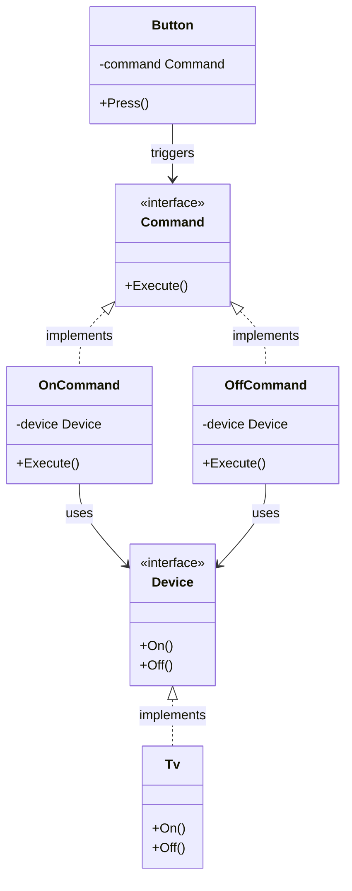

Dalam arsitektur perangkat lunak, memisahkan objek yang memicu tindakan (*trigger*) dari objek yang benar-benar melakukan tindakan tersebut adalah praktik desain yang sangat krusial. Jika sebuah tombol UI harus mengetahui secara spesifik cara mengeksekusi kueri database, aplikasi Anda akan menjadi sangat kusut (*tightly coupled*) dan sulit dirawat.

**Command Design Pattern** adalah behavioral design pattern yang mengubah sebuah request menjadi objek mandiri yang menyimpan semua informasi terkait request tersebut. Transformasi ini memungkinkan Anda mengirim request sebagai argumen metode, menunda atau mengantrekan eksekusi tugas, serta memfasilitasi fitur pembatalan tindakan (*undo*).

---

## Analogi Konseptual: Pesanan di Restoran

Bayangkan Anda sedang makan di restoran yang sibuk. Anda (sebagai **Client**) melihat menu dan menyampaikan pesanan makanan (sebagai **Request**) kepada pramusaji (sebagai **Invoker**). Pramusaji kemudian menuliskan detail pesanan tersebut pada selembar kertas nota (sebagai **Command**).

Pramusaji membawa kertas nota tersebut ke dapur dan menempelkannya di papan antrean. Koki (sebagai **Receiver**) membaca kertas nota tersebut lalu memasak makanan Anda.

Perhatikan pemisahan tugas yang terjadi:
*   Pramusaji tidak perlu tahu cara memasak makanan.
*   Koki tidak perlu tahu siapa nama Anda atau bagaimana cara Anda memesan makanan.
*   Kertas nota (Command) merangkum semua detail pesanan, sehingga dapat dimasukkan ke dalam antrean dapur, ditunda, atau diserahkan ke koki mana pun yang sedang luang.

---

## Diagram Konseptual

Berikut adalah diagram Mermaid yang menunjukkan bagaimana Command memisahkan Invoker dan Receiver:



---

## Skenario Masalah & Use Case

Misalkan kita sedang membangun aplikasi IoT (Internet of Things) untuk rumah pintar menggunakan Go. Kita memiliki beberapa perangkat elektronik: TV, Lampu, dan AC (sebagai Receivers). Di sisi lain, kita memiliki tombol fisik di dinding rumah, tombol di aplikasi mobile, dan perintah suara Google Assistant (sebagai Invokers).

Jika kita memprogram setiap tombol untuk langsung memanggil metode dari perangkat tertentu secara langsung, kita akan menghadapi kesulitan untuk:
1.  Mengubah fungsi tombol ke perangkat lain saat aplikasi sedang berjalan (*runtime*).
2.  Membuat satu tombol "Makro" yang mematikan seluruh perangkat secara bersamaan.
3.  Membuat fitur "Undo" (membatalkan perintah sebelumnya).

Dengan menggunakan Command pattern, kita dapat memisahkan tombol dari perangkat secara total.

---

## Contoh Kode Golang

Berikut adalah implementasi lengkap di Go yang siap dikompilasi untuk menggambarkan Command pattern pada sistem IoT rumah pintar.

```go
package main

import (
	"fmt"
)

// ---------------------------------------------------------
// 1. Receiver Interface & Implementation
// ---------------------------------------------------------

// Device merepresentasikan receiver dari perintah-perintah kita.
type Device interface {
	On()
	Off()
}

// Tv adalah concrete receiver untuk perangkat TV.
type Tv struct {
	isRunning bool
}

func (t *Tv) On() {
	t.isRunning = true
	fmt.Println("TV: Menyala (Powered ON).")
}

func (t *Tv) Off() {
	t.isRunning = false
	fmt.Println("TV: Mati (Powered OFF).")
}

// ---------------------------------------------------------
// 2. Command Interface & Concrete Implementations
// ---------------------------------------------------------

// Command mendefinisikan interface dasar untuk setiap aksi.
type Command interface {
	Execute()
}

// OnCommand bertugas menyalakan perangkat.
type OnCommand struct {
	device Device
}

func (c *OnCommand) Execute() {
	c.device.On()
}

// OffCommand bertugas mematikan perangkat.
type OffCommand struct {
	device Device
}

func (c *OffCommand) Execute() {
	c.device.Off()
}

// ---------------------------------------------------------
// 3. Invoker
// ---------------------------------------------------------

// Button merepresentasikan tombol pemicu perintah.
type Button struct {
	command Command
}

func (b *Button) SetCommand(command Command) {
	b.command = command
}

func (b *Button) Press() {
	b.command.Execute()
}

// ---------------------------------------------------------
// 4. Macro Command (Composite Command)
// ---------------------------------------------------------

// MacroCommand mengeksekusi kumpulan perintah sekaligus.
type MacroCommand struct {
	commands []Command
}

func (m *MacroCommand) Execute() {
	fmt.Println("MacroCommand: Memulai eksekusi perintah massal...")
	for _, cmd := range m.commands {
		cmd.Execute()
	}
}

// ---------------------------------------------------------
// 5. Client Code / Simulasi
// ---------------------------------------------------------

func main() {
	// Inisialisasi receiver
	livingRoomTv := &Tv{}

	// Petakan perintah ke receiver
	turnOnTv := &OnCommand{device: livingRoomTv}
	turnOffTv := &OffCommand{device: livingRoomTv}

	// Inisialisasi tombol pemicu (invoker)
	remoteButton := &Button{}

	// 1. Atur tombol remote untuk menyalakan TV
	fmt.Println("--- Memprogram Tombol Remote: Nyalakan TV ---")
	remoteButton.SetCommand(turnOnTv)
	remoteButton.Press()

	// 2. Ubah fungsi tombol remote untuk mematikan TV
	fmt.Println("\n--- Memprogram Tombol Remote: Matikan TV ---")
	remoteButton.SetCommand(turnOffTv)
	remoteButton.Press()

	// 3. Membuat Macro Command (Mematikan seluruh TV di rumah)
	fmt.Println("\n--- Membuat Perintah Makro (Macro Command) ---")
	bedroomTv := &Tv{}
	masterOffCommand := &MacroCommand{
		commands: []Command{
			&OffCommand{device: livingRoomTv},
			&OffCommand{device: bedroomTv},
		},
	}

	macroButton := &Button{command: masterOffCommand}
	macroButton.Press()
}
```

---

## Ringkasan

### Keuntungan
*   **Pemisahan Tanggung Jawab (Decoupling)**: Memisahkan secara total objek yang memicu operasi dari objek yang mengetahui cara memprosesnya.
*   **Ekstabilitas Tinggi**: Anda dapat dengan mudah menambahkan Command baru tanpa perlu mengubah kode lama (sesuai dengan Open/Closed Principle).
*   **Macro Command (Perintah Makro)**: Anda dapat merangkai beberapa perintah sederhana menjadi satu kesatuan perintah kompleks (*composite pattern*).
*   **Penjadwalan & Antrean**: Karena dikemas sebagai objek mandiri, Anda dapat menyimpan perintah di dalam database atau message queue untuk dieksekusi di kemudian hari.
*   **Undo/Redo**: Membantu memfasilitasi rollback operasi karena objek command dapat diprogram untuk melacak riwayat state sebelumnya.

### Kerugian
*   **Boilerplate Tambahan**: Menghasilkan banyak kelas/struct baru untuk memetakan panggilan metode sederhana, sehingga membuat struktur kode terasa lebih besar.

### Kapan Harus Digunakan
*   Ketika Anda ingin memetakan aksi yang sama dari berbagai pemicu (misal: tombol keyboard shortcut, tombol menu, dan tombol klik biasa memanggil aksi yang sama).
*   Ketika Anda ingin menjadwalkan, mengantrekan, atau menjalankan operasi secara asinkron.
*   Ketika aplikasi Anda membutuhkan fungsionalitas pembatalan tindakan (*undo* dan *redo*).
