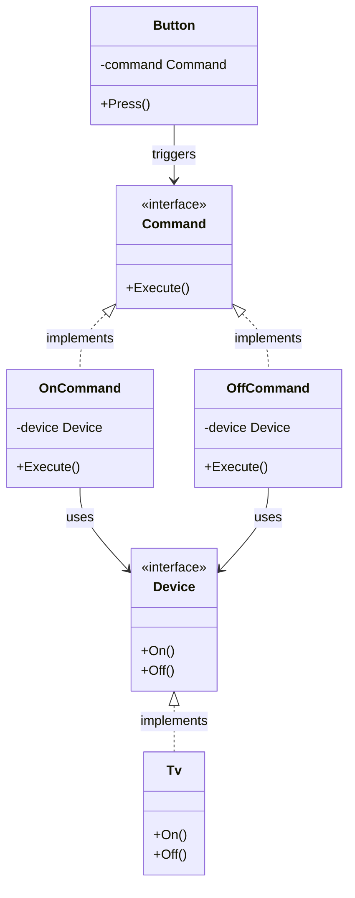

In software architecture, decoupling the objects that trigger actions from the objects that actually perform those actions is a fundamental practice. If a UI button has to know exactly how to execute a database query, your application becomes tightly coupled and difficult to maintain.

The **Command Design Pattern** is a behavioral design pattern that turns a request into a stand-alone object containing all information about the request. This transformation allows you to pass requests as method arguments, delay or queue a request's execution, and support undoable operations.

---

## Conceptual Analogy: The Restaurant Order

Imagine entering a busy restaurant. You (the **Client**) look at the menu and place an order (the **Request**) with the waiter (the **Invoker**). The waiter writes your order down on a slip of paper (the **Command**). 

The waiter then takes the slip to the kitchen and pins it on the queue board. The chef (the **Receiver**) reads the slip and prepares your meal. 

Notice the separation:
*   The waiter doesn't need to know how to cook the food.
*   The chef doesn't need to know you personally or how you ordered.
*   The slip of paper (the Command) encapsulates all the details of the order, allowing it to be queued, reordered, or passed from hand to hand.

---

## Conceptual Diagram

Here is a Mermaid diagram showing the decoupling of the Invoker, Command, and Receiver:



---

## Use Case / Problem Scenario

Suppose we are developing an IoT smart home application in Go. We have a set of home appliances: TVs, Lights, and Air Conditioners (Receivers). We also have user interface elements like physical buttons, mobile app buttons, and voice commands (Invokers).

If we hardcode each button to call a specific method of a specific device directly, we won't be able to:
1.  Map a button to a different device at runtime.
2.  Implement a "Macro" button that turns off all devices simultaneously.
3.  Implement an "Undo" command stack.

By introducing the Command pattern, we can decouple buttons from devices.

---

## Golang Code Example

Below is a complete, compilable Go implementation demonstrating the Command pattern in a smart home application.

```go
package main

import (
	"fmt"
)

// ---------------------------------------------------------
// 1. Receiver Interface & Implementation
// ---------------------------------------------------------

// Device represents the receiver of our commands.
type Device interface {
	On()
	Off()
}

// Tv is a concrete receiver.
type Tv struct {
	isRunning bool
}

func (t *Tv) On() {
	t.isRunning = true
	fmt.Println("TV: Powered ON.")
}

func (t *Tv) Off() {
	t.isRunning = false
	fmt.Println("TV: Powered OFF.")
}

// ---------------------------------------------------------
// 2. Command Interface & Concrete Implementations
// ---------------------------------------------------------

// Command defines the action interface.
type Command interface {
	Execute()
}

// OnCommand turns a device on.
type OnCommand struct {
	device Device
}

func (c *OnCommand) Execute() {
	c.device.On()
}

// OffCommand turns a device off.
type OffCommand struct {
	device Device
}

func (c *OffCommand) Execute() {
	c.device.Off()
}

// ---------------------------------------------------------
// 3. Invoker
// ---------------------------------------------------------

// Button represents the invoker triggering commands.
type Button struct {
	command Command
}

func (b *Button) SetCommand(command Command) {
	b.command = command
}

func (b *Button) Press() {
	b.command.Execute()
}

// ---------------------------------------------------------
// 4. Macro Command (Bonus: Composite Command)
// ---------------------------------------------------------

// MacroCommand executes multiple commands sequentially.
type MacroCommand struct {
	commands []Command
}

func (m *MacroCommand) Execute() {
	fmt.Println("MacroCommand: Triggering batch operations...")
	for _, cmd := range m.commands {
		cmd.Execute()
	}
}

// ---------------------------------------------------------
// 5. Client Code / Simulation
// ---------------------------------------------------------

func main() {
	// Initialize receivers
	livingRoomTv := &Tv{}

	// Initialize commands mapping to receivers
	turnOnTv := &OnCommand{device: livingRoomTv}
	turnOffTv := &OffCommand{device: livingRoomTv}

	// Initialize invokers
	remoteButton := &Button{}

	// 1. Configure remote button to turn TV ON
	fmt.Println("--- Programming Remote Button: Turn ON TV ---")
	remoteButton.SetCommand(turnOnTv)
	remoteButton.Press()

	// 2. Reconfigure remote button to turn TV OFF
	fmt.Println("\n--- Programming Remote Button: Turn OFF TV ---")
	remoteButton.SetCommand(turnOffTv)
	remoteButton.Press()

	// 3. Create a Macro Command (e.g. Master Power Off)
	fmt.Println("\n--- Setting up Macro Command ---")
	bedroomTv := &Tv{}
	masterOffCommand := &MacroCommand{
		commands: []Command{
			&OffCommand{device: livingRoomTv},
			&OffCommand{device: bedroomTv},
		},
	}

	macroButton := &Button{command: masterOffCommand}
	macroButton.Press()
}
```

---

## Summary

### Advantages
*   **Decoupling**: Separates the class that invokes the operation from the class that knows how to perform it.
*   **Extensibility**: You can easily add new Commands without changing existing code (Open/Closed Principle).
*   **Composite Commands**: You can assemble multiple simple commands into a single complex Macro command.
*   **Scheduling / Queueing**: Since commands are standalone objects, you can serialize and store them inside database tables or queues to execute later.
*   **Undo/Redo**: Commands can keep track of their prior state, making it simple to implement rollback operations.

### Disadvantages
*   **Code Boilerplate**: Introduces many new classes/structs to express simple method calls, which can clutter your codebase.

### When to Use
*   When you want to parameterize objects by action (e.g., mapping keyboard shortcuts, menu buttons, and context options to the same command).
*   When you need to queue, schedule, or run operations asynchronously.
*   When your application requires undo/redo capabilities.
