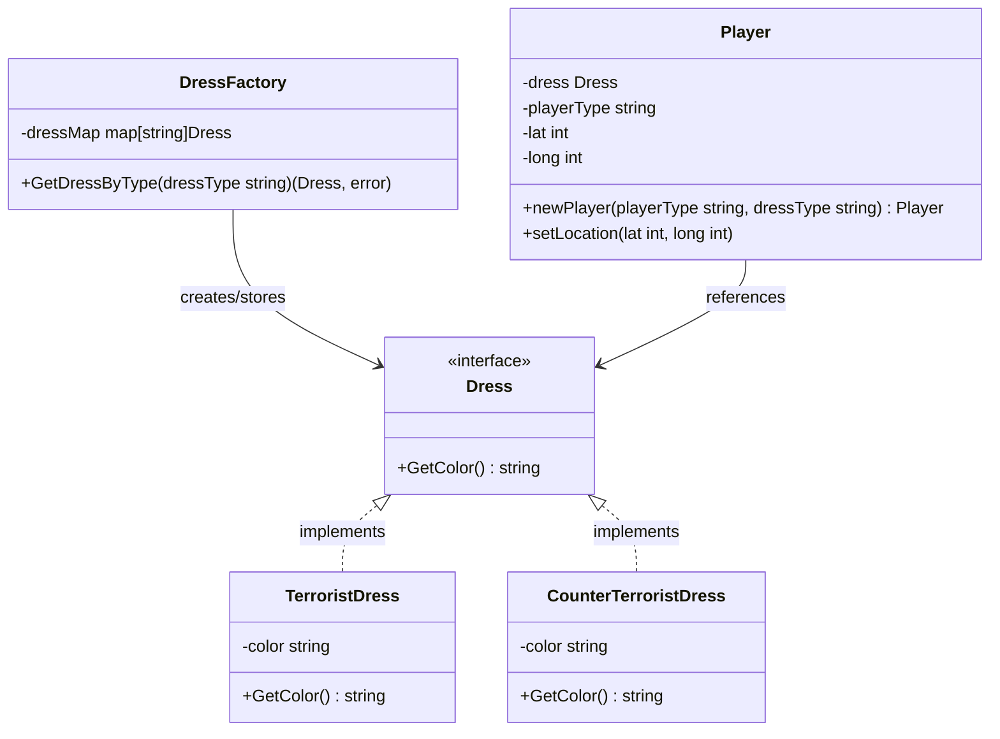

Dalam pengembangan perangkat lunak, mengelola memori dan sumber daya secara efisien adalah salah satu ciri rekayasa perangkat lunak profesional. Seiring berkembangnya aplikasi, pembuatan jutaan objek secara bersamaan dapat menurunkan performa dengan cepat, menyebabkan overhead pada Garbage Collector (GC), atau bahkan memicu *out-of-memory error*.

**Flyweight Design Pattern** adalah structural pattern yang dirancang khusus untuk mengatasi masalah ini. Pola ini memungkinkan kita memuat lebih banyak objek ke dalam kapasitas RAM yang tersedia dengan cara membagikan bagian state (keadaan) yang sama di antara beberapa objek, alih-alih menyimpan semua data tersebut di setiap objek secara individual.

---

## Analogi Konseptual: Game Engine

Bayangkan Anda sedang mengembangkan game MOBA (Massive Multiplayer Online Battle Arena) berskala besar. Di dalam game ini, terdapat ribuan partikel yang dirender di layar secara bersamaan: peluru yang melesat, percikan api dari ledakan, dan daun-daun yang berguguran.

Jika setiap partikel menyimpan properti seperti koordinat posisi, kecepatan, model 3D, tekstur gambar, dan warna, maka merender 100.000 partikel sekaligus akan menghabiskan memori sistem dengan sangat cepat. Padahal, tekstur dan model 3D dari partikel "percikan api" tersebut sama persis untuk semua partikel sejenis.

Dengan pola Flyweight, kita memisahkan state objek menjadi dua bagian:
1. **Intrinsic State (Flyweight)**: State yang bernilai konstan dan dapat dibagikan di antara semua objek (contoh: mesh model 3D, data tekstur, dan warna bawaan).
2. **Extrinsic State (Context)**: State yang nilainya bervariasi untuk setiap objek dan bergantung pada konteksnya (contoh: koordinat 3D saat ini, kecepatan, dan orientasi arah).

Dengan membagikan *intrinsic state* dan hanya melewatkan *extrinsic state* sebagai argumen saat memanggil operasi, kita dapat memangkas penggunaan memori secara signifikan.

---

## Diagram Konseptual

Berikut adalah diagram Mermaid yang menggambarkan struktur Flyweight pattern:



---

## Skenario Masalah & Use Case

Misalkan kita ingin membangun game shooter taktis multipemain di Go yang merepresentasikan pemain dalam sebuah pertandingan. Di game ini terdapat dua kubu: Terrorist (T) dan Counter-Terrorist (CT). Setiap objek pemain perlu menyimpan informasi seragam/pakaian yang mereka kenakan.

Tanpa Flyweight pattern, setiap objek pemain akan menginstansiasi objek pakaiannya sendiri. Jika terdapat 1.000 pemain aktif atau NPC, akan ada 1.000 struktur pakaian yang disimpan di memori, padahal pakaian tersebut hanya terdiri dari dua jenis yang berbeda.

Dengan mengimplementasikan Flyweight pattern, kita cukup menyimpan dua instans pakaian di memori dan membagikannya ke seluruh objek pemain yang relevan.

---

## Contoh Kode Golang

Berikut adalah implementasi lengkap dan siap kompilasi di Go yang mendemonstrasikan Flyweight pattern.

```go
package main

import (
	"fmt"
)

// ---------------------------------------------------------
// 1. Flyweight Interface
// ---------------------------------------------------------

// Dress mendefinisikan perilaku yang harus diimplementasikan oleh concrete flyweights.
type Dress interface {
	GetColor() string
}

// ---------------------------------------------------------
// 2. Concrete Flyweights
// ---------------------------------------------------------

// TerroristDress merepresentasikan intrinsic state untuk kubu Terrorist.
type TerroristDress struct {
	color string
}

// GetColor mengembalikan warna pakaian Terrorist yang dibagikan.
func (t *TerroristDress) GetColor() string {
	return t.color
}

// CounterTerroristDress merepresentasikan intrinsic state untuk kubu Counter-Terrorist.
type CounterTerroristDress struct {
	color string
}

// GetColor mengembalikan warna pakaian Counter-Terrorist yang dibagikan.
func (c *CounterTerroristDress) GetColor() string {
	return c.color
}

// ---------------------------------------------------------
// 3. Flyweight Factory
// ---------------------------------------------------------

// DressFactory memastikan flyweights dibagikan dan digunakan kembali dengan benar.
type DressFactory struct {
	dressMap map[string]Dress
}

// Kita mendefinisikan kunci untuk flyweights kita.
const (
	TerroristDressType       = "tDress"
	CounterTerroristDressType = "ctDress"
)

// Instans tunggal dari dress factory (wrapper Singleton).
var (
	dressFactorySingleInstance = &DressFactory{
		dressMap: make(map[string]Dress),
	}
)

// GetDressFactorySingleInstance mengembalikan instans singleton dari dress factory.
func GetDressFactorySingleInstance() *DressFactory {
	return dressFactorySingleInstance
}

// GetDressByType mengembalikan instans Flyweight yang dibagikan atau membuatnya jika belum ada.
func (d *DressFactory) GetDressByType(dressType string) (Dress, error) {
	// Jika pakaian sudah ada di dalam cache, gunakan kembali.
	if dress, exists := d.dressMap[dressType]; exists {
		return dress, nil
	}

	// Jika belum ada, buat baru lalu simpan di map.
	switch dressType {
	case TerroristDressType:
		d.dressMap[dressType] = &TerroristDress{color: "merah"}
		return d.dressMap[dressType], nil
	case CounterTerroristDressType:
		d.dressMap[dressType] = &CounterTerroristDress{color: "biru"}
		return d.dressMap[dressType], nil
	default:
		return nil, fmt.Errorf("tipe pakaian salah: %s", dressType)
	}
}

// ---------------------------------------------------------
// 4. Context (Mengandung Extrinsic State)
// ---------------------------------------------------------

// Player berisi extrinsic state (koordinat) dan referensi ke intrinsic state (dress).
type Player struct {
	dress      Dress  // Referensi ke Flyweight (Intrinsic State)
	playerType string // Extrinsic State
	lat        int    // Extrinsic State
	long       int    // Extrinsic State
}

// NewPlayer membuat pemain baru menggunakan Flyweight factory.
func NewPlayer(playerType, dressType string) *Player {
	factory := GetDressFactorySingleInstance()
	dress, err := factory.GetDressByType(dressType)
	if err != nil {
		panic(err)
	}
	return &Player{
		playerType: playerType,
		dress:      dress,
	}
}

// SetLocation mengubah extrinsic state.
func (p *Player) SetLocation(lat, long int) {
	p.lat = lat
	p.long = long
}

// Display menampilkan detail data pemain.
func (p *Player) Display() {
	fmt.Printf("Player: %s | Lokasi: (%d, %d) | Warna Pakaian: %s | Pointer Pakaian: %p\n",
		p.playerType, p.lat, p.long, p.dress.GetColor(), p.dress)
}

// ---------------------------------------------------------
// 5. Client Code / Simulasi
// ---------------------------------------------------------

type Game struct {
	players []*Player
}

func NewGame() *Game {
	return &Game{
		players: make([]*Player, 0),
	}
}

func (g *Game) AddPlayer(playerType, dressType string, lat, long int) {
	player := NewPlayer(playerType, dressType)
	player.SetLocation(lat, long)
	g.players = append(g.players, player)
}

func main() {
	game := NewGame()

	// Menambahkan pemain ke simulasi game kita.
	game.AddPlayer("T1", TerroristDressType, 10, 20)
	game.AddPlayer("T2", TerroristDressType, 12, 22)
	game.AddPlayer("T3", TerroristDressType, 15, 25)

	game.AddPlayer("CT1", CounterTerroristDressType, 50, 60)
	game.AddPlayer("CT2", CounterTerroristDressType, 52, 62)

	// Tampilkan data semua pemain
	for _, player := range game.players {
		player.Display()
	}

	// Verifikasi bahwa objek dress benar-benar dibagikan (shared)
	factory := GetDressFactorySingleInstance()
	fmt.Printf("\n--- Total Objek Flyweight di Cache: %d ---\n", len(factory.dressMap))
}
```

---

## Ringkasan

### Keuntungan
*   **Mengurangi Penggunaan Memori Secara Drastis**: Membagikan data *intrinsic* yang berat ke ratusan atau ribuan instans.
*   **Meningkatkan Performa**: Jejak memori (*memory footprint*) yang lebih kecil meminimalkan *cache miss* pada CPU dan mengurangi beban Go Garbage Collector.
*   **Pengelolaan State Terpusat**: Perubahan perilaku pada *intrinsic state* cukup diubah di satu tempat (objek flyweight) dan otomatis berdampak ke seluruh pemanggil.

### Kerugian
*   **Kompleksitas**: Meningkatkan kompleksitas kode karena harus memisahkan atribut objek menjadi bagian intrinsic dan extrinsic.
*   **CPU Trade-Off**: Menghitung atau mengolah data extrinsic secara dinamis setiap kali memanggil metode Flyweight dapat memakan siklus CPU tambahan.

### Kapan Harus Digunakan
*   Ketika aplikasi Anda membutuhkan pembuatan objek dalam jumlah yang sangat besar (contoh: editor dokumen yang memformat setiap karakter, rendering grafis game, atau pemetaan koordinat geografis).
*   Ketika kapasitas RAM menjadi *bottleneck* utama dan banyak objek menyimpan data redundan yang sebenarnya bisa dibagikan secara bersamaan.
