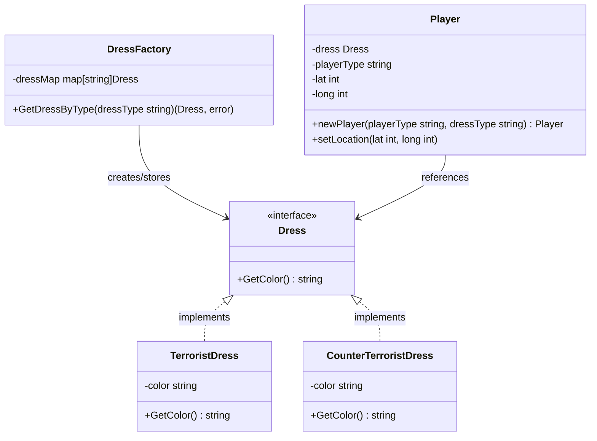

In software development, managing memory and resources efficiently is a hallmark of professional engineering. As applications scale, creating millions of objects can quickly degrade performance, leading to high garbage collection overhead or out-of-memory errors. 

The **Flyweight Design Pattern** is a structural pattern designed specifically to solve this issue. It allows you to fit more objects into the available amount of RAM by sharing common parts of state between multiple objects, instead of keeping all of the data in each object.

---

## Conceptual Analogy: The Game Engine

Imagine you are developing a massive multiplayer online battle arena (MOBA) game. In this game, thousands of particles are rendered on screen simultaneously: bullets flying, sparks from explosions, and falling leaves.

If each particle contains properties like its coordinates, velocity, model, texture, and color, rendering 100,000 particles simultaneously would exhaust the system's memory. However, the texture and 3D model of a "spark" particle are identical for all sparks. 

Under the Flyweight pattern, we separate the state of an object into two parts:
1. **Intrinsic State (Flyweight)**: State that remains constant and is shared among all objects (e.g., the 3D model mesh, texture data, and default colors).
2. **Extrinsic State (Context)**: State that varies from object to object and depends on the context (e.g., current 3D coordinates, speed, and orientation).

By sharing the intrinsic state and passing the extrinsic state as arguments when executing operations, we dramatically reduce the memory footprint.

---

## Conceptual Diagram

Here is a Mermaid diagram showing the structure of the Flyweight pattern:



---

## Use Case / Problem Scenario

Suppose we are building a multiplayer tactical shooter game in Go, representing players in a match. In our game, we have two factions: Terrorists (T) and Counter-Terrorists (CT). Each player structure needs to reference the outfit/dress they are wearing. 

Without the Flyweight pattern, each player object would instantiate its own dress object. If there are 1,000 active players or NPCs, 1,000 dress structures will be stored in memory, even though they only represent two distinct types.

By implementing the Flyweight pattern, we can store only two dress instances in memory and share them across all player objects.

---

## Golang Code Example

Below is a complete, compilable Go implementation demonstrating the Flyweight pattern.

```go
package main

import (
	"fmt"
)

// ---------------------------------------------------------
// 1. Flyweight Interface
// ---------------------------------------------------------

// Dress defines the behavior that concrete flyweights must implement.
type Dress interface {
	GetColor() string
}

// ---------------------------------------------------------
// 2. Concrete Flyweights
// ---------------------------------------------------------

// TerroristDress represents the intrinsic state for Terrorists.
type TerroristDress struct {
	color string
}

// GetColor returns the shared color of Terrorists.
func (t *TerroristDress) GetColor() string {
	return t.color
}

// CounterTerroristDress represents the intrinsic state for Counter-Terrorists.
type CounterTerroristDress struct {
	color string
}

// GetColor returns the shared color of Counter-Terrorists.
func (c *CounterTerroristDress) GetColor() string {
	return c.color
}

// ---------------------------------------------------------
// 3. Flyweight Factory
// ---------------------------------------------------------

// DressFactory ensures flyweights are shared and reused properly.
type DressFactory struct {
	dressMap map[string]Dress
}

// We define keys for our flyweights.
const (
	TerroristDressType       = "tDress"
	CounterTerroristDressType = "ctDress"
)

// Single instance of the dress factory (Singleton wrapper).
var (
	dressFactorySingleInstance = &DressFactory{
		dressMap: make(map[string]Dress),
	}
)

// GetDressFactorySingleInstance returns the singleton dress factory instance.
func GetDressFactorySingleInstance() *DressFactory {
	return dressFactorySingleInstance
}

// GetDressByType returns a shared Flyweight instance or creates it if it doesn't exist.
func (d *DressFactory) GetDressByType(dressType string) (Dress, error) {
	// If the dress already exists in our cache, reuse it.
	if dress, exists := d.dressMap[dressType]; exists {
		return dress, nil
	}

	// Otherwise, create and store it.
	switch dressType {
	case TerroristDressType:
		d.dressMap[dressType] = &TerroristDress{color: "red"}
		return d.dressMap[dressType], nil
	case CounterTerroristDressType:
		d.dressMap[dressType] = &CounterTerroristDress{color: "blue"}
		return d.dressMap[dressType], nil
	default:
		return nil, fmt.Errorf("wrong dress type passed: %s", dressType)
	}
}

// ---------------------------------------------------------
// 4. Context (Contains Extrinsic State)
// ---------------------------------------------------------

// Player contains extrinsic state (coordinates) and references the intrinsic state (dress).
type Player struct {
	dress      Dress  // Reference to Flyweight (Intrinsic State)
	playerType string // Extrinsic State
	lat        int    // Extrinsic State
	long       int    // Extrinsic State
}

// NewPlayer creates a new player using the Flyweight factory.
func NewPlayer(playerType, dressType string) *Player {
	factory := GetDressFactorySingleInstance()
	dress, err := factory.GetDressByType(dressType)
	if err != nil {
		panic(err)
	}
	return &Player{
		playerType: playerType,
		dress:      dress,
	}
}

// SetLocation modifies the extrinsic state.
func (p *Player) SetLocation(lat, long int) {
	p.lat = lat
	p.long = long
}

// Display prints the player details.
func (p *Player) Display() {
	fmt.Printf("Player: %s | Location: (%d, %d) | Dress Color: %s | Dress Pointer: %p\n",
		p.playerType, p.lat, p.long, p.dress.GetColor(), p.dress)
}

// ---------------------------------------------------------
// 5. Client Code / Simulation
// ---------------------------------------------------------

type Game struct {
	players []*Player
}

func NewGame() *Game {
	return &Game{
		players: make([]*Player, 0),
	}
}

func (g *Game) AddPlayer(playerType, dressType string, lat, long int) {
	player := NewPlayer(playerType, dressType)
	player.SetLocation(lat, long)
	g.players = append(g.players, player)
}

func main() {
	game := NewGame()

	// Adding players to our game simulation.
	game.AddPlayer("T1", TerroristDressType, 10, 20)
	game.AddPlayer("T2", TerroristDressType, 12, 22)
	game.AddPlayer("T3", TerroristDressType, 15, 25)

	game.AddPlayer("CT1", CounterTerroristDressType, 50, 60)
	game.AddPlayer("CT2", CounterTerroristDressType, 52, 62)

	// Display all players
	for _, player := range game.players {
		player.Display()
	}

	// Verify that the dress objects are indeed shared
	factory := GetDressFactorySingleInstance()
	fmt.Printf("\n--- Total Flyweight Objects Cached: %d ---\n", len(factory.dressMap))
}
```

---

## Summary

### Advantages
*   **Drastically Reduces Memory Usage**: Shares heavy intrinsic data across hundreds or thousands of instances.
*   **Improves Performance**: Lower memory footprint results in fewer CPU cache misses and less pressure on the Go garbage collector.
*   **Centralized State Management**: Modifying intrinsic state behavior inside a flyweight propagates immediately to all references.

### Disadvantages
*   **Complexity**: Increases codebase complexity by dividing objects into intrinsic and extrinsic parts.
*   **CPU Trade-Off**: Computing extrinsic values on-the-fly whenever calling flyweight methods can consume extra CPU cycles.

### When to Use
*   When your application requires spawning an extremely large number of objects (e.g., document editors formatting individual characters, game rendering, or geographic mapping software).
*   When the RAM capacity is an actual bottleneck and objects contain repetitive, redundant metadata that can be easily shared.
