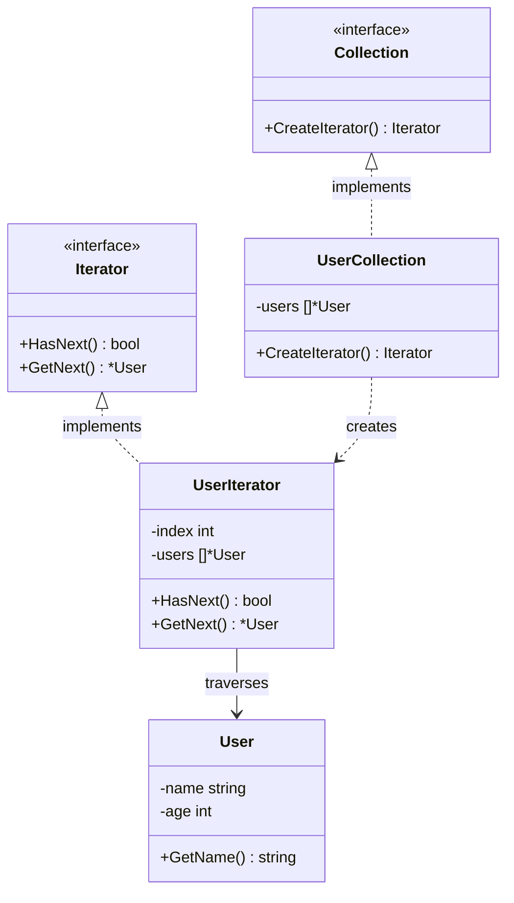

Dalam rekayasa perangkat lunak, kita selalu berhadapan dengan koleksi data (*collections*). Baik itu berupa array sederhana, linked list, binary tree, hingga graf yang rumit, kita sering kali perlu mengakses dan menelusuri (*traversing*) elemen-elemen yang disimpan di dalam struktur data tersebut.

Jika Anda membuka struktur penyimpanan internal dari koleksi data tersebut ke publik, klien yang menggunakan kode Anda akan sangat bergantung pada cara data disimpan. Jika suatu saat Anda memutuskan mengubah struktur linked list menjadi balanced binary tree untuk mempercepat pencarian data, maka semua baris kode klien yang melakukan perulangan (*looping*) akan rusak.

**Iterator Design Pattern** adalah behavioral design pattern yang memungkinkan Anda menelusuri elemen-elemen dari sebuah koleksi tanpa perlu mengekspos representasi internalnya (apakah itu list, stack, tree, dll).

---

## Analogi Konseptual: Pemandu Wisata

Bayangkan Anda mengunjungi sebuah kota kuno bersejarah yang memiliki tata letak jalan yang rumit dan sempit. Anda ingin mendatangi semua situs bersejarah di sana. Anda bisa saja membeli peta kota dan menghabiskan waktu berjam-jam tersesat menavigasi jalan, atau Anda bisa menyewa pemandu wisata profesional.

Pemandu wisata tersebut:
*   Sangat memahami seluruh tata letak dan jalur kota.
*   Membimbing Anda dari satu situs sejarah ke situs berikutnya secara berurutan.
*   Menyembunyikan kerumitan rute jalan; Anda cukup berjalan di belakang mereka dan menikmati pemandangan monumen.

Dalam skenario ini:
*   Kota kuno bersejarah adalah **Collection**.
*   Pemandu wisata adalah **Iterator**.
*   Anda adalah **Client**. Anda bisa mengunjungi seluruh destinasi tanpa harus mempelajari peta rute jalan kota yang rumit secara mandiri.

---

## Diagram Konseptual

Berikut adalah diagram Mermaid yang menunjukkan interaksi Client dengan Iterator dan Collection melalui interface abstrak:



---

## Skenario Masalah & Use Case

Bayangkan kita sedang membangun platform media sosial menggunakan Go. Kita mengelola kumpulan profil pengguna (`User`). Untuk beberapa fitur, kita menyimpannya dalam format slice datar. Untuk fitur lainnya, kita mungkin menyimpannya dalam struktur binary search tree yang diurutkan berdasarkan usia, atau graf untuk hubungan pertemanan.

Jika layanan pelaporan kita perlu mencetak nama semua pengguna, layanan tersebut seharusnya tidak perlu tahu apakah data tersebut disimpan di dalam slice, tree, atau graf. Kita dapat memperkenalkan interface `Iterator` sehingga layanan pelaporan dapat memanggil metode `HasNext()` dan `GetNext()` secara seragam, memisahkan logika penelusuran dari cara data disimpan.

---

## Contoh Kode Golang

Berikut adalah contoh kode Go lengkap dan siap dikompilasi yang mendemonstrasikan implementasi Iterator pattern.

```go
package main

import (
	"fmt"
)

// User merepresentasikan struktur data yang disimpan di dalam koleksi.
type User struct {
	name string
	age  int
}

func (u *User) GetName() string {
	return u.name
}

func (u *User) GetAge() int {
	return u.age
}

// ---------------------------------------------------------
// 1. Iterator & Collection Interfaces
// ---------------------------------------------------------

// Iterator mendefinisikan metode yang dibutuhkan untuk menelusuri koleksi.
type Iterator interface {
	HasNext() bool
	GetNext() *User
}

// Collection mendefinisikan metode untuk membuat iterator.
type Collection interface {
	CreateIterator() Iterator
}

// ---------------------------------------------------------
// 2. Concrete Collection
// ---------------------------------------------------------

// UserCollection menyimpan kumpulan data user di dalam slice privat.
type UserCollection struct {
	users []*User
}

// AddUser menambahkan user baru ke dalam koleksi.
func (uc *UserCollection) AddUser(u *User) {
	uc.users = append(uc.users, u)
}

// CreateIterator membuat instans baru dari UserIterator.
func (uc *UserCollection) CreateIterator() Iterator {
	return &UserIterator{
		users: uc.users,
		index: 0,
	}
}

// ---------------------------------------------------------
// 3. Concrete Iterator
// ---------------------------------------------------------

// UserIterator melacak posisi penelusuran (*cursor index*) di dalam UserCollection.
type UserIterator struct {
	users []*User
	index int
}

// HasNext memeriksa apakah kursor penelusuran sudah mencapai akhir koleksi.
func (ui *UserIterator) HasNext() bool {
	return ui.index < len(ui.users)
}

// GetNext mengambil elemen saat ini lalu memajukan kursor index satu langkah.
func (ui *UserIterator) GetNext() *User {
	if ui.HasNext() {
		user := ui.users[ui.index]
		ui.index++
		return user
	}
	return nil
}

// ---------------------------------------------------------
// 4. Client Code / Simulasi
// ---------------------------------------------------------

func main() {
	// Inisialisasi concrete collection
	collection := &UserCollection{}

	// Menambahkan data
	collection.AddUser(&User{name: "Alice", age: 25})
	collection.AddUser(&User{name: "Bob", age: 30})
	collection.AddUser(&User{name: "Charlie", age: 22})

	// Membuat iterator (terlepas dari eksposur slice privat)
	iterator := collection.CreateIterator()

	fmt.Println("--- Melakukan Iterasi Pada Koleksi User ---")
	for iterator.HasNext() {
		user := iterator.GetNext()
		fmt.Printf("User: %s | Usia: %d\n", user.GetName(), user.GetAge())
	}
}
```

---

## Ringkasan

### Keuntungan
*   **Kode Klien yang Bersih (SRP)**: Kode klien tidak dikotori oleh logika pelacakan indeks (*index tracker*) atau algoritma penelusuran tree yang rumit.
*   **Separation of Concerns (OCP)**: Anda dapat membuat tipe koleksi baru atau algoritma penelusuran baru tanpa perlu mengubah kode klien yang melakukan iterasi.
*   **Iterasi Paralel**: Beberapa iterator dapat menelusuri koleksi yang sama secara bersamaan karena masing-masing objek iterator melacak posisi indeksnya sendiri.
*   **Algoritma Penelusuran Fleksibel**: Anda dapat membuat beberapa jenis iterator untuk struktur data yang sama (misal: penelusuran pohon biner secara In-order, Pre-order, Depth-First, atau Breadth-First) dan menukarnya dengan mudah.

### Kerugian
*   **Terlalu Berlebihan untuk Koleksi Sederhana**: Menggunakan Iterator pattern untuk slice datar satu dimensi hanya menambah kompleksitas abstraksi yang tidak perlu, karena perulangan `range` bawaan Go sudah sangat mencukupi.
*   **Penggunaan Memori Tambahan**: Setiap objek iterator perlu menyimpan state posisi indeks saat ini, yang memakan sedikit alokasi memori tambahan.

### Kapan Harus Digunakan
*   Ketika koleksi Anda memiliki struktur data internal yang kompleks di baliknya (seperti graf, heap, atau binary tree) dan Anda ingin menyembunyikan kerumitan tersebut dari pemanggil.
*   Ketika Anda perlu mendukung berbagai macam algoritma penelusuran pada koleksi data yang sama.
*   Ketika Anda menginginkan kode klien dapat melakukan penelusuran secara seragam (*polymorphic traversal*) di berbagai tipe koleksi data.
