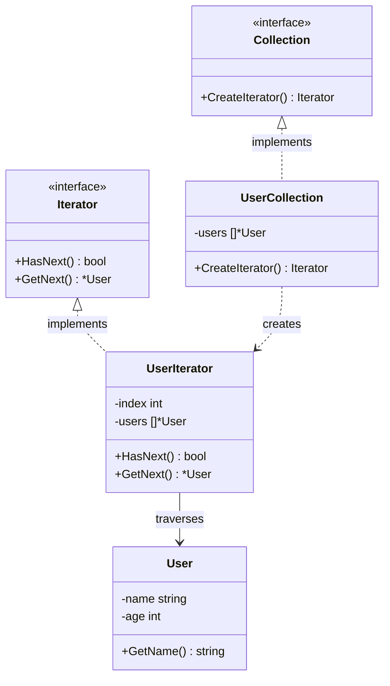

In software engineering, collections of data are everywhere. Whether it is a simple array, a linked list, a binary tree, or a complex graph, we constantly need to access and traverse the elements stored inside these data structures. 

If you expose the internal structure of your collections, clients become dependent on how data is stored. If you decide to change a list into a balanced tree tomorrow to speed up lookups, all the client code traversing your collection will break.

The **Iterator Design Pattern** is a behavioral pattern that lets you traverse elements of a collection without exposing its underlying representation (list, stack, tree, etc.).

---

## Conceptual Analogy: The Tour Guide

Imagine visiting an ancient city with a complex layout of narrow streets. You want to see all the historical landmarks. You could purchase a map and spend hours navigating, or you could hire a professional tour guide.

The tour guide:
*   Knows the entire layout of the city.
*   Guides you from one historical site to the next in a sequential order.
*   Hides the complexity of finding the streets; you just walk behind them and look at the monuments.

In this scenario:
*   The ancient city is the **Collection**.
*   The tour guide is the **Iterator**.
*   You are the **Client**. You get to experience all the landmarks without having to study the city's complex street grid yourself.

---

## Conceptual Diagram

Here is a Mermaid diagram demonstrating how the client interacts with Iterators and Collections via abstract interfaces:



---

## Use Case / Problem Scenario

Imagine we are building a social networking platform in Go. We maintain a collection of `User` profiles. For some features, we might store users in a flat slice. For others, we might store them in a binary search tree ordered by age, or in a graph representing friend connections.

If our reporting service needs to print the names of all users, it shouldn't care about the underlying data structure (slice, tree, or graph). We can introduce an `Iterator` interface that allows the reporting service to query `HasNext()` and `GetNext()` uniformly, decoupling traversal from storage.

---

## Golang Code Example

Below is a complete, compilable Go implementation demonstrating the Iterator pattern.

```go
package main

import (
	"fmt"
)

// User represents the data structure stored in the collection.
type User struct {
	name string
	age  int
}

func (u *User) GetName() string {
	return u.name
}

func (u *User) GetAge() int {
	return u.age
}

// ---------------------------------------------------------
// 1. Iterator & Collection Interfaces
// ---------------------------------------------------------

// Iterator defines the methods required for traversing a collection.
type Iterator interface {
	HasNext() bool
	GetNext() *User
}

// Collection defines the method to create an iterator.
type Collection interface {
	CreateIterator() Iterator
}

// ---------------------------------------------------------
// 2. Concrete Collection
// ---------------------------------------------------------

// UserCollection is a collection holding users in a private slice.
type UserCollection struct {
	users []*User
}

// AddUser appends a user to the collection.
func (uc *UserCollection) AddUser(u *User) {
	uc.users = append(uc.users, u)
}

// CreateIterator returns an instance of UserIterator.
func (uc *UserCollection) CreateIterator() Iterator {
	return &UserIterator{
		users: uc.users,
		index: 0,
	}
}

// ---------------------------------------------------------
// 3. Concrete Iterator
// ---------------------------------------------------------

// UserIterator tracks the traversal index over UserCollection.
type UserIterator struct {
	users []*User
	index int
}

// HasNext checks if the cursor has reached the end of the collection.
func (ui *UserIterator) HasNext() bool {
	return ui.index < len(ui.users)
}

// GetNext retrieves the current element and advances the cursor index.
func (ui *UserIterator) GetNext() *User {
	if ui.HasNext() {
		user := ui.users[ui.index]
		ui.index++
		return user
	}
	return nil
}

// ---------------------------------------------------------
// 4. Client Code / Simulation
// ---------------------------------------------------------

func main() {
	// Initialize a concrete collection
	collection := &UserCollection{}

	// Add data
	collection.AddUser(&User{name: "Alice", age: 25})
	collection.AddUser(&User{name: "Bob", age: 30})
	collection.AddUser(&User{name: "Charlie", age: 22})

	// Create the iterator (decoupled from direct slice exposure)
	iterator := collection.CreateIterator()

	fmt.Println("--- Iterating User Collection ---")
	for iterator.HasNext() {
		user := iterator.GetNext()
		fmt.Printf("User: %s | Age: %d\n", user.GetName(), user.GetAge())
	}
}
```

---

## Summary

### Advantages
*   **Clean Client Code (SRP)**: Client code doesn't get cluttered with index trackers or recursive tree traversal logic.
*   **Decoupling (OCP)**: You can implement new types of collections and new iterators without breaking client loops.
*   **Simultaneous Traversal**: Multiple iterators can traverse the same collection independently at the same time because each iterator object tracks its own state/index.
*   **Flexible Traversal algorithms**: You can build multiple iterators for the same tree structure (e.g., In-order, Pre-order, Depth-First, Breadth-First) and switch them easily.

### Disadvantages
*   **Overkill for Simple Arrays**: Implementing the Iterator pattern for simple, flat slices adds unnecessary abstraction overhead when a native `range` loop would suffice.
*   **Memory Cost**: Storing state (cursor pointer or copy of indices) inside iterator objects consumes small additional memory overhead.

### When to Use
*   When your collection has a complex data structure under the hood (like a binary tree, heap, or custom graph) and you want to hide its complexity from clients.
*   When you need to support multiple traversal algorithms over the same collection.
*   When you want your code to traverse different collections uniformly, regardless of their underlying data types.
