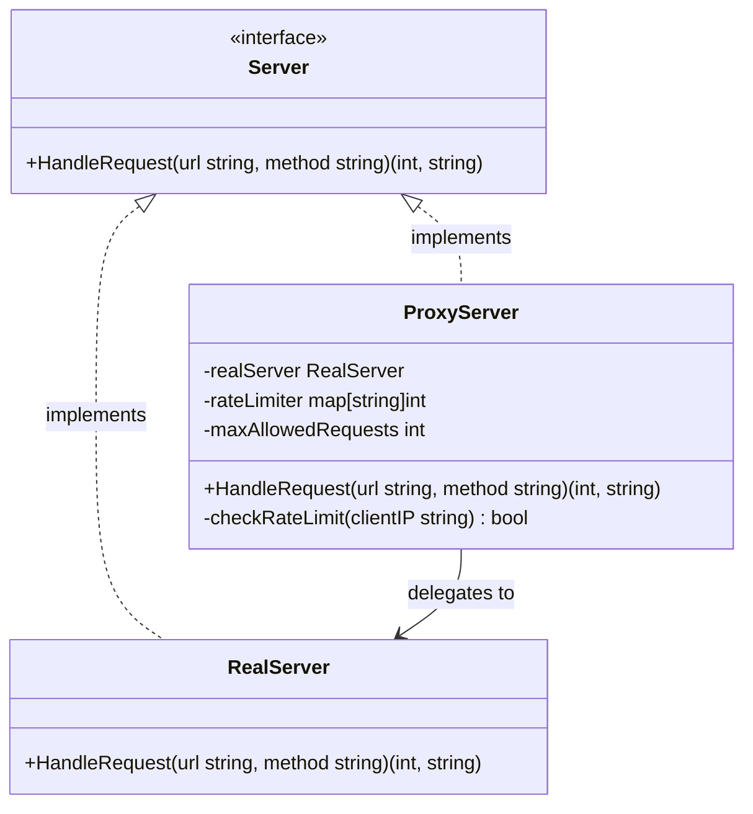

Dalam arsitektur aplikasi modern, mengekspos sistem inti atau sumber daya berat secara langsung ke konsumen luar sering kali tidak direkomendasikan. Kita mungkin perlu menerapkan kontrol akses, melakukan caching, mencatat riwayat log, atau membatasi jumlah permintaan (*rate limit*) sebelum semuanya mencapai layanan utama kita.

**Proxy Design Pattern** adalah structural design pattern yang bertindak sebagai pengganti (*surrogate*) atau tempat penampung (*placeholder*) bagi objek lain. Proxy bertugas mengontrol akses ke objek aslinya, memungkinkan Anda menjalankan suatu logika sebelum atau sesudah permintaan diteruskan ke objek utama.

---

## Analogi Konseptual: Gerbang Keamanan VIP

Bayangkan pintu masuk ke brankas bank atau klub VIP. Pengunjung tidak bisa langsung melenggang masuk untuk mengambil uang atau menemui tamu VIP. Mereka harus berinteraksi terlebih dahulu dengan teller bank atau penjaga keamanan di pintu depan.

Penjaga keamanan tersebut akan:
*   Memeriksa identitas atau kartu akses pengunjung (authorization).
*   Menolak masuk jika kuota ruangan sudah penuh (rate-limiting).
*   Mencatat siapa saja yang masuk dan keluar (logging/auditing).
*   Membagikan brosur informasi instan alih-alih memanggil manajer (caching).

Hanya setelah melewati gerbang pemeriksaan inilah pengunjung diperbolehkan mengakses brankas atau layanan utama. Di sini, penjaga keamanan bertindak sebagai **Proxy** bagi objek/layanan aslinya.

---

## Diagram Konseptual

Berikut adalah diagram Mermaid untuk Proxy pattern, menunjukkan bagaimana Client berinteraksi dengan Proxy yang memiliki interface yang sama dengan Real Subject:



---

## Skenario Masalah & Use Case

Bayangkan kita sedang membangun sebuah backend API di Go. Kita memiliki struct bernama `RealServer` yang menangani operasi-operasi berat (seperti memproses gambar atau menggabungkan tabel database yang besar).

Jika kita membiarkan server ini diakses langsung oleh publik tanpa pelindung, klien yang bermasalah atau serangan siber dapat membanjiri server dengan jutaan request hingga menyebabkan server lumpuh (*outage*). Dibandingkan mengotori kode logika bisnis di `RealServer` dengan baris kode keamanan dan pembatasan request, kita dapat membuat `ProxyServer` dengan interface yang sama. Proxy ini akan menyaring request yang berlebihan dan meneruskan request yang sah ke real server.

---

## Contoh Kode Golang

Berikut adalah contoh kode Go yang lengkap dan dapat dikompilasi, mendemonstrasikan implementasi Proxy untuk membatasi jumlah request (*rate-limiting*).

```go
package main

import (
	"fmt"
)

// ---------------------------------------------------------
// 1. Subject Interface
// ---------------------------------------------------------

// Server mendefinisikan kontrak yang harus dipenuhi oleh real server dan proxy.
type Server interface {
	HandleRequest(url, method string) (int, string)
}

// ---------------------------------------------------------
// 2. Real Subject
// ---------------------------------------------------------

// RealServer merepresentasikan layanan inti yang menangani operasi berat.
type RealServer struct{}

// HandleRequest memproses request pada layanan inti.
func (r *RealServer) HandleRequest(url, method string) (int, string) {
	if url == "/app/status" && method == "GET" {
		return 200, "Ok"
	}
	if url == "/app/user" && method == "POST" {
		return 201, "User Created"
	}
	return 404, "Not Found"
}

// ---------------------------------------------------------
// 3. Proxy Subject
// ---------------------------------------------------------

// ProxyServer mengontrol akses ke RealServer dengan membatasi jumlah request.
type ProxyServer struct {
	realServer       *RealServer
	maxRequests      int
	clientRequestMap map[string]int // Memetakan IP Client ke jumlah request
}

// NewProxyServer membuat instans baru dari ProxyServer.
func NewProxyServer(realServer *RealServer, maxRequests int) *ProxyServer {
	return &ProxyServer{
		realServer:       realServer,
		maxRequests:      maxRequests,
		clientRequestMap: make(map[string]int),
	}
}

// HandleRequest memotong request untuk memeriksa pembatasan akses.
func (p *ProxyServer) HandleRequest(url, method string) (int, string) {
	// Simulasi: Kita berasumsi IP Client didapatkan dari jaringan (misal: "192.168.1.50")
	clientIP := "192.168.1.50"

	allowed := p.checkRateLimit(clientIP)
	if !allowed {
		return 429, "Too Many Requests (Batas request terlampaui oleh Proxy)"
	}

	// Teruskan request ke Real Subject jika batas belum terlampaui
	return p.realServer.HandleRequest(url, method)
}

// checkRateLimit adalah metode pembantu untuk memeriksa kuota akses klien.
func (p *ProxyServer) checkRateLimit(ip string) bool {
	p.clientRequestMap[ip]++
	if p.clientRequestMap[ip] > p.maxRequests {
		return false
	}
	return true
}

// ---------------------------------------------------------
// 4. Client Code / Simulasi
// ---------------------------------------------------------

func main() {
	realServer := &RealServer{}
	// Proxy memperbolehkan maksimal 2 request dari IP yang sama sebelum memblokir
	proxy := NewProxyServer(realServer, 2)

	// Simulasi: Client mengirimkan beberapa request berturut-turut
	urls := []string{"/app/status", "/app/status", "/app/status", "/app/user"}
	methods := []string{"GET", "GET", "GET", "POST"}

	for i := 0; i < len(urls); i++ {
		fmt.Printf("Client: Mengirim request %s %s...\n", methods[i], urls[i])
		statusCode, response := proxy.HandleRequest(urls[i], methods[i])
		fmt.Printf("Server Response: [Status Code: %d] %s\n\n", statusCode, response)
	}
}
```

---

## Ringkasan

### Keuntungan
*   **Keamanan (Access Control)**: Melindungi subject utama dari panggilan langsung yang berbahaya atau tidak berizin.
*   **Separation of Concerns**: Memisahkan logika pendukung (rate-limiting, logging, caching) dari logika bisnis inti.
*   **Lazy Initialization**: Virtual Proxy dapat menunda proses instansiasi objek berat hingga objek tersebut benar-benar dibutuhkan oleh sistem.
*   **Open/Closed Principle**: Anda dapat menambahkan proxy baru tanpa perlu mengubah kode klien maupun kode layanan utama.

### Kerugian
*   **Respons Terlambat (Latency)**: Penggunaan perantara (*middleman*) dapat menambahkan sedikit waktu pemrosesan untuk setiap request yang masuk.
*   **Duplikasi Kode**: Baik Proxy maupun Real Subject harus mengimplementasikan interface yang sama, sehingga perubahan signature method harus selalu disinkronisasikan.

### Kapan Harus Digunakan
*   **Virtual Proxy (Lazy Loading)**: Ketika Anda memiliki objek yang berat (seperti koneksi database besar) yang sebaiknya dimuat hanya saat dibutuhkan.
*   **Protection Proxy (Access Control)**: Ketika Anda perlu melakukan otentikasi/otorisasi request sebelum meneruskannya ke fungsi inti.
*   **Remote Proxy**: Ketika objek asli berada di server eksternal atau di ruang memori yang berbeda.
*   **Smart Reference (Caching/Logging)**: Ketika Anda ingin menyimpan hasil kalkulasi secara lokal (*cache*) atau mencatat log riwayat pemanggilan method secara transparan.
