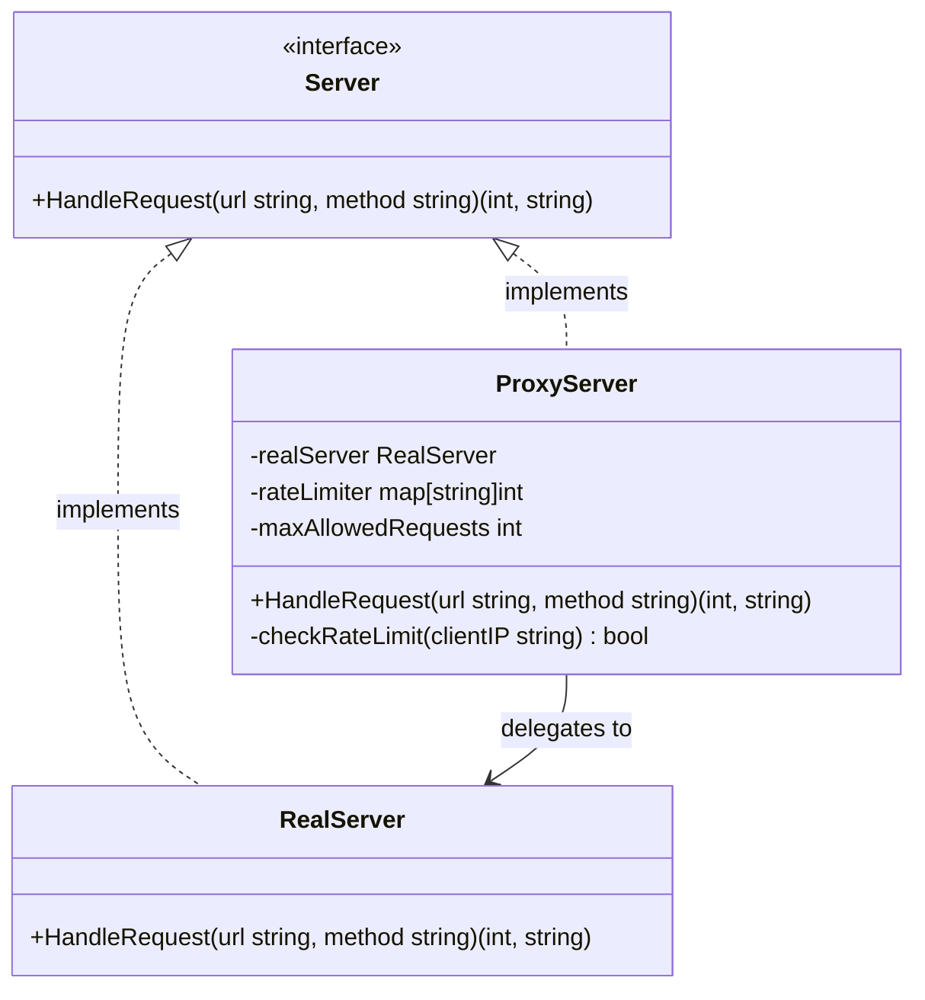

In modern application architectures, directly exposing core systems or heavy resources to external consumers is often undesirable. We might need to enforce access control, perform caching, log incoming queries, or rate-limit requests before they reach our primary services. 

The **Proxy Design Pattern** is a structural design pattern that provides a surrogate or placeholder for another object. A proxy controls access to the original object, allowing you to perform something either before or after the request reaches the original object.

---

## Conceptual Analogy: The Security Gate

Think of a bank vault or a VIP club. Guests cannot walk straight in to access the money or meet the VIPs. Instead, they interact with a teller or a security guard at the entrance. 

The security guard:
*   Checks the guest's credentials (authorization).
*   Refuses entry if the capacity is full (rate-limiting/throttling).
*   Keeps a log of who entered and exited (auditing/logging).
*   Points guests to pre-packaged brochures instead of calling a manager (caching).

Only after passing these checks does the guest get access to the actual vault or service. Here, the security guard acts as a **Proxy** for the real service.

---

## Conceptual Diagram

Here is a Mermaid diagram of the Proxy pattern showing how the client interacts with the Proxy, which implements the same interface as the Real Subject:



---

## Use Case / Problem Scenario

Imagine we are building a backend API. We have a `RealServer` class that handles resource-intensive operations (such as performing database joins or processing images). 

If we expose this server directly to the public web, malicious or poorly configured clients might flood it with requests, causing service degradation or complete outages. Instead of polluting the core business logic of our `RealServer` with rate-limiting and access control code, we can introduce a `ProxyServer` that implements the same server interface. The proxy will block excessive requests and forward legitimate ones to the real server.

---

## Golang Code Example

Below is a complete, compilable Go example illustrating how to implement a rate-limiting proxy.

```go
package main

import (
	"fmt"
)

// ---------------------------------------------------------
// 1. Subject Interface
// ---------------------------------------------------------

// Server defines the contract that both the real server and the proxy must fulfill.
type Server interface {
	HandleRequest(url, method string) (int, string)
}

// ---------------------------------------------------------
// 2. Real Subject
// ---------------------------------------------------------

// RealServer represents the core service performing expensive operations.
type RealServer struct{}

// HandleRequest processes the request on the core service.
func (r *RealServer) HandleRequest(url, method string) (int, string) {
	if url == "/app/status" && method == "GET" {
		return 200, "Ok"
	}
	if url == "/app/user" && method == "POST" {
		return 201, "User Created"
	}
	return 404, "Not Found"
}

// ---------------------------------------------------------
// 3. Proxy Subject
// ---------------------------------------------------------

// ProxyServer controls access to the RealServer by implementing rate-limiting.
type ProxyServer struct {
	realServer       *RealServer
	maxRequests      int
	clientRequestMap map[string]int // Maps Client IP to request count
}

// NewProxyServer instantiates a new ProxyServer.
func NewProxyServer(realServer *RealServer, maxRequests int) *ProxyServer {
	return &ProxyServer{
		realServer:       realServer,
		maxRequests:      maxRequests,
		clientRequestMap: make(map[string]int),
	}
}

// HandleRequest intercepts requests to enforce rate-limiting.
func (p *ProxyServer) HandleRequest(url, method string) (int, string) {
	// For simulation, we assume client IP is passed inside the URL as query-like parameters
	// or simulated header (e.g., client IP extracted from request). Let's simulate a client IP.
	clientIP := "192.168.1.50"

	allowed := p.checkRateLimit(clientIP)
	if !allowed {
		return 429, "Too Many Requests (Rate limit exceeded by Proxy)"
	}

	// Forward request to Real Subject if limit is not exceeded
	return p.realServer.HandleRequest(url, method)
}

// checkRateLimit is a helper method to check client's quota.
func (p *ProxyServer) checkRateLimit(ip string) bool {
	p.clientRequestMap[ip]++
	if p.clientRequestMap[ip] > p.maxRequests {
		return false
	}
	return true
}

// ---------------------------------------------------------
// 4. Client Code / Simulation
// ---------------------------------------------------------

func main() {
	realServer := &RealServer{}
	// Proxy allows maximum of 2 requests from the same client IP before rate-limiting
	proxy := NewProxyServer(realServer, 2)

	// Simulation: Client makes multiple requests
	urls := []string{"/app/status", "/app/status", "/app/status", "/app/user"}
	methods := []string{"GET", "GET", "GET", "POST"}

	for i := 0; i < len(urls); i++ {
		fmt.Printf("Client: Sending request %s %s...\n", methods[i], urls[i])
		statusCode, response := proxy.HandleRequest(urls[i], methods[i])
		fmt.Printf("Server Response: [Status Code: %d] %s\n\n", statusCode, response)
	}
}
```

---

## Summary

### Advantages
*   **Security (Access Control)**: Protects vulnerable subjects from unauthorized or excessive direct calls.
*   **Separation of Concerns**: Moves cross-cutting concerns (rate-limiting, logging, caching) out of the core application service.
*   **Lazy Initialization**: Virtual Proxies can defer the cost of instantiating resource-heavy objects until they are actually used.
*   **Open/Closed Principle**: You can introduce new proxies without changing the client or the original service code.

### Disadvantages
*   **Response Latency**: Introducing a middleman layer can add small overhead processing times to each request.
*   **Code Duplication**: Both the Proxy and the Real Subject must implement the same interface and keep their signatures synchronized.

### When to Use
*   **Virtual Proxy (Lazy Loading)**: When you have a heavy object (like a massive database instance) that should only be loaded on-demand.
*   **Protection Proxy (Access Control)**: When you need to authorize users before forwarding requests to the target service.
*   **Remote Proxy**: When the real object is located on a remote server or in a different address space.
*   **Smart Reference (Logging/Caching)**: When you want to store responses locally (caching) or trace access history (logging).
