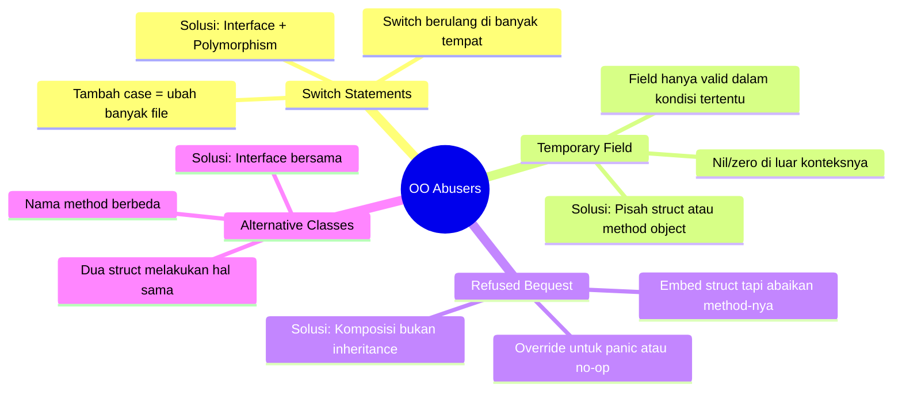
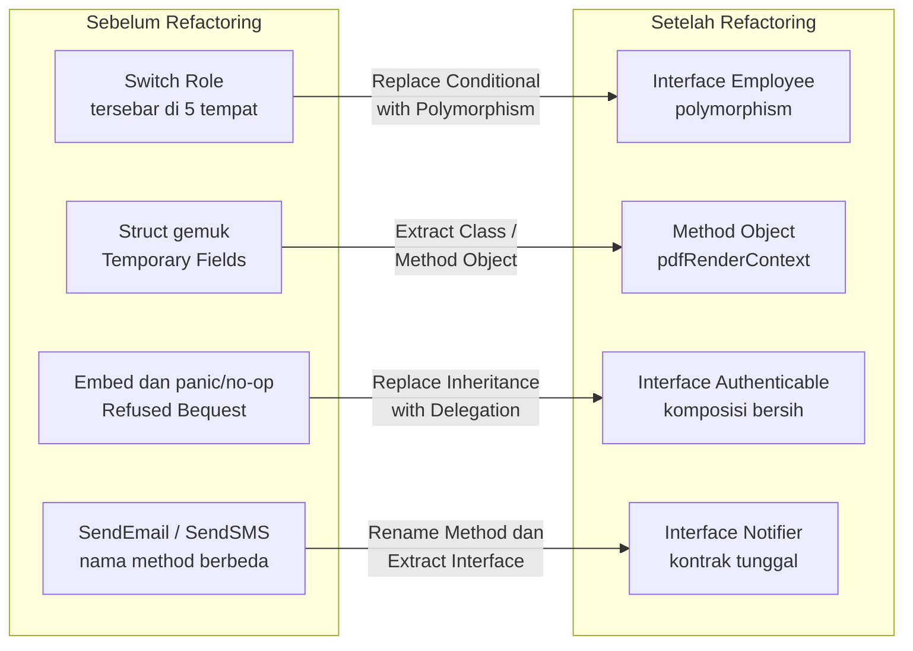

Bayangkan Anda bergabung ke sebuah tim baru. Hari pertama, Anda membuka kode sumber aplikasi utama mereka. Semua terlihat wajar di awal — struct, interface, method. Tapi semakin dalam Anda masuk, semakin aneh rasanya: ada `switch` yang sama persis di lima tempat berbeda, ada struct dengan field `tempDiscount` yang hanya disentuh oleh satu method tertentu, ada struct yang "mewarisi" banyak hal tapi tidak pernah menggunakannya. Anda mulai merasa ada yang salah — dan memang betul.

Itulah yang disebut **Object-Orientation Abusers**: code smells yang muncul ketika prinsip-prinsip OOP (atau dalam Go, prinsip komposisi dan interface) tidak diterapkan dengan benar. Bukan berarti kodenya tidak berjalan — justru itulah yang berbahaya. Kode berjalan, tapi struktur di baliknya rapuh, sulit diperluas, dan menjadi sumber bug yang misterius.

Dalam artikel ini kita akan membedah empat abuser paling umum: **Switch Statements**, **Temporary Field**, **Refused Bequest**, dan **Alternative Classes with Different Interfaces** — lengkap dengan contoh Go dan cara memperbaikinya.

---

## 🎯 Takeaway

Setelah membaca artikel ini, kamu akan:

- 🔍 Memahami apa itu Object-Orientation Abusers dan mengapa mereka berbahaya
- 🔀 Mengenali **Switch Statements** yang berulang dan menggantinya dengan polymorphism interface
- 👻 Mendeteksi **Temporary Field** — field yang hanya hidup untuk beberapa method tertentu
- 🚫 Memahami **Refused Bequest** — ketika child "menolak" warisan dari parent
- 🔗 Menyatukan **Alternative Classes with Different Interfaces** yang melakukan hal serupa dengan cara berbeda
- ✅ Menulis refactoring Go yang bersih, mudah diperluas, dan mudah ditest

---

## Peta Masalah: Empat OO Abusers



---

## 1. Switch Statements 🔀

### Apa Masalahnya?

`switch` sendiri bukan masalah. Masalahnya adalah ketika **switch yang sama** (berdasarkan tipe atau role yang sama) muncul di banyak tempat dalam kodebase. Setiap kali ada role baru, Anda harus membuka dan mengubah semua switch tersebut — ini melanggar **Open/Closed Principle**.

### Contoh Bad Code (❌)

```go
// ❌ BAD: switch pada "role" tersebar di mana-mana.
// Setiap kali ada role baru (misalnya "supervisor"),
// kita harus mencari semua switch ini dan menambahkan case baru.

package main

import "fmt"

// Menghitung gaji berdasarkan role
func calculateSalary(role string, baseSalary float64) float64 {
	switch role {
	case "engineer":
		return baseSalary * 1.2 // bonus 20%
	case "manager":
		return baseSalary * 1.5 // bonus 50%
	case "intern":
		return baseSalary * 0.8 // potongan 20%
	default:
		return baseSalary
	}
}

// Mendapatkan label tampilan berdasarkan role
func getDisplayLabel(role string) string {
	switch role {
	case "engineer":
		return "Software Engineer"
	case "manager":
		return "Engineering Manager"
	case "intern":
		return "Intern"
	default:
		return "Employee"
	}
}

// Memeriksa apakah role bisa approve PR
func canApprovePR(role string) bool {
	switch role {
	case "engineer":
		return true
	case "manager":
		return true
	case "intern":
		return false
	default:
		return false
	}
}

// Sekarang bayangkan menambahkan role "supervisor":
// Anda harus mengubah TIGA fungsi di atas.
// Jika ada 10 fungsi dengan switch serupa, Anda mengubah 10 tempat.
// Dan kemungkinan lupa satu — itulah bug-nya.
```

**Mengapa ini bermasalah?**
- Menambah role baru = mencari semua `switch` yang tersebar dan memperbarui setiap satu
- Sangat mudah melewatkan satu `switch` dan menciptakan bug yang sulit dilacak
- Setiap fungsi harus "tahu" semua kemungkinan role yang ada

### Perbaikan (✅)

```go
// ✅ GOOD: Gunakan interface agar setiap role bertanggung jawab
// atas perilakunya sendiri. Menambah role baru = buat satu struct baru.
// Tidak ada file yang perlu diubah selain tempat registrasi role.

package main

import "fmt"

// Employee mendefinisikan kontrak yang harus dipenuhi oleh setiap role
type Employee interface {
	CalculateSalary(base float64) float64
	DisplayLabel() string
	CanApprovePR() bool
}

// --- Implementasi untuk masing-masing role ---

type Engineer struct{}

func (e Engineer) CalculateSalary(base float64) float64 { return base * 1.2 }
func (e Engineer) DisplayLabel() string                 { return "Software Engineer" }
func (e Engineer) CanApprovePR() bool                   { return true }

type Manager struct{}

func (m Manager) CalculateSalary(base float64) float64 { return base * 1.5 }
func (m Manager) DisplayLabel() string                  { return "Engineering Manager" }
func (m Manager) CanApprovePR() bool                    { return true }

type Intern struct{}

func (i Intern) CalculateSalary(base float64) float64 { return base * 0.8 }
func (i Intern) DisplayLabel() string                  { return "Intern" }
func (i Intern) CanApprovePR() bool                    { return false }

// --- Menambah role baru semudah ini, tanpa mengubah kode di atas ---

type Supervisor struct{}

func (s Supervisor) CalculateSalary(base float64) float64 { return base * 1.35 }
func (s Supervisor) DisplayLabel() string                  { return "Supervisor" }
func (s Supervisor) CanApprovePR() bool                    { return true }

// --- Penggunaan: tidak ada switch sama sekali ---

func printEmployeeInfo(emp Employee, base float64) {
	fmt.Printf("Label   : %s\n", emp.DisplayLabel())
	fmt.Printf("Gaji    : %.2f\n", emp.CalculateSalary(base))
	fmt.Printf("Approve : %v\n\n", emp.CanApprovePR())
}

func main() {
	employees := []Employee{Engineer{}, Manager{}, Intern{}, Supervisor{}}
	for _, emp := range employees {
		printEmployeeInfo(emp, 10_000_000)
	}
}
```

**Keuntungan:**
- Menambah role baru = buat satu struct baru, tidak ada file lain yang berubah
- Setiap role bertanggung jawab atas logikanya sendiri
- Mudah ditest secara independen: `Engineer{}.CalculateSalary(10000)` langsung bisa ditest

---

## 2. Temporary Field 👻

### Apa Masalahnya?

**Temporary Field** adalah field di dalam struct yang hanya memiliki nilai bermakna dalam kondisi atau operasi tertentu — di luar konteks itu, field tersebut bernilai `nil`, `0`, atau `""`. Pembaca kode akan bingung: *kapan field ini valid? Boleh saya akses sekarang?*

### Contoh Bad Code (❌)

```go
// ❌ BAD: Struct ReportGenerator punya field yang hanya
// bermakna saat sedang dalam proses PDF generation.
// Di luar proses itu, field-field ini nilainya zero/nil
// dan menyesatkan siapa saja yang membaca struct ini.

package main

import (
	"fmt"
	"strings"
)

type ReportGenerator struct {
	Title  string
	Author string

	// Temporary Fields — hanya valid saat GeneratePDF() dipanggil.
	// Di luar fungsi itu, field ini tidak bermakna sama sekali.
	tempPageCount    int
	tempHeaderBuffer strings.Builder
	tempFooterText   string
	tempWatermark    string
}

func (r *ReportGenerator) GeneratePDF() string {
	// Inisialisasi field sementara di sini...
	r.tempPageCount = 0
	r.tempHeaderBuffer.Reset()
	r.tempFooterText = fmt.Sprintf("(c) %s", r.Author)
	r.tempWatermark = "CONFIDENTIAL"

	// Gunakan field sementara...
	r.tempHeaderBuffer.WriteString(r.Title)
	r.tempPageCount++

	result := fmt.Sprintf(
		"[PDF] Header: %s | Footer: %s | Watermark: %s | Pages: %d",
		r.tempHeaderBuffer.String(),
		r.tempFooterText,
		r.tempWatermark,
		r.tempPageCount,
	)

	// Reset setelah selesai — tanda bahwa field ini memang sementara
	r.tempPageCount = 0
	r.tempHeaderBuffer.Reset()
	r.tempFooterText = ""
	r.tempWatermark = ""

	return result
}

// Pertanyaan bagi pembaca kode baru:
// Bolehkah saya akses r.tempPageCount sebelum GeneratePDF()?
// Nilainya 0 — tapi apakah itu "belum ada halaman" atau "belum diinisialisasi"?
// Tidak ada cara tahu tanpa membaca seluruh implementasi.
```

**Mengapa ini bermasalah?**
- Pembaca kode tidak bisa tahu kapan field ini valid tanpa membaca implementasi lengkap
- Struct terasa "gemuk" dengan field yang sebagian besar waktu tidak terpakai
- Risiko bug: jika `GeneratePDF()` dipanggil bersamaan dari dua goroutine (race condition)

### Perbaikan (✅)

```go
// ✅ GOOD: Pisahkan state sementara ke dalam objek/struct tersendiri
// yang hidupnya hanya selama operasi itu berlangsung.
// Teknik ini disebut "Method Object" atau "Parameter Object".

package main

import (
	"fmt"
	"strings"
)

// ReportGenerator hanya berisi data permanen yang selalu valid
type ReportGenerator struct {
	Title  string
	Author string
}

// pdfRenderContext adalah objek privat yang hidupnya hanya
// selama satu operasi GeneratePDF. Tidak ada kebocoran state ke luar.
type pdfRenderContext struct {
	pageCount    int
	headerBuffer strings.Builder
	footerText   string
	watermark    string
}

func newPDFRenderContext(title, author string) *pdfRenderContext {
	ctx := &pdfRenderContext{
		footerText: fmt.Sprintf("(c) %s", author),
		watermark:  "CONFIDENTIAL",
	}
	ctx.headerBuffer.WriteString(title)
	return ctx
}

func (ctx *pdfRenderContext) addPage() {
	ctx.pageCount++
}

func (ctx *pdfRenderContext) render() string {
	return fmt.Sprintf(
		"[PDF] Header: %s | Footer: %s | Watermark: %s | Pages: %d",
		ctx.headerBuffer.String(),
		ctx.footerText,
		ctx.watermark,
		ctx.pageCount,
	)
}

// GeneratePDF kini bersih: tidak ada state sementara di ReportGenerator
func (r *ReportGenerator) GeneratePDF() string {
	ctx := newPDFRenderContext(r.Title, r.Author)
	ctx.addPage() // simulasi menambah halaman
	return ctx.render()
}

func main() {
	gen := ReportGenerator{Title: "Laporan Q2 2026", Author: "Budi Santoso"}
	fmt.Println(gen.GeneratePDF())
	// ReportGenerator tetap bersih setelah pemanggilan
}
```

**Keuntungan:**
- `ReportGenerator` hanya punya field yang selalu valid — tidak ada kebingungan
- `pdfRenderContext` di-create dan di-destroy dalam satu siklus fungsi
- Aman untuk concurrent call: setiap goroutine punya `pdfRenderContext`-nya sendiri
- Mudah ditest: `newPDFRenderContext(...)` bisa ditest secara independen

---

## 3. Refused Bequest 🚫

### Apa Masalahnya?

**Refused Bequest** (menolak warisan) terjadi ketika sebuah struct melakukan embed dari struct lain tapi tidak menggunakan — bahkan secara aktif mengabaikan atau meng-override — method yang diwarisi. Ini tanda bahwa hubungan "is-a" yang dimodelkan melalui embedding sebenarnya tidak tepat.

Dalam Go, ini biasanya muncul ketika developer menggunakan struct embedding sebagai shortcut untuk mendapatkan beberapa method, padahal yang dibutuhkan sebenarnya hanya komposisi.

### Contoh Bad Code (❌)

```go
// ❌ BAD: GuestAccount meng-embed UserAccount untuk mendapat
// beberapa method, tapi harus override method lain dengan panic
// atau no-op karena Guest tidak boleh melakukan hal-hal tersebut.
// Ini adalah Refused Bequest yang klasik.

package main

import "fmt"

type UserAccount struct {
	Username string
	Email    string
}

func (u *UserAccount) Login() string {
	return fmt.Sprintf("%s berhasil login", u.Username)
}

func (u *UserAccount) Logout() string {
	return fmt.Sprintf("%s logout", u.Username)
}

func (u *UserAccount) ChangePassword(newPass string) error {
	fmt.Printf("Password %s diubah\n", u.Username)
	return nil
}

func (u *UserAccount) DeleteAccount() error {
	fmt.Printf("Akun %s dihapus\n", u.Username)
	return nil
}

// GuestAccount meng-embed UserAccount hanya untuk mendapat Login/Logout,
// tapi menolak ChangePassword dan DeleteAccount
type GuestAccount struct {
	UserAccount // Embedding hanya untuk "meminjam" Login dan Logout
	SessionID   string
}

// Override karena Guest tidak boleh ganti password
func (g *GuestAccount) ChangePassword(newPass string) error {
	// Refused Bequest: menolak warisan dengan panic
	panic("guest account tidak bisa mengganti password")
}

// Override karena Guest tidak punya akun untuk dihapus
func (g *GuestAccount) DeleteAccount() error {
	// Refused Bequest: no-op yang menyesatkan
	return fmt.Errorf("operasi tidak didukung untuk guest")
}

// Masalah: kalau ada fungsi yang menerima *UserAccount,
// dia akan mencoba ChangePassword dan kena panic.
// Hubungan "GuestAccount is-a UserAccount" secara fundamental salah.
```

**Mengapa ini bermasalah?**
- Prinsip Liskov Substitution dilanggar: `GuestAccount` tidak bisa menggantikan `UserAccount` dengan aman
- `panic` atau `error` dari method yang di-override adalah "bom waktu" di production
- Mengungkapkan bahwa hubungan yang dimodelkan salah sejak awal

### Perbaikan (✅)

```go
// ✅ GOOD: Gunakan interface untuk mendefinisikan kontrak yang tepat.
// UserAccount dan GuestAccount berbagi beberapa kemampuan (Authenticable)
// tapi GuestAccount tidak punya kontrak untuk operasi akun penuh.

package main

import "fmt"

// Authenticable: kemampuan login/logout yang dimiliki semua jenis pengguna
type Authenticable interface {
	Login() string
	Logout() string
}

// FullAccount: kemampuan tambahan hanya untuk akun penuh
type FullAccount interface {
	Authenticable
	ChangePassword(newPass string) error
	DeleteAccount() error
}

// --- Implementasi UserAccount: akun lengkap ---

type UserAccount struct {
	Username string
	Email    string
}

func (u *UserAccount) Login() string {
	return fmt.Sprintf("%s berhasil login sebagai user", u.Username)
}

func (u *UserAccount) Logout() string {
	return fmt.Sprintf("%s logout", u.Username)
}

func (u *UserAccount) ChangePassword(newPass string) error {
	fmt.Printf("Password %s berhasil diubah\n", u.Username)
	return nil
}

func (u *UserAccount) DeleteAccount() error {
	fmt.Printf("Akun %s berhasil dihapus\n", u.Username)
	return nil
}

// --- Implementasi GuestAccount: hanya bisa login/logout ---

type GuestAccount struct {
	SessionID string
}

func (g *GuestAccount) Login() string {
	return fmt.Sprintf("Guest sesi %s dimulai", g.SessionID)
}

func (g *GuestAccount) Logout() string {
	return fmt.Sprintf("Guest sesi %s berakhir", g.SessionID)
}

// GuestAccount TIDAK mengimplementasikan ChangePassword atau DeleteAccount
// karena memang tidak seharusnya — bukan karena "menolak warisan"

// --- Fungsi yang menerima interface, bukan concrete type ---

// handleAuth bisa menerima UserAccount maupun GuestAccount
func handleAuth(user Authenticable) {
	fmt.Println(user.Login())
}

// handleAccountManagement hanya menerima FullAccount
func handleAccountManagement(account FullAccount, newPass string) {
	if err := account.ChangePassword(newPass); err != nil {
		fmt.Println("Error:", err)
	}
}

func main() {
	user := &UserAccount{Username: "budi", Email: "budi@example.com"}
	guest := &GuestAccount{SessionID: "sess-abc123"}

	// Keduanya bisa login/logout — mereka implementasi Authenticable
	handleAuth(user)
	handleAuth(guest)

	// Hanya user yang bisa ganti password — type system menjaga ini
	handleAccountManagement(user, "newSecurePass123")

	// handleAccountManagement(guest, "...") akan menghasilkan compile error!
	// Tidak perlu runtime panic, compiler yang mencegah ini.
}
```

**Keuntungan:**
- Type system Go yang menjaga agar `GuestAccount` tidak digunakan untuk operasi yang tidak didukungnya
- Tidak ada `panic` atau `error` yang menyesatkan
- Hubungan antar tipe menjadi eksplisit dan benar secara semantik

---

## 4. Alternative Classes with Different Interfaces 🔗

### Apa Masalahnya?

**Alternative Classes with Different Interfaces** terjadi ketika dua atau lebih struct melakukan hal yang **sama secara fungsional**, tapi nama method-nya berbeda sehingga tidak bisa digunakan secara bergantian. Duplikasi logika tersembunyi di balik nama yang berbeda.

Ini sering muncul karena dua developer mengerjakan hal yang mirip secara paralel tanpa koordinasi, atau karena refactoring yang tidak tuntas.

### Contoh Bad Code (❌)

```go
// ❌ BAD: EmailNotifier dan SMSNotifier melakukan hal yang sama
// (mengirim notifikasi kepada pengguna), tapi nama method-nya berbeda.
// Kode yang ingin menggunakannya terpaksa tahu tipe konkretnya,
// tidak bisa diperlakukan secara seragam.

package main

import "fmt"

// EmailNotifier: notifikasi via email
type EmailNotifier struct {
	SMTPHost string
}

// Method: SendEmail — nama spesifik email
func (e *EmailNotifier) SendEmail(recipient, subject, body string) error {
	fmt.Printf("[EMAIL] To: %s | Subject: %s | Body: %s\n", recipient, subject, body)
	return nil
}

// SMSNotifier: notifikasi via SMS
type SMSNotifier struct {
	APIKey string
}

// Method: SendSMS — nama spesifik SMS, parameter berbeda pula!
func (s *SMSNotifier) SendSMS(phoneNumber, message string) error {
	fmt.Printf("[SMS] To: %s | Message: %s\n", phoneNumber, message)
	return nil
}

// PushNotifier: notifikasi via push notification
type PushNotifier struct {
	AppID string
}

// Method: PushMessage — lagi-lagi nama berbeda
func (p *PushNotifier) PushMessage(deviceToken, title, payload string) error {
	fmt.Printf("[PUSH] Token: %s | Title: %s | Payload: %s\n", deviceToken, title, payload)
	return nil
}

// Masalah nyata: UserService harus tahu semua tipe konkret
type UserService struct {
	email *EmailNotifier
	sms   *SMSNotifier
	push  *PushNotifier
}

func (u *UserService) NotifyAll(userEmail, userPhone, deviceToken, message string) {
	// Tidak ada cara generik — harus panggil masing-masing secara eksplisit
	_ = u.email.SendEmail(userEmail, "Notifikasi", message)
	_ = u.sms.SendSMS(userPhone, message)
	_ = u.push.PushMessage(deviceToken, "Notifikasi", message)

	// Menambah channel baru (misalnya WhatsApp) = ubah UserService
}
```

**Mengapa ini bermasalah?**
- `UserService` harus di-hardcode untuk setiap channel notifikasi
- Tidak bisa loop atau range atas daftar notifier
- Menambah channel baru = ubah `UserService` dan semua tempat yang memanggilnya

### Perbaikan (✅)

```go
// ✅ GOOD: Definisikan interface bersama yang menyatukan semua notifier.
// Setiap notifier punya cara kerjanya sendiri, tapi kontraknya seragam.

package main

import "fmt"

// NotificationMessage: data yang dibutuhkan untuk mengirim notifikasi apapun
type NotificationMessage struct {
	Recipient string // bisa email, nomor HP, device token, dsb.
	Title     string
	Body      string
}

// Notifier: kontrak tunggal untuk semua jenis notifikasi
type Notifier interface {
	Send(msg NotificationMessage) error
	ChannelName() string // untuk logging dan debugging
}

// --- Implementasi: masing-masing bertanggung jawab pada detailnya ---

type EmailNotifier struct {
	SMTPHost string
}

func (e *EmailNotifier) Send(msg NotificationMessage) error {
	fmt.Printf("[EMAIL via %s] To: %s | Subject: %s | Body: %s\n",
		e.SMTPHost, msg.Recipient, msg.Title, msg.Body)
	return nil
}

func (e *EmailNotifier) ChannelName() string { return "Email" }

type SMSNotifier struct {
	APIKey string
}

func (s *SMSNotifier) Send(msg NotificationMessage) error {
	fmt.Printf("[SMS] To: %s | %s: %s\n", msg.Recipient, msg.Title, msg.Body)
	return nil
}

func (s *SMSNotifier) ChannelName() string { return "SMS" }

type PushNotifier struct {
	AppID string
}

func (p *PushNotifier) Send(msg NotificationMessage) error {
	fmt.Printf("[PUSH via %s] Token: %s | Title: %s | Payload: %s\n",
		p.AppID, msg.Recipient, msg.Title, msg.Body)
	return nil
}

func (p *PushNotifier) ChannelName() string { return "Push Notification" }

// WhatsApp baru? Tidak perlu ubah UserService sama sekali!
type WhatsAppNotifier struct {
	BusinessID string
}

func (w *WhatsAppNotifier) Send(msg NotificationMessage) error {
	fmt.Printf("[WHATSAPP] To: %s | %s\n", msg.Recipient, msg.Body)
	return nil
}

func (w *WhatsAppNotifier) ChannelName() string { return "WhatsApp" }

// --- UserService kini tidak perlu tahu tipe konkret apapun ---

type UserService struct {
	notifiers []Notifier // slice of interface — bisa berisi apa saja
}

func NewUserService(notifiers ...Notifier) *UserService {
	return &UserService{notifiers: notifiers}
}

func (u *UserService) NotifyAll(recipient, title, body string) {
	msg := NotificationMessage{
		Recipient: recipient,
		Title:     title,
		Body:      body,
	}
	for _, n := range u.notifiers {
		if err := n.Send(msg); err != nil {
			fmt.Printf("[ERROR] Gagal kirim via %s: %v\n", n.ChannelName(), err)
		}
	}
}

func main() {
	svc := NewUserService(
		&EmailNotifier{SMTPHost: "smtp.example.com"},
		&SMSNotifier{APIKey: "sms-key-123"},
		&PushNotifier{AppID: "app-xyz"},
		&WhatsAppNotifier{BusinessID: "wa-biz-456"}, // tambah tanpa ubah UserService
	)

	svc.NotifyAll("user@example.com", "Pesanan Dikonfirmasi", "Pesanan #ORD-789 Anda telah dikonfirmasi.")
}
```

**Keuntungan:**
- `UserService` tidak perlu berubah saat channel baru ditambahkan
- `Notifier` bisa di-range, di-pass sebagai parameter, atau di-store dalam map
- Testing mudah: buat `MockNotifier` yang implementasi `Notifier` untuk unit test

---

## Perbandingan Sebelum dan Sesudah



---

## Teknik Refactoring yang Digunakan

| Code Smell | Teknik Refactoring | Inti Perubahan |
|---|---|---|
| Switch Statements | *Replace Conditional with Polymorphism* | Pindahkan setiap case ke method di struct masing-masing |
| Temporary Field | *Extract Class* / *Method Object* | Buat struct baru untuk state yang sementara |
| Refused Bequest | *Replace Inheritance with Delegation* | Gunakan interface dan komposisi, bukan embedding buta |
| Alternative Classes | *Rename Method* + *Extract Interface* | Seragamkan nama method lalu bungkus dalam interface |

---

## Tips Mendeteksi OO Abusers dalam Code Review

Berikut tanda-tanda yang bisa Anda cari saat code review atau saat membaca kodebase baru:

**Switch Statements:**
- Ada `switch` atau `if-else` yang sama persis di lebih dari satu fungsi?
- Menambah kondisi baru memaksa edit banyak tempat?

**Temporary Field:**
- Ada field di struct yang kadang `nil`, kadang zero value?
- Ada field yang di-reset ke zero setelah suatu method selesai?
- Ada komentar seperti `// only valid during X operation`?

**Refused Bequest:**
- Ada method yang di-override hanya untuk `panic` atau return `error "not supported"`?
- Ada struct yang embed struct lain tapi tidak pernah panggil method-nya secara langsung?

**Alternative Classes:**
- Ada dua struct yang melakukan hal sama tapi nama method-nya berbeda?
- Dua struct tidak bisa digunakan secara bergantian (tidak ada interface bersama)?

---

## 📝 Ringkasan

Object-Orientation Abusers adalah code smells yang muncul bukan karena kode tidak jalan, tapi karena **prinsip desain OOP (atau idiom Go) tidak diterapkan dengan benar**. Keempat abuser yang kita bahas hari ini:

- **🔀 Switch Statements** — ganti `switch` berulang dengan interface dan polymorphism. Setiap tipe bertanggung jawab atas perilakunya sendiri. Menambah tipe baru tidak memerlukan perubahan di kode yang ada.

- **👻 Temporary Field** — pisahkan field yang hanya valid dalam kondisi tertentu ke dalam struct atau objek tersendiri (Method Object). Struct utama hanya berisi field yang selalu bermakna, dan state sementara tidak bocor ke luar.

- **🚫 Refused Bequest** — jika sebuah struct terpaksa meng-override method parent dengan `panic` atau no-op, itu tanda hubungan "is-a" yang salah. Gunakan interface dan komposisi (delegation), bukan embedding. Biarkan type system Go yang menjaga batasan ini.

- **🔗 Alternative Classes** — jika dua struct melakukan hal sama dengan nama method berbeda, seragamkan dengan interface bersama. Ini membuka pintu untuk list, range, dan dependency injection yang bersih.

Refactoring bukan tentang membuat kode terlihat cantik — ini tentang membuat kode **mudah diperluas, mudah ditest, dan mudah dimengerti** oleh orang lain (termasuk diri Anda sendiri enam bulan ke depan).

> **Ingat:** Refactoring terbaik adalah yang dilakukan bertahap, dengan test sebagai jaring pengaman. Satu smell, satu teknik, satu commit.

---

**🇮🇩 Versi Indonesia** | [🇬🇧 English Version](/refactoring-part-2-oo-abusers)

← [Part 1: Code Smells — Bloaters](/refactoring-part-1-bloaters-id) | [Part 3: Code Smells — Change Preventers](/refactoring-part-3-change-preventers-id) →
